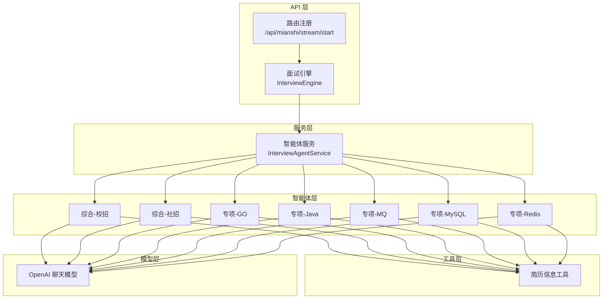
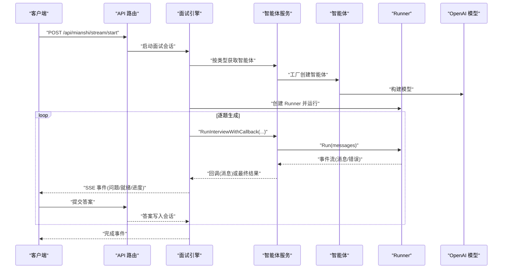
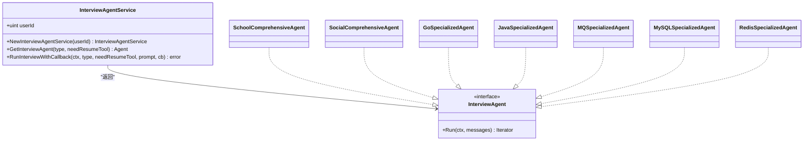
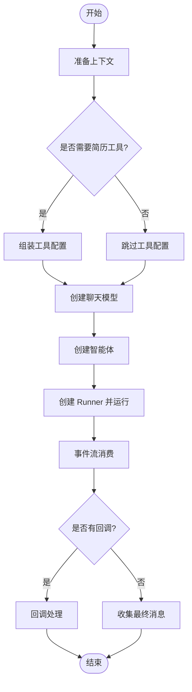
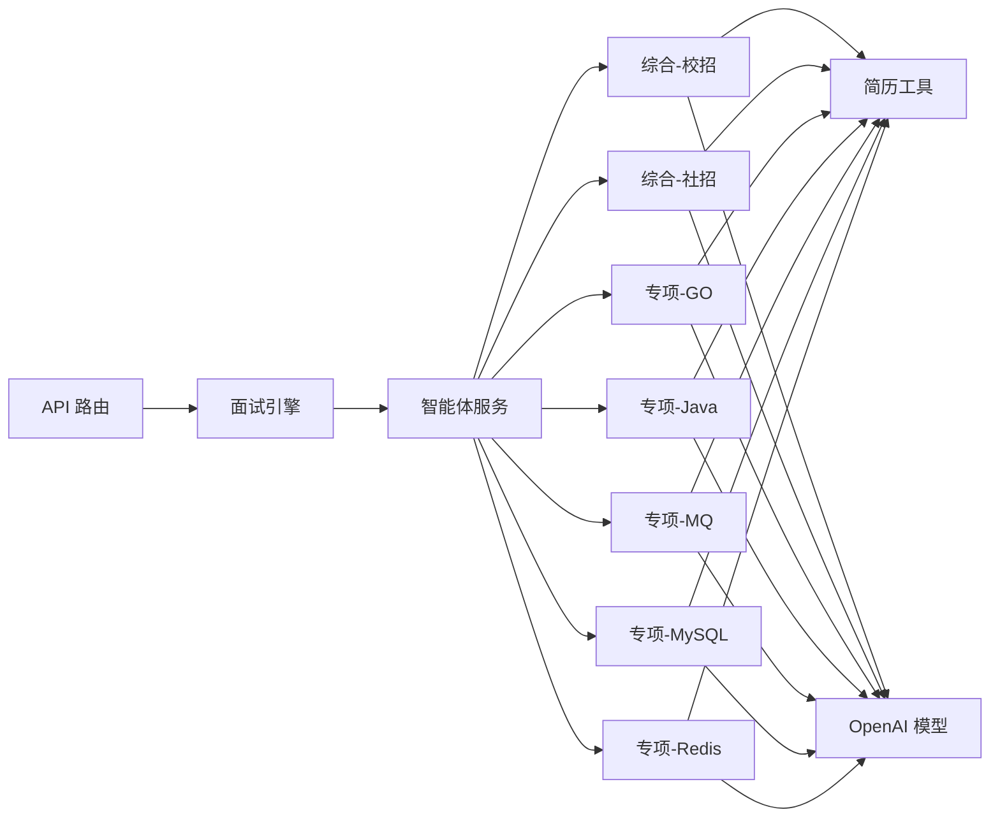

# 面试智能体服务

<cite>
**本文引用的文件**
- [backend/chatApp/agent_service/interview/interview_agent_service.go](file://backend/chatApp/agent_service/interview/interview_agent_service.go)
- [backend/chatApp/agent/interview/comprehensive/school_comprehensive_agent.go](file://backend/chatApp/agent/interview/comprehensive/school_comprehensive_agent.go)
- [backend/chatApp/agent/interview/comprehensive/social_comprehensive_agent.go](file://backend/chatApp/agent/interview/comprehensive/social_comprehensive_agent.go)
- [backend/chatApp/agent/interview/comprehensive/constants.go](file://backend/chatApp/agent/interview/comprehensive/constants.go)
- [backend/chatApp/agent/interview/specialized/go_agent.go](file://backend/chatApp/agent/interview/specialized/go_agent.go)
- [backend/chatApp/agent/interview/specialized/java_agent.go](file://backend/chatApp/agent/interview/specialized/java_agent.go)
- [backend/chatApp/agent/interview/specialized/mq_agent.go](file://backend/chatApp/agent/interview/specialized/mq_agent.go)
- [backend/chatApp/agent/interview/specialized/mysql_agent.go](file://backend/chatApp/agent/interview/specialized/mysql_agent.go)
- [backend/chatApp/agent/interview/specialized/redis_agent.go](file://backend/chatApp/agent/interview/specialized/redis_agent.go)
- [backend/chatApp/agent/interview/specialized/constants.go](file://backend/chatApp/agent/interview/specialized/constants.go)
- [backend/api/handler/interview/mianshi/engine.go](file://backend/api/handler/interview/mianshi/engine.go)
- [backend/api/router/interview/api.go](file://backend/api/router/interview/api.go)
- [backend/chatApp/chat/openAi.go](file://backend/chatApp/chat/openAi.go)
- [backend/chatApp/tool/get_resume_info_tool.go](file://backend/chatApp/tool/get_resume_info_tool.go)
- [backend/chatApp/main.go](file://backend/chatApp/main.go)
</cite>

## 目录
1. [简介](#简介)
2. [项目结构](#项目结构)
3. [核心组件](#核心组件)
4. [架构总览](#架构总览)
5. [详细组件分析](#详细组件分析)
6. [依赖关系分析](#依赖关系分析)
7. [性能考量](#性能考量)
8. [故障排查指南](#故障排查指南)
9. [结论](#结论)
10. [附录](#附录)

## 简介
本文件面向面试智能体服务，系统性阐述 InterviewAgentService 的设计架构、智能体工厂模式实现与统一调度机制；详解智能体类型枚举、创建流程与生命周期管理；提供运行时回调机制、错误处理与资源清理策略；覆盖初始化配置、上下文管理与并发安全要点，并给出 API 使用示例与最佳实践。

## 项目结构
面试智能体服务位于后端 chatApp 子模块中，围绕“智能体工厂 + 统一调度”的模式组织：
- 服务层：InterviewAgentService 提供智能体实例化与统一运行接口
- 智能体层：综合面试与专项面试两类，每类若干具体智能体
- 工具层：简历检索工具等可插拔工具
- 调用链路：API 层通过 InterviewEngine 协调会话、调度智能体、发送 SSE 事件

图表来源
- [backend/api/router/interview/api.go](file://backend/api/router/interview/api.go#L17-L46)
- [backend/api/handler/interview/mianshi/engine.go](file://backend/api/handler/interview/mianshi/engine.go#L39-L230)
- [backend/chatApp/agent_service/interview/interview_agent_service.go](file://backend/chatApp/agent_service/interview/interview_agent_service.go#L30-L101)

章节来源
- [backend/api/router/interview/api.go](file://backend/api/router/interview/api.go#L17-L46)
- [backend/api/handler/interview/mianshi/engine.go](file://backend/api/handler/interview/mianshi/engine.go#L39-L230)
- [backend/chatApp/agent_service/interview/interview_agent_service.go](file://backend/chatApp/agent_service/interview/interview_agent_service.go#L30-L101)

## 核心组件
- InterviewAgentService：智能体工厂与统一调度器，负责按类型创建智能体、封装运行流程、支持回调输出
- 智能体工厂方法族：按“综合/专项”分类，按“校招/社招/Golang/Java/MQ/MySQL/Redis”细分
- 运行器 runAgentWithIterator：统一迭代消费事件流，支持回调与最终结果回传
- OpenAI 聊天模型：基于用户默认模型配置动态创建，支持参数校验与错误映射
- 简历工具：可选注入，按需启用以增强智能体上下文

章节来源
- [backend/chatApp/agent_service/interview/interview_agent_service.go](file://backend/chatApp/agent_service/interview/interview_agent_service.go#L14-L101)
- [backend/chatApp/chat/openAi.go](file://backend/chatApp/chat/openAi.go#L19-L109)
- [backend/chatApp/tool/get_resume_info_tool.go](file://backend/chatApp/tool/get_resume_info_tool.go#L21-L47)

## 架构总览
整体采用“API -> 引擎 -> 服务 -> 智能体 -> 模型/工具”的分层调用链。API 层负责会话与事件推送，引擎负责问题生成与等待回答，服务层负责智能体创建与运行，智能体内部组合模型与工具，最终通过事件流向客户端推送。

图表来源
- [backend/api/router/interview/api.go](file://backend/api/router/interview/api.go#L44-L46)
- [backend/api/handler/interview/mianshi/engine.go](file://backend/api/handler/interview/mianshi/engine.go#L39-L230)
- [backend/chatApp/agent_service/interview/interview_agent_service.go](file://backend/chatApp/agent_service/interview/interview_agent_service.go#L75-L101)

## 详细组件分析

### InterviewAgentService 设计与工厂模式
- 类型定义：InterviewAgentType 以字符串枚举区分“综合/专项”及具体领域
- 工厂方法 GetInterviewAgent：依据类型返回对应智能体构造函数，集中管理创建分支
- 统一运行 RunInterviewWithCallback：封装 Runner 创建、消息构建、事件迭代与回调分发
- 运行器 runAgentWithIterator：统一事件流消费，支持回调与最终消息回传

图表来源
- [backend/chatApp/agent_service/interview/interview_agent_service.go](file://backend/chatApp/agent_service/interview/interview_agent_service.go#L14-L101)
- [backend/chatApp/agent/interview/comprehensive/school_comprehensive_agent.go](file://backend/chatApp/agent/interview/comprehensive/school_comprehensive_agent.go#L14-L47)
- [backend/chatApp/agent/interview/comprehensive/social_comprehensive_agent.go](file://backend/chatApp/agent/interview/comprehensive/social_comprehensive_agent.go#L14-L47)
- [backend/chatApp/agent/interview/specialized/go_agent.go](file://backend/chatApp/agent/interview/specialized/go_agent.go#L14-L47)
- [backend/chatApp/agent/interview/specialized/java_agent.go](file://backend/chatApp/agent/interview/specialized/java_agent.go#L14-L47)
- [backend/chatApp/agent/interview/specialized/mq_agent.go](file://backend/chatApp/agent/interview/specialized/mq_agent.go#L14-L47)
- [backend/chatApp/agent/interview/specialized/mysql_agent.go](file://backend/chatApp/agent/interview/specialized/mysql_agent.go#L14-L47)
- [backend/chatApp/agent/interview/specialized/redis_agent.go](file://backend/chatApp/agent/interview/specialized/redis_agent.go#L14-L47)

章节来源
- [backend/chatApp/agent_service/interview/interview_agent_service.go](file://backend/chatApp/agent_service/interview/interview_agent_service.go#L14-L101)

### 智能体类型与提示词
- 综合面试：校招与社招两类，分别内置不同指令模板，强调对候选人的能力画像与实战经验评估
- 专项面试：Go、Java、MQ、MySQL、Redis 五类，针对特定技术栈设计提示词，聚焦深度与实战

章节来源
- [backend/chatApp/agent/interview/comprehensive/constants.go](file://backend/chatApp/agent/interview/comprehensive/constants.go#L3-L46)
- [backend/chatApp/agent/interview/comprehensive/constants.go](file://backend/chatApp/agent/interview/comprehensive/constants.go#L48-L94)
- [backend/chatApp/agent/interview/specialized/constants.go](file://backend/chatApp/agent/interview/specialized/constants.go#L3-L50)
- [backend/chatApp/agent/interview/specialized/constants.go](file://backend/chatApp/agent/interview/specialized/constants.go#L52-L99)
- [backend/chatApp/agent/interview/specialized/constants.go](file://backend/chatApp/agent/interview/specialized/constants.go#L101-L148)
- [backend/chatApp/agent/interview/specialized/constants.go](file://backend/chatApp/agent/interview/specialized/constants.go#L150-L197)
- [backend/chatApp/agent/interview/specialized/constants.go](file://backend/chatApp/agent/interview/specialized/constants.go#L199-L246)

### 智能体创建流程与生命周期
- 创建入口：各智能体工厂方法 NewXxxSpecializedAgent/NewXxxComprehensiveAgent
- 生命周期阶段：
  - 构造上下文与工具配置（可选简历工具）
  - 通过 chat.OpenAI 接口创建模型实例
  - 使用 adk.NewChatModelAgent 创建智能体，设置指令、工具、最大迭代次数等
  - 通过 Runner 运行，事件流消费完成后返回最终消息或错误

图表来源
- [backend/chatApp/agent/interview/comprehensive/school_comprehensive_agent.go](file://backend/chatApp/agent/interview/comprehensive/school_comprehensive_agent.go#L16-L46)
- [backend/chatApp/agent/interview/comprehensive/social_comprehensive_agent.go](file://backend/chatApp/agent/interview/comprehensive/social_comprehensive_agent.go#L16-L46)
- [backend/chatApp/agent/interview/specialized/go_agent.go](file://backend/chatApp/agent/interview/specialized/go_agent.go#L16-L46)
- [backend/chatApp/agent/interview/specialized/java_agent.go](file://backend/chatApp/agent/interview/specialized/java_agent.go#L16-L46)
- [backend/chatApp/agent/interview/specialized/mq_agent.go](file://backend/chatApp/agent/interview/specialized/mq_agent.go#L16-L46)
- [backend/chatApp/agent/interview/specialized/mysql_agent.go](file://backend/chatApp/agent/interview/specialized/mysql_agent.go#L16-L46)
- [backend/chatApp/agent/interview/specialized/redis_agent.go](file://backend/chatApp/agent/interview/specialized/redis_agent.go#L16-L46)
- [backend/chatApp/agent_service/interview/interview_agent_service.go](file://backend/chatApp/agent_service/interview/interview_agent_service.go#L103-L154)

章节来源
- [backend/chatApp/agent/interview/comprehensive/school_comprehensive_agent.go](file://backend/chatApp/agent/interview/comprehensive/school_comprehensive_agent.go#L16-L46)
- [backend/chatApp/agent/interview/comprehensive/social_comprehensive_agent.go](file://backend/chatApp/agent/interview/comprehensive/social_comprehensive_agent.go#L16-L46)
- [backend/chatApp/agent/interview/specialized/go_agent.go](file://backend/chatApp/agent/interview/specialized/go_agent.go#L16-L46)
- [backend/chatApp/agent/interview/specialized/java_agent.go](file://backend/chatApp/agent/interview/specialized/java_agent.go#L16-L46)
- [backend/chatApp/agent/interview/specialized/mq_agent.go](file://backend/chatApp/agent/interview/specialized/mq_agent.go#L16-L46)
- [backend/chatApp/agent/interview/specialized/mysql_agent.go](file://backend/chatApp/agent/interview/specialized/mysql_agent.go#L16-L46)
- [backend/chatApp/agent/interview/specialized/redis_agent.go](file://backend/chatApp/agent/interview/specialized/redis_agent.go#L16-L46)
- [backend/chatApp/agent_service/interview/interview_agent_service.go](file://backend/chatApp/agent_service/interview/interview_agent_service.go#L103-L154)

### 统一调度与回调机制
- RunInterviewWithCallback：对外暴露统一运行接口，内部委派给 runAgentWithIterator
- runAgentWithIterator：构建 Runner，迭代事件流，提取消息内容，按需回调，最终返回最后一条消息
- 回调语义：每次收到消息即触发回调；若回调返回错误则中断执行并向上抛出

章节来源
- [backend/chatApp/agent_service/interview/interview_agent_service.go](file://backend/chatApp/agent_service/interview/interview_agent_service.go#L75-L154)

### 错误处理与资源清理
- 错误处理：
  - 智能体创建失败：包装为业务错误并返回
  - 模型创建失败：根据错误类型映射为配额不足、速率限制、上下文超限等专用错误
  - 运行期事件错误：事件流中遇到 Err 直接中断并返回
  - 回调错误：回调返回错误时立即终止
- 资源清理：
  - Runner 在事件流结束后自然结束，无需显式关闭
  - 模型与工具在智能体生命周期内由 SDK 管理，遵循 SDK 生命周期

章节来源
- [backend/chatApp/agent_service/interview/interview_agent_service.go](file://backend/chatApp/agent_service/interview/interview_agent_service.go#L85-L101)
- [backend/chatApp/chat/openAi.go](file://backend/chatApp/chat/openAi.go#L84-L106)

### 初始化配置与上下文管理
- 用户模型配置：从用户默认模型表读取 API Key、模型名、BaseURL，进行解密与校验
- URL 规范化：去除多余后缀与不可打印字符，避免 SDK 重复拼接
- 上下文传播：所有创建与运行均使用传入的 context，支持取消与超时控制
- 并发安全：服务层字段为简单值类型，无共享可变状态；工厂方法在单次调用内创建对象，未见全局共享状态

章节来源
- [backend/chatApp/chat/openAi.go](file://backend/chatApp/chat/openAi.go#L19-L109)
- [backend/chatApp/agent_service/interview/interview_agent_service.go](file://backend/chatApp/agent_service/interview/interview_agent_service.go#L35-L40)

### API 使用示例与最佳实践
- 典型调用链：
  - 客户端发起“开始面试”请求
  - API 层注册路由并转发至面试引擎
  - 引擎根据会话类型与领域选择智能体类型
  - 通过服务层 RunInterviewWithCallback 生成问题并回调推送
  - 客户端提交答案，引擎等待并推进下一轮
  - 完成后保存对话记录并发布评估消息
- 最佳实践：
  - 明确区分“综合/专项”与“校招/社招/Golang/Java/MQ/MySQL/Redis”
  - 仅在需要简历上下文时启用简历工具，减少不必要的工具调用
  - 使用回调实时推送问题，避免一次性拉取导致延迟
  - 正确处理超时与取消，确保会话状态一致
  - 对模型错误进行分类处理，便于前端展示与重试策略

章节来源
- [backend/api/router/interview/api.go](file://backend/api/router/interview/api.go#L44-L46)
- [backend/api/handler/interview/mianshi/engine.go](file://backend/api/handler/interview/mianshi/engine.go#L39-L230)
- [backend/chatApp/agent_service/interview/interview_agent_service.go](file://backend/chatApp/agent_service/interview/interview_agent_service.go#L75-L101)

## 依赖关系分析
- 服务层依赖智能体工厂与 Runner；智能体依赖模型与工具；引擎依赖服务层与会话管理
- 工具依赖 DAO 层获取简历数据；模型依赖用户默认模型配置

图表来源
- [backend/api/handler/interview/mianshi/engine.go](file://backend/api/handler/interview/mianshi/engine.go#L39-L230)
- [backend/chatApp/agent_service/interview/interview_agent_service.go](file://backend/chatApp/agent_service/interview/interview_agent_service.go#L42-L73)
- [backend/chatApp/tool/get_resume_info_tool.go](file://backend/chatApp/tool/get_resume_info_tool.go#L21-L47)
- [backend/chatApp/chat/openAi.go](file://backend/chatApp/chat/openAi.go#L19-L109)

章节来源
- [backend/api/handler/interview/mianshi/engine.go](file://backend/api/handler/interview/mianshi/engine.go#L39-L230)
- [backend/chatApp/agent_service/interview/interview_agent_service.go](file://backend/chatApp/agent_service/interview/interview_agent_service.go#L42-L73)
- [backend/chatApp/tool/get_resume_info_tool.go](file://backend/chatApp/tool/get_resume_info_tool.go#L21-L47)
- [backend/chatApp/chat/openAi.go](file://backend/chatApp/chat/openAi.go#L19-L109)

## 性能考量
- 事件流消费：采用迭代器逐条消费事件，避免一次性缓冲大量中间消息
- 工具调用：仅在需要时启用简历工具，降低外部依赖带来的延迟
- 模型调用：合理设置 MaxIterations，避免过度迭代；结合上下文长度限制与超时控制
- 并发与会话：会话管理器负责并发读写答案，建议在会话维度加锁或使用无锁队列，避免竞态

## 故障排查指南
- 模型错误映射：
  - 配额不足/余额耗尽：检查账户余额与限额
  - 速率限制：降低并发或增加退避重试
  - 上下文超限：缩短输入或减少历史上下文
- 回调错误：检查回调函数是否正确处理消息并返回 nil
- 会话超时：确认客户端心跳与答案提交及时性
- 简历工具异常：检查 ResumeDao 查询是否成功与数据完整性

章节来源
- [backend/chatApp/chat/openAi.go](file://backend/chatApp/chat/openAi.go#L84-L106)
- [backend/api/handler/interview/mianshi/engine.go](file://backend/api/handler/interview/mianshi/engine.go#L166-L173)
- [backend/chatApp/tool/get_resume_info_tool.go](file://backend/chatApp/tool/get_resume_info_tool.go#L26-L33)

## 结论
InterviewAgentService 通过清晰的工厂模式与统一运行器，实现了智能体类型的集中管理与稳定运行；配合可插拔工具与事件流回调，满足了面试场景的实时性与可扩展性需求。建议在生产环境中完善会话并发控制、错误分类与可观测性埋点，持续优化模型与工具调用成本。

## 附录
- 示例入口参考：命令行交互测试入口展示了 Runner 的基本用法与事件流消费方式
- 配置参考：OpenAI 模型创建与参数校验流程

章节来源
- [backend/chatApp/main.go](file://backend/chatApp/main.go#L25-L123)
- [backend/chatApp/chat/openAi.go](file://backend/chatApp/chat/openAi.go#L19-L109)