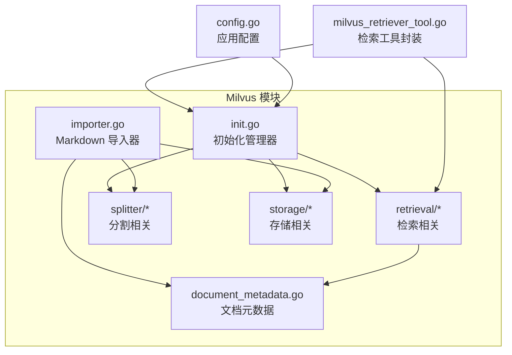
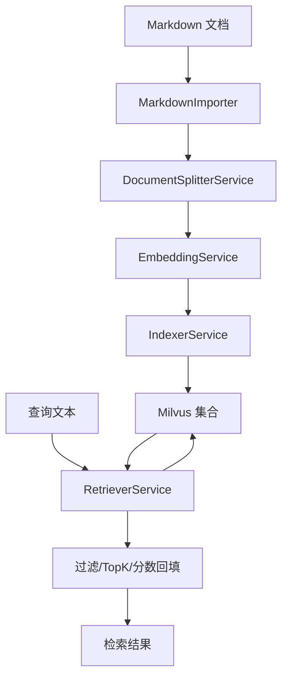
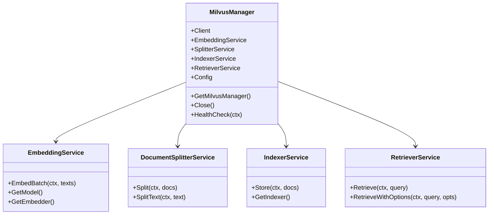
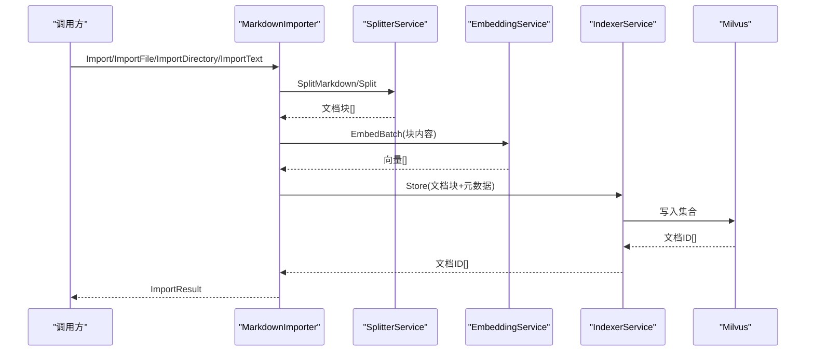
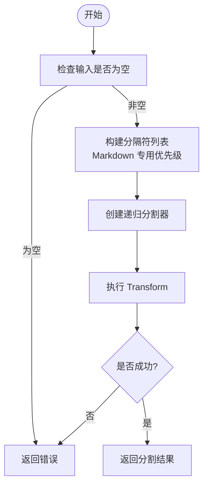
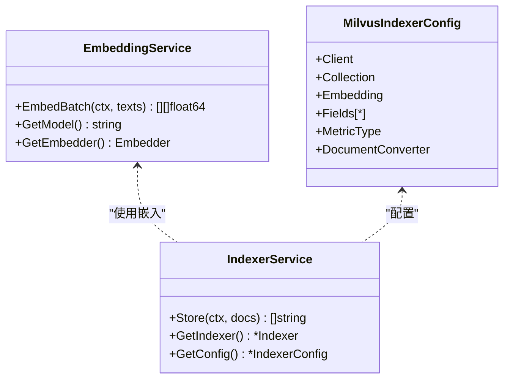
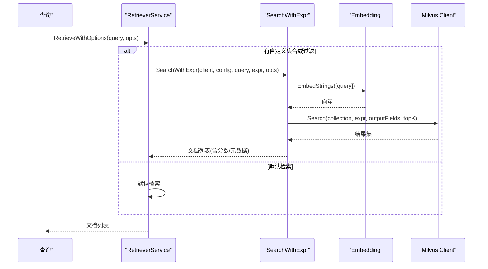
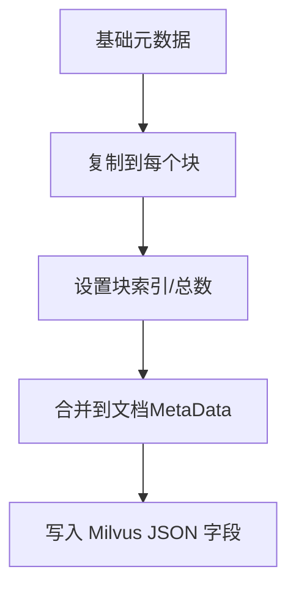
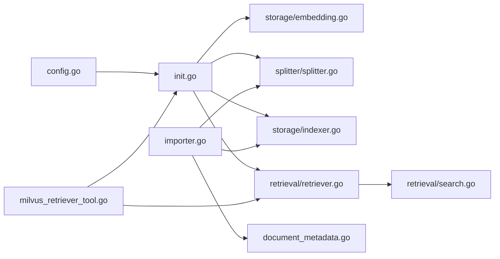

# 向量检索系统

<cite>
**本文档引用的文件**
- [backend/internal/eino/milvus/init.go](file://backend/internal/eino/milvus/init.go)
- [backend/internal/eino/milvus/importer.go](file://backend/internal/eino/milvus/importer.go)
- [backend/internal/eino/milvus/retrieval/retriever.go](file://backend/internal/eino/milvus/retrieval/retriever.go)
- [backend/internal/eino/milvus/retrieval/search.go](file://backend/internal/eino/milvus/retrieval/search.go)
- [backend/internal/eino/milvus/storage/embedding.go](file://backend/internal/eino/milvus/storage/embedding.go)
- [backend/internal/eino/milvus/storage/indexer.go](file://backend/internal/eino/milvus/storage/indexer.go)
- [backend/internal/eino/milvus/splitter/splitter.go](file://backend/internal/eino/milvus/splitter/splitter.go)
- [backend/internal/eino/milvus/splitter/markdown.go](file://backend/internal/eino/milvus/splitter/markdown.go)
- [backend/internal/eino/milvus/document_metadata.go](file://backend/internal/eino/milvus/document_metadata.go)
- [backend/internal/eino/milvus/retrieval/options.go](file://backend/internal/eino/milvus/retrieval/options.go)
- [backend/internal/config/config.go](file://backend/internal/config/config.go)
- [backend/chatApp/tool/milvus_retriever_tool.go](file://backend/chatApp/tool/milvus_retriever_tool.go)
- [backend/internal/eino/milvus/readme.md](file://backend/internal/eino/milvus/readme.md)
- [backend/internal/eino/milvus/integration_test.go](file://backend/internal/eino/milvus/integration_test.go)
</cite>

## 目录
1. [简介](#简介)
2. [项目结构](#项目结构)
3. [核心组件](#核心组件)
4. [架构总览](#架构总览)
5. [详细组件分析](#详细组件分析)
6. [依赖关系分析](#依赖关系分析)
7. [性能考量](#性能考量)
8. [故障排除指南](#故障排除指南)
9. [结论](#结论)
10. [附录](#附录)

## 简介
本项目为基于 Milvus 的向量检索系统，提供从文档向量化、索引构建到高效检索的完整链路。系统采用模块化设计，结合递归分割器、Ark Embedding 服务与 Milvus 索引器，支持多语言、多分类的文档检索，并提供灵活的过滤与排序能力。本文档面向开发者与运维人员，覆盖架构设计、数据导入流程、检索算法、性能调优、监控与故障排除等内容。

## 项目结构
Milvus 模块位于 backend/internal/eino/milvus，包含初始化、导入器、检索、分割、存储与元数据等子模块；配置位于 backend/internal/config；工具层提供检索工具封装；readme.md 提供模块概览与测试说明；integration_test.go 提供端到端集成测试。

图表来源
- [backend/internal/eino/milvus/init.go](file://backend/internal/eino/milvus/init.go#L1-L219)
- [backend/internal/eino/milvus/importer.go](file://backend/internal/eino/milvus/importer.go#L1-L503)
- [backend/internal/eino/milvus/document_metadata.go](file://backend/internal/eino/milvus/document_metadata.go#L1-L135)
- [backend/internal/eino/milvus/retrieval/retriever.go](file://backend/internal/eino/milvus/retrieval/retriever.go#L1-L173)
- [backend/internal/eino/milvus/splitter/splitter.go](file://backend/internal/eino/milvus/splitter/splitter.go#L1-L84)
- [backend/internal/eino/milvus/storage/indexer.go](file://backend/internal/eino/milvus/storage/indexer.go#L1-L105)
- [backend/internal/config/config.go](file://backend/internal/config/config.go#L1-L269)
- [backend/chatApp/tool/milvus_retriever_tool.go](file://backend/chatApp/tool/milvus_retriever_tool.go#L1-L144)

章节来源
- [backend/internal/eino/milvus/readme.md](file://backend/internal/eino/milvus/readme.md#L1-L228)

## 核心组件
- MilvusManager：统一初始化与管理 Embedding、分割器、索引器、检索器，提供健康检查与关闭。
- MarkdownImporter：支持单文件、目录、批量导入，自动提取标题、生成元数据并写入 Milvus。
- DocumentSplitterService：递归分割器，支持中英文混合与 Markdown 专用分隔符。
- EmbeddingService：Ark 模型向量化服务，支持批量嵌入与超时/重试配置。
- IndexerService：将文档向量、内容与元数据写入 Milvus，使用浮点向量与 JSON 元数据字段。
- RetrieverService：检索服务，支持语言/分类过滤、TopK、自定义表达式过滤与分数回填。
- DocumentMetadata：统一的元数据结构，支持语言、分类、文件信息、块索引、时间戳与自定义字段。
- 配置系统：Embedding、Milvus、文档分割器等配置集中管理，支持环境变量展开。

章节来源
- [backend/internal/eino/milvus/init.go](file://backend/internal/eino/milvus/init.go#L22-L143)
- [backend/internal/eino/milvus/importer.go](file://backend/internal/eino/milvus/importer.go#L13-L262)
- [backend/internal/eino/milvus/splitter/splitter.go](file://backend/internal/eino/milvus/splitter/splitter.go#L14-L84)
- [backend/internal/eino/milvus/storage/embedding.go](file://backend/internal/eino/milvus/storage/embedding.go#L14-L105)
- [backend/internal/eino/milvus/storage/indexer.go](file://backend/internal/eino/milvus/storage/indexer.go#L14-L105)
- [backend/internal/eino/milvus/retrieval/retriever.go](file://backend/internal/eino/milvus/retrieval/retriever.go#L15-L173)
- [backend/internal/eino/milvus/document_metadata.go](file://backend/internal/eino/milvus/document_metadata.go#L28-L135)
- [backend/internal/config/config.go](file://backend/internal/config/config.go#L14-L269)

## 架构总览
系统采用“导入-索引-检索”三段式流水线：导入阶段将 Markdown 文档切分为小块并生成向量；索引阶段写入 Milvus；检索阶段支持过滤与 TopK 返回。

图表来源
- [backend/internal/eino/milvus/importer.go](file://backend/internal/eino/milvus/importer.go#L80-L142)
- [backend/internal/eino/milvus/splitter/splitter.go](file://backend/internal/eino/milvus/splitter/splitter.go#L53-L78)
- [backend/internal/eino/milvus/storage/embedding.go](file://backend/internal/eino/milvus/storage/embedding.go#L76-L88)
- [backend/internal/eino/milvus/storage/indexer.go](file://backend/internal/eino/milvus/storage/indexer.go#L84-L94)
- [backend/internal/eino/milvus/retrieval/retriever.go](file://backend/internal/eino/milvus/retrieval/retriever.go#L91-L130)

## 详细组件分析

### MilvusManager 初始化与生命周期
- 负责连接 Milvus、初始化 Embedding、分割器、索引器与检索器，并提供健康检查与关闭。
- 通过全局单例保证服务复用与一致性。

图表来源
- [backend/internal/eino/milvus/init.go](file://backend/internal/eino/milvus/init.go#L22-L143)
- [backend/internal/eino/milvus/storage/embedding.go](file://backend/internal/eino/milvus/storage/embedding.go#L14-L105)
- [backend/internal/eino/milvus/splitter/splitter.go](file://backend/internal/eino/milvus/splitter/splitter.go#L14-L84)
- [backend/internal/eino/milvus/storage/indexer.go](file://backend/internal/eino/milvus/storage/indexer.go#L14-L105)
- [backend/internal/eino/milvus/retrieval/retriever.go](file://backend/internal/eino/milvus/retrieval/retriever.go#L15-L173)

章节来源
- [backend/internal/eino/milvus/init.go](file://backend/internal/eino/milvus/init.go#L42-L143)

### 文档导入流程（MarkdownImporter）
- 支持单文件、目录与批量导入，自动提取标题、生成元数据并写入 Milvus。
- 提供纯文本导入接口，便于飞书等来源的文本直接入库。

图表来源
- [backend/internal/eino/milvus/importer.go](file://backend/internal/eino/milvus/importer.go#L80-L142)
- [backend/internal/eino/milvus/splitter/splitter.go](file://backend/internal/eino/milvus/splitter/splitter.go#L53-L78)
- [backend/internal/eino/milvus/storage/embedding.go](file://backend/internal/eino/milvus/storage/embedding.go#L76-L88)
- [backend/internal/eino/milvus/storage/indexer.go](file://backend/internal/eino/milvus/storage/indexer.go#L84-L94)

章节来源
- [backend/internal/eino/milvus/importer.go](file://backend/internal/eino/milvus/importer.go#L13-L262)

### 文档分割策略（Splitter）
- 递归分割器支持自定义块大小、重叠大小与分隔符，Markdown 专用分隔符优先保留语义完整性。
- 支持批量文档与纯文本分割。

图表来源
- [backend/internal/eino/milvus/splitter/splitter.go](file://backend/internal/eino/milvus/splitter/splitter.go#L20-L65)
- [backend/internal/eino/milvus/splitter/markdown.go](file://backend/internal/eino/milvus/splitter/markdown.go#L11-L72)

章节来源
- [backend/internal/eino/milvus/splitter/splitter.go](file://backend/internal/eino/milvus/splitter/splitter.go#L14-L84)
- [backend/internal/eino/milvus/splitter/markdown.go](file://backend/internal/eino/milvus/splitter/markdown.go#L11-L129)

### 向量索引与存储（Embedding/Indexer）
- EmbeddingService 基于 Ark 模型，支持批量嵌入与超时/重试配置。
- IndexerService 使用浮点向量字段与 JSON 元数据，支持 L2/COSINE/IP 等度量类型。

图表来源
- [backend/internal/eino/milvus/storage/embedding.go](file://backend/internal/eino/milvus/storage/embedding.go#L14-L105)
- [backend/internal/eino/milvus/storage/indexer.go](file://backend/internal/eino/milvus/storage/indexer.go#L14-L105)

章节来源
- [backend/internal/eino/milvus/storage/embedding.go](file://backend/internal/eino/milvus/storage/embedding.go#L14-L105)
- [backend/internal/eino/milvus/storage/indexer.go](file://backend/internal/eino/milvus/storage/indexer.go#L14-L105)

### 检索算法与过滤（Retriever/Search）
- RetrieverService 支持基本检索与过滤检索，过滤表达式优先级高于语言/分类字段。
- SearchWithExpr 直接使用 Milvus SDK 执行搜索，回填相似度分数与元数据。

图表来源
- [backend/internal/eino/milvus/retrieval/retriever.go](file://backend/internal/eino/milvus/retrieval/retriever.go#L91-L130)
- [backend/internal/eino/milvus/retrieval/search.go](file://backend/internal/eino/milvus/retrieval/search.go#L14-L137)

章节来源
- [backend/internal/eino/milvus/retrieval/retriever.go](file://backend/internal/eino/milvus/retrieval/retriever.go#L15-L173)
- [backend/internal/eino/milvus/retrieval/search.go](file://backend/internal/eino/milvus/retrieval/search.go#L14-L137)
- [backend/internal/eino/milvus/retrieval/options.go](file://backend/internal/eino/milvus/retrieval/options.go#L21-L36)

### 文档元数据与过滤表达式
- DocumentMetadata 统一语言、分类、文件信息、块索引、时间戳与自定义字段。
- EnrichDocumentsWithMetadata 将基础元数据复制到每个块并回填块索引与总数。
- BuildFilterExpr 将语言/分类/自定义表达式转换为 Milvus 表达式。

图表来源
- [backend/internal/eino/milvus/document_metadata.go](file://backend/internal/eino/milvus/document_metadata.go#L110-L135)

章节来源
- [backend/internal/eino/milvus/document_metadata.go](file://backend/internal/eino/milvus/document_metadata.go#L28-L135)

### 工具层与外部集成
- milvus_retriever_tool 提供 Eino 工具封装，将检索结果格式化为 JSON 输出，便于外部调用。

章节来源
- [backend/chatApp/tool/milvus_retriever_tool.go](file://backend/chatApp/tool/milvus_retriever_tool.go#L15-L144)

## 依赖关系分析
- 初始化依赖：init.go 依赖配置、Ark Embedding、递归分割器、Milvus 索引器与检索器。
- 导入依赖：importer.go 依赖分割器、索引器与元数据。
- 检索依赖：retriever.go 依赖检索器实现与搜索实现；search.go 依赖 Milvus SDK。
- 配置依赖：config.go 提供 Embedding、Milvus、分割器等配置，支持环境变量展开。

图表来源
- [backend/internal/config/config.go](file://backend/internal/config/config.go#L14-L269)
- [backend/internal/eino/milvus/init.go](file://backend/internal/eino/milvus/init.go#L1-L219)
- [backend/internal/eino/milvus/importer.go](file://backend/internal/eino/milvus/importer.go#L1-L503)
- [backend/internal/eino/milvus/retrieval/retriever.go](file://backend/internal/eino/milvus/retrieval/retriever.go#L1-L173)
- [backend/internal/eino/milvus/retrieval/search.go](file://backend/internal/eino/milvus/retrieval/search.go#L1-L137)
- [backend/chatApp/tool/milvus_retriever_tool.go](file://backend/chatApp/tool/milvus_retriever_tool.go#L1-L144)

章节来源
- [backend/internal/eino/milvus/init.go](file://backend/internal/eino/milvus/init.go#L1-L219)
- [backend/internal/eino/milvus/importer.go](file://backend/internal/eino/milvus/importer.go#L1-L503)
- [backend/internal/eino/milvus/retrieval/retriever.go](file://backend/internal/eino/milvus/retrieval/retriever.go#L1-L173)
- [backend/internal/eino/milvus/retrieval/search.go](file://backend/internal/eino/milvus/retrieval/search.go#L1-L137)
- [backend/internal/config/config.go](file://backend/internal/config/config.go#L14-L269)

## 性能考量
- 向量维度与度量类型：Embedding 维度需与 Milvus 集合维度一致；COSINE/L2/IP 适用于不同场景，需结合数据分布与索引类型选择。
- TopK 与阈值：TopK 影响召回与延迟；可结合 ScoreThreshold 过滤低分结果。
- 分割策略：ChunkSize 与 OverlapSize 需平衡检索精度与向量规模；重叠有助于跨边界语义连贯。
- 索引与查询参数：AUTOINDEX 搜索参数适配通用场景；可根据数据规模与查询模式调整索引类型与参数。
- 批量导入：分批处理与并发控制降低内存峰值；合理设置超时与重试提升稳定性。
- 检索过滤：表达式过滤在 Milvus 侧执行，减少网络传输与二次处理成本。

章节来源
- [backend/internal/eino/milvus/storage/indexer.go](file://backend/internal/eino/milvus/storage/indexer.go#L69-L71)
- [backend/internal/eino/milvus/retrieval/retriever.go](file://backend/internal/eino/milvus/retrieval/retriever.go#L46-L78)
- [backend/internal/eino/milvus/splitter/splitter.go](file://backend/internal/eino/milvus/splitter/splitter.go#L25-L35)
- [backend/internal/config/config.go](file://backend/internal/config/config.go#L173-L210)

## 故障排除指南
- 连接与健康检查：使用 HealthCheck 验证 Milvus 连通性；关注连接超时与凭据配置。
- 认证与模型：Embedding 配置需提供 APIKey 或 AK/SK；模型名称与 BaseURL 正确性直接影响嵌入质量。
- 维度不匹配：Indexer 初始化需与 Embedding 维度一致；否则写入失败或检索异常。
- 过滤表达式：自定义 Expr 优先级最高；确保语法正确且字段存在。
- 索引等待：导入后需等待 Milvus 完成索引构建；可通过测试中的等待时间观察效果。
- 工具输出：工具层返回 JSON 结构，包含文档列表、数量与错误信息，便于定位问题。

章节来源
- [backend/internal/eino/milvus/init.go](file://backend/internal/eino/milvus/init.go#L203-L219)
- [backend/internal/eino/milvus/storage/embedding.go](file://backend/internal/eino/milvus/storage/embedding.go#L25-L31)
- [backend/internal/eino/milvus/storage/indexer.go](file://backend/internal/eino/milvus/storage/indexer.go#L34-L36)
- [backend/chatApp/tool/milvus_retriever_tool.go](file://backend/chatApp/tool/milvus_retriever_tool.go#L103-L130)
- [backend/internal/eino/milvus/integration_test.go](file://backend/internal/eino/milvus/integration_test.go#L168-L171)

## 结论
本向量检索系统以 Milvus 为核心，结合 Ark Embedding 与递归分割器，形成从导入、索引到检索的完整链路。通过统一的元数据模型与灵活的过滤机制，系统支持多语言、多分类的面试知识库建设。建议在生产环境中重点关注维度一致性、TopK 与阈值调优、表达式过滤与批量导入策略，并配合健康检查与日志监控保障稳定性。

## 附录

### 配置指南（关键参数）
- Embedding 配置：APIKey/AccessKey/SecretKey、Model、BaseURL、Region、Timeout、RetryTimes、Dimensions。
- Milvus 配置：Address、Username、Password、DatabaseName、CollectionName、Collections、TopK、MetricType、ConnectTimeout、SearchTimeout。
- 文档分割器：ChunkSize、OverlapSize、Separators、KeepType。

章节来源
- [backend/internal/config/config.go](file://backend/internal/config/config.go#L154-L210)

### 监控方案（建议）
- 连接健康：定期执行 HealthCheck，记录集合数量与延迟。
- 导入指标：统计导入文件数、成功/失败数、总块数、写入耗时。
- 检索指标：响应时间、TopK、命中率、平均分数分布。
- 异常告警：工具层错误输出与日志聚合，结合飞书/邮件告警。

章节来源
- [backend/internal/eino/milvus/init.go](file://backend/internal/eino/milvus/init.go#L203-L219)
- [backend/chatApp/tool/milvus_retriever_tool.go](file://backend/chatApp/tool/milvus_retriever_tool.go#L103-L130)

### 端到端测试与验证
- 集成测试覆盖：初始化、健康检查、单文件/批量导入、索引等待、基本与过滤检索。
- 测试数据：按语言与分类组织的 Markdown 文档，便于验证多维过滤与召回效果。

章节来源
- [backend/internal/eino/milvus/readme.md](file://backend/internal/eino/milvus/readme.md#L124-L228)
- [backend/internal/eino/milvus/integration_test.go](file://backend/internal/eino/milvus/integration_test.go#L12-L167)