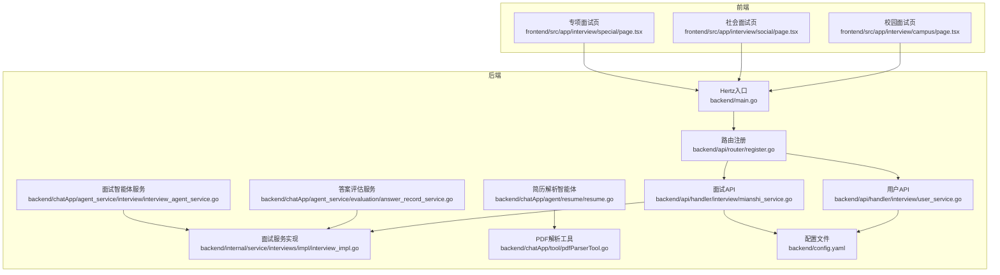
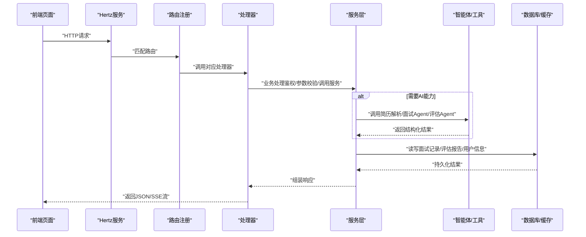
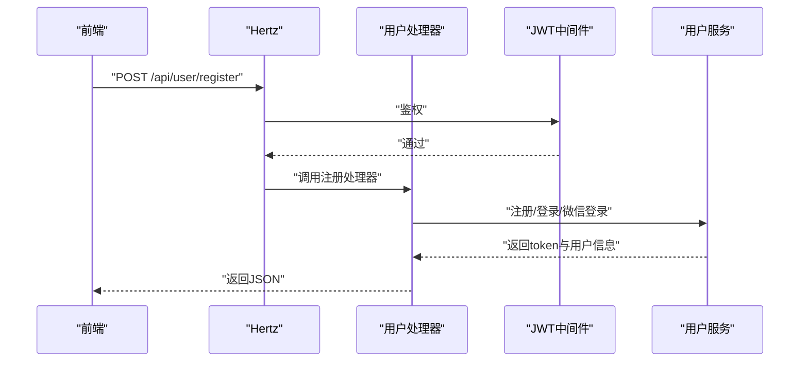
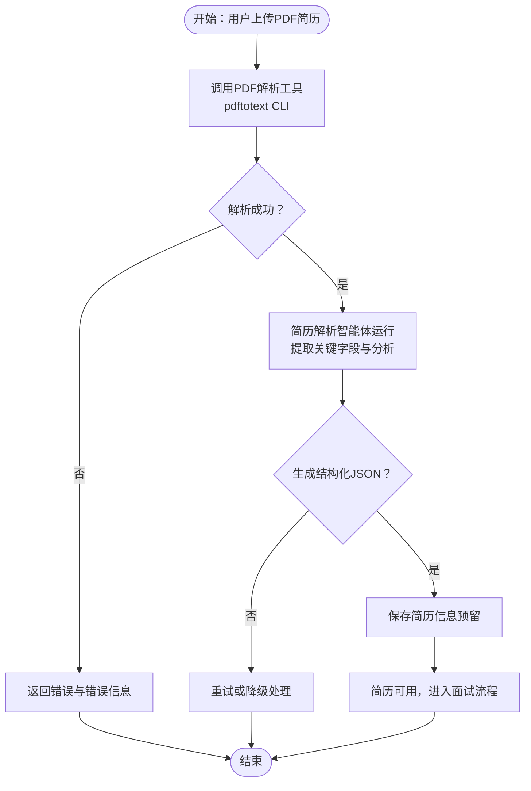
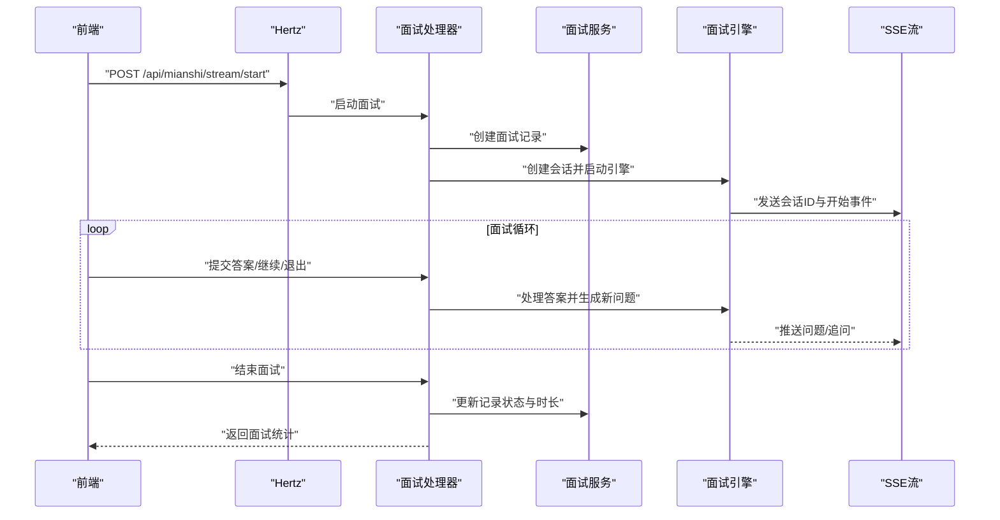
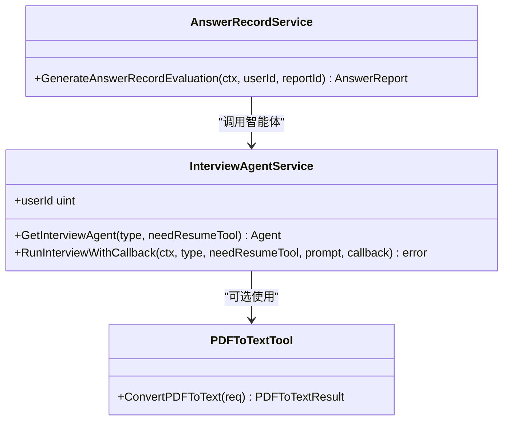
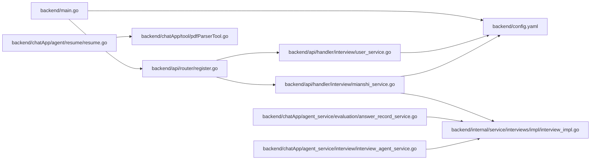

# 核心功能特性

<cite>
**本文引用的文件**
- [backend/main.go](file://backend/main.go)
- [backend/api/router/register.go](file://backend/api/router/register.go)
- [backend/api/handler/interview/user_service.go](file://backend/api/handler/interview/user_service.go)
- [backend/api/handler/interview/mianshi_service.go](file://backend/api/handler/interview/mianshi_service.go)
- [backend/chatApp/agent/resume/resume.go](file://backend/chatApp/agent/resume/resume.go)
- [backend/chatApp/agent_service/interview/interview_agent_service.go](file://backend/chatApp/agent_service/interview/interview_agent_service.go)
- [backend/chatApp/agent_service/evaluation/answer_record_service.go](file://backend/chatApp/agent_service/evaluation/answer_record_service.go)
- [backend/chatApp/tool/pdfParserTool.go](file://backend/chatApp/tool/pdfParserTool.go)
- [backend/internal/service/interviews/impl/interview_impl.go](file://backend/internal/service/interviews/impl/interview_impl.go)
- [frontend/src/app/interview/campus/page.tsx](file://frontend/src/app/interview/campus/page.tsx)
- [frontend/src/app/interview/social/page.tsx](file://frontend/src/app/interview/social/page.tsx)
- [frontend/src/app/interview/special/page.tsx](file://frontend/src/app/interview/special/page.tsx)
- [backend/config.yaml](file://backend/config.yaml)
- [doc/需求文档/综合面试.md](file://doc/需求文档/综合面试.md)
</cite>

## 目录
1. [简介](#简介)
2. [项目结构](#项目结构)
3. [核心组件](#核心组件)
4. [架构总览](#架构总览)
5. [详细组件分析](#详细组件分析)
6. [依赖关系分析](#依赖关系分析)
7. [性能考量](#性能考量)
8. [故障排查指南](#故障排查指南)
9. [结论](#结论)
10. [附录](#附录)

## 简介
本文件面向面试吧AI智能面试平台的核心功能特性，系统性阐述用户管理、简历管理、面试系统与AI智能体系统的实现与交互。文档覆盖以下主题：
- 用户管理：注册、登录、微信登录、密码找回与重置、用户资料与模型配置检查
- 简历管理：简历上传、PDF解析、简历信息抽取与结构化、简历驱动的面试押题
- 面试系统：综合面试（校招/社招）、专项面试（Go/Java/MQ/MySQL/Redis等）、SSE驱动的实时面试、答案提交与追问、面试记录与评估
- AI智能体系统：简历解析智能体、面试问题生成智能体、答案评估与答题报告生成、预测推荐（预留）

通过接口路由、处理器、服务层、智能体与工具链的协同，平台实现了“简历→问题→追问→评估→报告”的闭环，满足不同面试阶段的学习与演练需求。

## 项目结构
后端采用Hertz框架，按模块划分API、内部服务、智能体与工具、持久层DAO与配置；前端基于Next.js，提供面试入口与参数配置界面。整体结构如下：

图表来源
- [backend/main.go](file://backend/main.go#L29-L173)
- [backend/api/router/register.go](file://backend/api/router/register.go#L11-L15)
- [backend/api/handler/interview/user_service.go](file://backend/api/handler/interview/user_service.go#L212-L420)
- [backend/api/handler/interview/mianshi_service.go](file://backend/api/handler/interview/mianshi_service.go#L25-L300)
- [backend/chatApp/agent/resume/resume.go](file://backend/chatApp/agent/resume/resume.go#L14-L109)
- [backend/chatApp/tool/pdfParserTool.go](file://backend/chatApp/tool/pdfParserTool.go#L39-L124)
- [backend/chatApp/agent_service/evaluation/answer_record_service.go](file://backend/chatApp/agent_service/evaluation/answer_record_service.go#L16-L100)
- [backend/chatApp/agent_service/interview/interview_agent_service.go](file://backend/chatApp/agent_service/interview/interview_agent_service.go#L42-L101)
- [backend/internal/service/interviews/impl/interview_impl.go](file://backend/internal/service/interviews/impl/interview_impl.go#L19-L102)
- [backend/config.yaml](file://backend/config.yaml#L1-L129)

章节来源
- [backend/main.go](file://backend/main.go#L29-L173)
- [backend/api/router/register.go](file://backend/api/router/register.go#L11-L15)
- [backend/config.yaml](file://backend/config.yaml#L1-L129)

## 核心组件
- 用户管理模块：提供注册、登录、微信登录、密码找回/重置、用户资料查询与更新、模型配置检查等接口，统一通过JWT鉴权保护。
- 简历管理模块：通过PDF解析工具与简历解析智能体，将PDF简历转化为结构化信息，支撑简历驱动的面试题目生成与押题。
- 面试系统模块：支持综合面试（校招/社招）与专项面试（Go/Java/MQ/MySQL/Redis等），通过SSE流式输出问题，支持答案提交、追问与结束面试；提供面试记录与评估报告查询。
- AI智能体系统：简历解析智能体负责抽取简历关键信息；面试智能体服务按类型调度不同面试Agent；答案评估服务生成答题报告并持久化；预测推荐模块预留。

章节来源
- [backend/api/handler/interview/user_service.go](file://backend/api/handler/interview/user_service.go#L212-L420)
- [backend/chatApp/agent/resume/resume.go](file://backend/chatApp/agent/resume/resume.go#L14-L109)
- [backend/chatApp/tool/pdfParserTool.go](file://backend/chatApp/tool/pdfParserTool.go#L39-L124)
- [backend/api/handler/interview/mianshi_service.go](file://backend/api/handler/interview/mianshi_service.go#L25-L300)
- [backend/chatApp/agent_service/interview/interview_agent_service.go](file://backend/chatApp/agent_service/interview/interview_agent_service.go#L42-L101)
- [backend/chatApp/agent_service/evaluation/answer_record_service.go](file://backend/chatApp/agent_service/evaluation/answer_record_service.go#L16-L100)
- [backend/internal/service/interviews/impl/interview_impl.go](file://backend/internal/service/interviews/impl/interview_impl.go#L19-L102)

## 架构总览
平台采用“前端页面 + Hertz路由 + 处理器 + 服务层 + 智能体/工具 + 数据库/缓存”的分层架构。JWT中间件统一鉴权，CORS中间件处理跨域，Redis队列与消费者用于异步处理，配置文件集中管理外部服务与超时策略。

图表来源
- [backend/main.go](file://backend/main.go#L101-L128)
- [backend/api/router/register.go](file://backend/api/router/register.go#L11-L15)
- [backend/api/handler/interview/mianshi_service.go](file://backend/api/handler/interview/mianshi_service.go#L25-L117)
- [backend/chatApp/agent/resume/resume.go](file://backend/chatApp/agent/resume/resume.go#L14-L109)
- [backend/chatApp/agent_service/evaluation/answer_record_service.go](file://backend/chatApp/agent_service/evaluation/answer_record_service.go#L16-L100)
- [backend/internal/service/interviews/impl/interview_impl.go](file://backend/internal/service/interviews/impl/interview_impl.go#L19-L102)

## 详细组件分析

### 用户管理模块
- 注册/登录/微信登录：绑定与校验请求参数，调用用户服务完成账号创建/登录态维护，返回token与用户信息。
- 密码找回/重置：通过邮箱发送重置链接，校验token后更新密码。
- 用户资料：获取/更新用户资料；模型配置检查接口返回当前用户是否已配置默认模型。
- 权限控制：JWT中间件拦截未授权请求，部分路由支持跳过鉴权（如微信回调）。

图表来源
- [backend/api/handler/interview/user_service.go](file://backend/api/handler/interview/user_service.go#L212-L382)
- [backend/main.go](file://backend/main.go#L127-L128)

章节来源
- [backend/api/handler/interview/user_service.go](file://backend/api/handler/interview/user_service.go#L212-L382)
- [backend/main.go](file://backend/main.go#L127-L128)

### 简历管理与解析
- PDF解析工具：封装pdftotext CLI，支持参数校验、文件存在性检查、超时处理与结构化返回。
- 简历解析智能体：指导大模型调用PDF解析工具，提取基本信息、教育背景、工作经历、技术栈、项目经验、技能与证书等，并给出推荐难度与关注领域。
- 与面试联动：简历ID随面试参数传递，面试引擎在会话中携带简历信息，驱动问题生成与追问。

图表来源
- [backend/chatApp/tool/pdfParserTool.go](file://backend/chatApp/tool/pdfParserTool.go#L39-L124)
- [backend/chatApp/agent/resume/resume.go](file://backend/chatApp/agent/resume/resume.go#L14-L109)

章节来源
- [backend/chatApp/tool/pdfParserTool.go](file://backend/chatApp/tool/pdfParserTool.go#L39-L124)
- [backend/chatApp/agent/resume/resume.go](file://backend/chatApp/agent/resume/resume.go#L14-L109)

### 面试系统（综合/专项）
- 综合面试（校招/社招）：前端页面收集简历、岗位、难度与目标公司，后端创建面试记录并启动SSE流式面试；支持答案提交、追问、结束面试与评估报告查询。
- 专项面试（Go/Java/MQ/MySQL/Redis等）：前端选择技术栈与难度，后端按类型调度对应面试智能体。
- 会话管理：全局会话管理器维护面试会话，支持取消、计时与状态更新；面试结束后持久化记录并清理会话。
- 评估与报告：支持面试评估报告与答题报告的查询与生成，若数据库无数据则触发智能体生成并持久化。

图表来源
- [backend/api/handler/interview/mianshi_service.go](file://backend/api/handler/interview/mianshi_service.go#L25-L300)
- [backend/internal/service/interviews/impl/interview_impl.go](file://backend/internal/service/interviews/impl/interview_impl.go#L19-L102)

章节来源
- [backend/api/handler/interview/mianshi_service.go](file://backend/api/handler/interview/mianshi_service.go#L25-L300)
- [backend/internal/service/interviews/impl/interview_impl.go](file://backend/internal/service/interviews/impl/interview_impl.go#L19-L102)
- [frontend/src/app/interview/campus/page.tsx](file://frontend/src/app/interview/campus/page.tsx#L268-L296)
- [frontend/src/app/interview/social/page.tsx](file://frontend/src/app/interview/social/page.tsx#L280-L295)
- [frontend/src/app/interview/special/page.tsx](file://frontend/src/app/interview/special/page.tsx#L103-L114)

### AI智能体系统
- 面试智能体服务：按类型（综合校招/社招、Go/Java/MQ/MySQL/Redis）返回对应智能体，支持是否需要简历工具的开关。
- 答案评估服务：根据用户ID与报告ID，调用答题评估智能体生成主题级评估反馈，解析JSON并持久化到数据库。
- 配置与超时：服务层为评估流程设置超时，避免长时间阻塞；工具与智能体均具备错误处理与日志记录。

图表来源
- [backend/chatApp/agent_service/interview/interview_agent_service.go](file://backend/chatApp/agent_service/interview/interview_agent_service.go#L42-L101)
- [backend/chatApp/agent_service/evaluation/answer_record_service.go](file://backend/chatApp/agent_service/evaluation/answer_record_service.go#L16-L100)
- [backend/chatApp/tool/pdfParserTool.go](file://backend/chatApp/tool/pdfParserTool.go#L39-L124)

章节来源
- [backend/chatApp/agent_service/interview/interview_agent_service.go](file://backend/chatApp/agent_service/interview/interview_agent_service.go#L42-L101)
- [backend/chatApp/agent_service/evaluation/answer_record_service.go](file://backend/chatApp/agent_service/evaluation/answer_record_service.go#L16-L100)
- [backend/chatApp/tool/pdfParserTool.go](file://backend/chatApp/tool/pdfParserTool.go#L39-L124)

### 前端使用指南与演示
- 综合面试（校招/社招）：选择简历、岗位、难度与目标公司，点击开始进入面试；若未配置模型，引导至用户模型页面配置。
- 专项面试：选择技术栈与难度，点击开始进入面试。
- 面试过程：SSE流式接收问题，提交答案后可继续或退出；结束时查看时长、问题数等统计。

章节来源
- [frontend/src/app/interview/campus/page.tsx](file://frontend/src/app/interview/campus/page.tsx#L268-L296)
- [frontend/src/app/interview/social/page.tsx](file://frontend/src/app/interview/social/page.tsx#L280-L295)
- [frontend/src/app/interview/special/page.tsx](file://frontend/src/app/interview/special/page.tsx#L103-L114)

## 依赖关系分析
- 启动与中间件：Hertz入口加载配置、初始化数据库/Redis、注册路由、挂载CORS与JWT中间件。
- 路由与处理器：路由注册统一转发至各模块处理器；用户与面试处理器分别对接用户服务与面试服务。
- 服务与DAO：面试服务实现负责记录创建/更新、列表查询与对话保存；DAO层负责数据持久化。
- 智能体与工具：简历解析智能体依赖PDF解析工具；答案评估服务依赖面试服务与智能体；面试智能体服务按类型调度不同Agent。

图表来源
- [backend/main.go](file://backend/main.go#L29-L173)
- [backend/api/router/register.go](file://backend/api/router/register.go#L11-L15)
- [backend/api/handler/interview/user_service.go](file://backend/api/handler/interview/user_service.go#L212-L382)
- [backend/api/handler/interview/mianshi_service.go](file://backend/api/handler/interview/mianshi_service.go#L25-L300)
- [backend/internal/service/interviews/impl/interview_impl.go](file://backend/internal/service/interviews/impl/interview_impl.go#L19-L102)
- [backend/chatApp/agent/resume/resume.go](file://backend/chatApp/agent/resume/resume.go#L14-L109)
- [backend/chatApp/tool/pdfParserTool.go](file://backend/chatApp/tool/pdfParserTool.go#L39-L124)
- [backend/chatApp/agent_service/evaluation/answer_record_service.go](file://backend/chatApp/agent_service/evaluation/answer_record_service.go#L16-L100)
- [backend/chatApp/agent_service/interview/interview_agent_service.go](file://backend/chatApp/agent_service/interview/interview_agent_service.go#L42-L101)

章节来源
- [backend/main.go](file://backend/main.go#L29-L173)
- [backend/api/router/register.go](file://backend/api/router/register.go#L11-L15)
- [backend/api/handler/interview/mianshi_service.go](file://backend/api/handler/interview/mianshi_service.go#L25-L300)
- [backend/internal/service/interviews/impl/interview_impl.go](file://backend/internal/service/interviews/impl/interview_impl.go#L19-L102)

## 性能考量
- 超时与并发：面试服务配置最大时长、问题超时与最大/最小问题数；智能体评估设置超时（如300秒）避免阻塞。
- 异步与队列：消息队列与消费者用于异步处理（如评估生成），降低请求延迟。
- 缓存与连接池：Redis连接池参数与数据库连接池参数在配置中设定，减少连接开销。
- SSE流式：面试过程采用SSE，前端可逐步渲染问题，降低一次性传输压力。

章节来源
- [backend/config.yaml](file://backend/config.yaml#L32-L38)
- [backend/chatApp/agent_service/evaluation/answer_record_service.go](file://backend/chatApp/agent_service/evaluation/answer_record_service.go#L16-L20)

## 故障排查指南
- 配置加载失败：检查.env与config.yaml路径与权限，确认环境变量展开是否正确。
- 数据库/Redis连接失败：核对DSN与连接参数，确认容器网络连通性。
- JWT鉴权失败：确认前端携带正确的Authorization头与X-Auth-Token；检查JWT密钥与过期时间。
- PDF解析失败：确认pdftotext安装与可执行权限；检查文件路径与访问权限；查看错误信息与超时日志。
- 面试SSE异常：检查会话ID有效性、取消函数是否被调用、前端是否正确处理流式事件。
- 评估报告为空：确认智能体返回JSON格式是否正确，必要时启用降级默认报告并记录日志。

章节来源
- [backend/main.go](file://backend/main.go#L30-L48)
- [backend/chatApp/tool/pdfParserTool.go](file://backend/chatApp/tool/pdfParserTool.go#L56-L93)
- [backend/api/handler/interview/mianshi_service.go](file://backend/api/handler/interview/mianshi_service.go#L25-L117)
- [backend/chatApp/agent_service/evaluation/answer_record_service.go](file://backend/chatApp/agent_service/evaluation/answer_record_service.go#L102-L144)

## 结论
面试吧AI智能面试平台通过清晰的分层架构与模块化设计，将用户管理、简历解析、面试流程与AI智能体有机结合，形成从“简历→问题→追问→评估→报告”的完整闭环。平台具备良好的扩展性：可新增技术栈专项、引入向量检索增强、完善预测推荐与学习路径规划，并持续优化SSE流式体验与评估准确性。

## 附录
- 综合面试功能参考：涵盖多维度评估、真实面试流程、过程录制与回放、实时反馈与评分、难度设置等，可作为面试体验优化的依据。
  
章节来源
- [doc/需求文档/综合面试.md](file://doc/需求文档/综合面试.md#L1-L52)