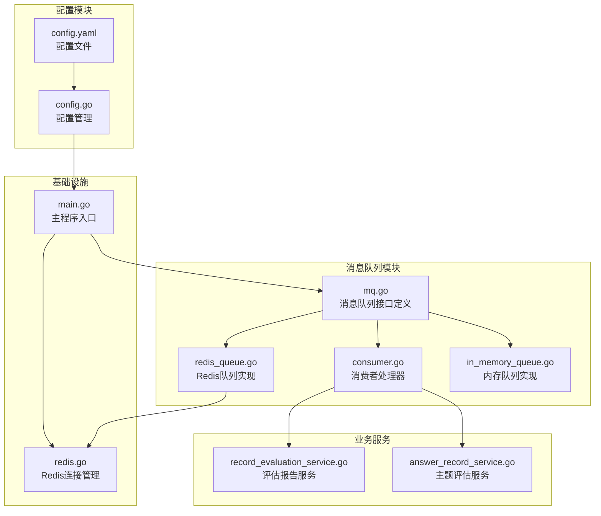
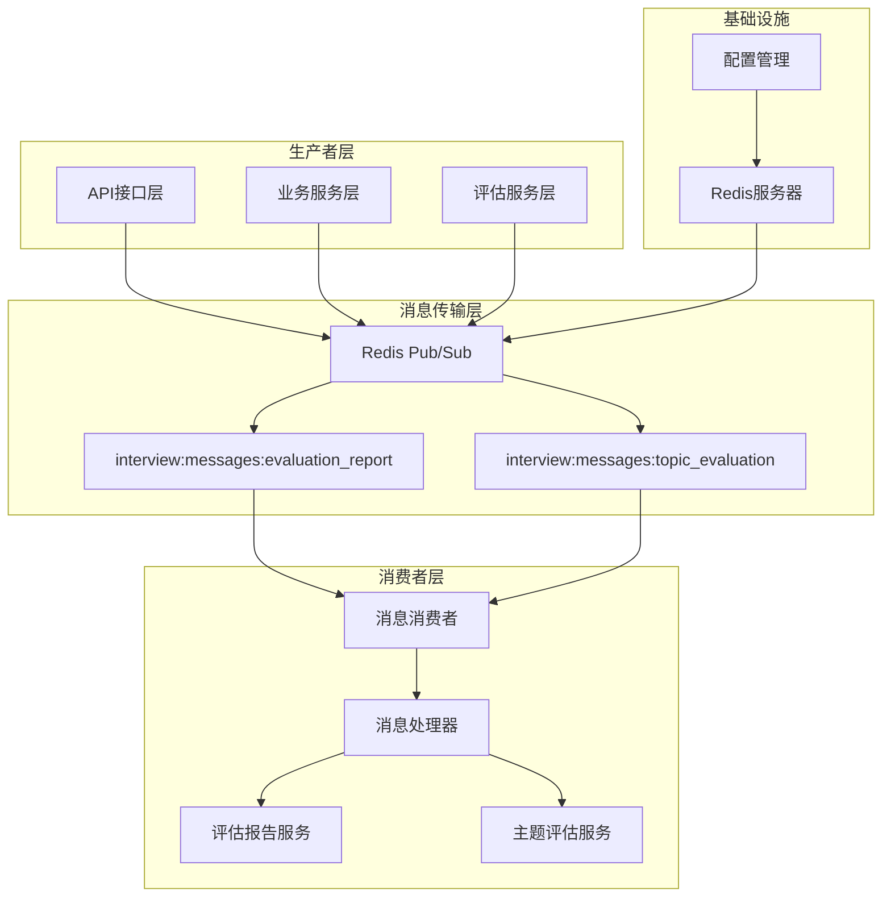
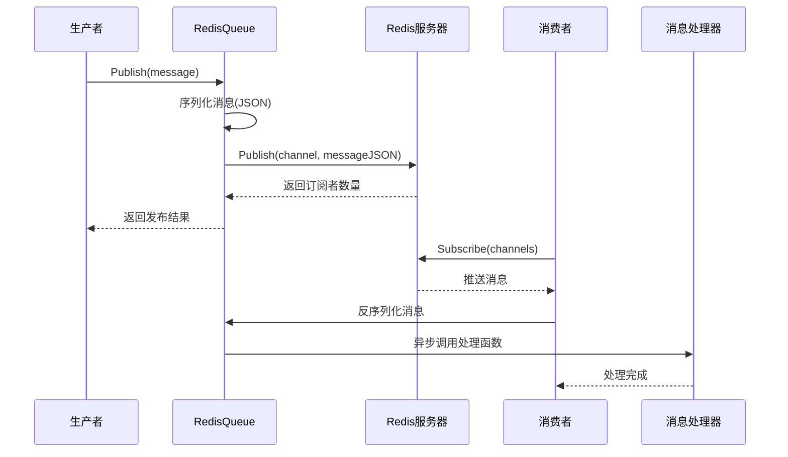
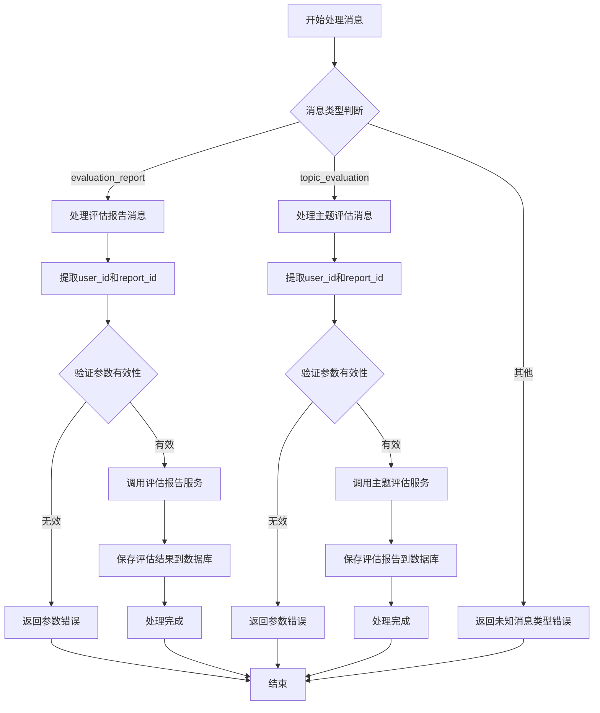
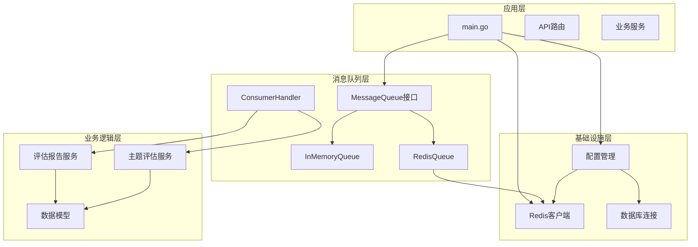

# 消息队列系统

<cite>
**本文档引用的文件**
- [backend/main.go](file://backend/main.go)
- [backend/internal/mq/mq.go](file://backend/internal/mq/mq.go)
- [backend/internal/mq/redis_queue.go](file://backend/internal/mq/redis_queue.go)
- [backend/internal/mq/consumer.go](file://backend/internal/mq/consumer.go)
- [backend/internal/repository/redis.go](file://backend/internal/repository/redis.go)
- [backend/internal/config/config.go](file://backend/internal/config/config.go)
- [backend/config.yaml](file://backend/config.yaml)
- [docker-compose.yml](file://docker-compose.yml)
- [backend/chatApp/agent_service/evaluation/record_evaluation_service.go](file://backend/chatApp/agent_service/evaluation/record_evaluation_service.go)
- [backend/chatApp/agent_service/evaluation/answer_record_service.go](file://backend/chatApp/agent_service/evaluation/answer_record_service.go)
</cite>

## 目录
1. [简介](#简介)
2. [项目结构](#项目结构)
3. [核心组件](#核心组件)
4. [架构概览](#架构概览)
5. [详细组件分析](#详细组件分析)
6. [依赖关系分析](#依赖关系分析)
7. [性能考虑](#性能考虑)
8. [故障排除指南](#故障排除指南)
9. [结论](#结论)

## 简介

本项目实现了基于Redis的分布式消息队列系统，专门用于面试Agent平台的异步任务处理。系统采用发布-订阅模式，通过Redis Pub/Sub机制实现消息的异步传递，支持评估报告生成和主题评估两种核心业务消息类型。

消息队列系统的核心目标是解耦业务逻辑，提高系统的可扩展性和可靠性，同时为面试评估任务提供异步处理能力。系统支持多种消息类型，具备良好的可扩展性，可以轻松添加新的消息类型和处理逻辑。

## 项目结构

消息队列系统主要位于`backend/internal/mq`目录下，包含以下关键文件：



**图表来源**
- [backend/internal/mq/mq.go](file://backend/internal/mq/mq.go#L1-L209)
- [backend/internal/mq/redis_queue.go](file://backend/internal/mq/redis_queue.go#L1-L132)
- [backend/internal/mq/consumer.go](file://backend/internal/mq/consumer.go#L1-L101)
- [backend/internal/repository/redis.go](file://backend/internal/repository/redis.go#L1-L54)
- [backend/main.go](file://backend/main.go#L1-L211)

**章节来源**
- [backend/internal/mq/mq.go](file://backend/internal/mq/mq.go#L1-L209)
- [backend/internal/mq/redis_queue.go](file://backend/internal/mq/redis_queue.go#L1-L132)
- [backend/internal/mq/consumer.go](file://backend/internal/mq/consumer.go#L1-L101)
- [backend/internal/repository/redis.go](file://backend/internal/repository/redis.go#L1-L54)
- [backend/main.go](file://backend/main.go#L1-L211)

## 核心组件

### 消息队列接口设计

系统采用接口抽象设计，定义了统一的消息队列接口，支持多种实现方式：

```mermaid
classDiagram
class MessageQueue {
<<interface>>
+Publish(ctx, message) error
+Subscribe(ctx, handler) error
+Close() error
}
class Message {
+MessageType Type
+map~string,interface~ Payload
}
class MessageType {
<<enumeration>>
evaluation_report
topic_evaluation
}
class MessageHandler {
<<function>>
+HandleMessage(ctx, message) error
}
class InMemoryQueue {
-sync.RWMutex mu
-chan *Message messages
-[]MessageHandler handlers
-chan struct{} done
+Publish(ctx, message) error
+Subscribe(ctx, handler) error
+Close() error
}
class RedisQueue {
-redis.Client client
-sync.RWMutex mu
-[]MessageHandler handlers
-chan struct{} done
+Publish(ctx, message) error
+Subscribe(ctx, handler) error
+Close() error
+GetRedisClient() *redis.Client
}
MessageQueue <|.. InMemoryQueue
MessageQueue <|.. RedisQueue
Message --> MessageType
RedisQueue --> redis.Client
```

**图表来源**
- [backend/internal/mq/mq.go](file://backend/internal/mq/mq.go#L40-L48)
- [backend/internal/mq/mq.go](file://backend/internal/mq/mq.go#L22-L26)
- [backend/internal/mq/mq.go](file://backend/internal/mq/mq.go#L12-L20)
- [backend/internal/mq/mq.go](file://backend/internal/mq/mq.go#L53-L129)
- [backend/internal/mq/redis_queue.go](file://backend/internal/mq/redis_queue.go#L13-L19)

### 消息类型定义

系统定义了两种核心消息类型：

| 消息类型 | 描述 | 负载字段 |
|---------|------|----------|
| evaluation_report | 评估报告生成消息 | user_id, report_id |
| topic_evaluation | 主题评估消息 | user_id, report_id |

每种消息类型都配有专门的负载结构体，确保消息数据的结构化和类型安全。

**章节来源**
- [backend/internal/mq/mq.go](file://backend/internal/mq/mq.go#L12-L38)
- [backend/internal/mq/mq.go](file://backend/internal/mq/mq.go#L155-L208)

## 架构概览

消息队列系统采用发布-订阅模式的分布式架构：



**图表来源**
- [backend/main.go](file://backend/main.go#L79-L100)
- [backend/internal/mq/redis_queue.go](file://backend/internal/mq/redis_queue.go#L40-L46)
- [backend/internal/mq/consumer.go](file://backend/internal/mq/consumer.go#L89-L100)

系统架构具有以下特点：

1. **解耦设计**：生产者和消费者完全解耦，通过Redis Pub/Sub进行通信
2. **异步处理**：消息发布后立即返回，消费者异步处理
3. **可扩展性**：支持水平扩展，多个消费者实例可以并行处理消息
4. **可靠性**：基于Redis的持久化特性，确保消息可靠传递

## 详细组件分析

### Redis消息队列实现

Redis队列实现提供了高性能的消息发布和订阅功能：



**图表来源**
- [backend/internal/mq/redis_queue.go](file://backend/internal/mq/redis_queue.go#L32-L56)
- [backend/internal/mq/redis_queue.go](file://backend/internal/mq/redis_queue.go#L58-L119)

#### 关键特性

1. **消息序列化**：使用JSON格式进行消息序列化，确保跨语言兼容性
2. **频道路由**：根据消息类型动态选择对应的Redis频道
3. **并发处理**：支持多消费者并行处理，提高系统吞吐量
4. **错误处理**：完善的错误处理机制，确保系统稳定性

**章节来源**
- [backend/internal/mq/redis_queue.go](file://backend/internal/mq/redis_queue.go#L1-L132)

### 消费者处理器

消费者处理器负责接收和处理来自消息队列的消息：



**图表来源**
- [backend/internal/mq/consumer.go](file://backend/internal/mq/consumer.go#L19-L87)

#### 处理流程

1. **消息路由**：根据消息类型分发到相应的处理函数
2. **参数验证**：验证消息负载中的必要参数
3. **业务处理**：调用相应的评估服务生成评估结果
4. **数据持久化**：将处理结果保存到数据库
5. **错误处理**：捕获并处理处理过程中的异常

**章节来源**
- [backend/internal/mq/consumer.go](file://backend/internal/mq/consumer.go#L1-L101)

### 内存消息队列实现

内存队列主要用于开发和测试环境，提供快速的消息处理能力：

```mermaid
classDiagram
class InMemoryQueue {
-sync.RWMutex mu
-chan *Message messages
-[]MessageHandler handlers
-chan struct{} done
+Publish(ctx, message) error
+Subscribe(ctx, handler) error
+Close() error
}
class MemoryChannel {
+chan *Message messages
+bufferSize int
}
InMemoryQueue --> MemoryChannel : 使用
MemoryChannel --> Message : 存储
```

**图表来源**
- [backend/internal/mq/mq.go](file://backend/internal/mq/mq.go#L53-L129)

内存队列的特点：

1. **零配置**：无需外部依赖，开箱即用
2. **高性能**：内存操作，无网络延迟
3. **易调试**：便于开发和测试环境使用
4. **局限性**：进程内存储，不支持分布式部署

**章节来源**
- [backend/internal/mq/mq.go](file://backend/internal/mq/mq.go#L53-L129)

## 依赖关系分析

消息队列系统的依赖关系呈现清晰的分层结构：



**图表来源**
- [backend/main.go](file://backend/main.go#L79-L100)
- [backend/internal/mq/mq.go](file://backend/internal/mq/mq.go#L131-L153)
- [backend/internal/repository/redis.go](file://backend/internal/repository/redis.go#L13-L38)

### 关键依赖关系

1. **Redis依赖**：RedisQueue直接依赖redis-go-redis客户端
2. **配置依赖**：所有组件依赖配置管理系统
3. **业务依赖**：消费者处理器依赖具体的业务服务实现
4. **接口抽象**：通过MessageQueue接口实现松耦合设计

**章节来源**
- [backend/internal/mq/mq.go](file://backend/internal/mq/mq.go#L1-L209)
- [backend/internal/mq/redis_queue.go](file://backend/internal/mq/redis_queue.go#L1-L132)
- [backend/internal/repository/redis.go](file://backend/internal/repository/redis.go#L1-L54)

## 性能考虑

### Redis性能优化

1. **连接池管理**：合理配置Redis连接池大小，避免连接过多导致资源浪费
2. **消息大小控制**：控制单条消息的大小，避免过大的消息影响传输性能
3. **频道选择策略**：根据消息类型合理选择频道，避免频道过于拥挤

### 并发处理优化

1. **消费者数量**：根据CPU核心数和业务负载合理设置消费者数量
2. **异步处理**：使用goroutine实现异步消息处理，提高吞吐量
3. **内存管理**：合理设置内存队列缓冲区大小，避免内存溢出

### 监控和指标

系统支持以下性能监控指标：

| 指标类型 | 监控内容 | 实现方式 |
|---------|----------|----------|
| 消息吞吐量 | 每秒处理的消息数量 | 计数器统计 |
| 延迟时间 | 消息从发布到处理的时间 | 时间戳记录 |
| 错误率 | 处理失败的消息比例 | 错误计数器 |
| 内存使用 | 消息队列内存占用 | 内存监控 |

## 故障排除指南

### 常见问题诊断

1. **消息丢失问题**
   - 检查Redis连接状态
   - 验证消息序列化是否正确
   - 确认消费者处理逻辑

2. **性能瓶颈问题**
   - 监控Redis服务器资源使用
   - 检查消费者处理速度
   - 优化消息负载大小

3. **连接异常问题**
   - 验证Redis服务器可达性
   - 检查网络连接状态
   - 确认认证信息正确性

### 调试技巧

1. **日志分析**：通过详细的日志信息定位问题
2. **性能分析**：使用pprof工具分析性能瓶颈
3. **监控告警**：建立完善的监控告警机制

**章节来源**
- [backend/internal/mq/redis_queue.go](file://backend/internal/mq/redis_queue.go#L98-L103)
- [backend/internal/mq/consumer.go](file://backend/internal/mq/consumer.go#L51-L54)

## 结论

本消息队列系统基于Redis实现了可靠的分布式异步处理能力，具有以下优势：

1. **架构简洁**：采用发布-订阅模式，设计简单清晰
2. **性能优异**：利用Redis的高性能特性，满足高并发需求
3. **扩展性强**：支持水平扩展，可根据业务需求增加消费者
4. **可靠性高**：基于Redis的持久化机制，确保消息可靠传递

系统目前支持评估报告生成和主题评估两种核心业务消息类型，未来可以轻松扩展支持更多消息类型。通过合理的配置和监控，系统能够稳定支撑面试Agent平台的业务需求。

建议后续优化方向：
- 实现消息重试机制
- 添加死信队列处理
- 增强监控和告警功能
- 优化性能指标收集