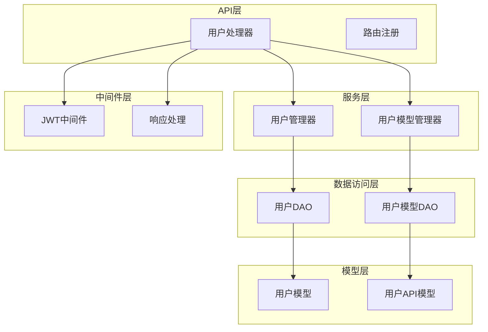
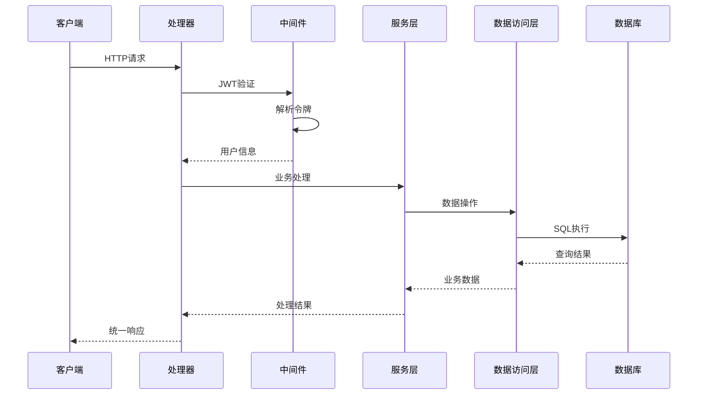
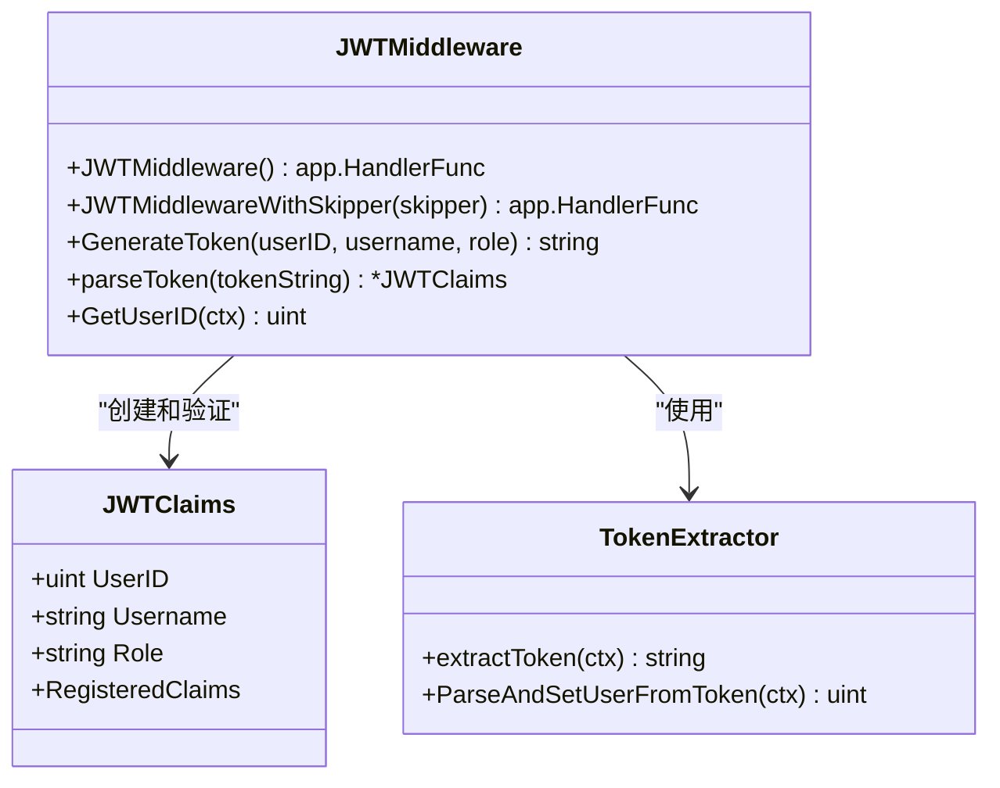
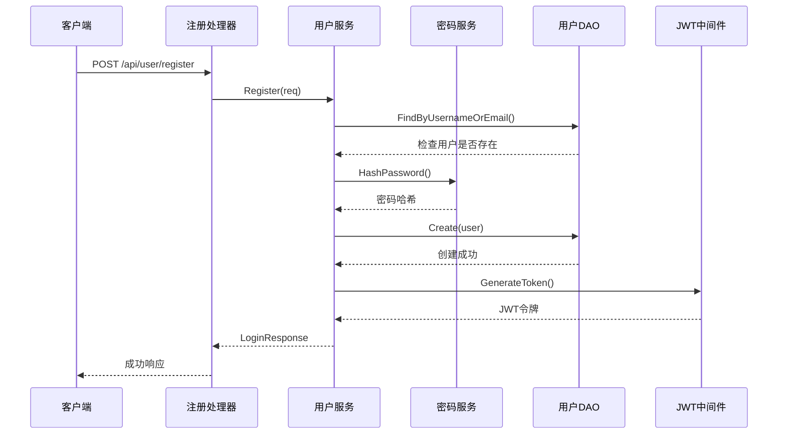
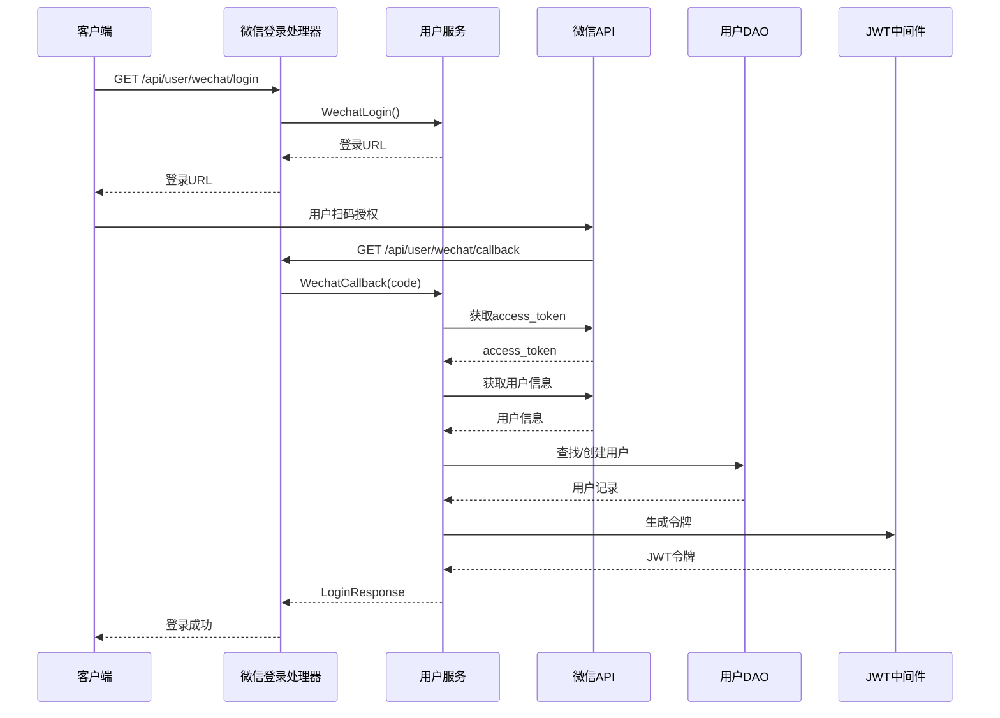
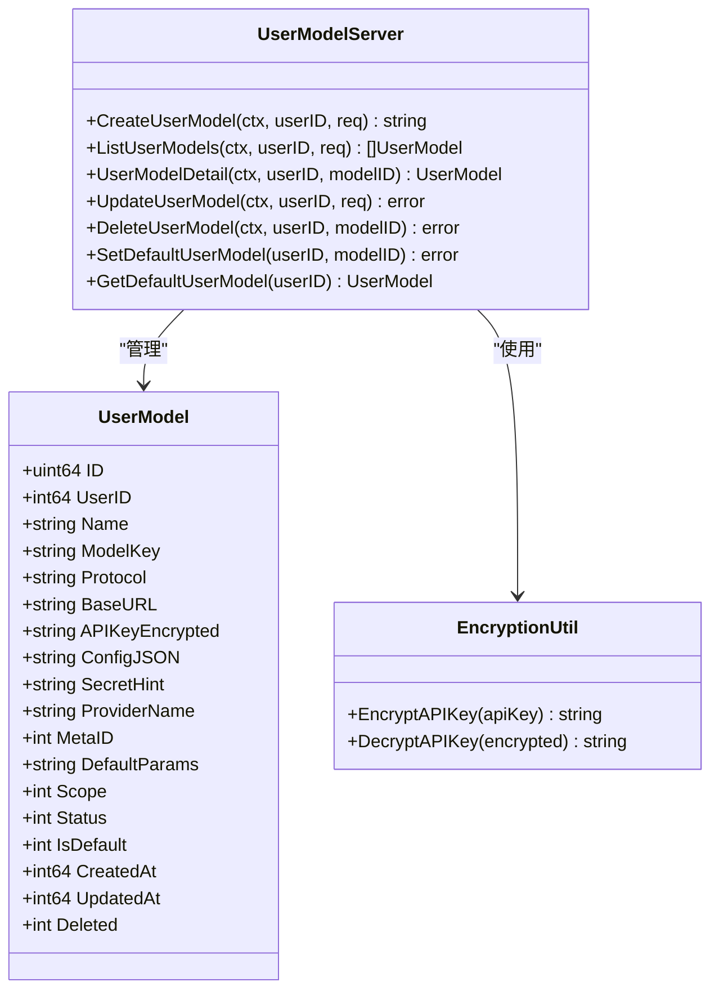
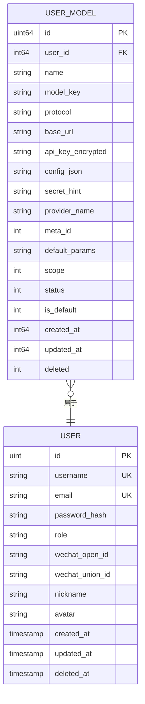
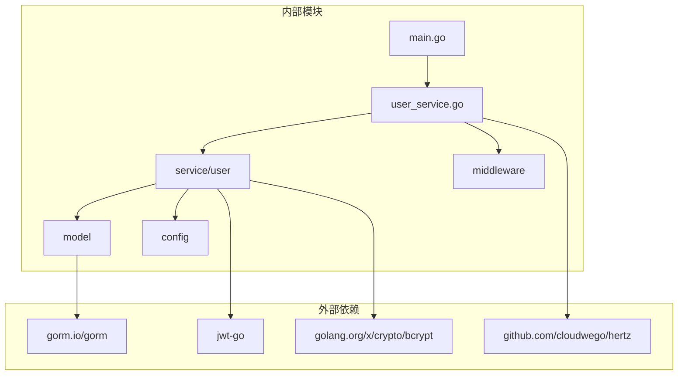

# 用户管理系统

<cite>
**本文档引用的文件**
- [backend/main.go](file://backend/main.go)
- [backend/api/router/register.go](file://backend/api/router/register.go)
- [backend/api/handler/interview/user_service.go](file://backend/api/handler/interview/user_service.go)
- [backend/idl/user/user.thrift](file://backend/idl/user/user.thrift)
- [backend/api/model/user/user.go](file://backend/api/model/user/user.go)
- [backend/internal/model/user.go](file://backend/internal/model/user.go)
- [backend/internal/model/user_model.go](file://backend/internal/model/user_model.go)
- [backend/internal/service/user/interface.go](file://backend/internal/service/user/interface.go)
- [backend/internal/service/user/impl/user_impl.go](file://backend/internal/service/user/impl/user_impl.go)
- [backend/internal/service/user/impl/user_model_impl.go](file://backend/internal/service/user/impl/user_model_impl.go)
- [backend/internal/middleware/jwt.go](file://backend/internal/middleware/jwt.go)
- [backend/internal/service/common/password.go](file://backend/internal/service/common/password.go)
- [backend/internal/service/common/util.go](file://backend/internal/service/common/util.go)
- [backend/api/response/response.go](file://backend/api/response/response.go)
- [backend/internal/config/config.go](file://backend/internal/config/config.go)
</cite>

## 目录
1. [简介](#简介)
2. [项目结构](#项目结构)
3. [核心组件](#核心组件)
4. [架构总览](#架构总览)
5. [详细组件分析](#详细组件分析)
6. [依赖关系分析](#依赖关系分析)
7. [性能考虑](#性能考虑)
8. [故障排除指南](#故障排除指南)
9. [结论](#结论)

## 简介
本项目是一个基于 Go 语言构建的用户管理系统，提供用户注册、登录、微信登录、用户信息管理、模型配置管理等核心功能。系统采用 JWT 进行认证授权，使用 bcrypt 进行密码加密，通过 Thrift 定义 API 接口，并通过 Hertz 框架提供 RESTful 服务。

## 项目结构
后端采用分层架构设计，主要分为以下层次：
- API 层：处理 HTTP 请求和响应，定义路由和控制器
- 服务层：实现业务逻辑，协调数据访问和外部服务
- 数据访问层：封装数据库操作，提供 DAO 接口
- 模型层：定义数据结构和数据库映射
- 中间件层：提供 JWT 认证、CORS、错误处理等通用功能
- 配置层：管理应用配置和环境变量

**图表来源**
- [backend/api/handler/interview/user_service.go](file://backend/api/handler/interview/user_service.go#L1-L420)
- [backend/internal/service/user/interface.go](file://backend/internal/service/user/interface.go#L1-L144)
- [backend/internal/model/user.go](file://backend/internal/model/user.go#L1-L116)
- [backend/internal/model/user_model.go](file://backend/internal/model/user_model.go#L1-L243)

**章节来源**
- [backend/main.go](file://backend/main.go#L1-L211)
- [backend/api/router/register.go](file://backend/api/router/register.go#L1-L16)

## 核心组件
系统的核心组件包括：

### 用户认证组件
- JWT 认证中间件：提供令牌验证和用户信息提取
- 密码加密服务：使用 bcrypt 进行密码哈希
- 用户管理服务：处理用户注册、登录、资料管理

### 用户模型管理组件
- 模型配置管理：支持多种大模型提供商配置
- API 密钥加密：使用 AES-CBC 加密存储敏感信息
- 默认模型设置：支持用户设置默认使用的模型

### API 接口组件
- Thrift 接口定义：标准化 API 规范
- 统一响应格式：提供一致的错误和成功响应
- 参数校验：基于 Thrift 的请求参数验证

**章节来源**
- [backend/internal/middleware/jwt.go](file://backend/internal/middleware/jwt.go#L1-L215)
- [backend/internal/service/common/password.go](file://backend/internal/service/common/password.go#L1-L18)
- [backend/internal/service/common/util.go](file://backend/internal/service/common/util.go#L1-L43)

## 架构总览
系统采用经典的三层架构模式，通过中间件实现横切关注点，通过接口抽象实现松耦合设计。

**图表来源**
- [backend/api/handler/interview/user_service.go](file://backend/api/handler/interview/user_service.go#L212-L262)
- [backend/internal/middleware/jwt.go](file://backend/internal/middleware/jwt.go#L32-L78)
- [backend/api/response/response.go](file://backend/api/response/response.go#L29-L88)

## 详细组件分析

### JWT 认证机制
JWT 认证系统提供了完整的身份验证和授权功能：

**图表来源**
- [backend/internal/middleware/jwt.go](file://backend/internal/middleware/jwt.go#L16-L134)

JWT 认证流程：
1. **令牌生成**：用户登录成功后生成包含用户信息的 JWT
2. **令牌验证**：每次请求通过中间件验证令牌有效性
3. **用户信息提取**：从令牌中提取用户身份信息
4. **权限控制**：基于用户角色进行权限验证

**章节来源**
- [backend/internal/middleware/jwt.go](file://backend/internal/middleware/jwt.go#L80-L134)

### 用户注册与登录流程
用户注册和登录采用统一的处理流程：

**图表来源**
- [backend/api/handler/interview/user_service.go](file://backend/api/handler/interview/user_service.go#L212-L236)
- [backend/internal/service/user/impl/user_impl.go](file://backend/internal/service/user/impl/user_impl.go#L34-L65)

**章节来源**
- [backend/api/handler/interview/user_service.go](file://backend/api/handler/interview/user_service.go#L212-L262)
- [backend/internal/service/user/impl/user_impl.go](file://backend/internal/service/user/impl/user_impl.go#L34-L93)

### 微信登录集成
系统支持微信 OAuth2.0 登录流程：

**图表来源**
- [backend/api/handler/interview/user_service.go](file://backend/api/handler/interview/user_service.go#L337-L382)
- [backend/internal/service/user/impl/user_impl.go](file://backend/internal/service/user/impl/user_impl.go#L119-L157)

**章节来源**
- [backend/api/handler/interview/user_service.go](file://backend/api/handler/interview/user_service.go#L337-L382)
- [backend/internal/service/user/impl/user_impl.go](file://backend/internal/service/user/impl/user_impl.go#L119-L365)

### 用户模型管理
用户模型管理支持多种大模型提供商的配置和管理：

**图表来源**
- [backend/internal/model/user_model.go](file://backend/internal/model/user_model.go#L30-L52)
- [backend/internal/service/user/impl/user_model_impl.go](file://backend/internal/service/user/impl/user_model_impl.go#L13-L18)

**章节来源**
- [backend/internal/model/user_model.go](file://backend/internal/model/user_model.go#L1-L243)
- [backend/internal/service/user/impl/user_model_impl.go](file://backend/internal/service/user/impl/user_model_impl.go#L1-L225)

### API 接口规范
系统通过 Thrift 定义了完整的 API 接口规范：

| 接口 | 方法 | 路径 | 功能描述 |
|------|------|------|----------|
| UserService | Register | POST /api/user/register | 用户注册 |
| UserService | Login | POST /api/user/login | 用户登录 |
| UserService | GetProfile | GET /api/user/profile | 获取用户资料 |
| UserService | UpdateProfile | PUT /api/user/profile | 更新用户资料 |
| UserService | WechatLogin | GET /api/user/wechat/login | 获取微信登录二维码 |
| UserService | WechatCallback | GET /api/user/wechat/callback | 微信登录回调 |
| UserService | CreateUserModel | POST /api/user/create/model | 创建用户模型 |
| UserService | ListUserModels | GET /api/user/model/list | 获取模型列表 |
| UserService | GetUserModel | GET /api/user/model/details/:id | 获取模型详情 |
| UserService | UpdateUserModel | PUT /api/user/model/update/:id | 更新模型配置 |
| UserService | DeleteUserModel | DELETE /api/user/model/delete/:id | 删除模型配置 |
| UserService | CheckUserModelConfigured | GET /api/user/model/check | 检查模型配置状态 |

**章节来源**
- [backend/idl/user/user.thrift](file://backend/idl/user/user.thrift#L217-L315)

### 数据模型设计
系统采用清晰的数据模型设计，支持用户和用户模型的分离管理：

**图表来源**
- [backend/internal/model/user.go](file://backend/internal/model/user.go#L12-L28)
- [backend/internal/model/user_model.go](file://backend/internal/model/user_model.go#L30-L52)

**章节来源**
- [backend/internal/model/user.go](file://backend/internal/model/user.go#L1-L116)
- [backend/internal/model/user_model.go](file://backend/internal/model/user_model.go#L1-L243)

## 依赖关系分析

**图表来源**
- [backend/main.go](file://backend/main.go#L1-L211)
- [backend/api/handler/interview/user_service.go](file://backend/api/handler/interview/user_service.go#L1-L420)

系统的主要依赖关系：
- **JWT 认证**：使用 golang-jwt/jwt/v5 进行令牌生成和验证
- **数据库 ORM**：使用 gorm.io/gorm 进行数据库操作
- **HTTP 框架**：使用 CloudWeGo Hertz 进行 HTTP 服务
- **密码加密**：使用 golang.org/x/crypto/bcrypt 进行密码哈希
- **配置管理**：使用 YAML 配置文件和环境变量

**章节来源**
- [backend/internal/middleware/jwt.go](file://backend/internal/middleware/jwt.go#L1-L215)
- [backend/internal/service/common/password.go](file://backend/internal/service/common/password.go#L1-L18)

## 性能考虑
系统在设计时充分考虑了性能优化：

### 缓存策略
- **数据库连接池**：配置最大连接数和空闲连接数
- **Redis 缓存**：使用 Redis 作为缓存层，减少数据库压力
- **API 密钥缓存**：对频繁访问的用户模型配置进行缓存

### 并发处理
- **Goroutine 池**：使用 goroutine 处理并发请求
- **数据库事务**：合理使用事务保证数据一致性
- **异步消息队列**：使用 Redis 作为消息队列处理异步任务

### 性能监控
- **请求日志**：记录请求处理时间和错误信息
- **指标收集**：收集系统性能指标
- **资源监控**：监控内存使用和连接状态

## 故障排除指南

### 常见错误及解决方案

**JWT 令牌相关错误**
- **错误**：Authorization header is required
- **原因**：请求缺少 Authorization 头部
- **解决方案**：确保在请求头部添加 Bearer 令牌

**数据库连接错误**
- **错误**：Database not initialized
- **原因**：数据库连接未正确初始化
- **解决方案**：检查数据库配置和连接字符串

**用户认证失败**
- **错误**：用户不存在或密码错误
- **原因**：用户名或密码不正确
- **解决方案**：验证用户凭据或重置密码

**章节来源**
- [backend/internal/middleware/jwt.go](file://backend/internal/middleware/jwt.go#L26-L30)
- [backend/internal/model/user_model.go](file://backend/internal/model/user_model.go#L17-L26)

### 日志和调试
系统提供了完善的日志记录机制：
- **错误日志**：记录详细的错误信息和堆栈跟踪
- **访问日志**：记录所有 HTTP 请求和响应
- **性能日志**：记录关键操作的执行时间

## 结论
本用户管理系统采用现代化的技术栈和架构设计，提供了完整的用户管理和认证授权功能。系统具有以下特点：

1. **安全性**：采用 JWT 认证、bcrypt 密码加密、API 密钥加密等多重安全措施
2. **可扩展性**：模块化设计支持功能扩展和第三方集成
3. **可靠性**：完善的错误处理和监控机制确保系统稳定运行
4. **易用性**：标准化的 API 接口和清晰的文档便于使用和维护

建议在生产环境中进一步完善：
- 实现 JWT 刷新机制
- 增强安全审计功能
- 优化性能监控和告警
- 完善用户会话管理和多设备登录控制