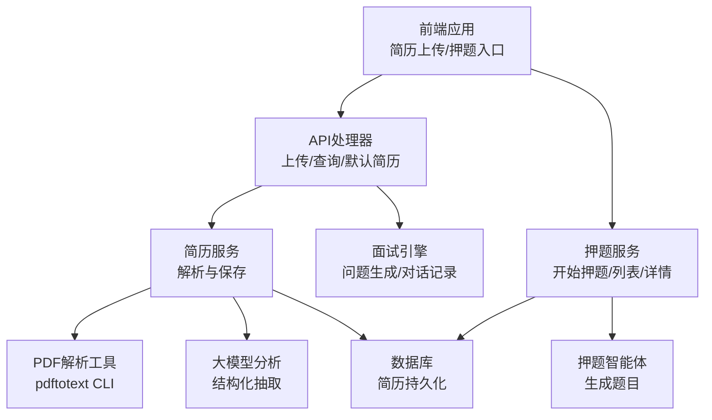
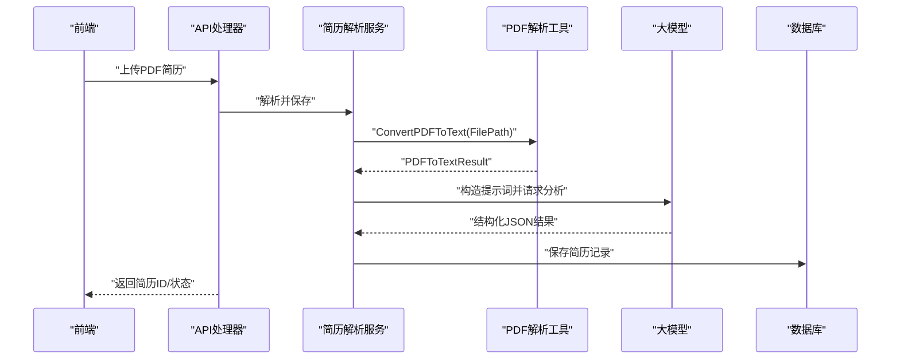
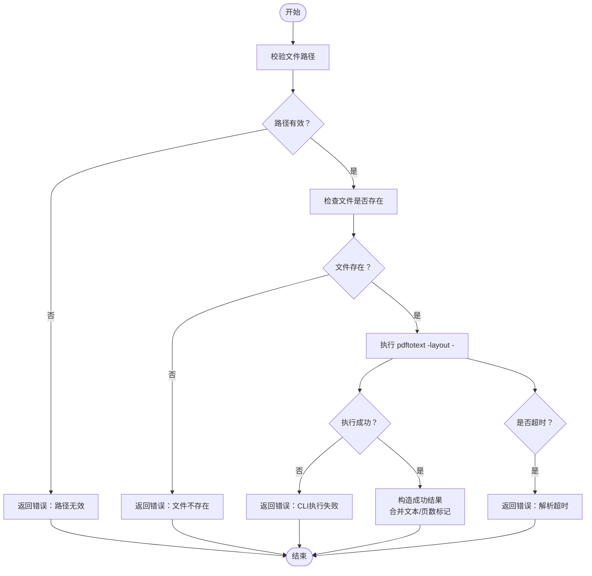
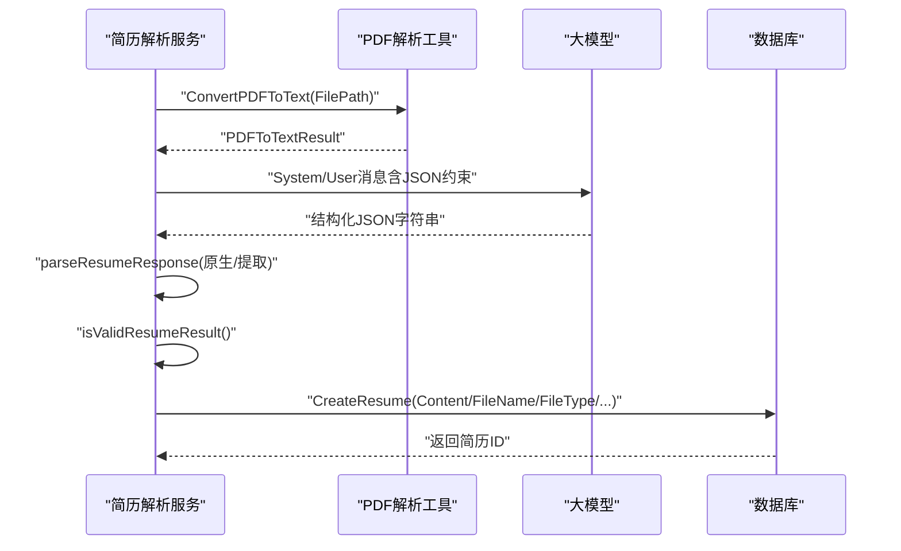
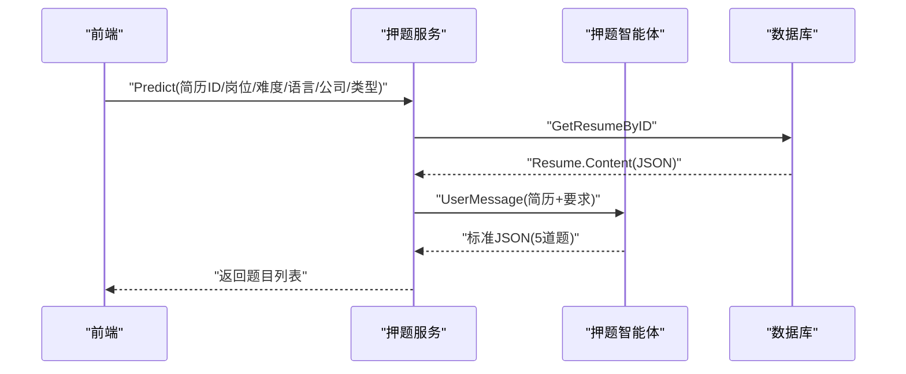
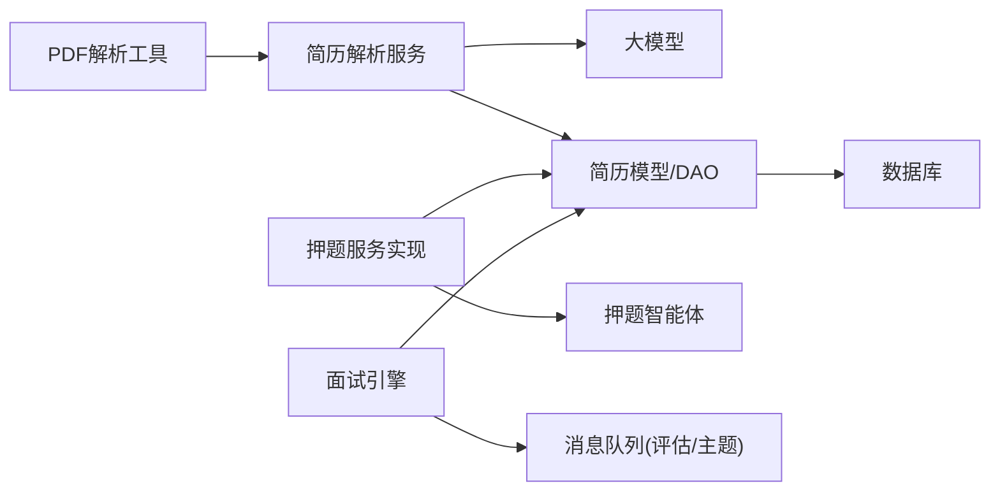
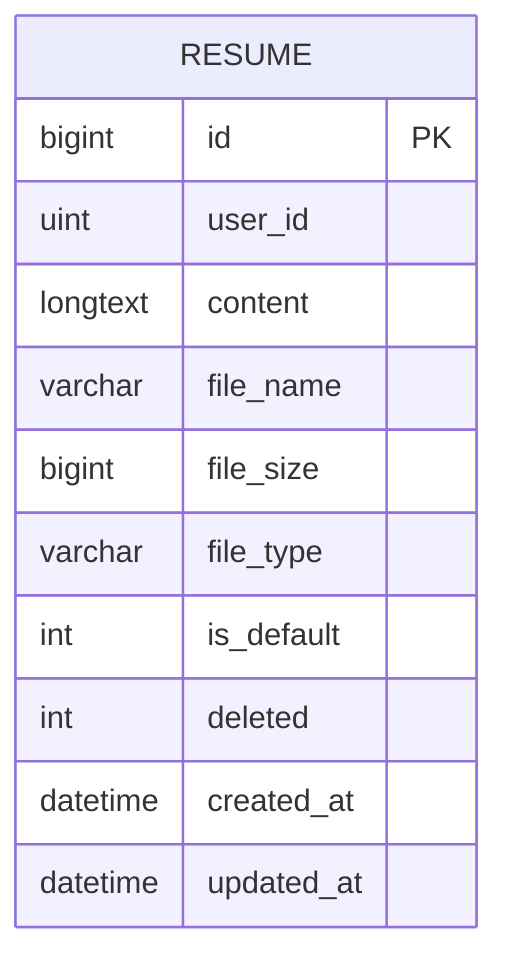
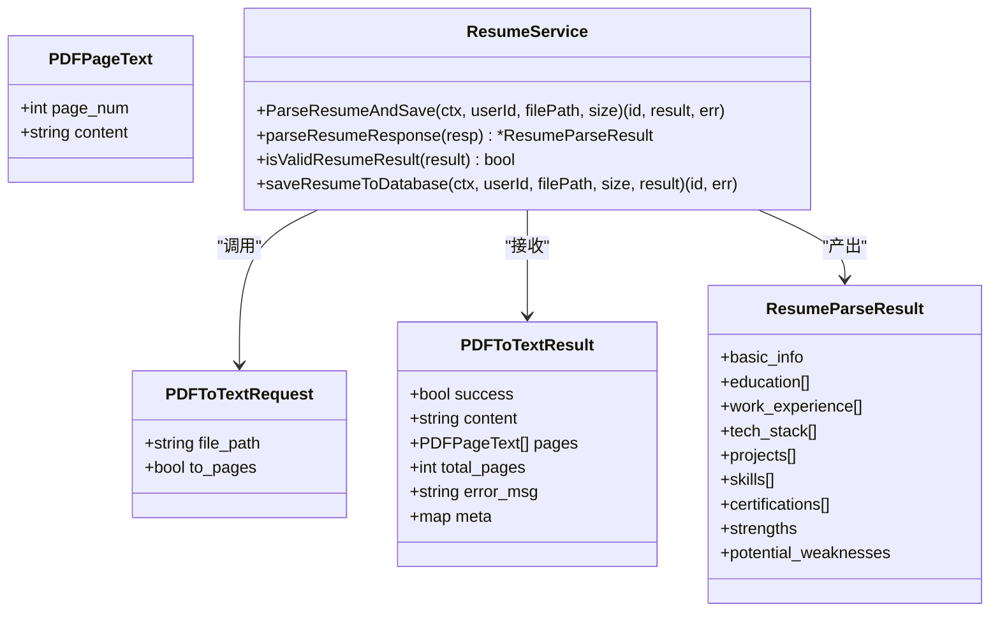

# 简历管理功能

<cite>
**本文引用的文件**
- [pdfParserTool.go](file://backend/chatApp/tool/pdfParserTool.go)
- [pdf_test.go](file://backend/chatApp/tool/pdf_test.go)
- [resume_service.go](file://backend/chatApp/agent/service/resume_service.go)
- [resume.go](file://backend/chatApp/agent/resume/resume.go)
- [resume.go](file://backend/internal/model/resume.go)
- [interviews_service.go](file://backend/api/handler/interview/interviews_service.go)
- [engine.go](file://backend/api/handler/interview/mianshi/engine.go)
- [prediction_agent.go](file://backend/chatApp/agent/prediction/prediction_agent.go)
- [prediction_impl.go](file://backend/internal/service/prediction/impl/prediction_impl.go)
- [database.go](file://backend/internal/repository/database.go)
- [json_utils.go](file://backend/chatApp/agent/service/json_utils.go)
</cite>

## 目录
1. [简介](#简介)
2. [项目结构](#项目结构)
3. [核心组件](#核心组件)
4. [架构总览](#架构总览)
5. [组件详解](#组件详解)
6. [依赖关系分析](#依赖关系分析)
7. [性能考量](#性能考量)
8. [故障排查指南](#故障排查指南)
9. [结论](#结论)
10. [附录](#附录)

## 简介
本技术文档围绕简历管理功能展开，覆盖简历上传、PDF解析、智能分析、简历押题等核心能力。文档详细说明了PDF解析算法与流程、简历信息抽取与结构化、关键词识别与技能标签化处理思路，以及简历分析的AI算法原理、知识图谱构建与个性化推荐机制的设计要点。同时给出数据流、性能优化策略与错误处理方案，并讨论简历格式兼容性、解析准确性与系统扩展性。

## 项目结构
简历管理功能涉及前后端与后端内部多层协作：
- 前端：提供简历上传界面与押题入口，选择简历后发起押题请求
- API层：接收上传、查询、默认简历设置等请求，协调服务层
- 服务层：简历解析流水线、AI分析与押题生成
- 工具层：PDF转文本工具与JSON提取工具
- 模型与仓储：简历数据模型与数据库持久化
- 面试引擎：基于简历的面试问题生成与对话记录

图表来源
- [interviews_service.go](file://backend/api/handler/interview/interviews_service.go#L94-L162)
- [resume_service.go](file://backend/chatApp/agent/service/resume_service.go#L47-L214)
- [pdfParserTool.go](file://backend/chatApp/tool/pdfParserTool.go#L39-L124)
- [prediction_impl.go](file://backend/internal/service/prediction/impl/prediction_impl.go#L25-L101)
- [engine.go](file://backend/api/handler/interview/mianshi/engine.go#L23-L230)

章节来源
- [interviews_service.go](file://backend/api/handler/interview/interviews_service.go#L94-L162)
- [resume_service.go](file://backend/chatApp/agent/service/resume_service.go#L47-L214)
- [pdfParserTool.go](file://backend/chatApp/tool/pdfParserTool.go#L39-L124)
- [prediction_impl.go](file://backend/internal/service/prediction/impl/prediction_impl.go#L25-L101)
- [engine.go](file://backend/api/handler/interview/mianshi/engine.go#L23-L230)

## 核心组件
- PDF解析工具：封装pdftotext CLI，提供统一的请求/响应结构，支持错误处理与元数据记录
- 简历解析服务：串联PDF解析、提示词构造、大模型分析、结果校验与入库
- 简历模型与DAO：简历数据结构、增删改查、默认简历设置、分页查询
- 押题服务与智能体：基于简历内容生成个性化面试题
- 面试引擎：基于简历与历史问答生成后续问题，维护对话记录

章节来源
- [pdfParserTool.go](file://backend/chatApp/tool/pdfParserTool.go#L17-L124)
- [resume_service.go](file://backend/chatApp/agent/service/resume_service.go#L17-L344)
- [resume.go](file://backend/internal/model/resume.go#L9-L170)
- [prediction_agent.go](file://backend/chatApp/agent/prediction/prediction_agent.go#L11-L66)
- [engine.go](file://backend/api/handler/interview/mianshi/engine.go#L23-L291)

## 架构总览
简历管理采用“上传-解析-入库-分析-应用”的数据流，结合AI提示工程与工具链，形成闭环：

图表来源
- [interviews_service.go](file://backend/api/handler/interview/interviews_service.go#L94-L162)
- [resume_service.go](file://backend/chatApp/agent/service/resume_service.go#L47-L214)
- [pdfParserTool.go](file://backend/chatApp/tool/pdfParserTool.go#L39-L124)

## 组件详解

### 1) 简历上传与存储
- 接口职责：接收表单上传的PDF文件，进行类型与大小校验，落盘到项目内uploads目录，返回文件路径
- 关键点：仅支持PDF；限制最大10MB；生成唯一文件名；同步落盘
- 错误处理：文件缺失、类型不符、大小超限、IO异常均返回错误

章节来源
- [interviews_service.go](file://backend/api/handler/interview/interviews_service.go#L94-L162)

### 2) PDF解析算法与流程
- 算法概述：调用系统pdftotext CLI，以布局模式输出纯文本；CLI输出捕获至stdout，再由Go程序读取
- 输入参数：文件绝对路径、是否按页输出（当前实现统一返回合并文本）
- 输出结构：成功标志、内容/分页内容、总页数、错误信息、元数据（含方法名、解析时间等）
- 错误处理：参数校验、文件存在性检查、CLI执行错误、上下文超时（DeadlineExceeded）

图表来源
- [pdfParserTool.go](file://backend/chatApp/tool/pdfParserTool.go#L39-L124)

章节来源
- [pdfParserTool.go](file://backend/chatApp/tool/pdfParserTool.go#L39-L124)
- [pdf_test.go](file://backend/chatApp/tool/pdf_test.go#L13-L116)

### 3) 简历信息提取与结构化
- 流水线步骤：
  1) PDF转文本（pdftotext）
  2) 构造系统提示词与用户提示词（要求返回标准JSON）
  3) 调用大模型生成结构化结果（带重试与指数退避）
  4) 解析响应（先原生JSON，失败则从文本中提取JSON）
  5) 校验结果有效性（任一关键字段非空即有效）
  6) 保存到数据库（Content存JSON字符串，FileName/FileSize/FileType等元信息）

图表来源
- [resume_service.go](file://backend/chatApp/agent/service/resume_service.go#L47-L214)
- [json_utils.go](file://backend/chatApp/agent/service/json_utils.go#L7-L62)

章节来源
- [resume_service.go](file://backend/chatApp/agent/service/resume_service.go#L47-L214)
- [json_utils.go](file://backend/chatApp/agent/service/json_utils.go#L7-L62)

### 4) 关键词识别与技能标签化
- 识别思路：通过大模型提示词引导，从简历文本中抽取技能、技术栈、项目经验等结构化字段
- 标签化策略：将抽取到的技能归一化（如统一术语、去除冗余），形成可检索的标签集合
- 注意事项：需保证提示词明确性与JSON约束，避免模型输出非结构化内容

章节来源
- [resume_service.go](file://backend/chatApp/agent/service/resume_service.go#L92-L124)

### 5) 知识图谱构建与个性化推荐
- 知识图谱：以“人-技能-项目-公司-教育”为核心节点，简历解析结果作为事实注入
- 推荐机制：结合用户画像（技能标签、项目经验、工作年限）与岗位要求，动态生成问题与押题
- 扩展建议：引入实体链接与消歧、同义词映射、权重计算与排序

（本小节为概念性说明，不直接分析具体源码）

### 6) 简历押题（Prediction）
- 输入：简历ID、岗位、难度、语言、目标公司、押题类型
- 流程：读取简历内容 -> 构造提示词 -> 调用押题智能体 -> 生成固定数量题目（严格JSON）
- 输出：题目列表（含重点考察、思考路径、参考答案、可能追问）

图表来源
- [prediction_impl.go](file://backend/internal/service/prediction/impl/prediction_impl.go#L25-L101)
- [prediction_agent.go](file://backend/chatApp/agent/prediction/prediction_agent.go#L25-L66)

章节来源
- [prediction_impl.go](file://backend/internal/service/prediction/impl/prediction_impl.go#L25-L101)
- [prediction_agent.go](file://backend/chatApp/agent/prediction/prediction_agent.go#L25-L66)

### 7) 面试引擎与问题生成
- 基于简历ID与难度生成初始问题，随后结合历史问答（最近若干题）生成后续问题
- 通过SSE推送问题与进度事件，等待用户回答并保存对话记录
- 支持不同面试类型（综合/专项）与领域（Go/Java/MQ/MySQL/Redis）

章节来源
- [engine.go](file://backend/api/handler/interview/mianshi/engine.go#L23-L291)

## 依赖关系分析

图表来源
- [pdfParserTool.go](file://backend/chatApp/tool/pdfParserTool.go#L114-L124)
- [resume_service.go](file://backend/chatApp/agent/service/resume_service.go#L47-L214)
- [resume.go](file://backend/internal/model/resume.go#L9-L170)
- [prediction_impl.go](file://backend/internal/service/prediction/impl/prediction_impl.go#L25-L101)
- [engine.go](file://backend/api/handler/interview/mianshi/engine.go#L23-L230)

章节来源
- [pdfParserTool.go](file://backend/chatApp/tool/pdfParserTool.go#L114-L124)
- [resume_service.go](file://backend/chatApp/agent/service/resume_service.go#L47-L214)
- [resume.go](file://backend/internal/model/resume.go#L9-L170)
- [prediction_impl.go](file://backend/internal/service/prediction/impl/prediction_impl.go#L25-L101)
- [engine.go](file://backend/api/handler/interview/mianshi/engine.go#L23-L230)

## 性能考量
- PDF解析
  - 使用系统级pdftotext CLI，I/O吞吐高；注意文件大小限制与磁盘空间
  - 建议：对超大文件进行预检与拆分、缓存解析结果
- 大模型调用
  - 带重试与指数退避，避免瞬时抖动；总超时控制在合理范围
  - 建议：对热点简历内容做本地缓存，减少重复LLM调用
- 数据库
  - 自动迁移与连接池配置，建议监控慢查询与连接数
  - 建议：简历Content字段建立索引，便于快速检索
- 押题与面试
  - SSE推送与消息队列解耦，提升用户体验与系统稳定性
  - 建议：对高频请求做限流与排队

（本节为通用性能建议，不直接分析具体源码）

## 故障排查指南
- PDF解析失败
  - 现象：返回错误信息、Success=false
  - 排查：文件路径、权限、是否存在、CLI可用性、上下文超时
- 大模型响应异常
  - 现象：JSON解析失败或为空
  - 排查：提示词约束、模型返回格式、重试机制是否生效
- 数据库异常
  - 现象：创建/查询失败
  - 排查：DSN、连接池、迁移是否完成、事务一致性
- 押题/面试中断
  - 现象：SSE中断、消息发布失败
  - 排查：消息队列可用性、网络与鉴权

章节来源
- [pdfParserTool.go](file://backend/chatApp/tool/pdfParserTool.go#L50-L93)
- [resume_service.go](file://backend/chatApp/agent/service/resume_service.go#L137-L179)
- [database.go](file://backend/internal/repository/database.go#L18-L60)
- [engine.go](file://backend/api/handler/interview/mianshi/engine.go#L117-L132)

## 结论
简历管理功能通过“PDF解析+结构化抽取+AI分析+持久化+应用”的闭环，实现了从上传到智能分析与押题的全链路能力。当前实现具备清晰的模块边界与稳健的错误处理，建议在性能与扩展性方面持续优化，包括缓存、限流、索引与知识图谱建设，以支撑更大规模与更复杂的业务场景。

## 附录

### A. 数据模型（简历）

图表来源
- [resume.go](file://backend/internal/model/resume.go#L9-L30)

章节来源
- [resume.go](file://backend/internal/model/resume.go#L9-L170)

### B. 简历解析服务类图

图表来源
- [resume_service.go](file://backend/chatApp/agent/service/resume_service.go#L17-L344)
- [pdfParserTool.go](file://backend/chatApp/tool/pdfParserTool.go#L17-L37)

章节来源
- [resume_service.go](file://backend/chatApp/agent/service/resume_service.go#L17-L344)
- [pdfParserTool.go](file://backend/chatApp/tool/pdfParserTool.go#L17-L37)