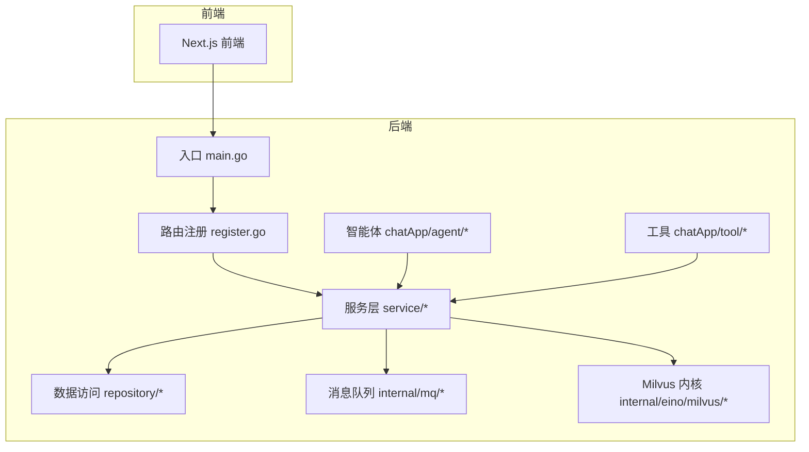
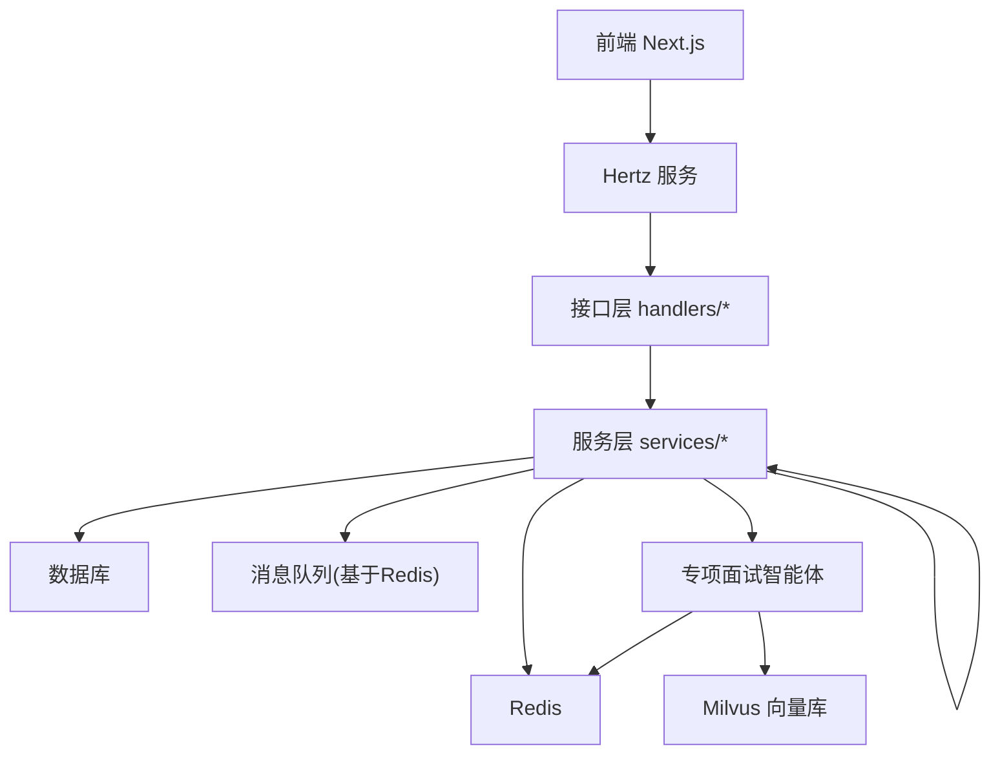
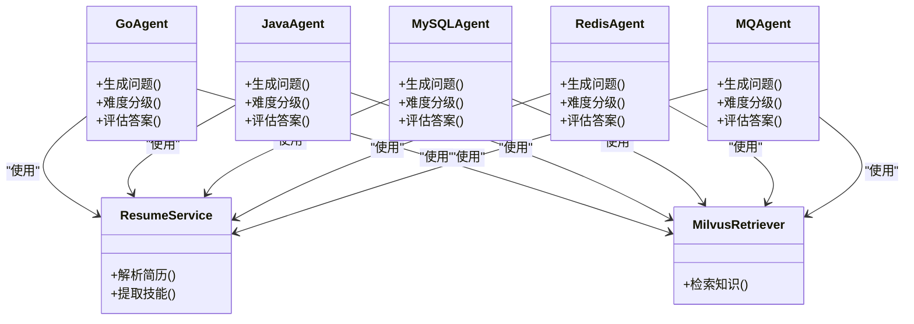
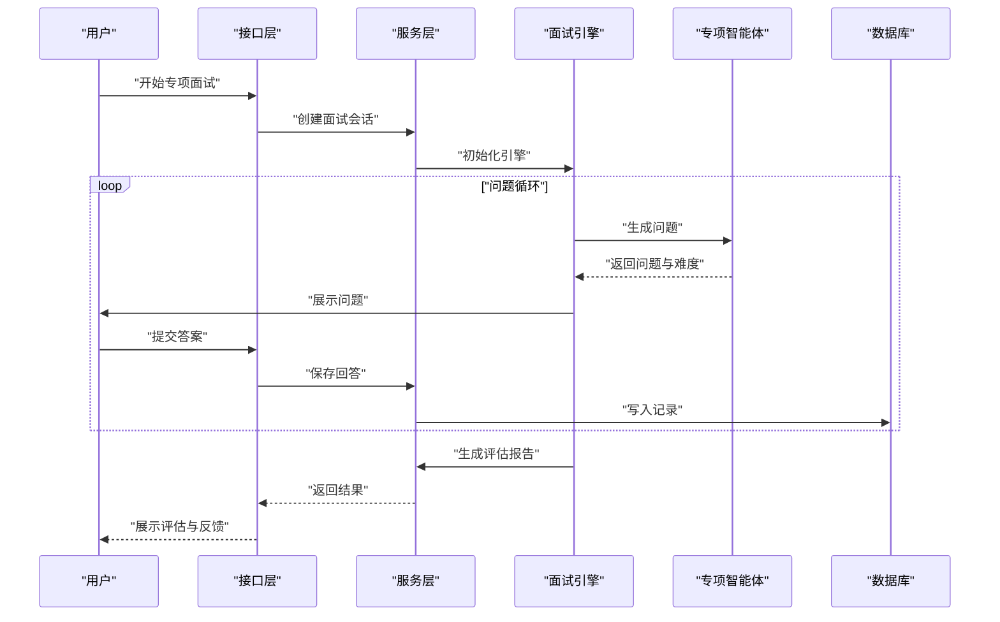
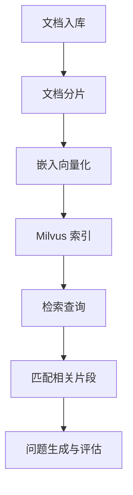
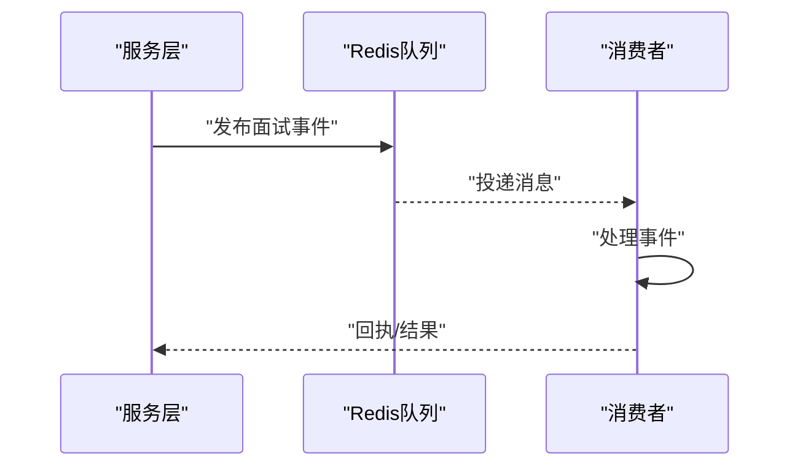
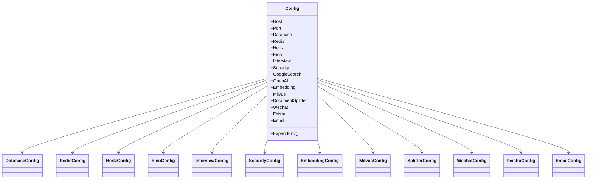
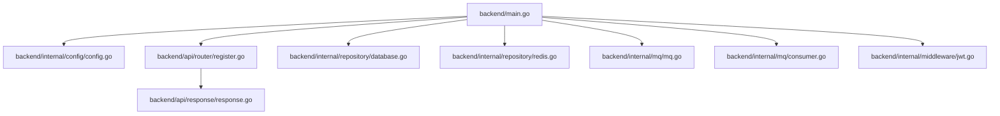

# 专项面试系统

<cite>
**本文引用的文件**
- [backend/main.go](file://backend/main.go)
- [backend/chatApp/main.go](file://backend/chatApp/main.go)
- [backend/internal/config/config.go](file://backend/internal/config/config.go)
- [backend/chatApp/config/config.go](file://backend/chatApp/config/config.go)
- [backend/api/router/register.go](file://backend/api/router/register.go)
- [backend/chatApp/agent/interview/specialized/go_agent.go](file://backend/chatApp/agent/interview/specialized/go_agent.go)
- [backend/chatApp/agent/interview/specialized/java_agent.go](file://backend/chatApp/agent/interview/specialized/java_agent.go)
- [backend/chatApp/agent/interview/specialized/mysql_agent.go](file://backend/chatApp/agent/interview/specialized/mysql_agent.go)
- [backend/chatApp/agent/interview/specialized/redis_agent.go](file://backend/chatApp/agent/interview/specialized/redis_agent.go)
- [backend/chatApp/agent/interview/specialized/mq_agent.go](file://backend/chatApp/agent/interview/specialized/mq_agent.go)
- [backend/internal/repository/database.go](file://backend/internal/repository/database.go)
- [backend/internal/repository/redis.go](file://backend/internal/repository/redis.go)
- [backend/internal/mq/mq.go](file://backend/internal/mq/mq.go)
- [backend/internal/mq/consumer.go](file://backend/internal/mq/consumer.go)
- [backend/internal/mq/redis_queue.go](file://backend/internal/mq/redis_queue.go)
- [backend/internal/eino/milvus/init.go](file://backend/internal/eino/milvus/init.go)
- [backend/internal/eino/milvus/retrieval/retriever.go](file://backend/internal/eino/milvus/retrieval/retriever.go)
- [backend/internal/eino/milvus/storage/indexer.go](file://backend/internal/eino/milvus/storage/indexer.go)
- [backend/internal/eino/milvus/storage/embedding.go](file://backend/internal/eino/milvus/storage/embedding.go)
- [backend/internal/eino/milvus/data/go专项/intro.md](file://backend/internal/eino/milvus/data/go专项/intro.md)
- [backend/internal/eino/milvus/data/go专项/advanced-concurrency.md](file://backend/internal/eino/milvus/data/go专项/advanced-concurrency.md)
- [backend/internal/eino/milvus/data/java专项/jvm-tuning.md](file://backend/internal/eino/milvus/data/java专项/jvm-tuning.md)
- [backend/internal/eino/milvus/data/java专项/intro.md](file://backend/internal/eino/milvus/data/java专项/intro.md)
- [backend/internal/eino/milvus/data/中间件专项/kafka-deep-dive.md](file://backend/internal/eino/milvus/data/中间件专项/kafka-deep-dive.md)
- [backend/internal/eino/milvus/data/中间件专项/intro.md](file://backend/internal/eino/milvus/data/中间件专项/intro.md)
- [backend/internal/eino/milvus/data/综合/architectures.md](file://backend/internal/eino/milvus/data/综合/architectures.md)
- [backend/chatApp/agent/prediction/prediction_agent.go](file://backend/chatApp/agent/prediction/prediction_agent.go)
- [backend/chatApp/agent/record_evaluation/answer_record_agent.go](file://backend/chatApp/agent/record_evaluation/answer_record_agent.go)
- [backend/chatApp/agent/record_evaluation/record_evaluation_agent.go](file://backend/chatApp/agent/record_evaluation/record_evaluation_agent.go)
- [backend/chatApp/agent/resume/resume.go](file://backend/chatApp/agent/resume/resume.go)
- [backend/chatApp/agent/service/resume_service.go](file://backend/chatApp/agent/service/resume_service.go)
- [backend/chatApp/tool/get_mianshi_info_tool.go](file://backend/chatApp/tool/get_mianshi_info_tool.go)
- [backend/chatApp/tool/get_resume_info_tool.go](file://backend/chatApp/tool/get_resume_info_tool.go)
- [backend/chatApp/tool/pdfParserTool.go](file://backend/chatApp/tool/pdfParserTool.go)
- [backend/chatApp/tool/milvus_retriever_tool.go](file://backend/chatApp/tool/milvus_retriever_tool.go)
- [backend/api/handler/interview/mianshi/engine.go](file://backend/api/handler/interview/mianshi/engine.go)
- [backend/api/handler/interview/mianshi/types.go](file://backend/api/handler/interview/mianshi/types.go)
- [backend/api/handler/interview/mianshi/events.go](file://backend/api/handler/interview/mianshi/events.go)
- [backend/api/handler/interview/mianshi/utils.go](file://backend/api/handler/interview/mianshi/utils.go)
- [backend/api/handler/interview/mianshi/errors.go](file://backend/api/handler/interview/mianshi/errors.go)
- [backend/api/handler/interview/interviews_service.go](file://backend/api/handler/interview/interviews_service.go)
- [backend/api/handler/interview/mianshi_service.go](file://backend/api/handler/interview/mianshi_service.go)
- [backend/api/handler/interview/prediction_service.go](file://backend/api/handler/interview/prediction_service.go)
- [backend/api/handler/interview/user_service.go](file://backend/api/handler/interview/user_service.go)
- [backend/api/model/interview/api.go](file://backend/api/model/interview/api.go)
- [backend/api/model/interviews/interviews.go](file://backend/api/model/interviews/interviews.go)
- [backend/api/model/mianshi/mianshi.go](file://backend/api/model/mianshi/mianshi.go)
- [backend/api/model/prediction/prediction.go](file://backend/api/model/prediction/prediction.go)
- [backend/api/model/user/user.go](file://backend/api/model/user/user.go)
- [backend/api/response/response.go](file://backend/api/response/response.go)
- [backend/api/router/interview/api.go](file://backend/api/router/interview/api.go)
- [backend/api/router/interview/middleware.go](file://backend/api/router/interview/middleware.go)
- [backend/internal/model/interview_dialogue.go](file://backend/internal/model/interview_dialogue.go)
- [backend/internal/model/interview_evaluation.go](file://backend/internal/model/interview_evaluation.go)
- [backend/internal/model/interview_record.go](file://backend/internal/model/interview_record.go)
- [backend/internal/model/resume.go](file://backend/internal/model/resume.go)
- [backend/internal/model/user.go](file://backend/internal/model/user.go)
- [backend/internal/model/prediction.go](file://backend/internal/model/prediction.go)
- [backend/internal/service/interviews/interface.go](file://backend/internal/service/interviews/interface.go)
- [backend/internal/service/interviews/impl/interview_impl.go](file://backend/internal/service/interviews/impl/interview_impl.go)
- [backend/internal/service/interviews/impl/resume_manager_impl.go](file://backend/internal/service/interviews/impl/resume_manager_impl.go)
- [backend/internal/service/prediction/interface.go](file://backend/internal/service/prediction/interface.go)
- [backend/internal/service/prediction/impl/prediction_impl.go](file://backend/internal/service/prediction/impl/prediction_impl.go)
- [backend/internal/service/user/interface.go](file://backend/internal/service/user/interface.go)
- [backend/internal/service/user/impl/user_impl.go](file://backend/internal/service/user/impl/user_impl.go)
- [backend/internal/service/user/impl/user_model_impl.go](file://backend/internal/service/user/impl/user_model_impl.go)
- [backend/internal/service/user/impl/user_password.go](file://backend/internal/service/user/impl/user_password.go)
- [backend/internal/alert/feishu.go](file://backend/internal/alert/feishu.go)
- [backend/internal/middleware/jwt.go](file://backend/internal/middleware/jwt.go)
- [backend/chatApp/agent/interview/comprehensive/school_comprehensive_agent.go](file://backend/chatApp/agent/interview/comprehensive/school_comprehensive_agent.go)
- [backend/chatApp/agent/interview/comprehensive/social_comprehensive_agent.go](file://backend/chatApp/agent/interview/comprehensive/social_comprehensive_agent.go)
</cite>

## 目录
1. [简介](#简介)
2. [项目结构](#项目结构)
3. [核心组件](#核心组件)
4. [架构总览](#架构总览)
5. [详细组件分析](#详细组件分析)
6. [依赖关系分析](#依赖关系分析)
7. [性能考虑](#性能考虑)
8. [故障排除指南](#故障排除指南)
9. [结论](#结论)
10. [附录](#附录)

## 简介
本项目是一个基于多技术栈的专项面试系统，围绕 Go、Java、MySQL、Redis、消息队列（MQ）等技术方向构建“专项面试智能体”。系统通过统一的后端服务承载接口、消息队列、持久化与检索增强（向量库）能力，并提供专项知识问答、难度分级、答题记录与评估、简历解析与押题等功能。前端采用 Next.js，后端采用 Go，结合 Hertz 框架、Eino 智能体框架、Milvus 向量数据库、Redis 作为消息队列与缓存、OpenAI/Ark 等大模型服务。

## 项目结构
后端采用分层与模块化组织方式：
- 入口与启动：backend/main.go 负责加载配置、初始化数据库与 Redis、启动消息队列消费者、注册路由并启动 Hertz 服务。
- API 层：api/router 与 api/handler 提供 REST 接口与业务服务封装。
- 业务服务层：internal/service 实现面试、用户、预测等核心业务逻辑。
- 数据访问层：internal/repository 封装数据库与 Redis 访问。
- 智能体与工具：chatApp/agent 与 chatApp/tool 提供专项面试智能体、简历解析、Milvus 检索等能力。
- 向量检索与知识库：internal/eino/milvus 提供数据导入、分片、嵌入、索引与检索。
- MQ：internal/mq 基于 Redis 实现消息队列与消费者。
- 配置：backend/internal/config 与 backend/chatApp/config 提供配置结构与加载。

图示来源
- [backend/main.go](file://backend/main.go#L29-L173)
- [backend/api/router/register.go](file://backend/api/router/register.go#L11-L15)

章节来源
- [backend/main.go](file://backend/main.go#L29-L173)
- [backend/api/router/register.go](file://backend/api/router/register.go#L11-L15)

## 核心组件
- 配置系统：支持 YAML 配置与环境变量展开，涵盖数据库、Redis、Hertz、Eino、Interview、Security、Embedding、Milvus、DocumentSplitter、微信/飞书/邮件等。
- 服务注册与路由：Hertz 默认服务器，注册生成路由，统一中间件（CORS、JWT、恢复）。
- 消息队列：基于 Redis 的消息队列与消费者，支持异步处理面试事件与通知。
- 智能体与专项面试：专项面试智能体（Go、Java、MySQL、Redis、MQ），结合简历与知识库进行难度分级与问题生成。
- 检索增强：Milvus 向量数据库，文档分片、嵌入、索引与检索，支撑专项知识问答。
- 业务服务：面试、用户、预测、简历管理等服务接口与实现。
- 工具链：简历解析、面试信息查询、Milvus 检索工具等。

章节来源
- [backend/internal/config/config.go](file://backend/internal/config/config.go#L13-L31)
- [backend/internal/config/config.go](file://backend/internal/config/config.go#L136-L152)
- [backend/internal/config/config.go](file://backend/internal/config/config.go#L212-L268)
- [backend/main.go](file://backend/main.go#L50-L100)
- [backend/api/router/register.go](file://backend/api/router/register.go#L11-L15)

## 架构总览
系统采用“前端-后端-Hertz-服务层-数据层-智能体/MQ/向量库”的分层架构。前端通过 REST 接口与后端交互；后端负责业务编排、消息队列与持久化；智能体负责专项面试问答与评估；Milvus 提供知识检索增强；Redis 作为消息队列与缓存。

图示来源
- [backend/main.go](file://backend/main.go#L101-L129)
- [backend/api/router/register.go](file://backend/api/router/register.go#L11-L15)
- [backend/internal/mq/mq.go](file://backend/internal/mq/mq.go#L1-L200)
- [backend/internal/repository/database.go](file://backend/internal/repository/database.go#L1-L200)
- [backend/internal/repository/redis.go](file://backend/internal/repository/redis.go#L1-L200)
- [backend/internal/eino/milvus/init.go](file://backend/internal/eino/milvus/init.go#L1-L200)

## 详细组件分析

### 专项面试智能体（Go、Java、MySQL、Redis、MQ）
专项面试智能体负责根据技术栈构建专业知识体系、生成问题并进行难度分级与评估。每个专项智能体包含：
- 专业领域知识：内置该技术领域的知识文档（如 Go 并发、Java JVM 调优、中间件 Kafka 深度解析等）。
- 问题生成逻辑：结合简历、历史对话与知识库，动态生成符合候选人水平的问题。
- 难度分级机制：依据候选人的技能标签、经验与表现，调整问题难度与深度。
- 评估标准：对答案进行结构化评分与反馈，输出面试记录与评估报告。

图示来源
- [backend/chatApp/agent/interview/specialized/go_agent.go](file://backend/chatApp/agent/interview/specialized/go_agent.go#L1-L200)
- [backend/chatApp/agent/interview/specialized/java_agent.go](file://backend/chatApp/agent/interview/specialized/java_agent.go#L1-L200)
- [backend/chatApp/agent/interview/specialized/mysql_agent.go](file://backend/chatApp/agent/interview/specialized/mysql_agent.go#L1-L200)
- [backend/chatApp/agent/interview/specialized/redis_agent.go](file://backend/chatApp/agent/interview/specialized/redis_agent.go#L1-L200)
- [backend/chatApp/agent/interview/specialized/mq_agent.go](file://backend/chatApp/agent/interview/specialized/mq_agent.go#L1-L200)
- [backend/chatApp/agent/service/resume_service.go](file://backend/chatApp/agent/service/resume_service.go#L1-L200)
- [backend/chatApp/tool/milvus_retriever_tool.go](file://backend/chatApp/tool/milvus_retriever_tool.go#L1-L200)

章节来源
- [backend/chatApp/agent/interview/specialized/go_agent.go](file://backend/chatApp/agent/interview/specialized/go_agent.go#L1-L200)
- [backend/chatApp/agent/interview/specialized/java_agent.go](file://backend/chatApp/agent/interview/specialized/java_agent.go#L1-L200)
- [backend/chatApp/agent/interview/specialized/mysql_agent.go](file://backend/chatApp/agent/interview/specialized/mysql_agent.go#L1-L200)
- [backend/chatApp/agent/interview/specialized/redis_agent.go](file://backend/chatApp/agent/interview/specialized/redis_agent.go#L1-L200)
- [backend/chatApp/agent/interview/specialized/mq_agent.go](file://backend/chatApp/agent/interview/specialized/mq_agent.go#L1-L200)
- [backend/chatApp/agent/service/resume_service.go](file://backend/chatApp/agent/service/resume_service.go#L1-L200)
- [backend/chatApp/tool/milvus_retriever_tool.go](file://backend/chatApp/tool/milvus_retriever_tool.go#L1-L200)

### 面试引擎与流程
面试引擎负责控制面试生命周期，包括问题生成、回答收集、事件驱动与异常处理。其核心流程如下：

图示来源
- [backend/api/handler/interview/mianshi/engine.go](file://backend/api/handler/interview/mianshi/engine.go#L1-L200)
- [backend/api/handler/interview/mianshi/events.go](file://backend/api/handler/interview/mianshi/events.go#L1-L200)
- [backend/api/handler/interview/mianshi/types.go](file://backend/api/handler/interview/mianshi/types.go#L1-L200)
- [backend/api/handler/interview/mianshi/utils.go](file://backend/api/handler/interview/mianshi/utils.go#L1-L200)
- [backend/api/handler/interview/mianshi/errors.go](file://backend/api/handler/interview/mianshi/errors.go#L1-L200)

章节来源
- [backend/api/handler/interview/mianshi/engine.go](file://backend/api/handler/interview/mianshi/engine.go#L1-L200)
- [backend/api/handler/interview/mianshi/events.go](file://backend/api/handler/interview/mianshi/events.go#L1-L200)
- [backend/api/handler/interview/mianshi/types.go](file://backend/api/handler/interview/mianshi/types.go#L1-L200)
- [backend/api/handler/interview/mianshi/utils.go](file://backend/api/handler/interview/mianshi/utils.go#L1-L200)
- [backend/api/handler/interview/mianshi/errors.go](file://backend/api/handler/interview/mianshi/errors.go#L1-L200)

### 检索增强与知识库
系统通过 Milvus 提供向量检索能力，支持专项知识文档的分片、嵌入与索引，从而在面试过程中动态检索相关知识点辅助问题生成与评估。

图示来源
- [backend/internal/eino/milvus/storage/indexer.go](file://backend/internal/eino/milvus/storage/indexer.go#L1-L200)
- [backend/internal/eino/milvus/storage/embedding.go](file://backend/internal/eino/milvus/storage/embedding.go#L1-L200)
- [backend/internal/eino/milvus/retrieval/retriever.go](file://backend/internal/eino/milvus/retrieval/retriever.go#L1-L200)
- [backend/internal/eino/milvus/init.go](file://backend/internal/eino/milvus/init.go#L1-L200)

章节来源
- [backend/internal/eino/milvus/storage/indexer.go](file://backend/internal/eino/milvus/storage/indexer.go#L1-L200)
- [backend/internal/eino/milvus/storage/embedding.go](file://backend/internal/eino/milvus/storage/embedding.go#L1-L200)
- [backend/internal/eino/milvus/retrieval/retriever.go](file://backend/internal/eino/milvus/retrieval/retriever.go#L1-L200)
- [backend/internal/eino/milvus/init.go](file://backend/internal/eino/milvus/init.go#L1-L200)

### 消息队列与异步处理
系统使用 Redis 作为消息队列，支持面试事件的异步处理与通知，提升系统的吞吐与稳定性。

图示来源
- [backend/internal/mq/mq.go](file://backend/internal/mq/mq.go#L1-L200)
- [backend/internal/mq/redis_queue.go](file://backend/internal/mq/redis_queue.go#L1-L200)
- [backend/internal/mq/consumer.go](file://backend/internal/mq/consumer.go#L1-L200)

章节来源
- [backend/internal/mq/mq.go](file://backend/internal/mq/mq.go#L1-L200)
- [backend/internal/mq/redis_queue.go](file://backend/internal/mq/redis_queue.go#L1-L200)
- [backend/internal/mq/consumer.go](file://backend/internal/mq/consumer.go#L1-L200)

### 配置系统
配置系统支持 YAML 配置与环境变量展开，涵盖数据库、Redis、Hertz、Eino、Interview、Security、Embedding、Milvus、DocumentSplitter、微信/飞书/邮件等模块。

图示来源
- [backend/internal/config/config.go](file://backend/internal/config/config.go#L13-L31)
- [backend/internal/config/config.go](file://backend/internal/config/config.go#L64-L83)
- [backend/internal/config/config.go](file://backend/internal/config/config.go#L136-L152)
- [backend/internal/config/config.go](file://backend/internal/config/config.go#L212-L268)

章节来源
- [backend/internal/config/config.go](file://backend/internal/config/config.go#L13-L31)
- [backend/internal/config/config.go](file://backend/internal/config/config.go#L136-L152)
- [backend/internal/config/config.go](file://backend/internal/config/config.go#L212-L268)

### 专项面试技术特点与领域特定算法
- 技术特点
  - 专项知识体系：针对 Go、Java、MySQL、Redis、MQ 等技术栈构建专属知识库。
  - 动态难度分级：结合候选人技能标签与表现，实时调整问题难度。
  - 检索增强问答：利用 Milvus 向量检索，提高问题相关性与覆盖面。
  - 异步事件驱动：通过消息队列实现面试事件的异步处理与通知。
- 领域特定算法
  - 问题生成：基于简历与知识库的检索结果，结合候选人的技能标签生成个性化问题。
  - 难度分级：采用基于经验与表现的评分机制，动态调整问题复杂度。
  - 评估标准：对答案进行结构化评分与反馈，输出面试记录与改进建议。

章节来源
- [backend/chatApp/agent/interview/specialized/go_agent.go](file://backend/chatApp/agent/interview/specialized/go_agent.go#L1-L200)
- [backend/chatApp/agent/interview/specialized/java_agent.go](file://backend/chatApp/agent/interview/specialized/java_agent.go#L1-L200)
- [backend/chatApp/agent/interview/specialized/mysql_agent.go](file://backend/chatApp/agent/interview/specialized/mysql_agent.go#L1-L200)
- [backend/chatApp/agent/interview/specialized/redis_agent.go](file://backend/chatApp/agent/interview/specialized/redis_agent.go#L1-L200)
- [backend/chatApp/agent/interview/specialized/mq_agent.go](file://backend/chatApp/agent/interview/specialized/mq_agent.go#L1-L200)
- [backend/internal/eino/milvus/retrieval/retriever.go](file://backend/internal/eino/milvus/retrieval/retriever.go#L1-L200)

### 扩展方法、自定义规则与性能优化
- 扩展方法
  - 新增专项：在 chatApp/agent/interview/specialized 下新增智能体文件，编写问题生成与评估逻辑。
  - 自定义知识库：在 internal/eino/milvus/data 下新增技术领域文档，更新索引与检索。
  - 自定义规则：在智能体中增加难度分级与评估规则，支持参数化配置。
- 性能优化
  - 缓存策略：利用 Redis 缓存热点问题与候选特征，降低重复计算。
  - 异步处理：通过消息队列异步处理面试事件，提升并发能力。
  - 向量检索优化：合理设置 Milvus 的 TopK、MetricType 与超时参数，平衡召回与延迟。
  - 数据库连接池：优化数据库连接池参数，减少连接开销。

章节来源
- [backend/internal/repository/redis.go](file://backend/internal/repository/redis.go#L1-L200)
- [backend/internal/mq/mq.go](file://backend/internal/mq/mq.go#L1-L200)
- [backend/internal/eino/milvus/init.go](file://backend/internal/eino/milvus/init.go#L1-L200)
- [backend/internal/config/config.go](file://backend/internal/config/config.go#L64-L83)
- [backend/internal/config/config.go](file://backend/internal/config/config.go#L173-L192)

### 面试质量保证与用户体验提升
- 面试质量保证
  - 结构化评估：对答案进行结构化评分与反馈，确保评估一致性。
  - 知识覆盖：通过检索增强确保问题覆盖核心技术点。
  - 异常处理：完善的错误处理与事件驱动机制，保障面试流程稳定。
- 用户体验提升
  - 个性化问题：基于简历与技能标签生成个性化问题，提升参与感。
  - 实时反馈：异步处理与消息通知，及时反馈面试进度与结果。
  - 统一中间件：CORS、JWT、恢复中间件确保跨域、鉴权与稳定性。

章节来源
- [backend/api/handler/interview/mianshi/errors.go](file://backend/api/handler/interview/mianshi/errors.go#L1-L200)
- [backend/api/handler/interview/mianshi/engine.go](file://backend/api/handler/interview/mianshi/engine.go#L1-L200)
- [backend/main.go](file://backend/main.go#L107-L125)

## 依赖关系分析
后端启动流程的关键依赖关系如下：

图示来源
- [backend/main.go](file://backend/main.go#L29-L173)
- [backend/internal/config/config.go](file://backend/internal/config/config.go#L136-L152)
- [backend/api/router/register.go](file://backend/api/router/register.go#L11-L15)
- [backend/internal/mq/mq.go](file://backend/internal/mq/mq.go#L1-L200)
- [backend/internal/mq/consumer.go](file://backend/internal/mq/consumer.go#L1-L200)
- [backend/internal/middleware/jwt.go](file://backend/internal/middleware/jwt.go#L1-L200)
- [backend/api/response/response.go](file://backend/api/response/response.go#L1-L200)

章节来源
- [backend/main.go](file://backend/main.go#L29-L173)
- [backend/api/router/register.go](file://backend/api/router/register.go#L11-L15)

## 性能考虑
- 数据库与连接池：合理配置最大连接数、空闲连接数与连接生命周期，避免连接争用。
- Redis 缓存：对热点问题与候选特征进行缓存，减少重复检索与计算。
- 消息队列：异步处理面试事件，避免阻塞主线程，提升吞吐。
- 向量检索：根据业务需求调整 TopK、距离度量与超时，平衡召回率与延迟。
- 中间件：CORS、JWT、恢复中间件需放置在合适位置，避免重复处理与性能损耗。

## 故障排除指南
- 配置加载失败：检查 config.yaml 路径与权限，确认环境变量展开是否正确。
- 数据库连接失败：检查 DSN 与连接池参数，确认网络连通性。
- Redis 连接失败：检查地址、密码与超时配置，确认 Redis 服务状态。
- 消息队列异常：检查 Redis 队列状态与消费者日志，确认消息投递与消费情况。
- 面试流程异常：查看面试引擎事件与错误处理日志，定位具体环节问题。

章节来源
- [backend/internal/config/config.go](file://backend/internal/config/config.go#L136-L152)
- [backend/internal/repository/database.go](file://backend/internal/repository/database.go#L1-L200)
- [backend/internal/repository/redis.go](file://backend/internal/repository/redis.go#L1-L200)
- [backend/internal/mq/consumer.go](file://backend/internal/mq/consumer.go#L1-L200)
- [backend/api/handler/interview/mianshi/errors.go](file://backend/api/handler/interview/mianshi/errors.go#L1-L200)

## 结论
专项面试系统通过多技术栈智能体、检索增强与消息队列实现了高扩展性的面试平台。系统具备完善的配置管理、服务编排与异常处理机制，能够为不同技术方向提供个性化的面试体验。通过持续优化缓存、异步处理与向量检索，可进一步提升系统性能与用户体验。

## 附录
- 配置文件示例与字段说明：参见配置结构体定义与环境变量展开逻辑。
- 知识库文档：参见 internal/eino/milvus/data 下各技术领域文档。
- 智能体扩展：参见 chatApp/agent/interview/specialized 下的专项智能体实现。