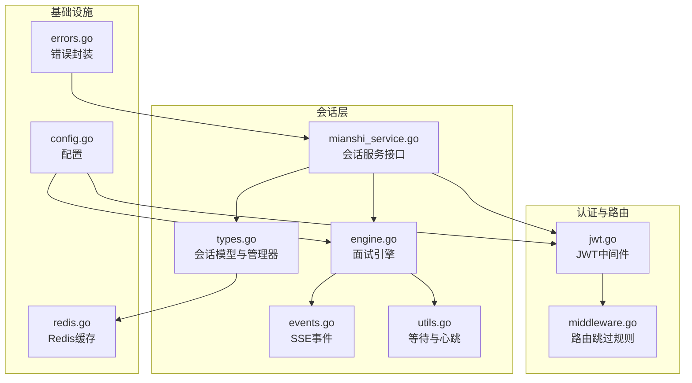
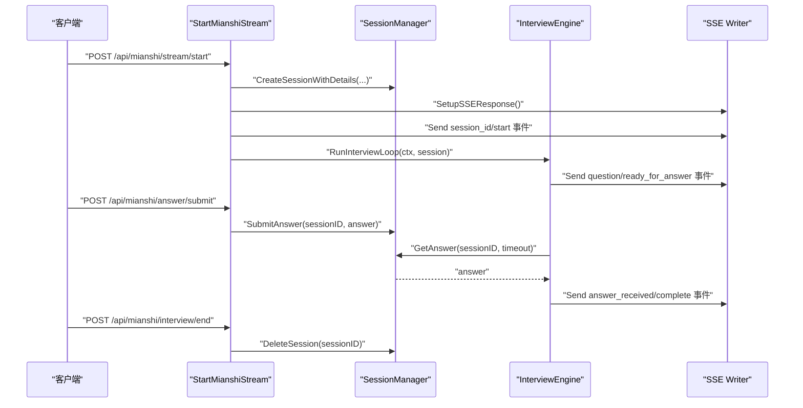
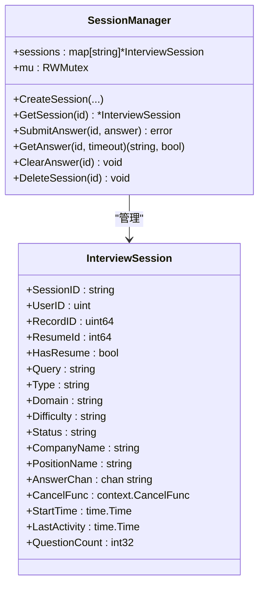
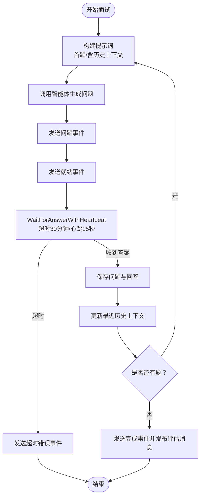
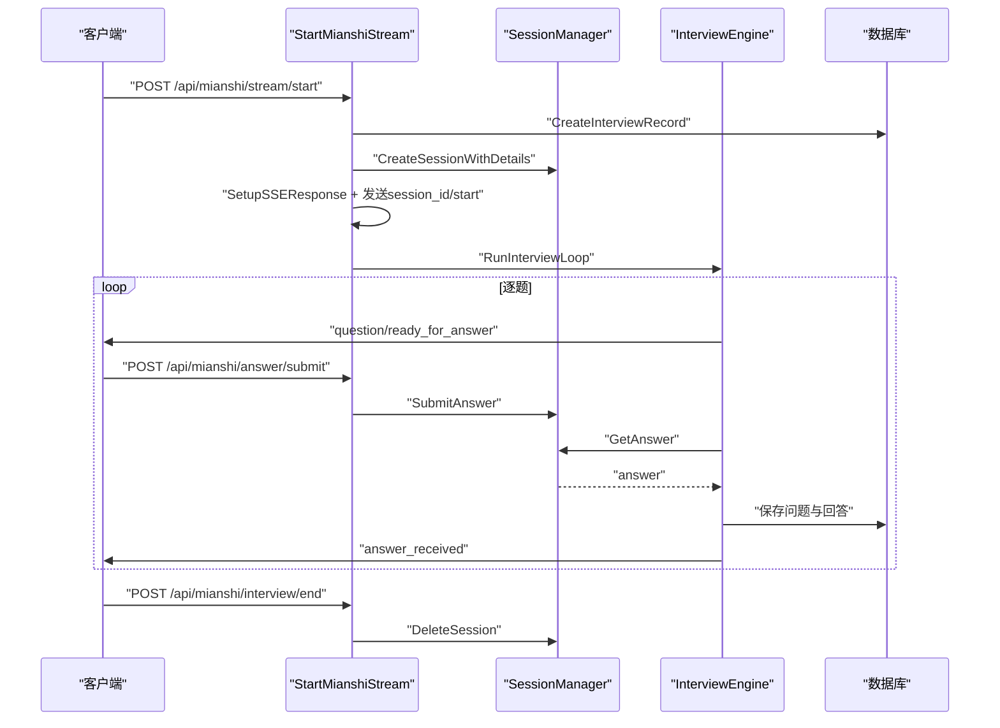
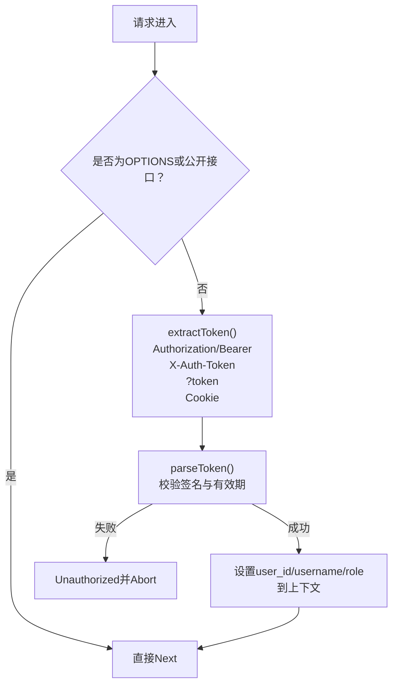
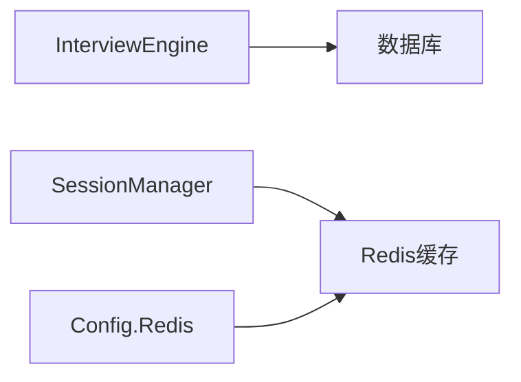
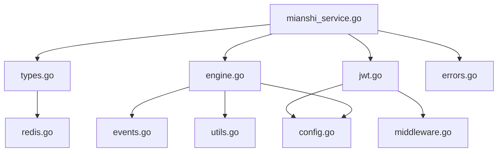

# 会话管理系统

<cite>
**本文档引用的文件**
- [backend/api/handler/interview/mianshi/types.go](file://backend/api/handler/interview/mianshi/types.go)
- [backend/api/handler/interview/mianshi/engine.go](file://backend/api/handler/interview/mianshi/engine.go)
- [backend/api/handler/interview/mianshi/utils.go](file://backend/api/handler/interview/mianshi/utils.go)
- [backend/api/handler/interview/mianshi/events.go](file://backend/api/handler/interview/mianshi/events.go)
- [backend/api/handler/interview/mianshi_service.go](file://backend/api/handler/interview/mianshi_service.go)
- [backend/api/router/interview/middleware.go](file://backend/api/router/interview/middleware.go)
- [backend/internal/middleware/jwt.go](file://backend/internal/middleware/jwt.go)
- [backend/internal/config/config.go](file://backend/internal/config/config.go)
- [backend/internal/repository/redis.go](file://backend/internal/repository/redis.go)
- [backend/internal/errors/errors.go](file://backend/internal/errors/errors.go)
- [doc/teach/# 面试全流程与核心控制教学.md](file://doc/teach/# 面试全流程与核心控制教学.md)
- [doc/项目优化建议_性能安全篇.md](file://doc/项目优化建议_性能安全篇.md)
</cite>

## 目录
1. [简介](#简介)
2. [项目结构](#项目结构)
3. [核心组件](#核心组件)
4. [架构总览](#架构总览)
5. [详细组件分析](#详细组件分析)
6. [依赖关系分析](#依赖关系分析)
7. [性能考虑](#性能考虑)
8. [故障排查指南](#故障排查指南)
9. [结论](#结论)
10. [附录](#附录)

## 简介
本文件面向会话管理系统，围绕面试场景下的会话生命周期（创建、维护、销毁）、状态管理、超时与并发控制、数据持久化与缓存、监控与性能优化、安全与权限控制等方面进行系统化技术说明。系统采用内存会话管理器配合 SSE（Server-Sent Events）实现实时交互，结合 JWT 认证与路由中间件保障访问安全。

## 项目结构
会话管理相关代码主要分布在以下模块：
- 会话模型与管理：mianshi/types.go
- 面试引擎与流程控制：mianshi/engine.go
- SSE 事件与心跳保活：mianshi/events.go、mianshi/utils.go
- 会话服务接口：mianshi_service.go
- 路由与认证中间件：router/interview/middleware.go、internal/middleware/jwt.go
- 配置与缓存：internal/config/config.go、internal/repository/redis.go
- 错误与日志：internal/errors/errors.go
- 教学与优化建议文档：doc/teach/、doc/项目优化建议_性能安全篇.md

**图表来源**
- [backend/api/handler/interview/mianshi/types.go](file://backend/api/handler/interview/mianshi/types.go#L1-L165)
- [backend/api/handler/interview/mianshi/engine.go](file://backend/api/handler/interview/mianshi/engine.go#L1-L291)
- [backend/api/handler/interview/mianshi/events.go](file://backend/api/handler/interview/mianshi/events.go#L1-L72)
- [backend/api/handler/interview/mianshi/utils.go](file://backend/api/handler/interview/mianshi/utils.go#L1-L74)
- [backend/api/handler/interview/mianshi_service.go](file://backend/api/handler/interview/mianshi_service.go#L1-L409)
- [backend/api/router/interview/middleware.go](file://backend/api/router/interview/middleware.go#L1-L362)
- [backend/internal/middleware/jwt.go](file://backend/internal/middleware/jwt.go#L1-L215)
- [backend/internal/config/config.go](file://backend/internal/config/config.go#L1-L269)
- [backend/internal/repository/redis.go](file://backend/internal/repository/redis.go#L1-L53)
- [backend/internal/errors/errors.go](file://backend/internal/errors/errors.go#L1-L178)

**章节来源**
- [backend/api/handler/interview/mianshi/types.go](file://backend/api/handler/interview/mianshi/types.go#L1-L165)
- [backend/api/handler/interview/mianshi/engine.go](file://backend/api/handler/interview/mianshi/engine.go#L1-L291)
- [backend/api/handler/interview/mianshi/events.go](file://backend/api/handler/interview/mianshi/events.go#L1-L72)
- [backend/api/handler/interview/mianshi/utils.go](file://backend/api/handler/interview/mianshi/utils.go#L1-L74)
- [backend/api/handler/interview/mianshi_service.go](file://backend/api/handler/interview/mianshi_service.go#L1-L409)
- [backend/api/router/interview/middleware.go](file://backend/api/router/interview/middleware.go#L1-L362)
- [backend/internal/middleware/jwt.go](file://backend/internal/middleware/jwt.go#L1-L215)
- [backend/internal/config/config.go](file://backend/internal/config/config.go#L1-L269)
- [backend/internal/repository/redis.go](file://backend/internal/repository/redis.go#L1-L53)
- [backend/internal/errors/errors.go](file://backend/internal/errors/errors.go#L1-L178)

## 核心组件
- 会话管理器（SessionManager）：以内存映射维护会话，提供创建、查询、提交答案、清理答案、删除会话等操作，内部使用读写锁保证并发安全。
- 面试引擎（InterviewEngine）：驱动面试循环，按题序生成问题、通过 SSE 推送事件、等待用户答案、维护历史上下文、持久化对话记录。
- SSE 事件与心跳：通过标准 SSE 格式推送问题、就绪、完成、错误、心跳等事件，并在等待阶段周期性发送心跳保活。
- 会话服务接口：提供启动面试流、提交答案、查询会话、结束面试等 API，绑定 JWT 认证与路由跳过规则。
- 认证与路由：JWT 中间件负责提取与校验令牌，路由中间件定义公开接口白名单与预检请求跳过。
- 配置与缓存：集中配置 JWT 秘钥、过期时间、Redis 连接参数等；Redis 提供缓存能力（读取、写入、删除、存在性检查）。
- 错误封装：统一错误码与 HTTP 状态映射，便于前端与运维定位问题。

**章节来源**
- [backend/api/handler/interview/mianshi/types.go](file://backend/api/handler/interview/mianshi/types.go#L9-L50)
- [backend/api/handler/interview/mianshi/engine.go](file://backend/api/handler/interview/mianshi/engine.go#L23-L37)
- [backend/api/handler/interview/mianshi/events.go](file://backend/api/handler/interview/mianshi/events.go#L11-L72)
- [backend/api/handler/interview/mianshi/utils.go](file://backend/api/handler/interview/mianshi/utils.go#L11-L74)
- [backend/api/handler/interview/mianshi_service.go](file://backend/api/handler/interview/mianshi_service.go#L25-L117)
- [backend/internal/middleware/jwt.go](file://backend/internal/middleware/jwt.go#L32-L78)
- [backend/api/router/interview/middleware.go](file://backend/api/router/interview/middleware.go#L13-L36)
- [backend/internal/config/config.go](file://backend/internal/config/config.go#L113-L118)
- [backend/internal/repository/redis.go](file://backend/internal/repository/redis.go#L13-L53)
- [backend/internal/errors/errors.go](file://backend/internal/errors/errors.go#L9-L29)

## 架构总览
系统通过 Hertz 框架提供 REST 接口，面试过程以 SSE 实时推送事件，会话状态在内存中维护并通过通道实现异步同步。JWT 中间件保障接口访问安全，路由中间件对公开接口放行。

**图表来源**
- [backend/api/handler/interview/mianshi_service.go](file://backend/api/handler/interview/mianshi_service.go#L25-L117)
- [backend/api/handler/interview/mianshi/types.go](file://backend/api/handler/interview/mianshi/types.go#L52-L82)
- [backend/api/handler/interview/mianshi/engine.go](file://backend/api/handler/interview/mianshi/engine.go#L39-L230)
- [backend/api/handler/interview/mianshi/events.go](file://backend/api/handler/interview/mianshi/events.go#L11-L72)

**章节来源**
- [doc/teach/# 面试全流程与核心控制教学.md](file://doc/teach/# 面试全流程与核心控制教学.md#L1-L85)

## 详细组件分析

### 会话模型与管理器
- InterviewSession：包含会话标识、用户与记录信息、问题类型与领域、状态、公司与岗位、答案通道、取消函数、起始与最后活动时间、问题计数等字段。
- SessionManager：提供创建、查询、提交答案、等待答案、清空答案、删除会话等方法；使用读写锁保证并发安全；答案通道容量为 1，避免堆积。
- 会话 ID 生成：基于时间戳与随机字符串组合，具备唯一性与可读性。
- 删除策略：结束接口延迟删除，避免 SSE 关闭前竞态。

**图表来源**
- [backend/api/handler/interview/mianshi/types.go](file://backend/api/handler/interview/mianshi/types.go#L9-L50)
- [backend/api/handler/interview/mianshi/types.go](file://backend/api/handler/interview/mianshi/types.go#L15-L34)

**章节来源**
- [backend/api/handler/interview/mianshi/types.go](file://backend/api/handler/interview/mianshi/types.go#L52-L164)

### 面试引擎与流程控制
- RunInterviewLoop：控制 20 题上限、每次仅生成一道问题、等待用户回答后再生成下一道；维护最近 5 道题的历史上下文；超时时间为 30 分钟；心跳间隔 15 秒。
- 事件推送：问题、就绪、进度、完成、错误等事件通过 SSE 推送；等待阶段周期性发送心跳事件。
- 保存策略：将全部问题与回答持久化至数据库，按批记录日志。

**图表来源**
- [backend/api/handler/interview/mianshi/engine.go](file://backend/api/handler/interview/mianshi/engine.go#L39-L230)
- [backend/api/handler/interview/mianshi/utils.go](file://backend/api/handler/interview/mianshi/utils.go#L11-L56)
- [backend/api/handler/interview/mianshi/events.go](file://backend/api/handler/interview/mianshi/events.go#L11-L72)

**章节来源**
- [backend/api/handler/interview/mianshi/engine.go](file://backend/api/handler/interview/mianshi/engine.go#L39-L291)
- [backend/api/handler/interview/mianshi/utils.go](file://backend/api/handler/interview/mianshi/utils.go#L11-L74)
- [backend/api/handler/interview/mianshi/events.go](file://backend/api/handler/interview/mianshi/events.go#L11-L72)

### 会话服务接口与生命周期
- 启动面试流：创建面试记录、生成会话、设置 SSE 响应头、发送会话 ID 与开始事件、启动异步引擎。
- 提交答案：校验会话归属与存在性，将答案写入通道。
- 查询会话：返回会话基本信息与统计指标（当前题号、已答数、总题数、耗时等）。
- 结束面试：更新状态与持续时间，取消上下文，延迟删除会话。

**图表来源**
- [backend/api/handler/interview/mianshi_service.go](file://backend/api/handler/interview/mianshi_service.go#L25-L300)
- [backend/api/handler/interview/mianshi/types.go](file://backend/api/handler/interview/mianshi/types.go#L52-L164)
- [backend/api/handler/interview/mianshi/engine.go](file://backend/api/handler/interview/mianshi/engine.go#L39-L230)

**章节来源**
- [backend/api/handler/interview/mianshi_service.go](file://backend/api/handler/interview/mianshi_service.go#L25-L300)

### 认证与权限控制
- JWT 中间件：支持 Authorization Bearer、X-Auth-Token、查询参数 token、Cookie 多种方式提取令牌；校验签名与有效期；将用户信息注入上下文。
- 路由跳过：对 OPTIONS 预检与公开接口（登录、注册、登出、微信回调等）放行。
- 会话校验：提交答案与查询会话接口均校验会话归属与存在性，防止越权访问。

**图表来源**
- [backend/api/router/interview/middleware.go](file://backend/api/router/interview/middleware.go#L13-L36)
- [backend/internal/middleware/jwt.go](file://backend/internal/middleware/jwt.go#L32-L78)
- [backend/internal/middleware/jwt.go](file://backend/internal/middleware/jwt.go#L186-L215)

**章节来源**
- [backend/api/router/interview/middleware.go](file://backend/api/router/interview/middleware.go#L13-L36)
- [backend/internal/middleware/jwt.go](file://backend/internal/middleware/jwt.go#L32-L134)

### 数据持久化与缓存机制
- 持久化：面试引擎将全部问题与回答逐条写入数据库，记录创建时间，按 10 条批次输出日志。
- 缓存：Redis 提供 Get/Set/Delete/Exists 等基础操作；配置文件包含 Redis 地址、密码、DB、超时与池大小等参数；可作为热点数据缓存层（如用户信息、会话元数据等）。

**图表来源**
- [backend/api/handler/interview/mianshi/engine.go](file://backend/api/handler/interview/mianshi/engine.go#L232-L258)
- [backend/internal/repository/redis.go](file://backend/internal/repository/redis.go#L13-L53)
- [backend/internal/config/config.go](file://backend/internal/config/config.go#L73-L83)

**章节来源**
- [backend/api/handler/interview/mianshi/engine.go](file://backend/api/handler/interview/mianshi/engine.go#L232-L258)
- [backend/internal/repository/redis.go](file://backend/internal/repository/redis.go#L13-L53)
- [backend/internal/config/config.go](file://backend/internal/config/config.go#L73-L83)

### 内存管理与并发控制
- 读写锁：SessionManager 使用 RWMutex 保护 sessions 映射，读多写少场景降低锁竞争。
- 答案通道：AnswerChan 容量为 1，避免无限堆积；ClearAnswer 用于消费或丢弃积压消息。
- 上下文取消：结束面试时通过 CancelFunc 立即中断引擎循环，避免资源泄漏。
- 延迟删除：结束接口延迟 1 秒删除会话，确保 SSE 连接稳定关闭。

**章节来源**
- [backend/api/handler/interview/mianshi/types.go](file://backend/api/handler/interview/mianshi/types.go#L8-L13)
- [backend/api/handler/interview/mianshi/types.go](file://backend/api/handler/interview/mianshi/types.go#L128-L149)
- [backend/api/handler/interview/mianshi_service.go](file://backend/api/handler/interview/mianshi_service.go#L269-L290)

## 依赖关系分析
- 会话服务接口依赖会话管理器与面试引擎；面试引擎依赖智能体服务与 MQ（评估消息发布）。
- JWT 中间件与路由中间件共同决定接口访问策略；配置模块为 JWT 与 Redis 提供参数。
- 错误封装模块统一错误码与状态映射，便于接口层处理。

**图表来源**
- [backend/api/handler/interview/mianshi_service.go](file://backend/api/handler/interview/mianshi_service.go#L1-L409)
- [backend/api/handler/interview/mianshi/types.go](file://backend/api/handler/interview/mianshi/types.go#L1-L165)
- [backend/api/handler/interview/mianshi/engine.go](file://backend/api/handler/interview/mianshi/engine.go#L1-L291)
- [backend/api/handler/interview/mianshi/events.go](file://backend/api/handler/interview/mianshi/events.go#L1-L72)
- [backend/api/handler/interview/mianshi/utils.go](file://backend/api/handler/interview/mianshi/utils.go#L1-L74)
- [backend/internal/middleware/jwt.go](file://backend/internal/middleware/jwt.go#L1-L215)
- [backend/api/router/interview/middleware.go](file://backend/api/router/interview/middleware.go#L1-L362)
- [backend/internal/repository/redis.go](file://backend/internal/repository/redis.go#L1-L53)
- [backend/internal/config/config.go](file://backend/internal/config/config.go#L1-L269)
- [backend/internal/errors/errors.go](file://backend/internal/errors/errors.go#L1-L178)

**章节来源**
- [backend/api/handler/interview/mianshi_service.go](file://backend/api/handler/interview/mianshi_service.go#L1-L409)
- [backend/api/handler/interview/mianshi/engine.go](file://backend/api/handler/interview/mianshi/engine.go#L1-L291)

## 性能考虑
- SSE 事件立即 flush：确保客户端及时收到事件，减少网络层延迟。
- 心跳保活：在长时间等待阶段定期发送心跳，维持连接活跃，避免代理超时。
- 答案通道容量：单通道容量为 1，避免无界堆积；可通过上游限流或队列化扩展。
- Redis 缓存策略：建议采用 Cache-Aside 模式，热点数据设置合理 TTL，读取失败时使用互斥锁或布隆过滤器防击穿。
- JWT 过期时间：通过配置项控制，默认 24 小时；建议结合刷新机制（见优化建议文档）降低频繁登录成本。
- 日志与指标：建议在关键路径埋点（会话创建、问题生成、答案接收、持久化、评估发布），结合 Prometheus/Grafana 监控。

[本节为通用性能指导，无需具体文件引用]

## 故障排查指南
- 会话未找到：提交答案或查询会话时若会话不存在，返回 Not Found；检查会话 ID 与用户归属。
- 未授权访问：JWT 校验失败或会话归属不符，返回 Unauthorized；检查 Authorization 头与会话所有权。
- 超时问题：等待答案超时（默认 30 分钟）或心跳异常；检查网络与客户端心跳处理。
- SSE 连接中断：结束面试或异常情况下连接提前关闭；确认 CancelFunc 使用与延迟删除策略。
- Redis 连接失败：检查地址、密码、DB、超时与池大小配置；关注 Ping 健康检查结果。
- 错误码映射：统一使用 AppError，便于前端识别与展示；注意不同错误类别的 HTTP 状态映射。

**章节来源**
- [backend/api/handler/interview/mianshi/errors.go](file://backend/api/handler/interview/mianshi/errors.go#L5-L12)
- [backend/api/handler/interview/mianshi_service.go](file://backend/api/handler/interview/mianshi_service.go#L120-L168)
- [backend/internal/errors/errors.go](file://backend/internal/errors/errors.go#L13-L29)
- [backend/internal/repository/redis.go](file://backend/internal/repository/redis.go#L16-L33)

## 结论
该会话管理系统通过内存会话管理器与 SSE 实时事件流，实现了面试场景下的高并发、低延迟交互；JWT 中间件与路由跳过规则保障了访问安全与易用性；Redis 与配置模块提供了可扩展的缓存与参数化能力。建议后续引入会话持久化（如 Redis 会话存储）、JWT 刷新机制、更细粒度的监控与告警，以进一步提升稳定性与可维护性。

[本节为总结性内容，无需具体文件引用]

## 附录
- 会话状态字段说明：状态、起始时间、最后活动时间、问题计数等用于统计与审计。
- JWT 配置要点：密钥、过期时间、CORS 等；建议使用强随机密钥与合理过期策略。
- Redis 缓存最佳实践：热点数据优先、合理 TTL、Cache-Aside、防击穿。

[本节为补充说明，无需具体文件引用]