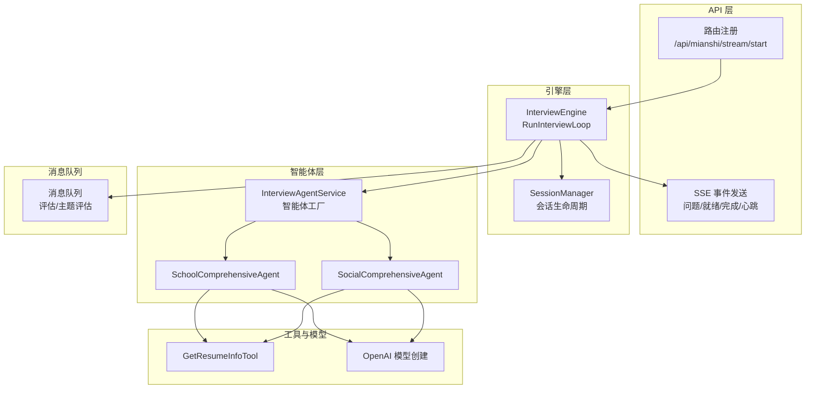
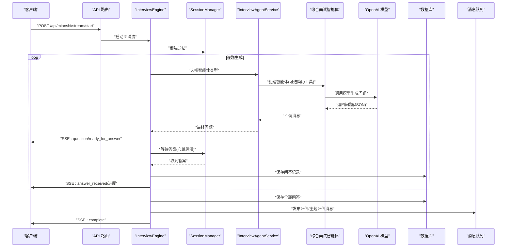
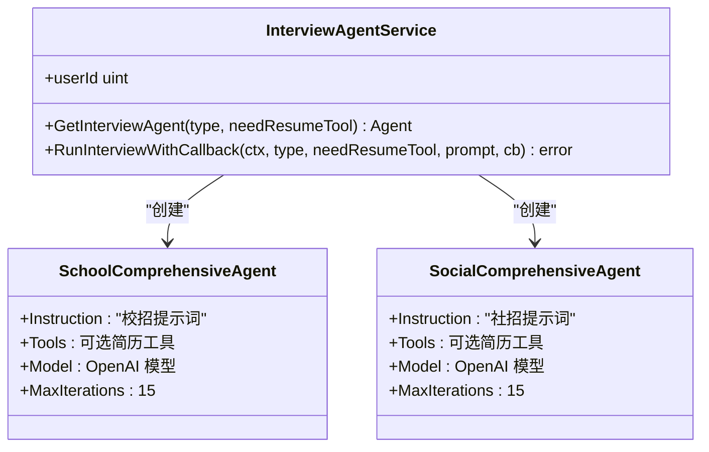
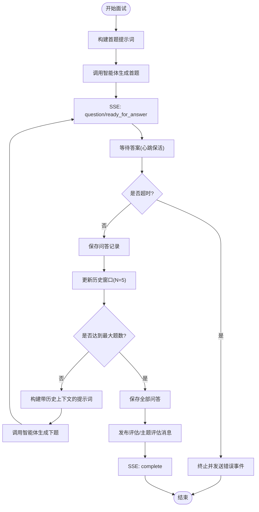
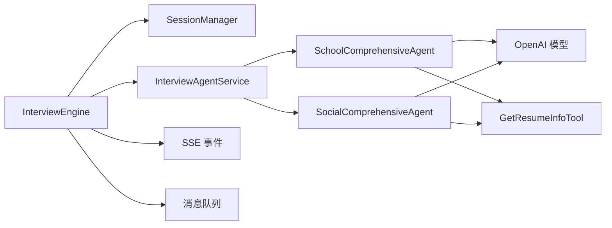

# 综合面试系统

<cite>
**本文引用的文件**
- [backend/chatApp/agent/interview/comprehensive/school_comprehensive_agent.go](file://backend/chatApp/agent/interview/comprehensive/school_comprehensive_agent.go)
- [backend/chatApp/agent/interview/comprehensive/social_comprehensive_agent.go](file://backend/chatApp/agent/interview/comprehensive/social_comprehensive_agent.go)
- [backend/chatApp/agent/interview/comprehensive/constants.go](file://backend/chatApp/agent/interview/comprehensive/constants.go)
- [backend/chatApp/agent_service/interview/interview_agent_service.go](file://backend/chatApp/agent_service/interview/interview_agent_service.go)
- [backend/api/handler/interview/mianshi/engine.go](file://backend/api/handler/interview/mianshi/engine.go)
- [backend/api/handler/interview/mianshi/types.go](file://backend/api/handler/interview/mianshi/types.go)
- [backend/api/handler/interview/mianshi/events.go](file://backend/api/handler/interview/mianshi/events.go)
- [backend/api/handler/interview/mianshi/utils.go](file://backend/api/handler/interview/mianshi/utils.go)
- [backend/api/router/interview/api.go](file://backend/api/router/interview/api.go)
- [backend/internal/mq/mq.go](file://backend/internal/mq/mq.go)
- [backend/chatApp/tool/get_resume_info_tool.go](file://backend/chatApp/tool/get_resume_info_tool.go)
- [backend/chatApp/chat/openAi.go](file://backend/chatApp/chat/openAi.go)
</cite>

## 目录
1. [简介](#简介)
2. [项目结构](#项目结构)
3. [核心组件](#核心组件)
4. [架构总览](#架构总览)
5. [详细组件分析](#详细组件分析)
6. [依赖关系分析](#依赖关系分析)
7. [性能考虑](#性能考虑)
8. [故障排查指南](#故障排查指南)
9. [结论](#结论)
10. [附录](#附录)

## 简介
本文件面向综合面试系统，聚焦“校招”与“社招”两种综合面试模式的设计差异与实现原理，系统性阐述综合面试智能体工作机制（问题生成算法、面试流程控制、实时交互处理）、面试引擎核心逻辑（会话管理、状态转换、事件处理）、配置选项与扩展接口、性能优化策略，以及监控指标、异常处理与用户体验优化方案。文档同时提供可视化图示，帮助读者快速理解系统全貌与关键路径。

## 项目结构
后端采用分层与按功能域划分的组织方式：
- API 层：路由注册与对外接口暴露，负责会话启动、答案提交、SSE 流等。
- 引擎层：面试引擎负责问题生成、会话管理、事件推送与持久化。
- 智能体层：综合/专项面试智能体，封装提示词、工具与模型调用。
- 工具层：简历检索工具等外部能力接入。
- MQ 层：异步发布评估与主题评估消息，解耦后续处理。
- 配置与模型：统一的 OpenAI 模型创建与密钥管理。

图表来源
- [backend/api/router/interview/api.go](file://backend/api/router/interview/api.go#L17-L47)
- [backend/api/handler/interview/mianshi/engine.go](file://backend/api/handler/interview/mianshi/engine.go#L30-L37)
- [backend/api/handler/interview/mianshi/types.go](file://backend/api/handler/interview/mianshi/types.go#L9-L16)
- [backend/chatApp/agent_service/interview/interview_agent_service.go](file://backend/chatApp/agent_service/interview/interview_agent_service.go#L30-L40)
- [backend/chatApp/agent/interview/comprehensive/school_comprehensive_agent.go](file://backend/chatApp/agent/interview/comprehensive/school_comprehensive_agent.go#L14-L47)
- [backend/chatApp/agent/interview/comprehensive/social_comprehensive_agent.go](file://backend/chatApp/agent/interview/comprehensive/social_comprehensive_agent.go#L14-L47)
- [backend/chatApp/tool/get_resume_info_tool.go](file://backend/chatApp/tool/get_resume_info_tool.go#L36-L47)
- [backend/chatApp/chat/openAi.go](file://backend/chatApp/chat/openAi.go#L19-L109)
- [backend/internal/mq/mq.go](file://backend/internal/mq/mq.go#L155-L208)

章节来源
- [backend/api/router/interview/api.go](file://backend/api/router/interview/api.go#L17-L47)
- [backend/api/handler/interview/mianshi/types.go](file://backend/api/handler/interview/mianshi/types.go#L9-L16)

## 核心组件
- 综合面试智能体（校招/社招）
  - 校招智能体：面向应届生，强调基础知识、学习潜力与职业素养，问题设计更偏基础与递进。
  - 社招智能体：面向有经验候选人，强调实战经验、架构设计与领导力，问题更具深度与复杂度。
- 面试引擎（InterviewEngine）
  - 单轮生成、逐一作答、历史上下文保留、SSE 实时事件推送、超时与心跳保活、完成后持久化与消息发布。
- 会话管理（SessionManager）
  - 会话创建、答案通道、超时等待、心跳保活、状态维护与清理。
- 智能体服务（InterviewAgentService）
  - 智能体工厂，按类型创建不同面试智能体；统一运行与回调处理。
- 工具与模型
  - 简历检索工具；OpenAI 模型创建与密钥校验。
- 消息队列（MQ）
  - 评估报告与主题评估消息发布，支持内存队列与可替换实现。

章节来源
- [backend/chatApp/agent/interview/comprehensive/school_comprehensive_agent.go](file://backend/chatApp/agent/interview/comprehensive/school_comprehensive_agent.go#L14-L47)
- [backend/chatApp/agent/interview/comprehensive/social_comprehensive_agent.go](file://backend/chatApp/agent/interview/comprehensive/social_comprehensive_agent.go#L14-L47)
- [backend/api/handler/interview/mianshi/engine.go](file://backend/api/handler/interview/mianshi/engine.go#L23-L37)
- [backend/api/handler/interview/mianshi/types.go](file://backend/api/handler/interview/mianshi/types.go#L9-L34)
- [backend/chatApp/agent_service/interview/interview_agent_service.go](file://backend/chatApp/agent_service/interview/interview_agent_service.go#L30-L40)
- [backend/chatApp/tool/get_resume_info_tool.go](file://backend/chatApp/tool/get_resume_info_tool.go#L36-L47)
- [backend/chatApp/chat/openAi.go](file://backend/chatApp/chat/openAi.go#L19-L109)
- [backend/internal/mq/mq.go](file://backend/internal/mq/mq.go#L155-L208)

## 架构总览
综合面试系统采用“API -> 引擎 -> 智能体 -> 工具/模型”的链路，配合“会话管理 + SSE 事件 + MQ 异步处理”的解耦设计，形成稳定可靠的实时面试体验。

图表来源
- [backend/api/router/interview/api.go](file://backend/api/router/interview/api.go#L44-L46)
- [backend/api/handler/interview/mianshi/engine.go](file://backend/api/handler/interview/mianshi/engine.go#L39-L230)
- [backend/api/handler/interview/mianshi/utils.go](file://backend/api/handler/interview/mianshi/utils.go#L11-L56)
- [backend/api/handler/interview/mianshi/events.go](file://backend/api/handler/interview/mianshi/events.go#L11-L71)
- [backend/chatApp/agent_service/interview/interview_agent_service.go](file://backend/chatApp/agent_service/interview/interview_agent_service.go#L75-L101)
- [backend/chatApp/agent/interview/comprehensive/school_comprehensive_agent.go](file://backend/chatApp/agent/interview/comprehensive/school_comprehensive_agent.go#L14-L47)
- [backend/chatApp/agent/interview/comprehensive/social_comprehensive_agent.go](file://backend/chatApp/agent/interview/comprehensive/social_comprehensive_agent.go#L14-L47)
- [backend/internal/mq/mq.go](file://backend/internal/mq/mq.go#L155-L208)

## 详细组件分析

### 综合面试智能体（校招 vs 社招）
- 设计差异
  - 校招：侧重基础知识、学习潜力与思维过程，问题更开放且循序渐进，强调友好氛围与引导性追问。
  - 社招：侧重实战经验、系统设计与领导力，问题更具挑战性与业务深度，关注复杂问题处理与团队影响。
- 实现要点
  - 智能体通过提示词指令驱动，首次问题仅需简历ID与难度；后续问题引入最近N道题的历史上下文，避免重复并深化难度。
  - 可选集成简历检索工具，增强对候选人背景的理解，提升问题针对性。
  - 统一 MaxIterations 限制，保障对话收敛与资源可控。

图表来源
- [backend/chatApp/agent_service/interview/interview_agent_service.go](file://backend/chatApp/agent_service/interview/interview_agent_service.go#L30-L73)
- [backend/chatApp/agent/interview/comprehensive/school_comprehensive_agent.go](file://backend/chatApp/agent/interview/comprehensive/school_comprehensive_agent.go#L14-L47)
- [backend/chatApp/agent/interview/comprehensive/social_comprehensive_agent.go](file://backend/chatApp/agent/interview/comprehensive/social_comprehensive_agent.go#L14-L47)
- [backend/chatApp/agent/interview/comprehensive/constants.go](file://backend/chatApp/agent/interview/comprehensive/constants.go#L3-L46)
- [backend/chatApp/agent/interview/comprehensive/constants.go](file://backend/chatApp/agent/interview/comprehensive/constants.go#L48-L94)

章节来源
- [backend/chatApp/agent/interview/comprehensive/school_comprehensive_agent.go](file://backend/chatApp/agent/interview/comprehensive/school_comprehensive_agent.go#L14-L47)
- [backend/chatApp/agent/interview/comprehensive/social_comprehensive_agent.go](file://backend/chatApp/agent/interview/comprehensive/social_comprehensive_agent.go#L14-L47)
- [backend/chatApp/agent/interview/comprehensive/constants.go](file://backend/chatApp/agent/interview/comprehensive/constants.go#L3-L46)
- [backend/chatApp/agent/interview/comprehensive/constants.go](file://backend/chatApp/agent/interview/comprehensive/constants.go#L48-L94)

### 面试引擎（InterviewEngine）
- 问题生成算法
  - 首题：仅含简历ID与难度，生成首问。
  - 后续：拼接最近N道题的历史上下文，避免重复并动态深化难度，保证连贯性与针对性。
- 面试流程控制
  - 逐题生成、逐一作答、历史窗口滚动更新、进度事件推送、超时与心跳保活。
- 实时交互处理
  - 使用 SSE 推送问题、就绪、进度、完成与心跳事件；答案通过会话通道异步接收。
- 事件处理机制
  - 问题事件、就绪事件、进度事件、错误事件、完成事件；心跳事件用于保活。
- 会话管理与状态
  - 会话创建、活跃时间更新、答案通道、删除会话；超时与取消控制。

图表来源
- [backend/api/handler/interview/mianshi/engine.go](file://backend/api/handler/interview/mianshi/engine.go#L39-L230)
- [backend/api/handler/interview/mianshi/utils.go](file://backend/api/handler/interview/mianshi/utils.go#L11-L56)
- [backend/api/handler/interview/mianshi/events.go](file://backend/api/handler/interview/mianshi/events.go#L11-L71)
- [backend/api/handler/interview/mianshi/types.go](file://backend/api/handler/interview/mianshi/types.go#L52-L82)

章节来源
- [backend/api/handler/interview/mianshi/engine.go](file://backend/api/handler/interview/mianshi/engine.go#L23-L37)
- [backend/api/handler/interview/mianshi/engine.go](file://backend/api/handler/interview/mianshi/engine.go#L39-L230)
- [backend/api/handler/interview/mianshi/utils.go](file://backend/api/handler/interview/mianshi/utils.go#L11-L56)
- [backend/api/handler/interview/mianshi/events.go](file://backend/api/handler/interview/mianshi/events.go#L11-L71)
- [backend/api/handler/interview/mianshi/types.go](file://backend/api/handler/interview/mianshi/types.go#L52-L82)

### 会话管理（SessionManager）
- 关键能力
  - 会话创建与详情设置、获取、删除。
  - 答案提交与阻塞等待、通道清空。
  - 会话状态维护（active/paused/completed/failed）与活动时间更新。
- 并发与线程安全
  - 读写锁保护会话表，通道容量为1，避免堆积。
- 超时与心跳
  - 等待答案时定时发送心跳事件，防止连接中断。

章节来源
- [backend/api/handler/interview/mianshi/types.go](file://backend/api/handler/interview/mianshi/types.go#L9-L34)
- [backend/api/handler/interview/mianshi/types.go](file://backend/api/handler/interview/mianshi/types.go#L52-L82)
- [backend/api/handler/interview/mianshi/types.go](file://backend/api/handler/interview/mianshi/types.go#L84-L149)
- [backend/api/handler/interview/mianshi/utils.go](file://backend/api/handler/interview/mianshi/utils.go#L11-L56)

### 智能体服务（InterviewAgentService）
- 智能体类型
  - 综合：校招、社招。
  - 专项：Go、Java、MQ、MySQL、Redis。
- 统一运行接口
  - 支持回调式增量输出与一次性最终消息获取。
- 运行机制
  - 基于 Runner 的迭代器消费事件流，按需回调或收集最终消息。

章节来源
- [backend/chatApp/agent_service/interview/interview_agent_service.go](file://backend/chatApp/agent_service/interview/interview_agent_service.go#L14-L28)
- [backend/chatApp/agent_service/interview/interview_agent_service.go](file://backend/chatApp/agent_service/interview/interview_agent_service.go#L42-L73)
- [backend/chatApp/agent_service/interview/interview_agent_service.go](file://backend/chatApp/agent_service/interview/interview_agent_service.go#L75-L101)
- [backend/chatApp/agent_service/interview/interview_agent_service.go](file://backend/chatApp/agent_service/interview/interview_agent_service.go#L103-L154)

### 工具与模型
- 简历检索工具
  - 将 ResumeID 映射为简历实体，供智能体在生成问题时参考。
- OpenAI 模型创建
  - 读取用户默认模型配置，解密 API Key，校验格式与可用性，创建聊天模型；对常见错误进行分类包装。

章节来源
- [backend/chatApp/tool/get_resume_info_tool.go](file://backend/chatApp/tool/get_resume_info_tool.go#L21-L34)
- [backend/chatApp/tool/get_resume_info_tool.go](file://backend/chatApp/tool/get_resume_info_tool.go#L36-L47)
- [backend/chatApp/chat/openAi.go](file://backend/chatApp/chat/openAi.go#L19-L109)

### 消息队列（MQ）
- 消息类型
  - 评估报告生成消息、主题评估消息。
- 发布与订阅
  - 提供全局消息队列实例，默认内存实现；支持异步处理器广播。
- 在面试中的作用
  - 面试结束后发布评估相关消息，触发后续处理流程。

章节来源
- [backend/internal/mq/mq.go](file://backend/internal/mq/mq.go#L12-L26)
- [backend/internal/mq/mq.go](file://backend/internal/mq/mq.go#L155-L208)

## 依赖关系分析
- 组件耦合
  - 引擎依赖会话管理、智能体服务、SSE 事件与 MQ。
  - 智能体服务依赖具体智能体实现与工具。
  - 智能体依赖模型创建与工具。
- 外部依赖
  - OpenAI 模型 SDK、SSE 客户端、消息队列实现。
- 潜在风险
  - 模型调用失败、API Key 无效、MQ 发布失败、会话通道阻塞等。

图表来源
- [backend/api/handler/interview/mianshi/engine.go](file://backend/api/handler/interview/mianshi/engine.go#L23-L37)
- [backend/api/handler/interview/mianshi/types.go](file://backend/api/handler/interview/mianshi/types.go#L9-L16)
- [backend/chatApp/agent_service/interview/interview_agent_service.go](file://backend/chatApp/agent_service/interview/interview_agent_service.go#L30-L40)
- [backend/chatApp/agent/interview/comprehensive/school_comprehensive_agent.go](file://backend/chatApp/agent/interview/comprehensive/school_comprehensive_agent.go#L14-L47)
- [backend/chatApp/agent/interview/comprehensive/social_comprehensive_agent.go](file://backend/chatApp/agent/interview/comprehensive/social_comprehensive_agent.go#L14-L47)
- [backend/chatApp/chat/openAi.go](file://backend/chatApp/chat/openAi.go#L19-L109)
- [backend/chatApp/tool/get_resume_info_tool.go](file://backend/chatApp/tool/get_resume_info_tool.go#L36-L47)
- [backend/api/handler/interview/mianshi/events.go](file://backend/api/handler/interview/mianshi/events.go#L11-L71)
- [backend/internal/mq/mq.go](file://backend/internal/mq/mq.go#L155-L208)

## 性能考虑
- 问题生成与上下文
  - 限制历史窗口大小（如5），避免上下文膨胀导致延迟与成本上升。
  - 控制最大题数与最大迭代次数，防止无限循环与资源耗尽。
- SSE 与心跳
  - 心跳间隔与超时时间需平衡网络波动与用户体验；及时 flush 保证实时性。
- 模型调用
  - API Key 校验与错误分类，避免重试风暴；必要时引入退避策略。
- 数据持久化
  - 分批日志记录保存进度，降低单次写入压力；批量入库可结合事务与索引优化。
- MQ 异步化
  - 评估与主题评估消息异步处理，避免阻塞主流程；可替换为生产级 MQ 实现。

## 故障排查指南
- 常见错误与定位
  - 会话未找到：检查会话ID有效性与生命周期。
  - 答案超时：检查心跳事件是否正常推送、网络是否稳定。
  - 模型创建失败：核对 API Key 格式、配额与速率限制。
  - MQ 发布失败：检查消息队列初始化与订阅者状态。
- 日志与可观测性
  - 引擎、会话管理、SSE 事件、MQ 发布均输出关键日志，便于定位问题节点。
- 用户体验优化
  - 心跳保活、进度百分比、错误事件提示，减少用户等待焦虑。
  - 首题与后续题提示词差异化，提升问题质量与连贯性。

章节来源
- [backend/api/handler/interview/mianshi/errors.go](file://backend/api/handler/interview/mianshi/errors.go#L5-L12)
- [backend/api/handler/interview/mianshi/engine.go](file://backend/api/handler/interview/mianshi/engine.go#L128-L138)
- [backend/api/handler/interview/mianshi/engine.go](file://backend/api/handler/interview/mianshi/engine.go#L167-L173)
- [backend/chatApp/chat/openAi.go](file://backend/chatApp/chat/openAi.go#L84-L106)
- [backend/internal/mq/mq.go](file://backend/internal/mq/mq.go#L177-L184)

## 结论
综合面试系统通过“智能体 + 会话管理 + SSE + MQ”的组合，实现了可扩展、可观察、可优化的实时面试体验。校招与社招智能体在提示词与问题策略上形成互补，引擎层提供稳定的流程控制与事件机制，工具与模型层确保能力可插拔与安全可控。建议在生产环境中进一步完善 MQ 替换、错误退避、上下文压缩与评估任务并发治理，持续提升稳定性与吞吐量。

## 附录
- 配置选项与扩展接口
  - 智能体类型扩展：在智能体服务中新增类型常量与工厂分支。
  - 会话参数扩展：在会话结构中增加字段，会话管理器相应扩展创建与详情接口。
  - SSE 事件扩展：在事件模块新增事件类型与发送函数。
  - MQ 扩展：实现 MessageQueue 接口，替换全局消息队列实例。
- 监控指标建议
  - 面试时长、平均题间时延、答案超时率、SSE 事件发送成功率、MQ 发布成功率、模型调用耗时与错误率。
- 用户体验优化
  - 增加“暂停/恢复”会话能力、提供“跳过/重问”选项、展示答题时间统计、优化移动端兼容性。