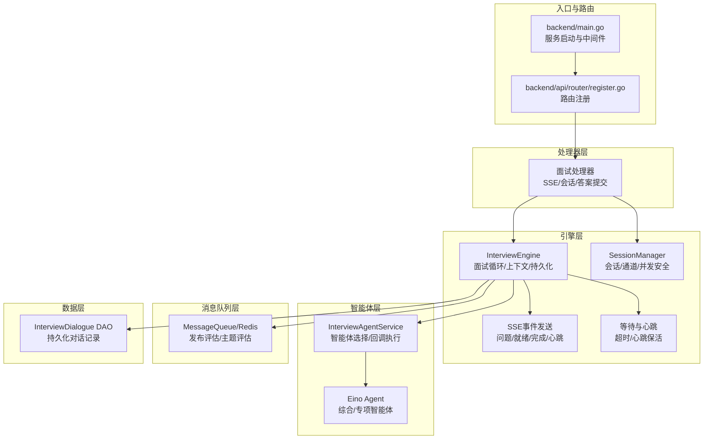
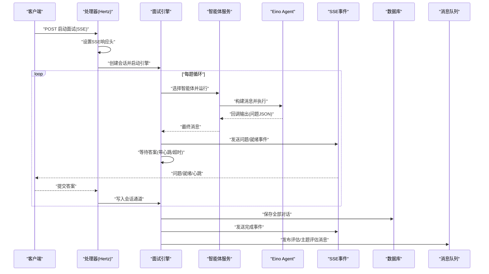
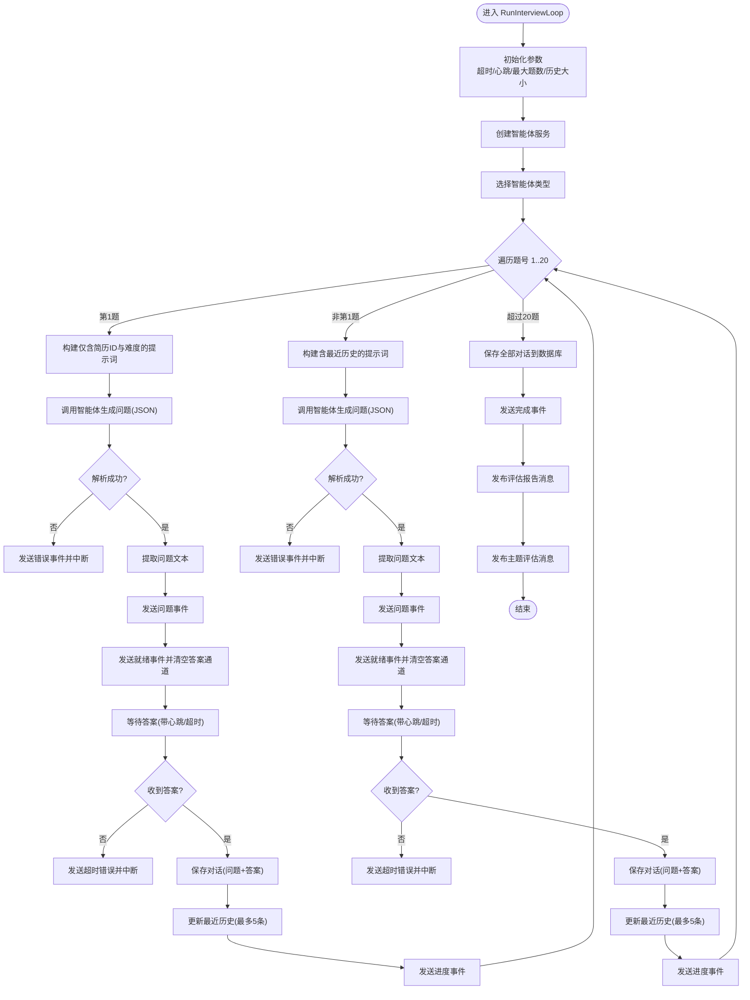
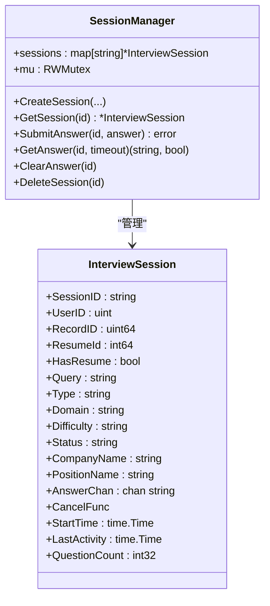
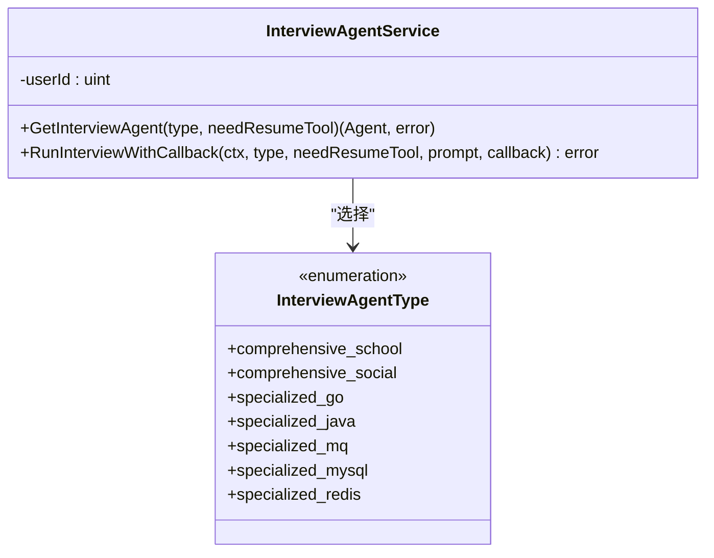
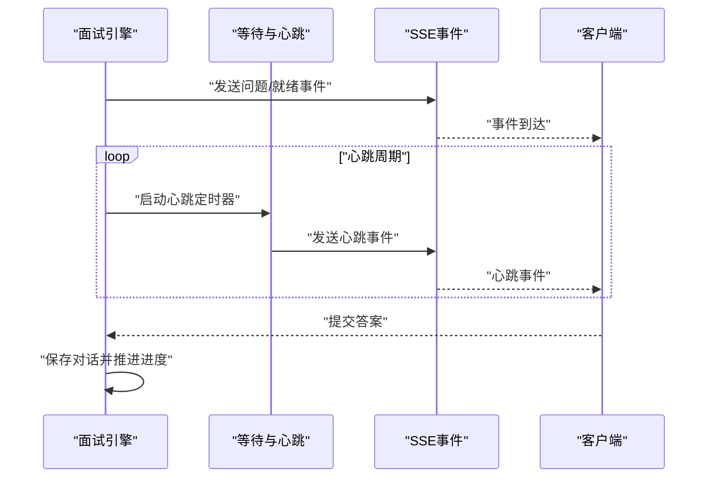
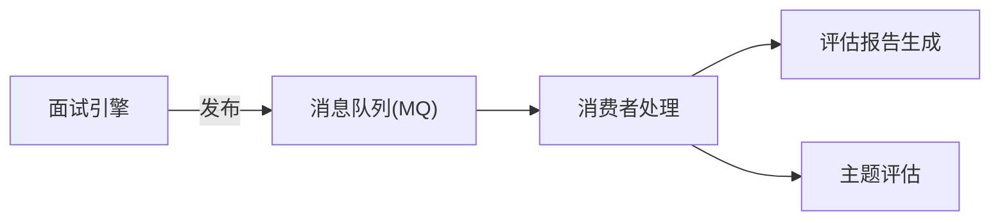
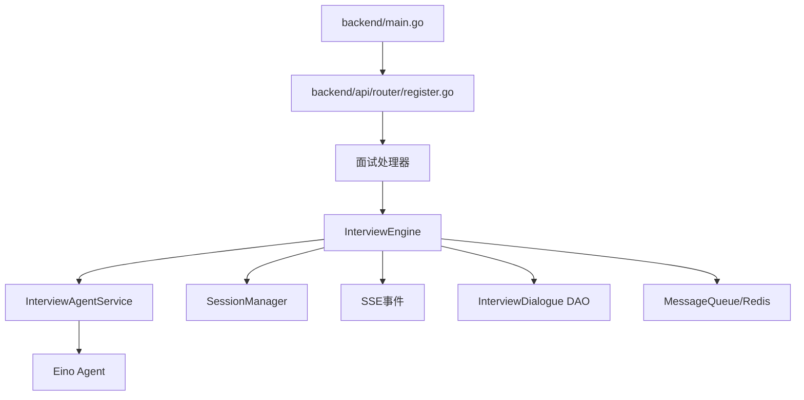

# 面试引擎架构

<cite>
**本文档引用的文件**
- [backend/main.go](file://backend/main.go)
- [backend/api/router/register.go](file://backend/api/router/register.go)
- [backend/api/handler/interview/mianshi/engine.go](file://backend/api/handler/interview/mianshi/engine.go)
- [backend/api/handler/interview/mianshi/types.go](file://backend/api/handler/interview/mianshi/types.go)
- [backend/api/handler/interview/mianshi/events.go](file://backend/api/handler/interview/mianshi/events.go)
- [backend/api/handler/interview/mianshi/utils.go](file://backend/api/handler/interview/mianshi/utils.go)
- [backend/api/handler/interview/mianshi/errors.go](file://backend/api/handler/interview/mianshi/errors.go)
- [backend/chatApp/agent_service/interview/interview_agent_service.go](file://backend/chatApp/agent_service/interview/interview_agent_service.go)
- [backend/chatApp/agent/interview/comprehensive/school_comprehensive_agent.go](file://backend/chatApp/agent/interview/comprehensive/school_comprehensive_agent.go)
- [backend/chatApp/agent/interview/specialized/go_agent.go](file://backend/chatApp/agent/interview/specialized/go_agent.go)
- [backend/internal/mq/mq.go](file://backend/internal/mq/mq.go)
- [backend/internal/service/interviews/interface.go](file://backend/internal/service/interviews/interface.go)
- [backend/internal/model/interview_dialogue.go](file://backend/internal/model/interview_dialogue.go)
- [backend/chatApp/main.go](file://backend/chatApp/main.go)
</cite>

## 目录
1. [简介](#简介)
2. [项目结构](#项目结构)
3. [核心组件](#核心组件)
4. [架构总览](#架构总览)
5. [详细组件分析](#详细组件分析)
6. [依赖关系分析](#依赖关系分析)
7. [性能考量](#性能考量)
8. [故障排查指南](#故障排查指南)
9. [结论](#结论)
10. [附录](#附录)

## 简介
本文件面向面试引擎的架构设计与实现，系统性阐述引擎的整体设计思路、核心组件、运行机制与扩展方式。重点覆盖以下方面：
- 状态管理与生命周期控制：通过会话管理器在无状态 HTTP 服务中维持有状态的面试会话。
- 引擎与智能体系统的交互模式：基于 Eino Agent 的统一编排与回调机制。
- 事件驱动与异步处理：基于 SSE 的事件推送与基于通道的异步等待。
- 资源调度与消息队列：基于 Redis 的消息发布与消费，支撑后续评估与主题分析。
- 扩展接口与插件机制：按面试类型与领域动态选择智能体，便于扩展新的面试场景。
- 性能调优与稳定性保障：超时控制、心跳保活、并发安全与优雅停机。

## 项目结构
后端采用分层与职责分离的设计：
- 入口与路由：Hertz 服务入口负责加载配置、初始化数据库与消息队列、注册路由与中间件。
- 处理器层：面试相关处理器负责建立 SSE 连接、创建会话、启动异步面试引擎、接收用户答案。
- 引擎层：面试引擎负责循环生成问题、维护上下文、等待用户回答、持久化对话、触发后续评估。
- 智能体层：基于 Eino Agent 的综合/专项智能体，按领域与难度动态选择。
- 消息队列层：基于 Redis 的消息发布，用于触发评估报告与主题评估。
- 数据模型层：面试对话记录的 DAO 与实体定义。

图表来源
- [backend/main.go](file://backend/main.go#L29-L173)
- [backend/api/router/register.go](file://backend/api/router/register.go#L11-L15)
- [backend/api/handler/interview/mianshi/engine.go](file://backend/api/handler/interview/mianshi/engine.go#L24-L291)
- [backend/api/handler/interview/mianshi/types.go](file://backend/api/handler/interview/mianshi/types.go#L9-L165)
- [backend/api/handler/interview/mianshi/events.go](file://backend/api/handler/interview/mianshi/events.go#L11-L72)
- [backend/api/handler/interview/mianshi/utils.go](file://backend/api/handler/interview/mianshi/utils.go#L11-L74)
- [backend/chatApp/agent_service/interview/interview_agent_service.go](file://backend/chatApp/agent_service/interview/interview_agent_service.go#L30-L155)
- [backend/internal/mq/mq.go](file://backend/internal/mq/mq.go#L12-L209)
- [backend/internal/model/interview_dialogue.go](file://backend/internal/model/interview_dialogue.go#L7-L46)

章节来源
- [backend/main.go](file://backend/main.go#L29-L173)
- [backend/api/router/register.go](file://backend/api/router/register.go#L11-L15)

## 核心组件
- 面试引擎（InterviewEngine）：负责面试循环、问题生成、上下文维护、答案等待、事件推送与持久化。
- 会话管理器（SessionManager）：在内存中维护会话状态，使用通道实现“引擎等待—用户提交”的异步同步。
- 智能体服务（InterviewAgentService）：统一封装 Eino Agent，按类型与是否需要简历工具选择具体智能体。
- SSE 事件发送（SendSSEEvent 系列）：向客户端推送问题、就绪、完成与心跳事件。
- 等待与心跳（WaitForAnswerWithHeartbeat）：带超时与心跳保活的异步等待逻辑。
- 消息队列（MessageQueue/Redis）：发布评估报告与主题评估消息，供后续消费者处理。
- 数据模型（InterviewDialogue DAO）：持久化面试对话记录。

章节来源
- [backend/api/handler/interview/mianshi/engine.go](file://backend/api/handler/interview/mianshi/engine.go#L24-L291)
- [backend/api/handler/interview/mianshi/types.go](file://backend/api/handler/interview/mianshi/types.go#L9-L165)
- [backend/api/handler/interview/mianshi/events.go](file://backend/api/handler/interview/mianshi/events.go#L11-L72)
- [backend/api/handler/interview/mianshi/utils.go](file://backend/api/handler/interview/mianshi/utils.go#L11-L74)
- [backend/chatApp/agent_service/interview/interview_agent_service.go](file://backend/chatApp/agent_service/interview/interview_agent_service.go#L30-L155)
- [backend/internal/mq/mq.go](file://backend/internal/mq/mq.go#L12-L209)
- [backend/internal/model/interview_dialogue.go](file://backend/internal/model/interview_dialogue.go#L7-L46)

## 架构总览
面试引擎采用“请求-响应”与“事件流”相结合的架构：
- 请求阶段：建立 SSE 连接，创建会话，启动异步面试引擎。
- 引擎阶段：循环生成问题，推送“问题/就绪”事件，等待用户回答；超时则中断。
- 结束阶段：持久化全部对话，发送“完成”事件，发布评估与主题评估消息。

图表来源
- [backend/api/handler/interview/mianshi/engine.go](file://backend/api/handler/interview/mianshi/engine.go#L39-L230)
- [backend/api/handler/interview/mianshi/events.go](file://backend/api/handler/interview/mianshi/events.go#L11-L72)
- [backend/api/handler/interview/mianshi/utils.go](file://backend/api/handler/interview/mianshi/utils.go#L11-L74)
- [backend/chatApp/agent_service/interview/interview_agent_service.go](file://backend/chatApp/agent_service/interview/interview_agent_service.go#L75-L155)
- [backend/internal/mq/mq.go](file://backend/internal/mq/mq.go#L155-L209)
- [backend/internal/model/interview_dialogue.go](file://backend/internal/model/interview_dialogue.go#L29-L35)

## 详细组件分析

### 面试引擎（InterviewEngine）
- 角色定位：面试循环的中枢，负责问题生成、上下文维护、答案等待、事件推送与持久化。
- 关键特性：
  - 逐题生成：最多 20 题，第一题仅含简历与难度，后续题包含最近 5 题历史。
  - 超时与心跳：每题允许最长 30 分钟回答时间，15 秒心跳保活。
  - 事件驱动：通过 SSE 推送问题、就绪、进度与完成事件。
  - 智能体集成：通过 InterviewAgentService 选择智能体类型并回调获取 JSON 结果。
  - 消息队列：面试结束后发布评估与主题评估消息。
  - 持久化：将全部对话写入数据库。

图表来源
- [backend/api/handler/interview/mianshi/engine.go](file://backend/api/handler/interview/mianshi/engine.go#L39-L230)
- [backend/api/handler/interview/mianshi/utils.go](file://backend/api/handler/interview/mianshi/utils.go#L11-L74)
- [backend/api/handler/interview/mianshi/events.go](file://backend/api/handler/interview/mianshi/events.go#L11-L72)
- [backend/internal/mq/mq.go](file://backend/internal/mq/mq.go#L155-L209)
- [backend/internal/model/interview_dialogue.go](file://backend/internal/model/interview_dialogue.go#L29-L35)

章节来源
- [backend/api/handler/interview/mianshi/engine.go](file://backend/api/handler/interview/mianshi/engine.go#L24-L291)

### 会话管理器（SessionManager）
- 角色定位：在内存中维护会话状态，提供创建、查询、提交答案、获取答案与删除会话等操作。
- 关键特性：
  - 并发安全：读写锁保护 sessions 映射。
  - 异步同步：每个会话维护一个容量为 1 的答案通道，实现“引擎等待—用户提交”的同步。
  - 生命周期：记录开始时间、最后活动时间、状态等元数据。

图表来源
- [backend/api/handler/interview/mianshi/types.go](file://backend/api/handler/interview/mianshi/types.go#L9-L165)

章节来源
- [backend/api/handler/interview/mianshi/types.go](file://backend/api/handler/interview/mianshi/types.go#L9-L165)

### 智能体服务（InterviewAgentService）
- 角色定位：统一封装 Eino Agent，按面试类型与是否需要简历工具选择具体智能体。
- 关键特性：
  - 类型枚举：综合/专项多种类型，Go、Java、MQ、MySQL、Redis 等领域。
  - 统一执行：通过迭代器运行智能体，支持回调逐段输出，便于解析 JSON。
  - 工具注入：可按需注入简历工具，增强上下文。

图表来源
- [backend/chatApp/agent_service/interview/interview_agent_service.go](file://backend/chatApp/agent_service/interview/interview_agent_service.go#L14-L155)

章节来源
- [backend/chatApp/agent_service/interview/interview_agent_service.go](file://backend/chatApp/agent_service/interview/interview_agent_service.go#L30-L155)

### SSE 事件与等待机制
- 事件发送：封装标准 SSE 格式，支持问题、就绪、完成与心跳事件，并立即 flush。
- 等待与心跳：定时发送心跳事件，避免连接空闲断开；支持超时控制；收到答案后返回。

图表来源
- [backend/api/handler/interview/mianshi/events.go](file://backend/api/handler/interview/mianshi/events.go#L11-L72)
- [backend/api/handler/interview/mianshi/utils.go](file://backend/api/handler/interview/mianshi/utils.go#L11-L74)

章节来源
- [backend/api/handler/interview/mianshi/events.go](file://backend/api/handler/interview/mianshi/events.go#L11-L72)
- [backend/api/handler/interview/mianshi/utils.go](file://backend/api/handler/interview/mianshi/utils.go#L11-L74)

### 消息队列与后续处理
- 消息类型：评估报告生成、主题评估。
- 发布：面试结束后发布两条消息，携带用户ID与报告ID。
- 消费：由消费者异步处理，支持 Redis 队列与内存队列两种实现。

图表来源
- [backend/internal/mq/mq.go](file://backend/internal/mq/mq.go#L12-L209)

章节来源
- [backend/internal/mq/mq.go](file://backend/internal/mq/mq.go#L12-L209)

### 数据持久化
- 实体与 DAO：InterviewDialogue 表示一次问答，包含用户ID、报告ID、问题与回答、创建时间。
- 创建与查询：DAO 提供创建与按用户与报告ID查询对话列表的能力。

章节来源
- [backend/internal/model/interview_dialogue.go](file://backend/internal/model/interview_dialogue.go#L7-L46)

## 依赖关系分析
- 入口与路由：main 负责加载配置、初始化数据库与 Redis、初始化消息队列并启动消费者，注册路由。
- 处理器与引擎：处理器建立 SSE 连接、创建会话、启动引擎；引擎依赖智能体服务、会话管理器、SSE 事件与消息队列。
- 智能体：智能体服务根据类型选择具体 Agent，Agent 通过 Eino 运行器迭代输出，回调解析 JSON。
- 数据与消息：引擎持久化对话至数据库，同时发布评估与主题评估消息。

图表来源
- [backend/main.go](file://backend/main.go#L29-L173)
- [backend/api/router/register.go](file://backend/api/router/register.go#L11-L15)
- [backend/api/handler/interview/mianshi/engine.go](file://backend/api/handler/interview/mianshi/engine.go#L24-L291)
- [backend/chatApp/agent_service/interview/interview_agent_service.go](file://backend/chatApp/agent_service/interview/interview_agent_service.go#L30-L155)
- [backend/internal/mq/mq.go](file://backend/internal/mq/mq.go#L12-L209)
- [backend/internal/model/interview_dialogue.go](file://backend/internal/model/interview_dialogue.go#L7-L46)

章节来源
- [backend/main.go](file://backend/main.go#L29-L173)
- [backend/api/router/register.go](file://backend/api/router/register.go#L11-L15)

## 性能考量
- 并发与锁：会话管理器使用读写锁保护共享映射，降低锁竞争；答案通道容量为 1，避免堆积。
- 超时与心跳：每题 30 分钟超时与 15 秒心跳，兼顾用户体验与资源占用。
- 事件刷新：SSE 立即 flush，保证事件及时送达。
- 持久化批量化：每 10 条记录打印日志，避免频繁 IO。
- 消息队列：Redis 队列支持高吞吐异步处理，消费者 goroutine 并发处理消息。
- 优雅停机：监听系统信号，先停止消费者再关闭服务，减少资源泄漏。

章节来源
- [backend/api/handler/interview/mianshi/utils.go](file://backend/api/handler/interview/mianshi/utils.go#L11-L74)
- [backend/api/handler/interview/mianshi/events.go](file://backend/api/handler/interview/mianshi/events.go#L11-L72)
- [backend/api/handler/interview/mianshi/engine.go](file://backend/api/handler/interview/mianshi/engine.go#L232-L258)
- [backend/internal/mq/mq.go](file://backend/internal/mq/mq.go#L53-L129)
- [backend/main.go](file://backend/main.go#L130-L173)

## 故障排查指南
- 会话相关错误：会话未找到、无效会话ID、未授权等基础错误类型。
- 事件发送失败：SSE 写入失败时记录日志，检查网络与客户端连接。
- 超时与心跳：若长时间无答案或心跳失败，检查客户端网络与处理器逻辑。
- 智能体执行错误：智能体运行异常或回调错误，检查 Agent 配置与工具注入。
- 持久化失败：DAO 创建失败时返回错误，检查数据库连接与迁移。
- 消息队列：发布失败时记录日志，检查 Redis 连接与消费者状态。

章节来源
- [backend/api/handler/interview/mianshi/errors.go](file://backend/api/handler/interview/mianshi/errors.go#L5-L12)
- [backend/api/handler/interview/mianshi/events.go](file://backend/api/handler/interview/mianshi/events.go#L21-L34)
- [backend/api/handler/interview/mianshi/utils.go](file://backend/api/handler/interview/mianshi/utils.go#L11-L74)
- [backend/chatApp/agent_service/interview/interview_agent_service.go](file://backend/chatApp/agent_service/interview/interview_agent_service.go#L85-L101)
- [backend/internal/model/interview_dialogue.go](file://backend/internal/model/interview_dialogue.go#L29-L35)
- [backend/internal/mq/mq.go](file://backend/internal/mq/mq.go#L155-L209)

## 结论
面试引擎通过“SSE 事件流 + 会话通道 + 智能体回调”的组合，实现了稳定、可扩展且可观察的面试流程。其核心优势在于：
- 明确的状态管理与生命周期控制；
- 事件驱动与异步处理的解耦；
- 基于 Redis 的消息队列支撑后续评估；
- 可扩展的智能体类型与工具注入；
- 完善的超时、心跳与错误处理机制。

该架构为后续扩展更多面试类型、引入更多工具与评估维度提供了清晰的路径。

## 附录
- 智能体示例：综合校招与 Go 专项智能体展示了如何注入简历工具与配置模型。
- 调试入口：chatApp/main.go 提供了 Eino Agent 的本地调试示例，便于验证模型与工具链。

章节来源
- [backend/chatApp/agent/interview/comprehensive/school_comprehensive_agent.go](file://backend/chatApp/agent/interview/comprehensive/school_comprehensive_agent.go#L14-L48)
- [backend/chatApp/agent/interview/specialized/go_agent.go](file://backend/chatApp/agent/interview/specialized/go_agent.go#L14-L48)
- [backend/chatApp/main.go](file://backend/chatApp/main.go#L25-L123)