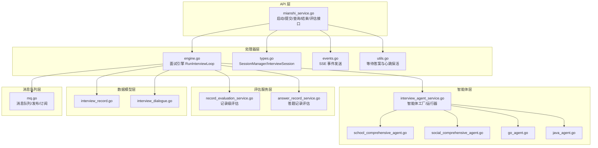
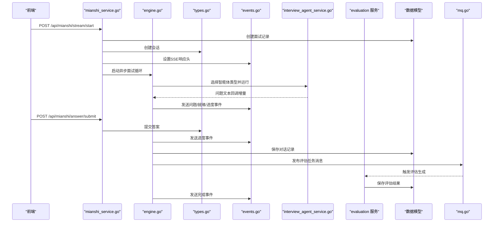
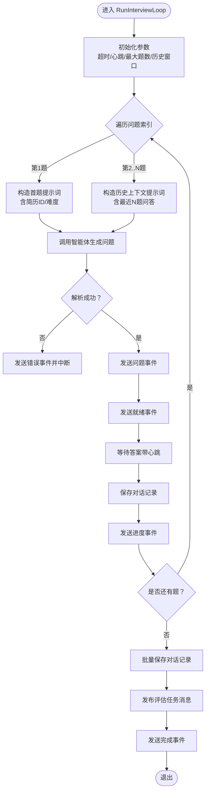
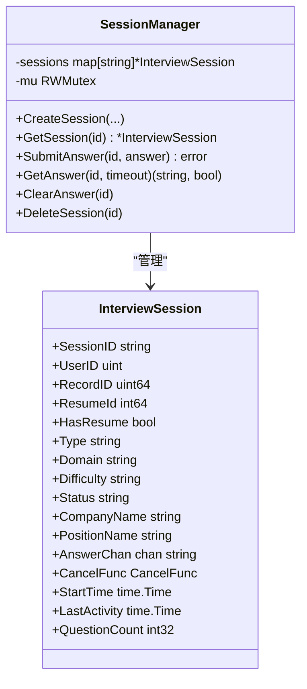
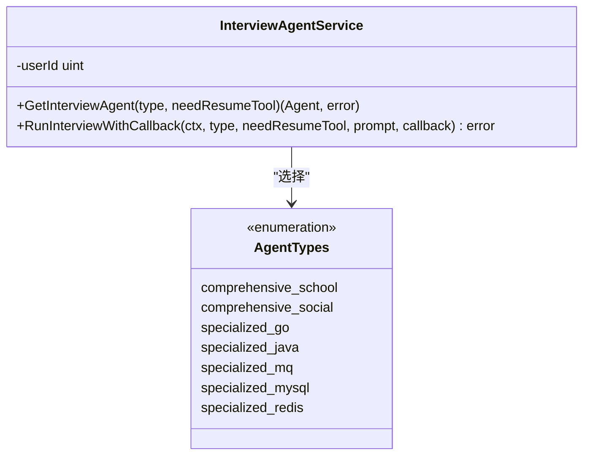
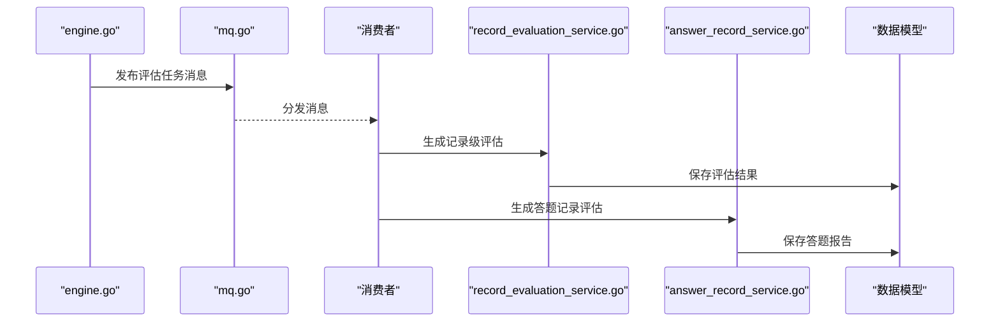
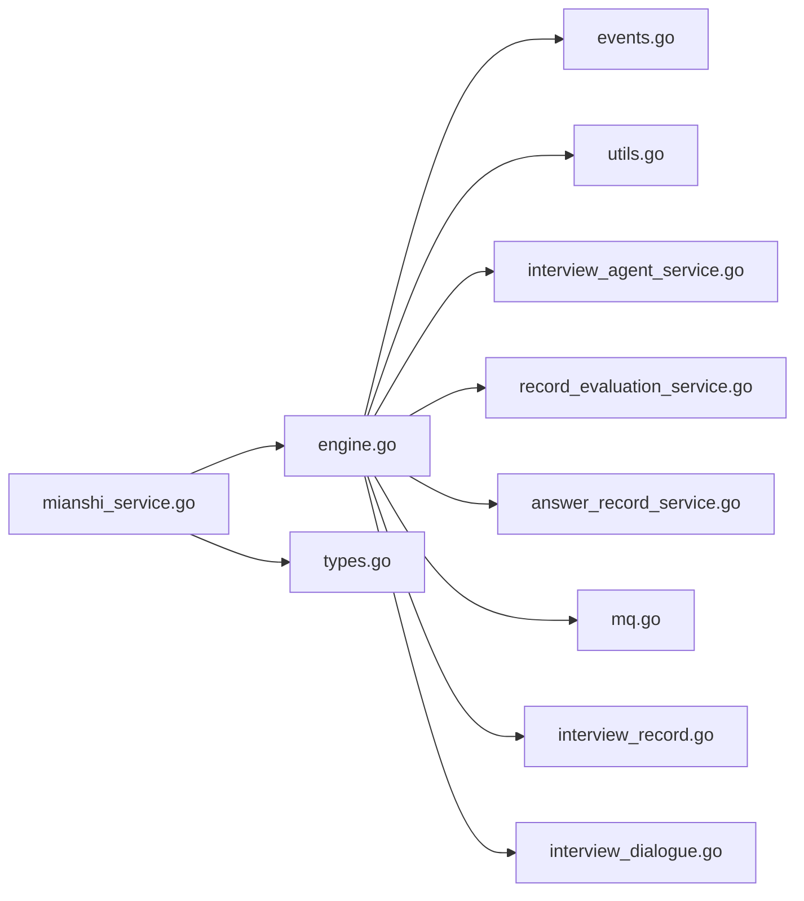

# 面试系统核心

<cite>
**本文引用的文件**
- [backend/api/handler/interview/mianshi/engine.go](file://backend/api/handler/interview/mianshi/engine.go)
- [backend/api/handler/interview/mianshi/types.go](file://backend/api/handler/interview/mianshi/types.go)
- [backend/api/handler/interview/mianshi/events.go](file://backend/api/handler/interview/mianshi/events.go)
- [backend/api/handler/interview/mianshi/utils.go](file://backend/api/handler/interview/mianshi/utils.go)
- [backend/api/handler/interview/mianshi_service.go](file://backend/api/handler/interview/mianshi_service.go)
- [backend/chatApp/agent_service/interview/interview_agent_service.go](file://backend/chatApp/agent_service/interview/interview_agent_service.go)
- [backend/chatApp/agent/interview/comprehensive/school_comprehensive_agent.go](file://backend/chatApp/agent/interview/comprehensive/school_comprehensive_agent.go)
- [backend/chatApp/agent/interview/comprehensive/social_comprehensive_agent.go](file://backend/chatApp/agent/interview/comprehensive/social_comprehensive_agent.go)
- [backend/chatApp/agent/interview/specialized/go_agent.go](file://backend/chatApp/agent/interview/specialized/go_agent.go)
- [backend/chatApp/agent/interview/specialized/java_agent.go](file://backend/chatApp/agent/interview/specialized/java_agent.go)
- [backend/chatApp/agent_service/evaluation/record_evaluation_service.go](file://backend/chatApp/agent_service/evaluation/record_evaluation_service.go)
- [backend/chatApp/agent_service/evaluation/answer_record_service.go](file://backend/chatApp/agent_service/evaluation/answer_record_service.go)
- [backend/internal/model/interview_dialogue.go](file://backend/internal/model/interview_dialogue.go)
- [backend/internal/model/interview_record.go](file://backend/internal/model/interview_record.go)
- [backend/internal/mq/mq.go](file://backend/internal/mq/mq.go)
</cite>

## 目录
1. [简介](#简介)
2. [项目结构](#项目结构)
3. [核心组件](#核心组件)
4. [架构总览](#架构总览)
5. [组件详解](#组件详解)
6. [依赖关系分析](#依赖关系分析)
7. [性能与扩展性](#性能与扩展性)
8. [故障排查与稳定性](#故障排查与稳定性)
9. [结论](#结论)

## 简介
本文件面向面试系统的核心功能，围绕“综合面试（校招/社招）”与“专项面试（Go/Java/MySQL/Redis/MQ）”两大场景，系统化阐述面试引擎工作原理、会话管理机制、实时SSE流处理、面试流程控制、问题生成算法、答案评估机制、面试记录管理与结果分析，并给出扩展性设计、性能优化策略与用户体验优化方案，以及监控、异常处理与系统稳定性保障措施。

## 项目结构
后端采用分层与模块化组织：
- API 层：对外暴露面试启动、答案提交、会话查询、结束面试、评估查询等接口，负责请求绑定、鉴权与SSE响应初始化。
- 处理器层：面试引擎与会话管理、SSE事件发送、等待答案与心跳保活。
- 智能体层：综合/专项面试智能体工厂与运行器，统一通过 InterviewAgentService 管理。
- 评估服务层：记录级评估与答题记录评估，产出维度化评分与反馈。
- 数据模型层：面试记录、对话记录、评估报告等持久化模型与DAO。
- 消息队列层：内嵌内存队列与发布订阅，支撑异步评估任务触发。

图表来源
- [backend/api/handler/interview/mianshi_service.go](file://backend/api/handler/interview/mianshi_service.go#L25-L117)
- [backend/api/handler/interview/mianshi/engine.go](file://backend/api/handler/interview/mianshi/engine.go#L39-L230)
- [backend/api/handler/interview/mianshi/types.go](file://backend/api/handler/interview/mianshi/types.go#L9-L165)
- [backend/api/handler/interview/mianshi/events.go](file://backend/api/handler/interview/mianshi/events.go#L11-L72)
- [backend/api/handler/interview/mianshi/utils.go](file://backend/api/handler/interview/mianshi/utils.go#L11-L74)
- [backend/chatApp/agent_service/interview/interview_agent_service.go](file://backend/chatApp/agent_service/interview/interview_agent_service.go#L30-L155)
- [backend/chatApp/agent/interview/comprehensive/school_comprehensive_agent.go](file://backend/chatApp/agent/interview/comprehensive/school_comprehensive_agent.go#L14-L48)
- [backend/chatApp/agent/interview/comprehensive/social_comprehensive_agent.go](file://backend/chatApp/agent/interview/comprehensive/social_comprehensive_agent.go#L14-L48)
- [backend/chatApp/agent/interview/specialized/go_agent.go](file://backend/chatApp/agent/interview/specialized/go_agent.go#L14-L48)
- [backend/chatApp/agent/interview/specialized/java_agent.go](file://backend/chatApp/agent/interview/specialized/java_agent.go#L14-L48)
- [backend/chatApp/agent_service/evaluation/record_evaluation_service.go](file://backend/chatApp/agent_service/evaluation/record_evaluation_service.go#L17-L108)
- [backend/chatApp/agent_service/evaluation/answer_record_service.go](file://backend/chatApp/agent_service/evaluation/answer_record_service.go#L16-L100)
- [backend/internal/model/interview_record.go](file://backend/internal/model/interview_record.go#L9-L128)
- [backend/internal/model/interview_dialogue.go](file://backend/internal/model/interview_dialogue.go#L9-L46)
- [backend/internal/mq/mq.go](file://backend/internal/mq/mq.go#L12-L209)

章节来源
- [backend/api/handler/interview/mianshi_service.go](file://backend/api/handler/interview/mianshi_service.go#L25-L117)
- [backend/api/handler/interview/mianshi/engine.go](file://backend/api/handler/interview/mianshi/engine.go#L39-L230)
- [backend/api/handler/interview/mianshi/types.go](file://backend/api/handler/interview/mianshi/types.go#L9-L165)
- [backend/api/handler/interview/mianshi/events.go](file://backend/api/handler/interview/mianshi/events.go#L11-L72)
- [backend/api/handler/interview/mianshi/utils.go](file://backend/api/handler/interview/mianshi/utils.go#L11-L74)
- [backend/chatApp/agent_service/interview/interview_agent_service.go](file://backend/chatApp/agent_service/interview/interview_agent_service.go#L30-L155)
- [backend/chatApp/agent_service/evaluation/record_evaluation_service.go](file://backend/chatApp/agent_service/evaluation/record_evaluation_service.go#L17-L108)
- [backend/chatApp/agent_service/evaluation/answer_record_service.go](file://backend/chatApp/agent_service/evaluation/answer_record_service.go#L16-L100)
- [backend/internal/model/interview_record.go](file://backend/internal/model/interview_record.go#L9-L128)
- [backend/internal/model/interview_dialogue.go](file://backend/internal/model/interview_dialogue.go#L9-L46)
- [backend/internal/mq/mq.go](file://backend/internal/mq/mq.go#L12-L209)

## 核心组件
- 面试引擎（InterviewEngine）
  - 负责按序生成问题、等待用户回答、维护历史上下文、保存对话记录、触发评估任务。
- 会话管理（SessionManager/InterviewSession）
  - 维护会话生命周期、并发安全、答案通道、活动时间与状态。
- SSE 事件（SendSSEEvent/Ready/Error/Complete/Heartbeat）
  - 实时推送问题、就绪、进度、完成与心跳事件。
- 智能体服务（InterviewAgentService）
  - 统一创建与运行不同类型的面试智能体（综合/专项），支持回调增量输出。
- 评估服务（记录级/答题记录级）
  - 基于工具链与大模型生成维度化评估与详细反馈。
- 数据模型（InterviewRecord/InterviewDialogue）
  - 面试记录与对话明细持久化，支持查询与更新。
- 消息队列（InMemoryQueue/Publish/Subscribe）
  - 异步触发评估任务，解耦面试流程与评估生成。

章节来源
- [backend/api/handler/interview/mianshi/engine.go](file://backend/api/handler/interview/mianshi/engine.go#L23-L291)
- [backend/api/handler/interview/mianshi/types.go](file://backend/api/handler/interview/mianshi/types.go#L9-L165)
- [backend/api/handler/interview/mianshi/events.go](file://backend/api/handler/interview/mianshi/events.go#L11-L72)
- [backend/api/handler/interview/mianshi/utils.go](file://backend/api/handler/interview/mianshi/utils.go#L11-L74)
- [backend/chatApp/agent_service/interview/interview_agent_service.go](file://backend/chatApp/agent_service/interview/interview_agent_service.go#L30-L155)
- [backend/chatApp/agent_service/evaluation/record_evaluation_service.go](file://backend/chatApp/agent_service/evaluation/record_evaluation_service.go#L17-L108)
- [backend/chatApp/agent_service/evaluation/answer_record_service.go](file://backend/chatApp/agent_service/evaluation/answer_record_service.go#L16-L100)
- [backend/internal/model/interview_record.go](file://backend/internal/model/interview_record.go#L9-L128)
- [backend/internal/model/interview_dialogue.go](file://backend/internal/model/interview_dialogue.go#L9-L46)
- [backend/internal/mq/mq.go](file://backend/internal/mq/mq.go#L12-L209)

## 架构总览
面试系统以“SSE 实时流 + 智能体生成 + 会话管理 + 评估服务 + 数据持久化 + 消息队列”的方式组织，形成“前端发起 -> 后端建立会话 -> 逐题生成 -> 答案提交 -> 保存记录 -> 触发评估 -> 返回结果”的闭环。

图表来源
- [backend/api/handler/interview/mianshi_service.go](file://backend/api/handler/interview/mianshi_service.go#L25-L117)
- [backend/api/handler/interview/mianshi/engine.go](file://backend/api/handler/interview/mianshi/engine.go#L39-L230)
- [backend/api/handler/interview/mianshi/types.go](file://backend/api/handler/interview/mianshi/types.go#L52-L165)
- [backend/api/handler/interview/mianshi/events.go](file://backend/api/handler/interview/mianshi/events.go#L11-L72)
- [backend/chatApp/agent_service/interview/interview_agent_service.go](file://backend/chatApp/agent_service/interview/interview_agent_service.go#L75-L155)
- [backend/chatApp/agent_service/evaluation/record_evaluation_service.go](file://backend/chatApp/agent_service/evaluation/record_evaluation_service.go#L17-L108)
- [backend/chatApp/agent_service/evaluation/answer_record_service.go](file://backend/chatApp/agent_service/evaluation/answer_record_service.go#L16-L100)
- [backend/internal/model/interview_record.go](file://backend/internal/model/interview_record.go#L33-L128)
- [backend/internal/model/interview_dialogue.go](file://backend/internal/model/interview_dialogue.go#L29-L46)
- [backend/internal/mq/mq.go](file://backend/internal/mq/mq.go#L155-L209)

## 组件详解

### 面试引擎（InterviewEngine）
- 逐题生成与上下文维护
  - 首题仅携带简历ID与难度；后续题带上最近N题的历史上下文，保证问题递进与去重。
- 答案等待与心跳保活
  - 使用定时器与ticker组合，周期性发送心跳事件，避免连接空闲断开。
- 事件驱动的SSE推送
  - 问题、就绪、进度、完成、错误事件均通过标准SSE格式推送。
- 评估任务触发
  - 面试结束后发布两条消息：记录级评估与主题级评估，供消费者异步生成并落库。

图表来源
- [backend/api/handler/interview/mianshi/engine.go](file://backend/api/handler/interview/mianshi/engine.go#L39-L230)
- [backend/api/handler/interview/mianshi/events.go](file://backend/api/handler/interview/mianshi/events.go#L11-L72)
- [backend/api/handler/interview/mianshi/utils.go](file://backend/api/handler/interview/mianshi/utils.go#L11-L74)
- [backend/internal/mq/mq.go](file://backend/internal/mq/mq.go#L155-L209)

章节来源
- [backend/api/handler/interview/mianshi/engine.go](file://backend/api/handler/interview/mianshi/engine.go#L39-L230)
- [backend/api/handler/interview/mianshi/utils.go](file://backend/api/handler/interview/mianshi/utils.go#L11-L74)
- [backend/api/handler/interview/mianshi/events.go](file://backend/api/handler/interview/mianshi/events.go#L11-L72)
- [backend/internal/mq/mq.go](file://backend/internal/mq/mq.go#L155-L209)

### 会话管理（SessionManager/InterviewSession）
- 并发安全
  - 读写锁保护会话表，支持高并发创建、提交、获取与清理。
- 生命周期与状态
  - 记录创建时间、最后活动时间、状态（active/paused/completed/failed）、问题计数等。
- 答案通道
  - 单向通道承载答案，避免阻塞；支持清空与超时等待。
- 全局单例
  - 提供全局会话管理器，贯穿面试全链路。

图表来源
- [backend/api/handler/interview/mianshi/types.go](file://backend/api/handler/interview/mianshi/types.go#L9-L165)

章节来源
- [backend/api/handler/interview/mianshi/types.go](file://backend/api/handler/interview/mianshi/types.go#L9-L165)

### 实时SSE流处理（SSE 事件与心跳）
- 事件格式
  - 标准 event/data 格式，支持 message、error、complete、ready_for_answer、heartbeat 等类型。
- 心跳保活
  - 定时发送 heartbeat 事件，防止代理/浏览器断开连接。
- 响应头配置
  - 设置 Content-Type、Cache-Control、Access-Control、Transfer-Encoding 等，适配跨域与长连接。

章节来源
- [backend/api/handler/interview/mianshi/events.go](file://backend/api/handler/interview/mianshi/events.go#L11-L72)
- [backend/api/handler/interview/mianshi/utils.go](file://backend/api/handler/interview/mianshi/utils.go#L58-L74)

### 智能体服务与面试类型选择
- 类型映射
  - 综合面试：校招/社招两类；专项面试：Go/Java/MQ/MySQL/Redis。
- 智能体工厂
  - 依据类型创建对应智能体，支持是否启用简历工具。
- 运行器
  - 统一 Runner 驱动，支持回调增量输出，便于SSE流式传输。

图表来源
- [backend/chatApp/agent_service/interview/interview_agent_service.go](file://backend/chatApp/agent_service/interview/interview_agent_service.go#L14-L73)
- [backend/chatApp/agent/interview/comprehensive/school_comprehensive_agent.go](file://backend/chatApp/agent/interview/comprehensive/school_comprehensive_agent.go#L14-L48)
- [backend/chatApp/agent/interview/comprehensive/social_comprehensive_agent.go](file://backend/chatApp/agent/interview/comprehensive/social_comprehensive_agent.go#L14-L48)
- [backend/chatApp/agent/interview/specialized/go_agent.go](file://backend/chatApp/agent/interview/specialized/go_agent.go#L14-L48)
- [backend/chatApp/agent/interview/specialized/java_agent.go](file://backend/chatApp/agent/interview/specialized/java_agent.go#L14-L48)

章节来源
- [backend/chatApp/agent_service/interview/interview_agent_service.go](file://backend/chatApp/agent_service/interview/interview_agent_service.go#L30-L155)
- [backend/chatApp/agent/interview/comprehensive/school_comprehensive_agent.go](file://backend/chatApp/agent/interview/comprehensive/school_comprehensive_agent.go#L14-L48)
- [backend/chatApp/agent/interview/comprehensive/social_comprehensive_agent.go](file://backend/chatApp/agent/interview/comprehensive/social_comprehensive_agent.go#L14-L48)
- [backend/chatApp/agent/interview/specialized/go_agent.go](file://backend/chatApp/agent/interview/specialized/go_agent.go#L14-L48)
- [backend/chatApp/agent/interview/specialized/java_agent.go](file://backend/chatApp/agent/interview/specialized/java_agent.go#L14-L48)

### 评估机制与结果分析
- 记录级评估（GetMianshiEvaluation）
  - 生成总体评分、维度评分、优势/不足、改进建议、知识点总结等，持久化至评估表。
- 答题记录评估（GetMianshiAnswerRecord）
  - 逐题生成详细反馈，包含问题、回答、评分、思考过程、参考答案等，持久化答题报告。
- 评估触发
  - 面试完成后由引擎发布评估消息，消费者异步生成并入库。

图表来源
- [backend/api/handler/interview/mianshi/engine.go](file://backend/api/handler/interview/mianshi/engine.go#L221-L230)
- [backend/internal/mq/mq.go](file://backend/internal/mq/mq.go#L155-L209)
- [backend/chatApp/agent_service/evaluation/record_evaluation_service.go](file://backend/chatApp/agent_service/evaluation/record_evaluation_service.go#L17-L108)
- [backend/chatApp/agent_service/evaluation/answer_record_service.go](file://backend/chatApp/agent_service/evaluation/answer_record_service.go#L16-L100)
- [backend/internal/model/interview_record.go](file://backend/internal/model/interview_record.go#L33-L128)
- [backend/internal/model/interview_dialogue.go](file://backend/internal/model/interview_dialogue.go#L29-L46)

章节来源
- [backend/chatApp/agent_service/evaluation/record_evaluation_service.go](file://backend/chatApp/agent_service/evaluation/record_evaluation_service.go#L17-L108)
- [backend/chatApp/agent_service/evaluation/answer_record_service.go](file://backend/chatApp/agent_service/evaluation/answer_record_service.go#L16-L100)
- [backend/api/handler/interview/mianshi/engine.go](file://backend/api/handler/interview/mianshi/engine.go#L221-L230)
- [backend/internal/mq/mq.go](file://backend/internal/mq/mq.go#L155-L209)

### 面试记录管理与持久化
- 面试记录（InterviewRecord）
  - 记录面试类型、难度、领域、公司/岗位、状态、时长等，支持分页查询与更新。
- 对话记录（InterviewDialogue）
  - 逐条保存问题与回答，按ID升序排列，支持按用户与报告ID查询。
- 评估与答题报告
  - 评估维度、总体评分、答题记录明细等持久化，便于后续分析与展示。

章节来源
- [backend/internal/model/interview_record.go](file://backend/internal/model/interview_record.go#L9-L128)
- [backend/internal/model/interview_dialogue.go](file://backend/internal/model/interview_dialogue.go#L9-L46)

## 依赖关系分析
- 控制流依赖
  - mianshi_service.go 负责入口与SSE初始化，engine.go 负责面试主循环，types.go 提供会话与并发安全，events.go/utils.go 提供SSE与等待逻辑，agent_service 提供智能体工厂与运行器，evaluation 服务负责评估生成，mq.go 负责消息发布，model 层负责持久化。
- 松耦合设计
  - 通过接口与回调（如 runAgentWithIterator）解耦智能体与引擎；通过消息队列解耦面试流程与评估生成。
- 潜在风险
  - 会话状态与答案通道需严格控制并发访问；SSE写入需及时flush，避免阻塞；评估超时与重试策略需完善。

图表来源
- [backend/api/handler/interview/mianshi_service.go](file://backend/api/handler/interview/mianshi_service.go#L25-L117)
- [backend/api/handler/interview/mianshi/engine.go](file://backend/api/handler/interview/mianshi/engine.go#L39-L230)
- [backend/api/handler/interview/mianshi/types.go](file://backend/api/handler/interview/mianshi/types.go#L9-L165)
- [backend/api/handler/interview/mianshi/events.go](file://backend/api/handler/interview/mianshi/events.go#L11-L72)
- [backend/api/handler/interview/mianshi/utils.go](file://backend/api/handler/interview/mianshi/utils.go#L11-L74)
- [backend/chatApp/agent_service/interview/interview_agent_service.go](file://backend/chatApp/agent_service/interview/interview_agent_service.go#L75-L155)
- [backend/chatApp/agent_service/evaluation/record_evaluation_service.go](file://backend/chatApp/agent_service/evaluation/record_evaluation_service.go#L17-L108)
- [backend/chatApp/agent_service/evaluation/answer_record_service.go](file://backend/chatApp/agent_service/evaluation/answer_record_service.go#L16-L100)
- [backend/internal/mq/mq.go](file://backend/internal/mq/mq.go#L155-L209)
- [backend/internal/model/interview_record.go](file://backend/internal/model/interview_record.go#L33-L128)
- [backend/internal/model/interview_dialogue.go](file://backend/internal/model/interview_dialogue.go#L29-L46)

## 性能与扩展性
- 性能优化
  - SSE 写入后立即 flush，减少延迟；心跳间隔与超时参数可调；批量保存对话记录时可考虑分批写入与事务优化。
  - 智能体运行采用 Runner 迭代器，回调增量输出，降低一次性聚合成本。
  - 评估服务设置合理超时（记录级120s，答题记录级300s），避免阻塞主线程。
- 扩展性设计
  - 新增专项面试只需新增智能体与类型映射；评估维度可动态扩展；消息队列可替换为生产级实现（如Redis/ Kafka）。
  - 会话管理器支持全局单例与多实例隔离，便于水平扩展。
- 用户体验
  - 保持稳定的SSE心跳与进度反馈；提供明确的错误事件与重试提示；答案提交后即时确认与进度推进。

[本节为通用指导，无需列出具体文件来源]

## 故障排查与稳定性
- 常见问题定位
  - SSE 写入失败：检查 flusher 支持与网络代理配置；查看事件发送日志。
  - 答案超时：检查心跳事件是否正常推送；确认会话状态未被提前结束。
  - 评估未生成：检查消息队列初始化与订阅是否生效；查看消费者日志。
  - 数据保存失败：检查数据库连接与事务回滚；核对字段约束。
- 异常处理
  - 引擎在问题生成、答案解析、事件发送、保存记录等关键节点均发送错误事件并中断流程。
  - 会话管理器对不存在会话与越权操作返回明确错误。
- 稳定性保障
  - 使用 context 取消机制终止面试循环；会话结束后延迟清理；评估服务失败不阻塞主流程，记录警告日志。

章节来源
- [backend/api/handler/interview/mianshi/engine.go](file://backend/api/handler/interview/mianshi/engine.go#L128-L146)
- [backend/api/handler/interview/mianshi/events.go](file://backend/api/handler/interview/mianshi/events.go#L36-L42)
- [backend/api/handler/interview/mianshi_service.go](file://backend/api/handler/interview/mianshi_service.go#L119-L168)
- [backend/chatApp/agent_service/evaluation/record_evaluation_service.go](file://backend/chatApp/agent_service/evaluation/record_evaluation_service.go#L72-L86)
- [backend/chatApp/agent_service/evaluation/answer_record_service.go](file://backend/chatApp/agent_service/evaluation/answer_record_service.go#L69-L83)

## 结论
面试系统以“SSE 实时流 + 智能体生成 + 会话管理 + 评估服务 + 数据持久化 + 消息队列”为核心架构，实现了从问题生成、答案提交、进度反馈到评估产出的完整闭环。通过清晰的模块划分与松耦合设计，系统具备良好的扩展性与稳定性，能够快速支持更多专项与评估维度，并持续提升用户体验与性能表现。