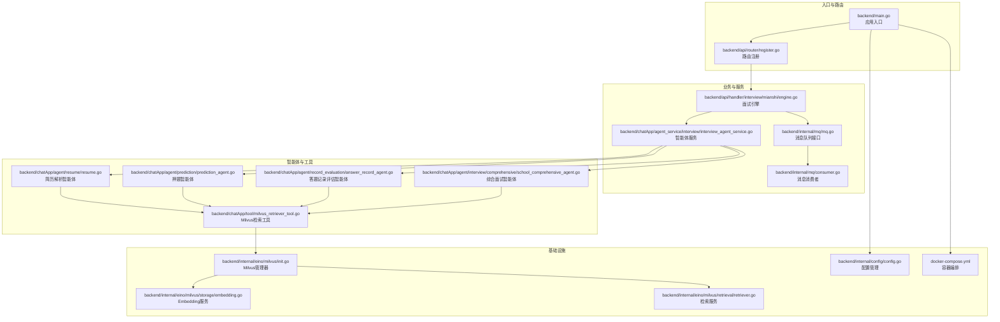
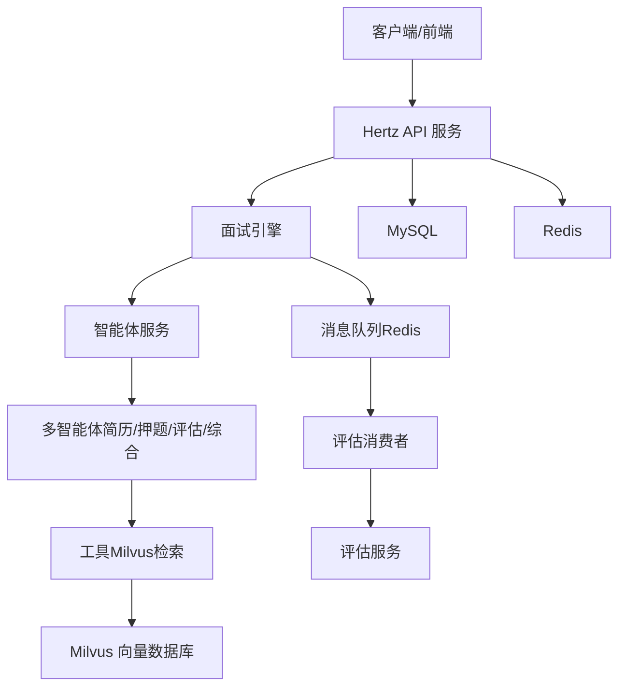
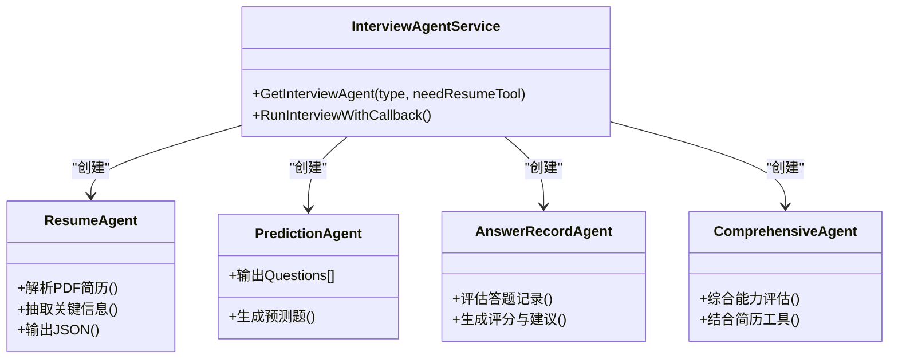
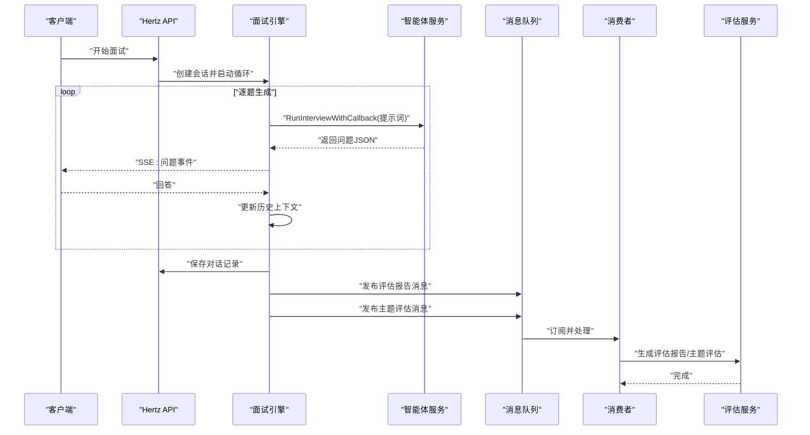
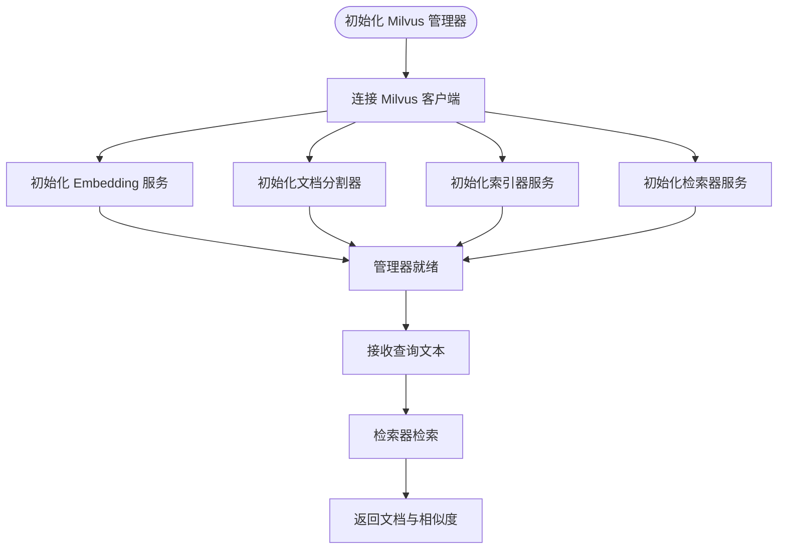
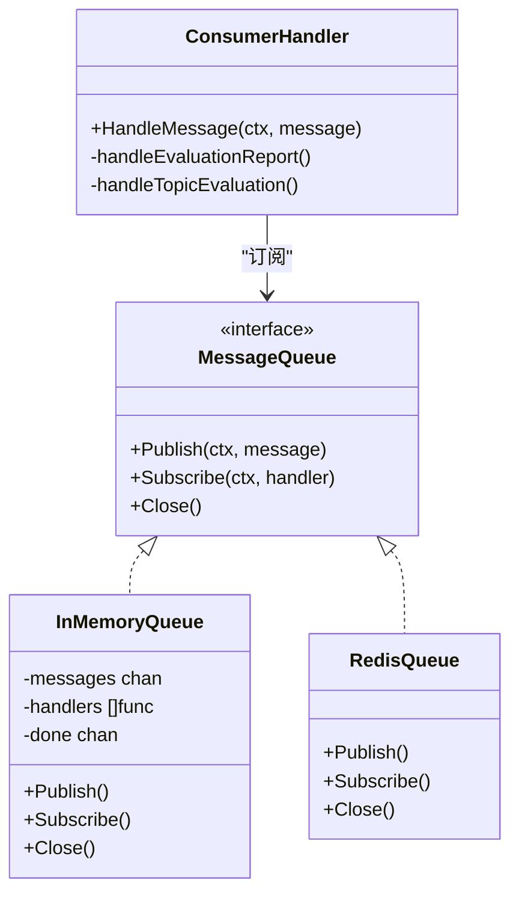
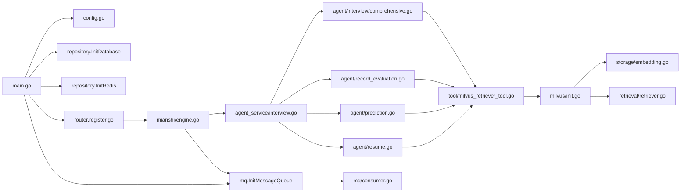

# 系统架构特点

<cite>
**本文档引用的文件**
- [backend/main.go](file://backend/main.go)
- [backend/api/router/register.go](file://backend/api/router/register.go)
- [backend/internal/mq/mq.go](file://backend/internal/mq/mq.go)
- [backend/internal/mq/consumer.go](file://backend/internal/mq/consumer.go)
- [backend/internal/eino/milvus/init.go](file://backend/internal/eino/milvus/init.go)
- [backend/internal/eino/milvus/storage/embedding.go](file://backend/internal/eino/milvus/storage/embedding.go)
- [backend/internal/eino/milvus/retrieval/retriever.go](file://backend/internal/eino/milvus/retrieval/retriever.go)
- [backend/chatApp/tool/milvus_retriever_tool.go](file://backend/chatApp/tool/milvus_retriever_tool.go)
- [backend/chatApp/agent/resume/resume.go](file://backend/chatApp/agent/resume/resume.go)
- [backend/chatApp/agent/prediction/prediction_agent.go](file://backend/chatApp/agent/prediction/prediction_agent.go)
- [backend/chatApp/agent/record_evaluation/answer_record_agent.go](file://backend/chatApp/agent/record_evaluation/answer_record_agent.go)
- [backend/chatApp/agent/interview/comprehensive/school_comprehensive_agent.go](file://backend/chatApp/agent/interview/comprehensive/school_comprehensive_agent.go)
- [backend/chatApp/agent_service/interview/interview_agent_service.go](file://backend/chatApp/agent_service/interview/interview_agent_service.go)
- [backend/api/handler/interview/mianshi/engine.go](file://backend/api/handler/interview/mianshi/engine.go)
- [backend/internal/config/config.go](file://backend/internal/config/config.go)
- [docker-compose.yml](file://docker-compose.yml)
</cite>

## 目录
1. [简介](#简介)
2. [项目结构](#项目结构)
3. [核心组件](#核心组件)
4. [架构总览](#架构总览)
5. [详细组件分析](#详细组件分析)
6. [依赖关系分析](#依赖关系分析)
7. [性能考量](#性能考量)
8. [故障排查指南](#故障排查指南)
9. [结论](#结论)

## 简介
本文件面向面试吧AI智能面试平台，系统性梳理其架构设计与实现要点，重点覆盖：
- 分层架构与微服务边界
- 多智能体架构（简历分析、面试问题生成、答案评估、预测推荐）的职责与协作
- 向量检索系统（基于Milvus）与消息队列系统（基于Redis）的架构与性能
- 可扩展性、可维护性与可部署性的设计取舍

## 项目结构
后端采用“入口层-路由层-业务层-服务层-基础设施层”的分层组织，配合独立的聊天应用模块（chatApp）承载多智能体与工具链，形成清晰的职责边界。

**图表来源**
- [backend/main.go](file://backend/main.go#L29-L173)
- [backend/api/router/register.go](file://backend/api/router/register.go#L11-L15)
- [backend/api/handler/interview/mianshi/engine.go](file://backend/api/handler/interview/mianshi/engine.go#L23-L290)
- [backend/chatApp/agent_service/interview/interview_agent_service.go](file://backend/chatApp/agent_service/interview/interview_agent_service.go#L30-L154)
- [backend/chatApp/tool/milvus_retriever_tool.go](file://backend/chatApp/tool/milvus_retriever_tool.go#L48-L101)
- [backend/internal/eino/milvus/init.go](file://backend/internal/eino/milvus/init.go#L42-L142)
- [backend/internal/eino/milvus/storage/embedding.go](file://backend/internal/eino/milvus/storage/embedding.go#L20-L74)
- [backend/internal/eino/milvus/retrieval/retriever.go](file://backend/internal/eino/milvus/retrieval/retriever.go#L22-L89)
- [backend/internal/mq/mq.go](file://backend/internal/mq/mq.go#L40-L153)
- [backend/internal/mq/consumer.go](file://backend/internal/mq/consumer.go#L89-L100)
- [backend/internal/config/config.go](file://backend/internal/config/config.go#L136-L268)
- [docker-compose.yml](file://docker-compose.yml#L1-L226)

**章节来源**
- [backend/main.go](file://backend/main.go#L29-L173)
- [backend/api/router/register.go](file://backend/api/router/register.go#L11-L15)
- [docker-compose.yml](file://docker-compose.yml#L1-L226)

## 核心组件
- 应用入口与生命周期管理：负责加载配置、初始化数据库/Redis、启动Hertz服务、启动消息队列消费者，并优雅关闭。
- 路由与中间件：统一恢复、CORS与JWT鉴权中间件，注册自动生成的路由。
- 面试引擎：驱动智能体生成问题、等待用户回答、持久化对话、发布评估消息。
- 智能体服务：按面试类型（综合/专项）与领域（Go/Java/MQ/MySQL/Redis）选择具体智能体。
- 多智能体：简历解析、押题、答题记录评估、综合面试。
- 向量检索：Milvus管理器封装Embedding、文档分割、索引与检索服务。
- 消息队列：抽象消息队列接口，Redis实现，支持发布/订阅与消费者处理评估任务。
- 配置管理：集中管理数据库、Redis、Milvus、Embedding、Hertz等配置项。

**章节来源**
- [backend/main.go](file://backend/main.go#L29-L173)
- [backend/api/router/register.go](file://backend/api/router/register.go#L11-L15)
- [backend/api/handler/interview/mianshi/engine.go](file://backend/api/handler/interview/mianshi/engine.go#L23-L290)
- [backend/chatApp/agent_service/interview/interview_agent_service.go](file://backend/chatApp/agent_service/interview/interview_agent_service.go#L30-L154)
- [backend/internal/eino/milvus/init.go](file://backend/internal/eino/milvus/init.go#L22-L142)
- [backend/internal/mq/mq.go](file://backend/internal/mq/mq.go#L40-L209)
- [backend/internal/config/config.go](file://backend/internal/config/config.go#L13-L31)

## 架构总览
系统采用“入口-路由-业务-智能体-基础设施”的分层架构，结合事件驱动的消息队列实现异步评估任务，支撑简历分析、面试问题生成、答案评估与预测推荐的多智能体协同。

**图表来源**
- [backend/main.go](file://backend/main.go#L50-L100)
- [backend/api/handler/interview/mianshi/engine.go](file://backend/api/handler/interview/mianshi/engine.go#L221-L229)
- [backend/internal/mq/consumer.go](file://backend/internal/mq/consumer.go#L31-L87)
- [backend/chatApp/tool/milvus_retriever_tool.go](file://backend/chatApp/tool/milvus_retriever_tool.go#L48-L101)

## 详细组件分析

### 多智能体架构设计
- 简历分析智能体：解析PDF简历，抽取基本信息、教育背景、工作经历、技术栈、项目经验、技能特长、证书资格等，输出标准化JSON，指导后续面试难度与关注点。
- 押题智能体：基于简历与岗位要求生成5道预测面试题，包含重点考察方向、思考路径、参考答案与可能追问。
- 答题记录评估智能体：对每轮问答记录进行评估，结合面试知识点与参考答案给出评分与改进建议。
- 综合面试智能体：面向校招/社招场景，结合简历工具与领域知识，进行综合性能力评估。

**图表来源**
- [backend/chatApp/agent/resume/resume.go](file://backend/chatApp/agent/resume/resume.go#L14-L108)
- [backend/chatApp/agent/prediction/prediction_agent.go](file://backend/chatApp/agent/prediction/prediction_agent.go#L25-L65)
- [backend/chatApp/agent/record_evaluation/answer_record_agent.go](file://backend/chatApp/agent/record_evaluation/answer_record_agent.go#L14-L40)
- [backend/chatApp/agent/interview/comprehensive/school_comprehensive_agent.go](file://backend/chatApp/agent/interview/comprehensive/school_comprehensive_agent.go#L14-L47)
- [backend/chatApp/agent_service/interview/interview_agent_service.go](file://backend/chatApp/agent_service/interview/interview_agent_service.go#L42-L101)

**章节来源**
- [backend/chatApp/agent/resume/resume.go](file://backend/chatApp/agent/resume/resume.go#L14-L108)
- [backend/chatApp/agent/prediction/prediction_agent.go](file://backend/chatApp/agent/prediction/prediction_agent.go#L25-L65)
- [backend/chatApp/agent/record_evaluation/answer_record_agent.go](file://backend/chatApp/agent/record_evaluation/answer_record_agent.go#L14-L40)
- [backend/chatApp/agent/interview/comprehensive/school_comprehensive_agent.go](file://backend/chatApp/agent/interview/comprehensive/school_comprehensive_agent.go#L14-L47)
- [backend/chatApp/agent_service/interview/interview_agent_service.go](file://backend/chatApp/agent_service/interview/interview_agent_service.go#L42-L101)

### 面试引擎与事件驱动流程
- 面试引擎按序生成问题，每道题生成后等待用户回答，随后将问答历史纳入下一轮提示词，逐步深化难度。
- 完成全部问题后，持久化对话记录，并发布两类评估消息：整体评估报告与主题评估。
- 消息队列消费者异步触发评估服务，避免阻塞主线程。

**图表来源**
- [backend/api/handler/interview/mianshi/engine.go](file://backend/api/handler/interview/mianshi/engine.go#L39-L230)
- [backend/internal/mq/mq.go](file://backend/internal/mq/mq.go#L155-L208)
- [backend/internal/mq/consumer.go](file://backend/internal/mq/consumer.go#L19-L87)
- [backend/chatApp/agent_service/interview/interview_agent_service.go](file://backend/chatApp/agent_service/interview/interview_agent_service.go#L75-L101)

**章节来源**
- [backend/api/handler/interview/mianshi/engine.go](file://backend/api/handler/interview/mianshi/engine.go#L39-L230)
- [backend/internal/mq/mq.go](file://backend/internal/mq/mq.go#L155-L208)
- [backend/internal/mq/consumer.go](file://backend/internal/mq/consumer.go#L19-L87)
- [backend/chatApp/agent_service/interview/interview_agent_service.go](file://backend/chatApp/agent_service/interview/interview_agent_service.go#L75-L101)

### 向量检索系统（基于Milvus）
- 管理器封装：初始化Milvus客户端、Embedding服务、文档分割器、索引器与检索器，提供全局单例与健康检查。
- Embedding服务：支持Ark平台的多种认证方式与超时/重试配置，批量生成向量。
- 检索服务：支持默认检索与带过滤表达式的检索，自动设置FloatVector转换器与AUTOINDEX搜索参数。
- 工具集成：Milvus检索工具将查询文本转为文档列表，供智能体在面试过程中调用。

**图表来源**
- [backend/internal/eino/milvus/init.go](file://backend/internal/eino/milvus/init.go#L42-L142)
- [backend/internal/eino/milvus/storage/embedding.go](file://backend/internal/eino/milvus/storage/embedding.go#L20-L74)
- [backend/internal/eino/milvus/retrieval/retriever.go](file://backend/internal/eino/milvus/retrieval/retriever.go#L22-L89)
- [backend/chatApp/tool/milvus_retriever_tool.go](file://backend/chatApp/tool/milvus_retriever_tool.go#L48-L101)

**章节来源**
- [backend/internal/eino/milvus/init.go](file://backend/internal/eino/milvus/init.go#L42-L142)
- [backend/internal/eino/milvus/storage/embedding.go](file://backend/internal/eino/milvus/storage/embedding.go#L20-L74)
- [backend/internal/eino/milvus/retrieval/retriever.go](file://backend/internal/eino/milvus/retrieval/retriever.go#L91-L130)
- [backend/chatApp/tool/milvus_retriever_tool.go](file://backend/chatApp/tool/milvus_retriever_tool.go#L48-L101)

### 消息队列系统（基于Redis）
- 接口抽象：统一的MessageQueue接口，支持发布/订阅与关闭。
- 内存实现：开发/测试可用的InMemoryQueue，便于本地调试。
- 全局实例：InitMessageQueue/GetMessageQueue保证全局一致性。
- 消费者：StartConsumer订阅消息，按类型分发至评估服务。

**图表来源**
- [backend/internal/mq/mq.go](file://backend/internal/mq/mq.go#L40-L153)
- [backend/internal/mq/consumer.go](file://backend/internal/mq/consumer.go#L10-L87)

**章节来源**
- [backend/internal/mq/mq.go](file://backend/internal/mq/mq.go#L40-L209)
- [backend/internal/mq/consumer.go](file://backend/internal/mq/consumer.go#L89-L100)

## 依赖关系分析
- 入口层依赖配置与基础设施初始化，再注册路由并启动服务。
- 路由层依赖业务处理器（面试引擎）。
- 业务层依赖智能体服务与消息队列。
- 智能体层依赖工具链（Milvus检索）。
- 工具链依赖Milvus管理器与Embedding/检索服务。
- 消息队列依赖Redis实现，消费者依赖评估服务。

**图表来源**
- [backend/main.go](file://backend/main.go#L40-L100)
- [backend/internal/config/config.go](file://backend/internal/config/config.go#L136-L268)
- [backend/api/router/register.go](file://backend/api/router/register.go#L11-L15)
- [backend/api/handler/interview/mianshi/engine.go](file://backend/api/handler/interview/mianshi/engine.go#L23-L290)
- [backend/chatApp/agent_service/interview/interview_agent_service.go](file://backend/chatApp/agent_service/interview/interview_agent_service.go#L30-L154)
- [backend/chatApp/tool/milvus_retriever_tool.go](file://backend/chatApp/tool/milvus_retriever_tool.go#L48-L101)
- [backend/internal/eino/milvus/init.go](file://backend/internal/eino/milvus/init.go#L42-L142)
- [backend/internal/eino/milvus/storage/embedding.go](file://backend/internal/eino/milvus/storage/embedding.go#L20-L74)
- [backend/internal/eino/milvus/retrieval/retriever.go](file://backend/internal/eino/milvus/retrieval/retriever.go#L22-L89)
- [backend/internal/mq/mq.go](file://backend/internal/mq/mq.go#L137-L153)
- [backend/internal/mq/consumer.go](file://backend/internal/mq/consumer.go#L89-L100)

**章节来源**
- [backend/main.go](file://backend/main.go#L40-L100)
- [backend/api/handler/interview/mianshi/engine.go](file://backend/api/handler/interview/mianshi/engine.go#L23-L290)
- [backend/chatApp/agent_service/interview/interview_agent_service.go](file://backend/chatApp/agent_service/interview/interview_agent_service.go#L30-L154)
- [backend/chatApp/tool/milvus_retriever_tool.go](file://backend/chatApp/tool/milvus_retriever_tool.go#L48-L101)
- [backend/internal/eino/milvus/init.go](file://backend/internal/eino/milvus/init.go#L42-L142)
- [backend/internal/mq/mq.go](file://backend/internal/mq/mq.go#L137-L153)

## 性能考量
- 面试引擎：采用SSE流式输出问题，逐题生成与等待，降低单次峰值压力；限制最大问题数与历史上下文长度，平衡性能与效果。
- 消息队列：Redis实现具备高吞吐与低延迟特性；通过全局实例与异步消费，避免阻塞主线程。
- 向量检索：Milvus检索器设置AUTOINDEX搜索参数与FloatVector转换器，减少无效搜索；TopK与阈值控制返回规模。
- 配置化：Embedding超时/重试、Milvus连接/搜索超时、Hertz超时等均通过配置管理，便于在不同环境调优。
- 容器编排：Docker Compose将MySQL、Redis、Etcd等依赖服务解耦，便于弹性扩缩与资源隔离。

**章节来源**
- [backend/api/handler/interview/mianshi/engine.go](file://backend/api/handler/interview/mianshi/engine.go#L39-L230)
- [backend/internal/mq/mq.go](file://backend/internal/mq/mq.go#L137-L153)
- [backend/internal/eino/milvus/retrieval/retriever.go](file://backend/internal/eino/milvus/retrieval/retriever.go#L46-L74)
- [backend/internal/config/config.go](file://backend/internal/config/config.go#L154-L210)
- [docker-compose.yml](file://docker-compose.yml#L1-L226)

## 故障排查指南
- 启动阶段
  - 配置加载失败：检查config.yaml路径与环境变量展开；确认数据库/Redis/Milvus连接参数。
  - 数据库/Redis初始化失败：核对DSN/地址/密码；查看容器健康状态。
  - Milvus未初始化：若启用，需确保Etcd/Milvus服务可用；可通过HealthCheck验证。
- 运行阶段
  - 面试问题生成异常：检查智能体服务与回调处理；确认提示词构造与JSON解析。
  - SSE事件发送失败：检查writer与网络连接；确认客户端SSE支持。
  - 评估消息未触发：检查消息队列初始化与消费者启动；核对消息类型与负载。
- 向量检索
  - 检索无结果：确认Embedding维度与索引配置一致；检查TopK与过滤表达式。
  - 检索报错：查看Milvus日志与连接超时；确认集合存在且已构建索引。
- 部署与运维
  - 容器健康检查失败：查看Compose日志与端口映射；确认环境变量注入正确。

**章节来源**
- [backend/main.go](file://backend/main.go#L38-L100)
- [backend/api/handler/interview/mianshi/engine.go](file://backend/api/handler/interview/mianshi/engine.go#L117-L132)
- [backend/internal/mq/consumer.go](file://backend/internal/mq/consumer.go#L31-L58)
- [backend/chatApp/tool/milvus_retriever_tool.go](file://backend/chatApp/tool/milvus_retriever_tool.go#L48-L101)
- [docker-compose.yml](file://docker-compose.yml#L15-L175)

## 结论
该系统以清晰的分层架构为基础，结合多智能体与事件驱动机制，实现了从简历解析、面试生成、答题评估到预测推荐的闭环。向量检索与消息队列分别在知识检索与异步处理方面提供了高扩展性与高可用性保障。通过配置化与容器化编排，系统具备良好的可维护性与可部署性，适合在多租户与高并发场景下演进。