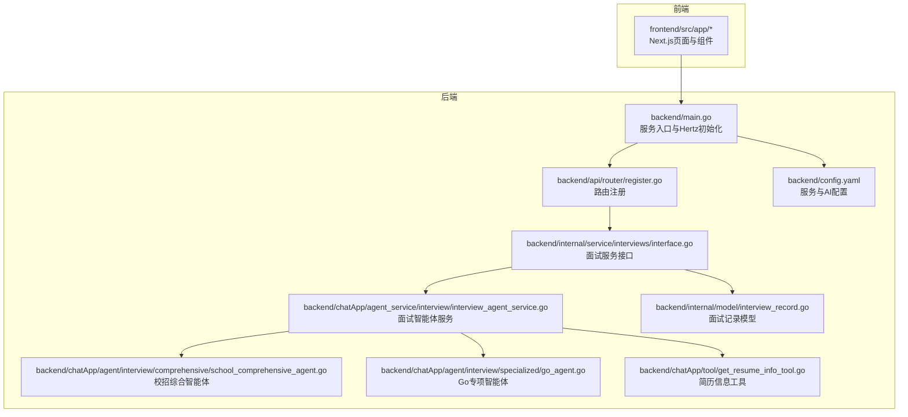
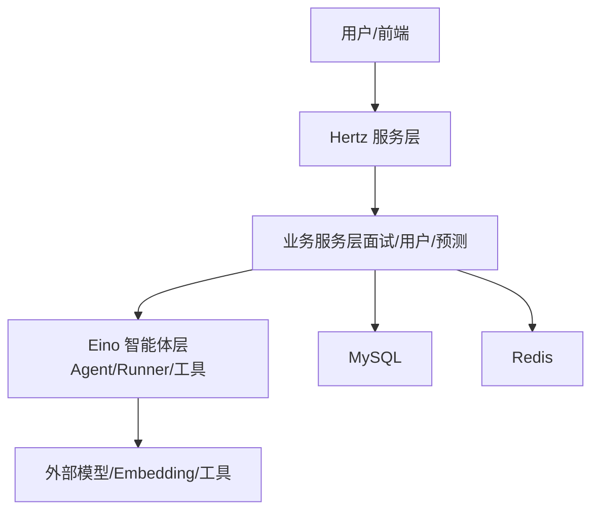
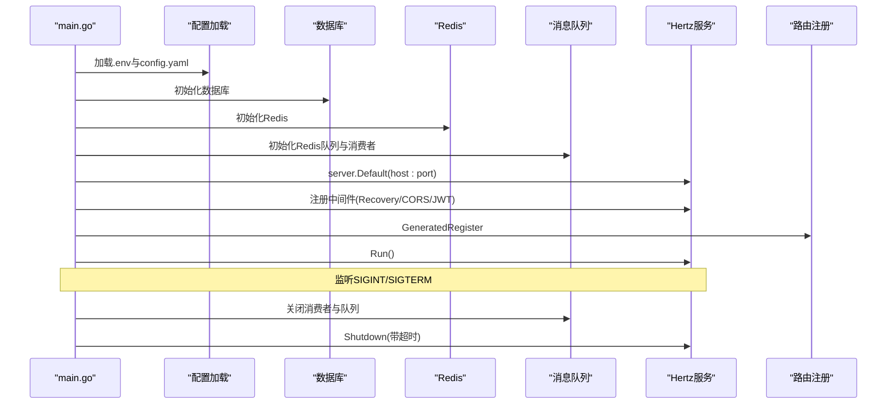
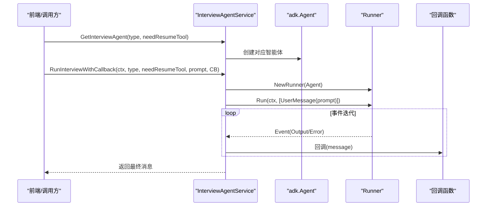
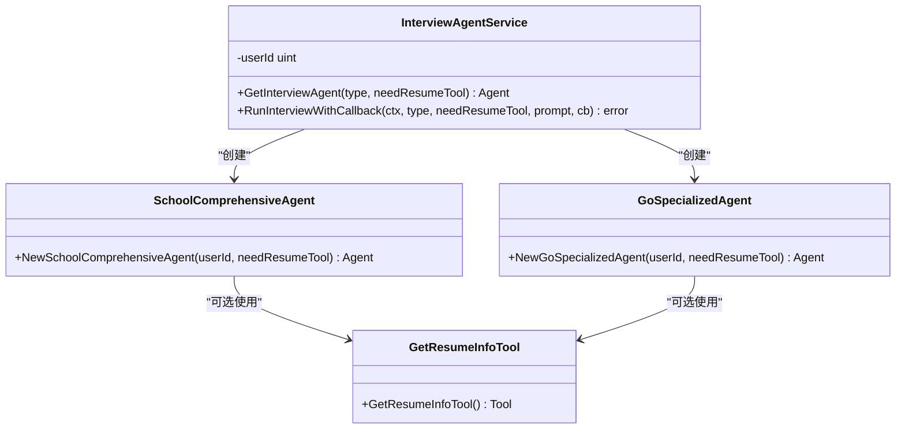
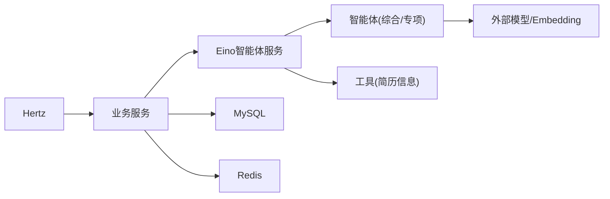

# 项目介绍

<cite>
**本文引用的文件**
- [README.md](file://README.md)
- [backend/main.go](file://backend/main.go)
- [backend/chatApp/main.go](file://backend/chatApp/main.go)
- [doc/需求文档.md](file://doc/需求文档.md)
- [doc/AI功能分析与实现架构设计.md](file://doc/AI功能分析与实现架构设计.md)
- [doc/后端架构设计.md](file://doc/后端架构设计.md)
- [backend/config.yaml](file://backend/config.yaml)
- [backend/chatApp/agent_service/interview/interview_agent_service.go](file://backend/chatApp/agent_service/interview/interview_agent_service.go)
- [backend/chatApp/agent/interview/comprehensive/school_comprehensive_agent.go](file://backend/chatApp/agent/interview/comprehensive/school_comprehensive_agent.go)
- [backend/chatApp/agent/interview/specialized/go_agent.go](file://backend/chatApp/agent/interview/specialized/go_agent.go)
- [backend/chatApp/tool/get_resume_info_tool.go](file://backend/chatApp/tool/get_resume_info_tool.go)
- [backend/internal/service/interviews/interface.go](file://backend/internal/service/interviews/interface.go)
- [backend/internal/model/interview_record.go](file://backend/internal/model/interview_record.go)
- [backend/api/router/register.go](file://backend/api/router/register.go)
</cite>

## 目录
1. [引言](#引言)
2. [项目结构](#项目结构)
3. [核心组件](#核心组件)
4. [架构总览](#架构总览)
5. [详细组件分析](#详细组件分析)
6. [依赖分析](#依赖分析)
7. [性能考量](#性能考量)
8. [故障排查指南](#故障排查指南)
9. [结论](#结论)
10. [附录](#附录)

## 引言
面试吧AI智能面试平台是一个基于 CloudWeGo Hertz 框架与 Eino 大语言模型框架构建的智能面试代理系统。其核心目标是帮助求职者在真实面试前进行高质量、可重复、可追踪的训练，涵盖综合面试与专项技术面试，并通过 AI 驱动的问题生成、答案评估与报告生成，提升面试表现与成功率。平台强调“低成本、高效率、可随时练习”的理念，面向程序员求职者、在职开发者、转行人员与在校生等多类人群，提供从简历分析到面试演练再到评估反馈的闭环体验。

## 项目结构
项目采用前后端分离与多模块协作的组织方式：
- 后端（Go）：以 Hertz 作为 HTTP 服务框架，提供 RESTful API；内部按领域分层（handler、service、repository、model、middleware、config），并集成 Eino 框架实现 AI 能力。
- 前端（Next.js）：提供用户交互界面，覆盖面试流程、简历管理、个人中心等功能。
- 文档与配置：包含需求文档、架构设计、技术实现方案、优化建议等，以及后端配置文件与容器化部署文件。



图表来源
- [backend/main.go](file://backend/main.go#L29-L173)
- [backend/api/router/register.go](file://backend/api/router/register.go#L11-L15)
- [backend/internal/service/interviews/interface.go](file://backend/internal/service/interviews/interface.go#L20-L63)
- [backend/chatApp/agent_service/interview/interview_agent_service.go](file://backend/chatApp/agent_service/interview/interview_agent_service.go#L30-L73)
- [backend/chatApp/agent/interview/comprehensive/school_comprehensive_agent.go](file://backend/chatApp/agent/interview/comprehensive/school_comprehensive_agent.go#L14-L47)
- [backend/chatApp/agent/interview/specialized/go_agent.go](file://backend/chatApp/agent/interview/specialized/go_agent.go#L14-L47)
- [backend/chatApp/tool/get_resume_info_tool.go](file://backend/chatApp/tool/get_resume_info_tool.go#L21-L34)
- [backend/internal/model/interview_record.go](file://backend/internal/model/interview_record.go#L9-L31)
- [backend/config.yaml](file://backend/config.yaml#L1-L129)

章节来源
- [README.md](file://README.md#L35-L137)
- [backend/main.go](file://backend/main.go#L29-L173)
- [backend/config.yaml](file://backend/config.yaml#L1-L129)

## 核心组件
- 服务入口与HTTP框架：Hertz 作为高性能 Web 框架，负责路由注册、中间件装配、服务生命周期管理与优雅关停。
- 面试服务层：提供面试记录管理、对话保存、评估报告查询等接口，支撑面试全流程。
- AI智能体服务：封装多种面试智能体（综合/专项），支持工具注入（如简历信息），统一运行与回调处理。
- 智能体实现：按面试类型（校招/社招、Go/Java/MySQL/Redis/MQ）分别构建专用智能体，具备提示词指令与工具链。
- 工具与数据模型：简历信息工具用于向智能体提供结构化简历数据；面试记录模型承载面试状态、时长、领域等关键属性。
- 配置与中间件：集中配置数据库、Redis、Hertz、AI服务、微信、邮件等；中间件提供CORS、JWT鉴权、错误恢复等横切能力。

章节来源
- [backend/main.go](file://backend/main.go#L101-L128)
- [backend/internal/service/interviews/interface.go](file://backend/internal/service/interviews/interface.go#L20-L63)
- [backend/chatApp/agent_service/interview/interview_agent_service.go](file://backend/chatApp/agent_service/interview/interview_agent_service.go#L30-L73)
- [backend/chatApp/agent/interview/comprehensive/school_comprehensive_agent.go](file://backend/chatApp/agent/interview/comprehensive/school_comprehensive_agent.go#L14-L47)
- [backend/chatApp/agent/interview/specialized/go_agent.go](file://backend/chatApp/agent/interview/specialized/go_agent.go#L14-L47)
- [backend/chatApp/tool/get_resume_info_tool.go](file://backend/chatApp/tool/get_resume_info_tool.go#L21-L34)
- [backend/internal/model/interview_record.go](file://backend/internal/model/interview_record.go#L9-L31)
- [backend/config.yaml](file://backend/config.yaml#L1-L129)

## 架构总览
系统采用“API网关层（Hertz）+ 业务服务层 + AI应用层（Eino）+ 数据层（MySQL/Redis）”的分层架构。Hertz 负责路由与中间件，业务服务层协调数据访问与流程编排，Eino 智能体负责对话、问题生成、答案评估等 AI 能力，数据层提供持久化与缓存。



图表来源
- [doc/后端架构设计.md](file://doc/后端架构设计.md#L24-L45)
- [backend/main.go](file://backend/main.go#L101-L128)
- [backend/chatApp/agent_service/interview/interview_agent_service.go](file://backend/chatApp/agent_service/interview/interview_agent_service.go#L103-L154)

章节来源
- [doc/后端架构设计.md](file://doc/后端架构设计.md#L1-L484)
- [README.md](file://README.md#L9-L34)

## 详细组件分析

### 服务入口与生命周期（Hertz）
- 初始化顺序：加载 .env 与配置、初始化数据库与 Redis、可选 Milvus、初始化消息队列与消费者、注册路由、启动服务、监听中断信号并优雅关停。
- 中间件：统一 Recovery、CORS、JWT 鉴权（对特定路由跳过）。
- 配置来源：支持相对路径查找 config.yaml，环境变量展开。



图表来源
- [backend/main.go](file://backend/main.go#L29-L173)
- [backend/api/router/register.go](file://backend/api/router/register.go#L11-L15)

章节来源
- [backend/main.go](file://backend/main.go#L29-L173)
- [backend/api/router/register.go](file://backend/api/router/register.go#L11-L15)

### 面试服务与数据模型
- 面试服务接口：提供创建、更新、分页查询、评估报告与答题报告查询、保存对话（父子关系）等能力。
- 面试记录模型：包含面试类型、难度、领域、公司/岗位、状态、时长等字段，支持分页与排序查询。

```mermaid
classDiagram
class InterviewManager {
+CreateInterviewRecord(ctx, dto) uint64
+UpdateInterviewRecord(ctx, dto) error
+ListInterviewRecords(ctx, userID, page, pageSize) ([]DTO, int64, error)
+GetInterviewEvaluation(ctx, userID, reportID) interface{}
+GetAnswerReport(ctx, userID, reportID) interface{}
+SaveInterviewDialogueWithParent(ctx, userID, reportID, main, followUps) error
}
class InterviewRecord {
+uint64 ID
+uint UserID
+string Type
+string Difficulty
+string Domain
+string CompanyName
+string PositionName
+string Status
+int64 Duration
+time CreatedAt
+time UpdatedAt
}
InterviewManager --> InterviewRecord : "持久化/查询"
```

图表来源
- [backend/internal/service/interviews/interface.go](file://backend/internal/service/interviews/interface.go#L20-L63)
- [backend/internal/model/interview_record.go](file://backend/internal/model/interview_record.go#L9-L31)

章节来源
- [backend/internal/service/interviews/interface.go](file://backend/internal/service/interviews/interface.go#L20-L117)
- [backend/internal/model/interview_record.go](file://backend/internal/model/interview_record.go#L33-L119)

### AI智能体服务与运行流程
- 智能体类型：综合校招、综合社招、Go/Java/MySQL/Redis/MQ 专项。
- 服务封装：根据类型获取对应智能体，支持是否注入简历工具；统一运行与回调处理。
- 运行机制：创建 Runner，构造用户消息，迭代事件流，回调逐条输出，最终返回最后一条消息。



图表来源
- [backend/chatApp/agent_service/interview/interview_agent_service.go](file://backend/chatApp/agent_service/interview/interview_agent_service.go#L42-L101)
- [backend/chatApp/agent_service/interview/interview_agent_service.go](file://backend/chatApp/agent_service/interview/interview_agent_service.go#L103-L154)

章节来源
- [backend/chatApp/agent_service/interview/interview_agent_service.go](file://backend/chatApp/agent_service/interview/interview_agent_service.go#L14-L73)
- [backend/chatApp/agent_service/interview/interview_agent_service.go](file://backend/chatApp/agent_service/interview/interview_agent_service.go#L75-L154)

### 智能体实现与工具链
- 综合智能体：面向校招/社招，可选注入简历工具，提供统一指令与最大迭代次数。
- 专项智能体：面向具体技术栈（如 Go），同样支持工具注入与统一配置。
- 工具：简历信息工具通过 DAO 查询简历并返回结构化数据，供智能体使用。



图表来源
- [backend/chatApp/agent_service/interview/interview_agent_service.go](file://backend/chatApp/agent_service/interview/interview_agent_service.go#L30-L73)
- [backend/chatApp/agent/interview/comprehensive/school_comprehensive_agent.go](file://backend/chatApp/agent/interview/comprehensive/school_comprehensive_agent.go#L14-L47)
- [backend/chatApp/agent/interview/specialized/go_agent.go](file://backend/chatApp/agent/interview/specialized/go_agent.go#L14-L47)
- [backend/chatApp/tool/get_resume_info_tool.go](file://backend/chatApp/tool/get_resume_info_tool.go#L36-L47)

章节来源
- [backend/chatApp/agent/interview/comprehensive/school_comprehensive_agent.go](file://backend/chatApp/agent/interview/comprehensive/school_comprehensive_agent.go#L14-L47)
- [backend/chatApp/agent/interview/specialized/go_agent.go](file://backend/chatApp/agent/interview/specialized/go_agent.go#L14-L47)
- [backend/chatApp/tool/get_resume_info_tool.go](file://backend/chatApp/tool/get_resume_info_tool.go#L21-L47)

### 配置与中间件
- 配置项：服务地址与端口、数据库/Redis 连接、Hertz 日志与超时、面试系统时长与问题数限制、JWT 密钥与CORS、OpenAI/Embedding/文档分割器、微信/飞书/邮件等。
- 中间件：Recovery 捕获 panic、CORS 处理跨域、JWT 鉴权（对面试路由跳过）。

章节来源
- [backend/config.yaml](file://backend/config.yaml#L1-L129)
- [backend/main.go](file://backend/main.go#L104-L128)

## 依赖分析
- 组件耦合：Hertz 作为入口，路由注册依赖业务服务；业务服务依赖数据模型与DAO；AI 智能体服务依赖 Eino 框架与工具链；工具链依赖数据访问层。
- 外部依赖：MySQL（GORM）、Redis、可选 Milvus、第三方模型（OpenAI 兼容/火山方舟等）。
- 潜在风险：智能体运行与外部模型调用的稳定性、消息队列的异步处理可靠性、配置项的环境变量展开与密钥管理。



图表来源
- [backend/main.go](file://backend/main.go#L101-L128)
- [backend/chatApp/agent_service/interview/interview_agent_service.go](file://backend/chatApp/agent_service/interview/interview_agent_service.go#L30-L73)
- [backend/chatApp/tool/get_resume_info_tool.go](file://backend/chatApp/tool/get_resume_info_tool.go#L21-L34)

章节来源
- [backend/main.go](file://backend/main.go#L101-L128)
- [backend/chatApp/agent_service/interview/interview_agent_service.go](file://backend/chatApp/agent_service/interview/interview_agent_service.go#L30-L73)
- [backend/chatApp/tool/get_resume_info_tool.go](file://backend/chatApp/tool/get_resume_info_tool.go#L21-L34)

## 性能考量
- 异步处理：通过 Redis 队列处理耗时任务（如简历分析、报告生成），降低请求延迟。
- 缓存策略：Redis 缓存热点数据与会话，减轻数据库压力。
- 服务降级：在外部模型不稳定时提供降级方案，保障核心功能可用。
- 并发与超时：合理设置 Hertz 的读写超时、空闲超时，避免资源占用过高。
- 配置优化：根据环境变量动态注入密钥与服务地址，避免硬编码带来的运维风险。

## 故障排查指南
- 服务启动失败：检查 .env 与 config.yaml 是否正确加载，数据库/Redis 连接是否可达，端口是否被占用。
- 路由不可用：确认 GeneratedRegister 是否被调用，中间件顺序是否正确（Recovery/CORS/JWT）。
- AI 智能体异常：检查模型配置（API Key/BaseURL/Model）、工具链是否正确注入、Runner 事件循环是否正常。
- 面试记录异常：核面对话保存与评估报告查询接口的参数与权限，检查数据库连接与事务处理。
- 配置问题：确认环境变量展开是否生效，敏感信息是否通过环境变量或密钥管理服务注入。

章节来源
- [backend/main.go](file://backend/main.go#L29-L173)
- [backend/chatApp/agent_service/interview/interview_agent_service.go](file://backend/chatApp/agent_service/interview/interview_agent_service.go#L103-L154)
- [backend/internal/service/interviews/interface.go](file://backend/internal/service/interviews/interface.go#L20-L63)
- [backend/config.yaml](file://backend/config.yaml#L1-L129)

## 结论
面试吧AI智能面试平台以 Hertz 与 Eino 为核心技术基石，构建了从简历分析、面试问题生成、答案评估到报告生成的完整闭环。通过模块化与分层架构，平台在保证高性能与可扩展性的同时，为求职者提供了低成本、高效率、可随时练习的面试训练体验。对于初学者，平台提供了清晰的模块边界与文档；对于资深开发者，平台在智能体编排、工具链集成、异步处理与配置管理等方面具备深入的技术深度与实践价值。

## 附录
- 产品定位与核心价值：面向程序员求职者，提供低成本、可随时练习、可针对性反馈的面试训练平台。
- 技术选型：Hertz（高性能Web）、Eino（AI应用框架）、MySQL/GORM、Redis、JWT、可选 Milvus 与 Google 搜索。
- API 覆盖：用户管理、简历管理、面试管理、专项面试、健康检查等。
- 部署与容器化：支持 Docker 与 docker-compose，包含开发/测试/生产环境配置。

章节来源
- [README.md](file://README.md#L3-L34)
- [doc/需求文档.md](file://doc/需求文档.md#L3-L43)
- [doc/AI功能分析与实现架构设计.md](file://doc/AI功能分析与实现架构设计.md#L1-L127)
- [doc/后端架构设计.md](file://doc/后端架构设计.md#L1-L484)