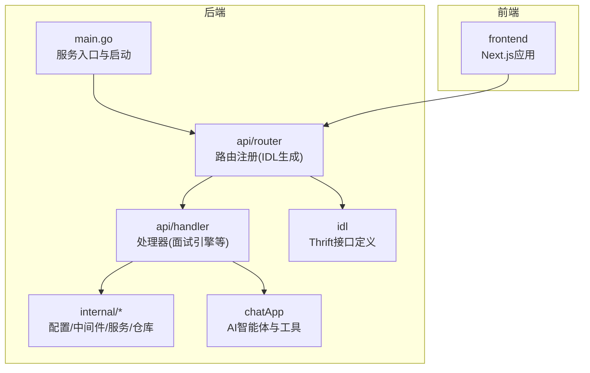
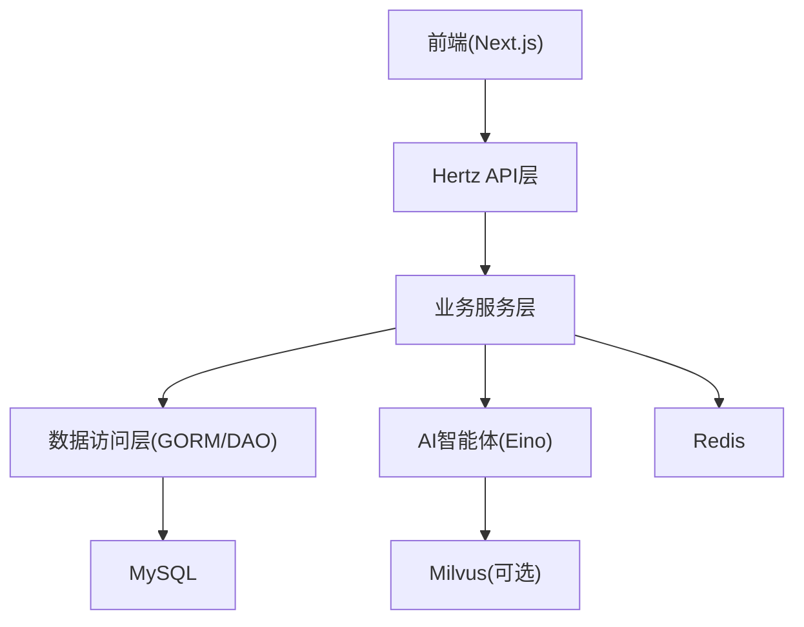
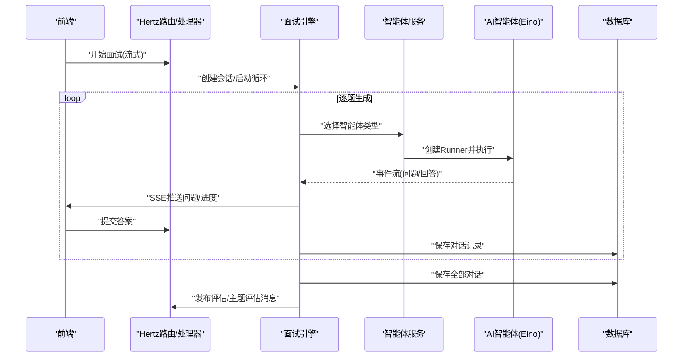
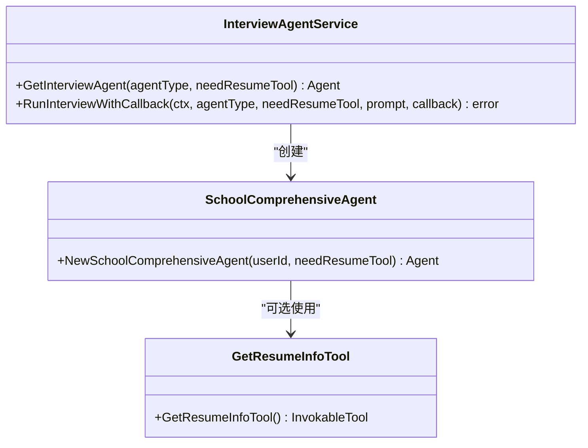
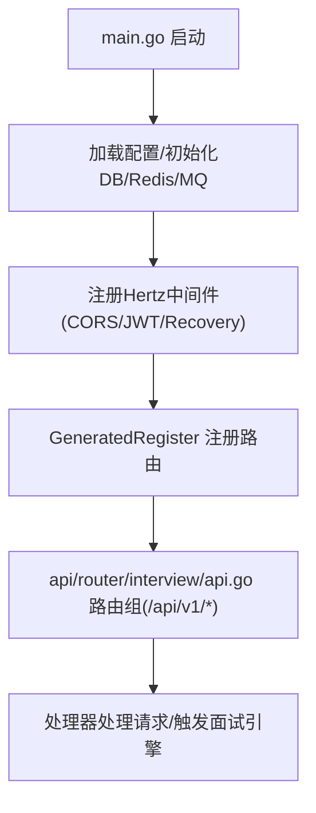
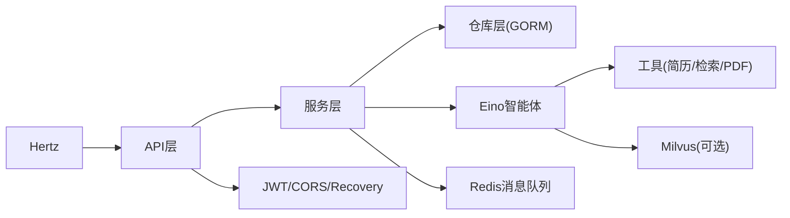

# 项目概述

<cite>
**本文引用的文件**
- [README.md](file://README.md)
- [backend/main.go](file://backend/main.go)
- [backend/chatApp/main.go](file://backend/chatApp/main.go)
- [doc/20251121_Go-Eino面试Agent平台分析报告.md](file://doc/20251121_Go-Eino面试Agent平台分析报告.md)
- [doc/AI功能分析与实现架构设计.md](file://doc/AI功能分析与实现架构设计.md)
- [backend/api/router/register.go](file://backend/api/router/register.go)
- [backend/api/router/interview/api.go](file://backend/api/router/interview/api.go)
- [backend/internal/config/config.go](file://backend/internal/config/config.go)
- [backend/internal/middleware/jwt.go](file://backend/internal/middleware/jwt.go)
- [backend/api/handler/interview/mianshi/engine.go](file://backend/api/handler/interview/mianshi/engine.go)
- [backend/chatApp/agent_service/interview/interview_agent_service.go](file://backend/chatApp/agent_service/interview/interview_agent_service.go)
- [backend/chatApp/agent/interview/comprehensive/school_comprehensive_agent.go](file://backend/chatApp/agent/interview/comprehensive/school_comprehensive_agent.go)
- [backend/chatApp/tool/get_resume_info_tool.go](file://backend/chatApp/tool/get_resume_info_tool.go)
- [backend/internal/service/interviews/interface.go](file://backend/internal/service/interviews/interface.go)
</cite>

## 目录
1. [简介](#简介)
2. [项目结构](#项目结构)
3. [核心组件](#核心组件)
4. [架构总览](#架构总览)
5. [详细组件分析](#详细组件分析)
6. [依赖分析](#依赖分析)
7. [性能考量](#性能考量)
8. [故障排查指南](#故障排查指南)
9. [结论](#结论)
10. [附录](#附录)

## 简介
面试吧AI智能面试平台是一个基于 CloudWeGo Hertz 框架与 Eino 大语言模型框架构建的智能面试代理系统。项目旨在通过AI驱动的面试体验，帮助求职者在真实面试场景中提升能力、获得反馈并最终拿到心仪Offer。系统提供用户管理、简历管理、综合/专项面试、AI智能体（简历分析、问题生成、答案评估、预测推荐）、向量检索（Milvus）、消息队列（Redis）等能力，并采用分层架构与多智能体协作模式，实现高扩展性与可维护性。

- 技术价值
  - 以 Hertz 作为高性能 Web 框架，提供稳定的 RESTful API；
  - 以 Eino 框架为核心，构建多智能体面试系统，支持工具调用与提示词模板化；
  - 通过 Redis 缓存与消息队列实现异步处理与高并发；
  - 通过 Milvus 向量数据库支撑知识检索与个性化推荐。

- 创新意义与实用价值
  - 面试流程闭环：从简历分析、问题生成、实时评估到报告输出，形成完整链路；
  - 多维度评估：结合技术能力、学习潜力与职业素养，提供多维度反馈；
  - 可扩展的智能体体系：支持新增面试类型与领域，持续增强AI能力。

**章节来源**
- [README.md](file://README.md#L1-L308)
- [doc/20251121_Go-Eino面试Agent平台分析报告.md](file://doc/20251121_Go-Eino面试Agent平台分析报告.md#L1-L153)
- [doc/AI功能分析与实现架构设计.md](file://doc/AI功能分析与实现架构设计.md#L1-L127)

## 项目结构
后端采用分层架构与模块化组织，主要目录与职责如下：
- backend/
  - main.go：后端服务入口，负责配置加载、数据库/缓存/消息队列初始化、Hertz 服务器启动与优雅关闭。
  - api/router：基于 IDL 自动生成的路由注册，集中管理 RESTful 路由。
  - api/handler：HTTP 请求处理器，承载业务流程编排与事件推送。
  - internal/*：内部包，包含配置、中间件、模型、仓库、服务层等。
  - chatApp：AI 聊天应用与智能体实现，包含多类面试智能体与工具。
  - idl：Thrift 接口定义，用于生成 API 路由与数据模型。
  - mcp-moduel、mcpserver：MCP 协议模块与服务器，用于工具与协议扩展。
- doc：项目文档，包含需求、架构、技术实现与优化建议。
- frontend：Next.js 前端应用，提供用户交互界面。

**图表来源**
- [backend/main.go](file://backend/main.go#L29-L173)
- [backend/api/router/register.go](file://backend/api/router/register.go#L11-L15)
- [backend/api/router/interview/api.go](file://backend/api/router/interview/api.go#L16-L103)

**章节来源**
- [README.md](file://README.md#L35-L120)

## 核心组件
- Hertz Web 服务
  - 负责路由注册、CORS、JWT 认证、优雅启停与错误恢复。
- 配置中心
  - YAML 配置文件，支持环境变量展开，涵盖数据库、Redis、Hertz、面试系统、安全、AI/OpenAI、向量数据库、微信/飞书/邮件等。
- 中间件
  - JWT 认证中间件，支持跳过规则；CORS 处理；统一错误响应。
- 业务服务层
  - 面试服务与简历服务接口，定义 CRUD 与查询能力。
- AI 智能体与工具
  - 多智能体（综合/专项），工具（简历信息获取、PDF解析、Milvus检索等），Runner 执行与事件迭代。
- 面试引擎
  - 控制面试流程，逐题生成、等待回答、保存对话、发布评估消息。

**章节来源**
- [backend/main.go](file://backend/main.go#L101-L128)
- [backend/internal/config/config.go](file://backend/internal/config/config.go#L13-L31)
- [backend/internal/middleware/jwt.go](file://backend/internal/middleware/jwt.go#L32-L78)
- [backend/internal/service/interviews/interface.go](file://backend/internal/service/interviews/interface.go#L20-L63)
- [backend/api/handler/interview/mianshi/engine.go](file://backend/api/handler/interview/mianshi/engine.go#L23-L37)

## 架构总览
系统采用“前端-后端API-服务层-数据访问层-AI Agent层-基础设施”的分层设计，配合 Hertz 与 Eino 框架，实现高性能与智能化的面试体验。

**图表来源**
- [doc/20251121_Go-Eino面试Agent平台分析报告.md](file://doc/20251121_Go-Eino面试Agent平台分析报告.md#L19-L55)

**章节来源**
- [doc/20251121_Go-Eino面试Agent平台分析报告.md](file://doc/20251121_Go-Eino面试Agent平台分析报告.md#L19-L55)

## 详细组件分析

### 面试引擎与AI智能体协作
- 面试引擎负责控制面试流程：逐题生成、等待回答、保存对话、发布评估消息。
- 智能体服务根据面试类型（综合/专项）与领域（Go/Java/MySQL/Redis/MQ）选择对应智能体。
- 智能体可选携带工具（如简历信息获取），通过 Runner 迭代接收事件并回调处理。

**图表来源**
- [backend/api/handler/interview/mianshi/engine.go](file://backend/api/handler/interview/mianshi/engine.go#L39-L230)
- [backend/chatApp/agent_service/interview/interview_agent_service.go](file://backend/chatApp/agent_service/interview/interview_agent_service.go#L75-L101)

**章节来源**
- [backend/api/handler/interview/mianshi/engine.go](file://backend/api/handler/interview/mianshi/engine.go#L23-L291)
- [backend/chatApp/agent_service/interview/interview_agent_service.go](file://backend/chatApp/agent_service/interview/interview_agent_service.go#L30-L155)

### 智能体类型与工具
- 智能体类型
  - 综合面试：校招/社招两类。
  - 专项面试：Go、Java、MySQL、Redis、MQ 等。
- 工具
  - 简历信息获取工具：从数据库读取解析后的简历内容。
  - PDF解析工具：用于简历上传解析。
  - Milvus检索工具：用于知识库检索增强。

**图表来源**
- [backend/chatApp/agent_service/interview/interview_agent_service.go](file://backend/chatApp/agent_service/interview/interview_agent_service.go#L42-L73)
- [backend/chatApp/agent/interview/comprehensive/school_comprehensive_agent.go](file://backend/chatApp/agent/interview/comprehensive/school_comprehensive_agent.go#L14-L47)
- [backend/chatApp/tool/get_resume_info_tool.go](file://backend/chatApp/tool/get_resume_info_tool.go#L21-L47)

**章节来源**
- [backend/chatApp/agent_service/interview/interview_agent_service.go](file://backend/chatApp/agent_service/interview/interview_agent_service.go#L14-L73)
- [backend/chatApp/agent/interview/comprehensive/school_comprehensive_agent.go](file://backend/chatApp/agent/interview/comprehensive/school_comprehensive_agent.go#L14-L47)
- [backend/chatApp/tool/get_resume_info_tool.go](file://backend/chatApp/tool/get_resume_info_tool.go#L21-L47)

### 路由与API注册
- 路由由 IDL 自动生成，集中注册在 GeneratedRegister 中。
- 面试相关路由包括：记录查询、开始/结束面试、提交答案、流式开始、评估与预测等。

**图表来源**
- [backend/main.go](file://backend/main.go#L101-L128)
- [backend/api/router/register.go](file://backend/api/router/register.go#L11-L15)
- [backend/api/router/interview/api.go](file://backend/api/router/interview/api.go#L16-L103)

**章节来源**
- [backend/api/router/register.go](file://backend/api/router/register.go#L11-L15)
- [backend/api/router/interview/api.go](file://backend/api/router/interview/api.go#L16-L103)

### 配置与中间件
- 配置结构覆盖数据库、Redis、Hertz、面试系统、安全、AI/OpenAI、向量数据库、微信/飞书/邮件等。
- JWT 中间件支持多种 Token 提取方式（Header、Query、Cookie），并提供跳过规则与统一错误响应。

**章节来源**
- [backend/internal/config/config.go](file://backend/internal/config/config.go#L13-L31)
- [backend/internal/middleware/jwt.go](file://backend/internal/middleware/jwt.go#L32-L78)

## 依赖分析
- 框架与库
  - Hertz：高性能 Web 框架，提供路由、中间件与优雅关闭。
  - Eino：大语言模型应用框架，提供智能体、Runner、事件迭代与工具调用。
  - GORM：数据库 ORM，DAO 模式封装数据访问。
  - Redis：缓存与消息队列（异步任务）。
  - Milvus（可选）：向量数据库，支持相似性检索。
- 组件耦合
  - API 层依赖服务层；服务层依赖仓库层与智能体服务；智能体服务依赖 Eino Runner 与工具。
  - 中间件横切关注点（认证、CORS、错误处理）贯穿 API 层。

**图表来源**
- [backend/main.go](file://backend/main.go#L101-L128)
- [backend/api/router/interview/api.go](file://backend/api/router/interview/api.go#L16-L103)
- [backend/chatApp/agent_service/interview/interview_agent_service.go](file://backend/chatApp/agent_service/interview/interview_agent_service.go#L75-L101)

**章节来源**
- [backend/main.go](file://backend/main.go#L101-L128)
- [backend/api/router/interview/api.go](file://backend/api/router/interview/api.go#L16-L103)

## 性能考量
- 并发与异步
  - 使用 Redis 作为消息队列，异步发布评估与主题评估消息，降低请求延迟。
- 缓存策略
  - Redis 作为缓存与提示词存储，建议对热点数据与模板进行缓存。
- 数据库优化
  - 建议完善单元测试与查询优化，避免 N+1 查询问题。
- 日志与监控
  - 当前使用基础 log 包，建议引入结构化日志（如 zap）与性能监控指标。

**章节来源**
- [doc/20251121_Go-Eino面试Agent平台分析报告.md](file://doc/20251121_Go-Eino面试Agent平台分析报告.md#L108-L130)

## 故障排查指南
- 服务启动与关闭
  - 若配置加载失败或数据库/Redis 初始化异常，需检查 config.yaml 与环境变量。
  - 优雅关闭时注意消费者与消息队列的关闭顺序。
- 认证问题
  - JWT 中间件支持多种 Token 提取方式，若报错需检查 Header/Query/Cookie 中的 token 格式与有效性。
- 面试流程异常
  - 面试引擎在生成问题、等待回答、保存对话与发布消息阶段均可能失败，需查看日志定位具体环节。
- 智能体执行
  - 智能体通过 Runner 迭代事件，若无回调或空结果，需检查工具调用与提示词模板。

**章节来源**
- [backend/main.go](file://backend/main.go#L38-L56)
- [backend/internal/middleware/jwt.go](file://backend/internal/middleware/jwt.go#L186-L214)
- [backend/api/handler/interview/mianshi/engine.go](file://backend/api/handler/interview/mianshi/engine.go#L117-L138)

## 结论
面试吧AI智能面试平台以 Hertz 与 Eino 为核心，构建了高扩展、可维护的智能面试系统。通过多智能体协作、工具增强与向量检索，系统实现了从简历分析到面试评估的完整闭环。当前项目在架构设计与AI能力方面具备显著优势，但在代码质量、错误处理、测试覆盖与缓存策略等方面仍有较大优化空间。建议优先清理冗余代码、统一错误处理、完善测试与日志系统，并逐步启用 Redis 与 Milvus 配置，以提升整体稳定性与性能。

**章节来源**
- [doc/20251121_Go-Eino面试Agent平台分析报告.md](file://doc/20251121_Go-Eino面试Agent平台分析报告.md#L90-L153)

## 附录
- 快速开始
  - 准备：Go 1.20+、MySQL、Redis、OpenAI API Key（或其他支持的模型 API Key）、可选 Milvus 与 Google Search API Key。
  - 步骤：克隆项目、配置 config.yaml、导入数据库 schema、安装依赖、运行后端服务。
- API 接口概览
  - 用户：注册、登录、微信登录、获取/更新资料、模型管理。
  - 简历：上传、解析、分析、押题、列表与详情。
  - 面试：创建、开始/结束、提交答案、问题与结果查询。
  - 预测：开始预测、列出预测、查看详情。

**章节来源**
- [README.md](file://README.md#L158-L308)