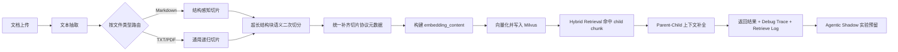

# RAG 平台文档切片体系升级分享：从 L0 到 L8

分享人：高尔特（RAG 平台后端开发）

听众：团队开发同事

---

## 1. 这次分享讲什么

这次升级，核心不是“把切片再切细一点”，而是把整条文档入库到检索的链路补完整。

原来的体系，主链路上更像是“拿到全文后做递归切片，然后直接拿 chunk 去做向量化和检索”。这套方案能跑，但有几个很典型的问题：

1. Markdown 文档明明有标题层级，但主链路不一定真的吃到了结构信息。
2. 很多 chunk 一旦离开标题，就变得不自解释，召回效果会受影响。
3. 检索命中了某个很小的 child chunk 后，答案引用会很准，但上下文容易不够。
4. 我们很难回答一个问题：这次检索结果，究竟是被哪种切片策略、哪种 embedding 文本、哪种回填策略命中的。

所以这次升级，不是单点优化，而是把文档切片体系升级成下面这条完整链路：

```text
结构优先切片
  -> 语义二次切分
  -> 上下文化 embedding 文本构建
  -> Parent-Child 检索补全
  -> 调试观测补齐
  -> Agentic 实验层预留
```

一句话总结：

> 我们把原来“只有切片”的系统，升级成了“可解释、可观测、可评测、可继续实验”的切片架构。

---

## 2. 分享背景

这次一共包含 7 个提交，40 个文件变更，新增 2326 行代码。

升级目标很明确：

1. 把当前切片能力先冻结成基线，后面所有升级都能对比。
2. 让 Markdown 结构切片真正进入知识库主链路。
3. 让向量化文本和展示文本分开，各自做自己该做的事。
4. 让检索命中 child 后，能按策略补 parent 上下文。
5. 让每次检索都能追溯“这条结果为什么会出来”。
6. 给后续 LLM 驱动切片留一个 shadow 实验层，但不污染现有主链路。

如果把这次升级看成一句工程话，就是：

> 从“能切”升级到“切得明白、搜得明白、查得明白”。

---

## 3. 升级前后架构图

### 3.1 升级前

```text
文档上传
  -> 文本抽取
  -> 通用递归切片
  -> chunk 直接向量化
  -> 写入 Milvus
  -> 检索返回 chunk
```

这个版本的问题不是不能用，而是信息损失比较严重：

1. 标题层级没有稳定进入主链路。
2. embedding 用的文本和展示用的文本是同一份。
3. 命中细粒度 chunk 后，上下文补全能力弱。
4. 很多策略决策过程没有可观测字段。

### 3.2 升级后



### 3.3 这张图现场怎么讲

建议从左往右讲，重点强调四个节点：

1. `按文件类型路由`：Markdown 不再走“和 TXT 一样”的主链路。
2. `构建 embedding_content`：从这里开始，向量化文本和展示文本彻底分离。
3. `Parent-Child 上下文补全`：命中 child，不等于只能返回 child。
4. `Debug Trace`：这次升级后，每个结果都能解释自己是怎么来的。

---

## 4. 整体链路先讲透

如果只记一条主链路，记下面这条就够了：

```text
上传文档
-> 按文件类型选择切片器
-> 得到结构化 chunk
-> 对超长 chunk 做语义二次切分
-> 给 chunk 补统一协议 metadata
-> 构造 embedding_content 做向量化
-> 检索阶段先命中 child
-> 再按 parent-child 策略补上下文
-> 最终把切片策略、embedding 策略、语义切分状态一起打到日志和调试视图
```

这里最重要的设计转变有两个：

1. 切片不再只是“切文本”，而是“生成带协议的检索单元”。
2. 检索不再只关心“命中哪个 chunk”，而是关心“命中后如何补齐最合适的上下文”。

---

## 5. 每一层是怎么做的

## 5.1 L0：先冻结基线，不急着改代码

### 这一层解决什么问题

很多系统升级失败，不是代码写错了，而是根本没有基线。后面效果变好还是变坏，只能靠感觉。

L0 做的事情很克制：

1. 先不改主逻辑。
2. 先把当前切片能力定义成可复现的 baseline。
3. 给后面每一层升级准备统一的评测数据集和 gate 阈值。

### 新增了什么

1. `backend/scripts/evaluation/chunking_strategy_profiles.example.json`
2. `backend/scripts/evaluation/chunking_dataset.example.json`
3. `backend/scripts/evaluation/chunking_gate_thresholds.example.json`

### 代码示例：切片策略基线

文件：`backend/scripts/evaluation/chunking_strategy_profiles.example.json`

```json
{
  "name": "baseline_recursive",
  "label": "Baseline Recursive",
  "family": "chunking",
  "baseline": true,
  "mode": "hybrid",
  "candidate_top_k": 10,
  "split_strategy": "recursive_v1",
  "split_version": "v1",
  "embedding_build_strategy": "raw_content_embedding",
  "context_version": "raw_content_v1"
}
```

### 这层的价值

这一步看起来不炫，但它决定了后面的升级是不是“有证据的优化”。

现场可以直接这么讲：

> L0 的重点不是提升效果，而是避免我们以后说不清“到底哪一步带来了提升”。

---

## 5.2 L1-L2：Markdown 主链路接入 + 元数据协议统一

### 这一层解决什么问题

升级前，Markdown 虽然有结构切片能力，但后台知识库上传主链路并不一定优先走它。这样会导致一个很尴尬的结果：

> 我们明明实现了结构感知切片，但主路径上不一定稳定吃到这份收益。

L1-L2 做了两件事：

1. 让 Markdown 结构切片成为主链路，而不是“可选能力”。
2. 让所有 chunk 都带上统一的切片协议元数据。

### 核心代码 1：按文件类型路由切片器

文件：`backend/internal/ragqueue/consumer.go`

```go
func splitKnowledgeDocument(ctx context.Context, splitter knowledgeDocumentSplitter, doc *schema.Document, sourceFileType string) ([]*schema.Document, error) {
	if splitter == nil {
		return nil, fmt.Errorf("splitter is nil")
	}

	switch chunkmeta.NormalizeSourceFileType(sourceFileType, "") {
	case chunkmeta.SourceFileTypeMarkdown:
		return splitter.SplitMarkdownDocument(ctx, doc)
	default:
		return splitter.Split(ctx, []*schema.Document{doc})
	}
}
```

这段代码很关键，因为它把“按文档类型选切片器”真正放进了知识库入库主链路。

### 核心代码 2：默认切片策略与版本

文件：`backend/internal/milvus/chunkmeta/chunkmeta.go`

```go
func DefaultSplitStrategyForSourceType(fileType string) string {
	switch NormalizeSourceFileType(fileType, "") {
	case SourceFileTypeMarkdown:
		return SplitStrategyMarkdownV1
	default:
		return SplitStrategyRecursiveV1
	}
}

func VersionForStrategy(strategy string) string {
	normalized := strings.TrimSpace(strategy)
	if normalized == "" {
		return ""
	}
	if normalized == SplitStrategyLegacyRecursive {
		return "legacy"
	}
	parts := strings.Split(normalized, "_")
	last := parts[len(parts)-1]
	if strings.HasPrefix(last, "v") {
		return last
	}
	return "v1"
}
```

### 统一后的元数据字段

这一层之后，chunk 至少会带上这些字段：

1. `split_strategy`
2. `split_version`
3. `source_file_type`
4. `split_stage`

### 这层最重要的工程意义

从这一步开始，我们不再只看到“某个 chunk 被召回了”，而是能知道：

1. 它是 Markdown 结构切片出来的，还是递归切片出来的。
2. 它属于哪个版本的切片策略。
3. 它原始文件是什么类型。

这决定了后面的调试、对比、回归分析是不是有抓手。

---

## 5.3 L3-L4：`raw_content` 和 `embedding_content` 分离

### 这一层解决什么问题

这是整次升级里最重要的一个转折点。

之前的问题是：同一个 `content` 同时承担三种职责。

1. 前端展示
2. 引用输出
3. 向量化输入

但这三件事的目标并不一样。

举个最简单的例子，一个 chunk 如果只有一句“默认保留 7 天”，展示时这句话没问题；但拿去做向量化时，如果没有标题和章节上下文，它几乎没有自解释能力。

所以这次明确拆开：

1. `raw_content`：原始文本，用于展示和引用
2. `embedding_content`：上下文化后的文本，用于 embedding

### 核心代码：构造上下文化 embedding 文本

文件：`backend/internal/milvus/chunkmeta/contextual.go`

```go
func BuildEmbeddingContent(raw string, metadata map[string]interface{}, opts ContextOptions) (string, string) {
	if !opts.Enabled {
		return raw, ""
	}

	title := firstNonEmpty(readString(metadata, "title"), readString(metadata, "file_name"))
	section := firstNonEmpty(readString(metadata, "hierarchy_path"), readString(metadata, "section_title"))

	lines := make([]string, 0, 3)
	if title != "" {
		lines = append(lines, "[Document]: "+title)
	}
	if section != "" {
		lines = append(lines, "[Section]: "+section)
	}
	if len(lines) > 0 {
		lines = append(lines, "[Chunk]:")
	}

	prefix := strings.Join(lines, "\n")
	prefix = truncateRunes(prefix, opts.MaxPrefixChars)
	content := truncateRunes(raw, opts.MaxContentChars)
	if prefix == "" {
		return content, ""
	}
	return strings.TrimSpace(prefix + "\n" + content), prefix
}
```

### 这段代码做了什么

它不是瞎拼字符串，而是在做一件非常具体的事：

1. 先拿文档标题。
2. 再拿章节层级路径。
3. 最后再把原始 chunk 拼进去。

最后给 embedding 模型看的文本，大概长这样：

```text
[Document]: RAG 平台策略中心说明
[Section]: 检索策略 / Parent-Child / 灰度开关
[Chunk]:
默认保留 7 天，超时后进入冷存储。
```

### 这层的关键设计

一定要强调这句话：

> 向量检索用 `embedding_content`，展示和引用继续用 `raw_content`。

这句话的意义是：我们既增强了召回，又避免把 `[Document]`、`[Section]` 这种上下文前缀污染到前端展示和引用内容里。

---

## 5.4 L5：灰度启用 Parent-Child，并补齐回填观测

### 这一层解决什么问题

细粒度 child chunk 的优势是命中准，但它的缺点也很明显：上下文可能不够。

比如用户问的是某个小段规则，如果只返回一条很短的 child 内容，答案虽然精确，但可解释性和引用完整性会差一些。

所以 L5 的思路不是“把 chunk 切大”，而是：

> 检索先命中 child，再按策略补 parent 或邻近上下文。

### 核心代码：Parent-Child 回填入口

文件：`backend/internal/milvus/retrieval/parent_child.go`

```go
func (p *parentChildPostProcessor) Fill(ctx context.Context, docs []*schema.Document) ([]*schema.Document, ParentChildFillStats) {
	stats := ParentChildFillStats{
		Strategy: p.config.FillStrategy,
	}
	if p == nil || !p.config.Enabled || len(docs) == 0 {
		return docs, stats
	}

	filled := make([]*schema.Document, 0, len(docs))
	for _, doc := range docs {
		out, applied, tokens, reason, err := p.fillDocument(ctx, doc)
		if err != nil {
			stats.FallbackCount++
			stats.Reason = firstNonEmptyString(stats.Reason, ParentFillReasonQueryFailed)
			fallbackDoc := cloneDocumentWithMetadata(doc)
			annotateParentFillMetadata(fallbackDoc, parentFillStrategyChildOnly, 0, 0, readDocScore(doc), false, ParentFillReasonQueryFailed)
			filled = append(filled, fallbackDoc)
			continue
		}
		if applied {
			stats.FilledCount++
			stats.FilledTokens += tokens
			stats.Reason = reason
		} else if stats.Reason == "" {
			stats.Reason = reason
		}
		filled = append(filled, out)
	}

	return filled, stats
}
```

### 这里怎么理解

它做的事很像“检索后的上下文修复”：

1. 先看这个结果是不是 child chunk。
2. 如果能补 parent，就按策略补。
3. 如果补不了，就明确标记失败原因，而不是静默降级。

### 新增的观测字段

这一层之后，结果里能看到：

1. `parent_fill_strategy`
2. `parent_fill_reason`
3. `parent_fill_tokens`
4. `parent_child_available`

这几个字段非常重要，因为它们能回答：

1. 为什么这条结果补了 parent。
2. 是按哪个策略补的。
3. 实际补了多少 token。
4. 是主动应用了，还是因为预算/查询失败而回退了。

---

## 5.5 L6：超长结构块语义二次切分

### 这一层解决什么问题

结构切片解决的是“标题边界”的问题，但解决不了另一个常见问题：

> 同一个标题下面，内容可能非常长，而且可能已经换主题了。

如果这时候只靠递归切片，边界往往不够聪明，容易出现“一个 chunk 里混了两个主题”。

所以 L6 的思路是：

1. 先按结构切出大块。
2. 只对超长结构块再做一次语义切分。
3. 小块不动，避免过度切片。

### 核心代码：语义二次切分主逻辑

文件：`backend/internal/milvus/splitter/semantic.go`

```go
func (s *DocumentSplitterService) semanticSplitChunk(ctx context.Context, chunk *schema.Document) []*schema.Document {
	if chunk == nil {
		return nil
	}
	content := strings.TrimSpace(chunk.Content)
	if len([]rune(content)) < s.semanticConfig.MinBlockSize {
		return []*schema.Document{chunk}
	}

	sentences := splitSemanticSentences(content)
	if len(sentences) < s.semanticConfig.MinSentencesPerChunk*2 || len(sentences) > 128 {
		return []*schema.Document{chunk}
	}

	texts := make([]string, 0, len(sentences))
	for _, sentence := range sentences {
		texts = append(texts, sentence.Text)
	}
	vectors, err := s.semanticConfig.Embedder.EmbedStrings(ctx, texts)
	if err != nil || len(vectors) != len(sentences) {
		return []*schema.Document{chunk}
	}

	similarities := adjacentSimilarities(vectors)
	threshold := percentileFloat64(similarities, s.semanticConfig.BreakpointPercentile)
	parts := rebuildSemanticChunks(sentences, similarities, threshold, s.semanticConfig)
	if len(parts) <= 1 {
		return []*schema.Document{chunk}
	}

	results := make([]*schema.Document, 0, len(parts))
	for _, part := range parts {
		meta := cloneMetadataMap(chunk.MetaData)
		meta[chunkmeta.KeySemanticSplitEnabled] = true
		meta[chunkmeta.KeySemanticSplitScore] = threshold
		meta[chunkmeta.KeySemanticBreakpointMethod] = chunkmeta.SemanticBreakpointEmbeddingV1
		results = append(results, &schema.Document{
			Content:  part,
			MetaData: meta,
		})
	}
	return results
}
```

### 这段代码可以拆成四句话讲

1. 先按句子切开。
2. 给每个句子算 embedding。
3. 看相邻句子的相似度，找“低谷”。
4. 在 chunk size 约束内，把这些句子重新合并成更合理的小块。

### 关键配置

文件：`backend/internal/config/config.go`

```yaml
DocumentSplitter:
  SemanticSecondarySplitEnabled: false
  SemanticMinBlockSize: 1200
  SemanticTargetChunkSize: 1000
  SemanticMaxChunkSize: 1400
  SemanticBreakpointPercentile: 20
  SemanticMinSentencesPerChunk: 2
```

### 这一层最值得强调的点

这不是“默认把所有文档都切得更碎”，而是：

> 只对超长结构块做二次处理，控制收益和成本的平衡。

---

## 5.6 L7：补齐调试视图和检索观测字段

### 这一层解决什么问题

如果前面几层都上线了，但结果里看不到切片决策过程，那排障还是会很痛苦。

所以 L7 本质上是在补“解释能力”。

### 新增的调试字段

这次检索结果和 debug trace 里重点新增了这些字段：

1. `split_strategy`
2. `embedding_build_strategy`
3. `context_version`
4. `semantic_split_enabled`
5. `agentic_chunking_mode`
6. `parent_fill_reason`

### 核心代码：Debug 文档快照

文件：`backend/internal/milvus/retrieval/debug_trace.go`

```go
items = append(items, DebugDocument{
	DocumentID:         debugUint64Metadata(metadata, "document_id"),
	ChunkID:            firstNonEmptyString(doc.ID, getStringMetadata(metadata, "chunk_id"), getStringMetadata(metadata, "child_id")),
	ParentID:           getStringMetadata(metadata, "parent_id"),
	FileName:           getStringMetadata(metadata, "file_name"),
	Route:              getStringMetadata(metadata, "route"),
	Score:              debugFloat64Metadata(metadata, "score"),
	RerankScore:        debugFloat64Metadata(metadata, "rerank_score"),
	Content:            doc.Content,
	Collection:         firstNonEmptyString(getStringMetadata(metadata, "collection"), getStringMetadata(metadata, "source.collection")),
	SectionTitle:       getStringMetadata(metadata, "section_title"),
	HierarchyPath:      getStringMetadata(metadata, "hierarchy_path"),
	SplitStrategy:      getStringMetadata(metadata, "split_strategy"),
	EmbeddingStrategy:  getStringMetadata(metadata, "embedding_build_strategy"),
	ContextVersion:     getStringMetadata(metadata, "context_version"),
	SemanticSplit:      debugBoolMetadata(metadata, "semantic_split_enabled"),
	ContextPrefix:      getStringMetadata(metadata, "context_prefix"),
	OriginalChild:      getStringMetadata(metadata, "original_child_content"),
	ParentFillApplied:  debugBoolMetadata(metadata, "parent_fill_applied"),
	ParentFillStrategy: getStringMetadata(metadata, "parent_fill_strategy"),
	ParentFillReason:   getStringMetadata(metadata, "parent_fill_reason"),
	Metadata:           cloneDebugMetadata(metadata),
})
```

### 这层带来的直接好处

以后查一条检索结果，不用猜：

1. 它是不是 Markdown 结构切片出来的。
2. 它是不是用了上下文化 embedding。
3. 它有没有触发语义二次切分。
4. 它有没有做 parent 回填。

对于线上排障，这一层非常值钱。

---

## 5.7 L8：加入 Agentic Shadow 实验层预留

### 这一层解决什么问题

很多团队做切片演进，最后都会走到一个问题：

> 能不能让 LLM 参与决定 chunk 边界？

这个方向可以探索，但不能直接把它塞进主链路。原因很简单：

1. 成本更高。
2. 稳定性更难控。
3. 可复现性更弱。

所以 L8 的设计很克制：先预留 shadow 实验层，不影响现有逻辑。

### 当前预留了哪些字段

1. `agentic_shadow_generated`
2. `agentic_shadow_candidate_count`
3. `agentic_chunking_mode`

### 这层怎么讲最合适

建议现场强调：

> 这不是马上上 Agentic Chunking，而是先把实验框架和观测字段留好，后面可以让 LLM 给出候选边界，再和规则切片做 AB 对比。

这样团队会更容易理解：我们是在为下一轮升级留接口，而不是提前引入复杂度。

---

## 6. 几段最关键的代码，建议现场重点讲

如果时间有限，我建议重点讲下面 4 段。

### 6.1 入口路由：Markdown 终于进主链路了

文件：`backend/internal/ragqueue/consumer.go`

```go
switch chunkmeta.NormalizeSourceFileType(sourceFileType, "") {
case chunkmeta.SourceFileTypeMarkdown:
	return splitter.SplitMarkdownDocument(ctx, doc)
default:
	return splitter.Split(ctx, []*schema.Document{doc})
}
```

讲法：

> 这几行代码看起来很小，但它决定了 Markdown 结构切片是不是“真的上线了”。

### 6.2 上下文化 embedding：检索和展示正式分家

文件：`backend/internal/milvus/chunkmeta/contextual.go`

```go
if title != "" {
	lines = append(lines, "[Document]: "+title)
}
if section != "" {
	lines = append(lines, "[Section]: "+section)
}
if len(lines) > 0 {
	lines = append(lines, "[Chunk]:")
}
```

讲法：

> 我们不是把 chunk 内容改了，而是给 embedding 模型补了一层最必要的解释上下文。

### 6.3 索引前取 embedding 文本：用的是 `embedding_content`

文件：`backend/internal/milvus/storage/indexer.go`

```go
texts := make([]string, 0, len(docs))
for _, doc := range docs {
	texts = append(texts, chunkmeta.ResolveEmbeddingText(doc))
}
```

讲法：

> 真正送进 embedding 模型的，不再默认是原始 chunk，而是经过 `ResolveEmbeddingText` 选出来的向量化文本。

### 6.4 索引后剥离调试字段：增强能力但不污染存储

文件：`backend/internal/milvus/storage/indexer.go`

```go
chunkmeta.StripIndexOnlyMetadata(docs, chunkmeta.ContextOptions{
	SaveContentForDebug:   s.saveEmbeddingContentForDebug,
	StoredContentMaxChars: s.embeddingContentMaxLength,
})
```

讲法：

> 我们既要拿到更好的 embedding 文本，又不想把过长的调试内容原样塞进存储，所以这里做了一层剥离和截断。

---

## 7. 升级后的效果对比

这次升级后的收益，可以分成五类。

### 7.1 切片质量更好

以前主要靠递归边界，现在变成：

1. Markdown 先按结构切。
2. 超长块再按语义二次切。

直接收益是：跨主题混块更少，chunk purity 更高。

### 7.2 检索召回更好

以前短 chunk 很容易“离开标题就不自解释”，现在通过 `embedding_content` 把标题和章节路径补进去了。

直接收益是：标题依赖型问题、短 chunk 问题、章节依赖型问题更容易召回。

### 7.3 引用质量更好

以前要么 chunk 切大一点换完整上下文，要么切小一点换精度。

现在的方案是：

1. 先用 child 命中保证精度。
2. 再用 parent-child 回填补上下文。

直接收益是：引用更细粒度，但回答又不至于太“碎”。

### 7.4 可观测性更强

以前看到一条结果，很难解释它是怎么来的；现在我们能直接看到：

1. `split_strategy`
2. `embedding_build_strategy`
3. `context_version`
4. `semantic_split_enabled`
5. `parent_fill_reason`

这让排查问题的成本明显下降。

### 7.5 可实验性更强

L0 的评测脚手架 + L8 的 Agentic shadow 预留，意味着后面做任何切片升级，都不需要重新从零搭实验环境。

这点对长期演进特别重要。

---

## 8. 这次升级最核心的几个设计取舍

## 8.1 为什么不是直接全面上 Agentic Chunking

因为现在还不值。

主链路最需要的是稳定、可控、可回滚。Agentic 更适合做 shadow 实验，而不是直接替换规则切片。

## 8.2 为什么不把所有 chunk 都做语义切分

因为很多 chunk 本来就不长，再切一次收益不大，反而会增加成本和不确定性。

所以这次只对超长结构块启用语义二次切分。

## 8.3 为什么一定要分 `raw_content` 和 `embedding_content`

因为展示和检索本来就是两种目标。

如果继续共用同一份文本，最后就会出现两头都不满意：

1. 检索缺上下文。
2. 展示被上下文前缀污染。

## 8.4 为什么这次特别重视 metadata 和 debug trace

因为没有这些字段，后面的所有优化都会变成黑盒。

调不清、讲不清、回归也对不清。

---

## 9. 后续规划

这次做到 L8，并不意味着切片体系结束了，反而说明我们终于有了继续迭代的地基。

后面我建议重点看四个方向：

1. 把 chunking dataset 从 example 变成真实可跑的团队回归集。
2. 给不同文档类型拆更明确的评测场景，比如 Markdown、PDF 抽取文本、列表型文档、规范型文档。
3. 在 shadow 模式下接入 LLM 候选边界生成，重点观察收益是否稳定高于规则切片。
4. 把切片观测字段进一步串到管理后台，减少排障时直接翻日志的成本。

如果再往后走一步，比较合理的下一阶段目标不是“更复杂的切片算法”，而是：

> 让切片策略可以被更稳定地评测、灰度、对比和回滚。

---

## 10. 最后总结

如果只用三句话概括这次升级，我会这样说：

1. 我们把文档切片从“递归切块”升级成了“结构优先 + 语义增强 + 上下文化向量化 + Parent-Child 补全”的完整架构。
2. 我们把切片结果从“只有文本”升级成了“带协议、可解释、可观测的检索单元”。
3. 我们没有急着把 Agentic 放进主链路，而是先把基线、灰度、观测和实验层搭好。

这次最重要的，不只是效果变好了，而是以后继续升级切片体系时，我们终于有了一个清楚、稳定、能持续演进的工程框架。

---

## 11. 附：分享时可直接照着讲的收尾

可以直接用下面这段做结尾：

> 这次升级表面上看是在改 chunking，但本质上是在补 RAG 平台“文档进入检索系统之前”的那一整层基础设施。  
> 以前我们更像是在切文本，现在我们是在生产带上下文、带协议、带观测能力的检索单元。  
> 这样后面不管是继续做检索优化，还是做 Agentic 实验，团队都不是从零开始。
