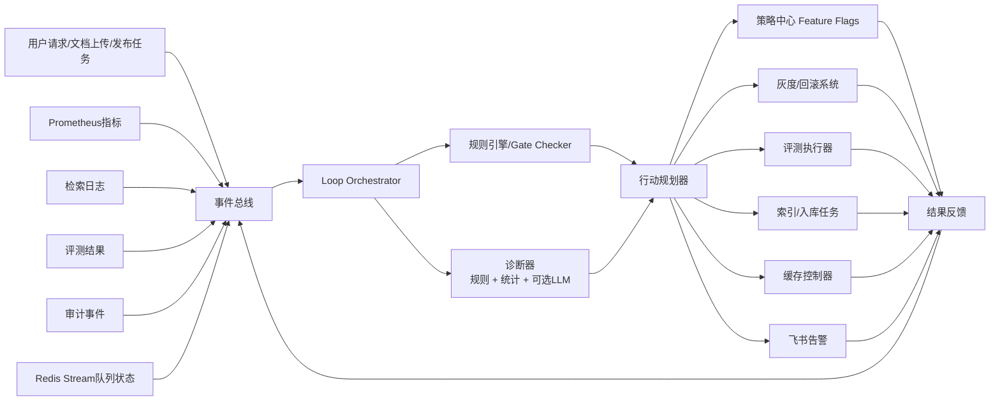
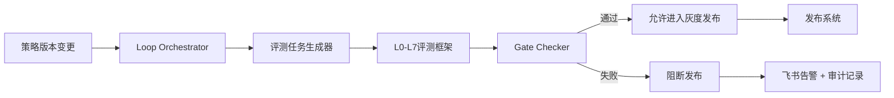
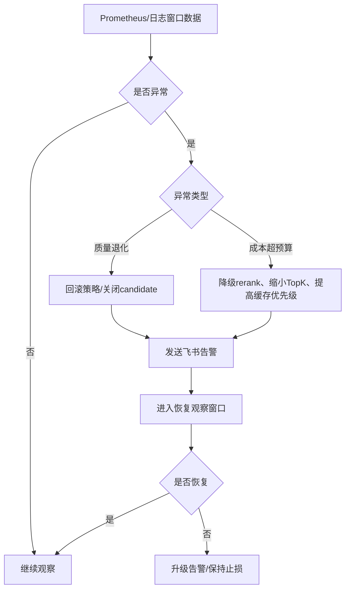

# Loop Engineering 在 RAG 后台管理平台中的应用价值

> 适用对象：架构评审、技术分享、产品规划会
>
> 项目上下文：Go 后端 + Next.js 前端 + Milvus + MySQL + Redis 的 RAG 后台管理平台

---

## 1. 为什么要讨论 Loop Engineering

当前平台已经具备较完整的 RAG 工程能力：

- 入库侧：结构感知切片、语义二次切分、上下文化嵌入、Parent-Child
- 检索侧：Dense + Sparse 混合检索、Rerank、查询改写、动态 TopK、证据门控、引用一致性
- 评测侧：L0-L7 评测框架、baseline/candidate 对比、gate 检查
- 治理侧：策略中心、灰度回滚、语义缓存、监控告警、治理门禁、发布系统

问题不在于“能力不够”，而在于这些能力目前大多还是离散的工具，尚未形成持续自驱的闭环。

当前模式更接近：

```text
人发现问题 -> 人打开后台 -> 人跑评测/看监控 -> 人决定改配置/回滚 -> 系统执行
```

这意味着平台是“半自动”的，核心判断仍然依赖人工。

Loop Engineering 的价值，就是把这些已经存在的模块连接成可持续运行的工程闭环，让系统从“能执行”升级为“能观察、能判断、能行动、能复盘”。

---

## 2. 什么是 Loop Engineering

### 2.1 定义

Loop Engineering 可以理解为：

> 围绕业务目标，把系统设计成一个持续运行的闭环，而不是一次性的请求响应器。

它强调的不是单次回答有多聪明，而是系统能否长期稳定地：

1. 观察环境和运行状态
2. 对状态做判断
3. 执行动作
4. 根据结果继续修正下一轮动作

这是一种“持续控制系统”思维，而不是“单次问答系统”思维。

### 2.2 核心循环

Loop Engineering 的标准闭环可以抽象为：

```text
观察 Observe -> 思考 Think -> 行动 Act -> 反馈 Feedback -> 再次观察
```

在本项目里，可以映射为：

- `Observe`：Prometheus/Grafana 指标、检索日志、审计事件、成本追踪、评测结果、Redis Stream 队列状态
- `Think`：Gate 规则、阈值判断、策略中心规则、异常归因、候选策略对比、必要时引入 LLM 诊断
- `Act`：调整 feature flag、变更灰度比例、触发回滚、发起重试、重建索引、清理缓存、发送飞书告警
- `Feedback`：重新跑评测、观察线上指标恢复情况、记录审计日志、固化经验到策略模板

### 2.3 与传统“一问一答”模式的区别

| 维度 | 一问一答模式 | Loop Engineering 模式 |
|---|---|---|
| 触发方式 | 人工触发请求 | 事件、指标、任务、定时器共同触发 |
| 目标 | 完成一次处理 | 持续优化系统行为 |
| 决策依据 | 当前输入 | 当前输入 + 历史状态 + 运行指标 + 策略规则 |
| 结果形态 | 返回一次结果 | 触发后续动作并形成闭环 |
| 典型场景 | 用户发起一次检索 | 系统自动止损、自动放量、自动修复、自动评测 |

一句话概括：

> 一问一答解决的是“这次怎么答”，Loop Engineering 解决的是“系统以后怎么越来越稳、越来越准、越来越省”。

---

## 3. 本项目为什么特别适合做 Loop Engineering

不是所有系统都适合上 Loop。这个项目适合，原因很明确：

### 3.1 已经具备闭环的基础部件

你们已经有了构建闭环所需的 4 类核心积木：

| 闭环要素 | 本项目已有能力 |
|---|---|
| 观察器 | 监控、检索日志、成本追踪、审计事件、队列状态、评测报告 |
| 判断器 | L0-L7 gate、证据门控、引用一致性、治理门禁、阈值规则 |
| 执行器 | feature flags、灰度发布、回滚、队列重试、缓存策略、索引操作 |
| 反馈器 | baseline/candidate 对比、发布系统、告警系统、审计沉淀 |

### 3.2 当前痛点本质上都是“缺闭环”

目前很多问题并不是“没能力”，而是“能力没连起来”：

- 检索退化了，系统知道，但要人看图后才回滚
- 候选策略准备好了，但要人手动跑评测后才敢放量
- 入库失败会重试，但不会根据失败模式自动切换处理策略
- 语义缓存命中率下降了，但系统不会自动判定是热点变化还是缓存污染
- 成本上涨了，但系统不会自动触发降级保护

这些都不是算法问题，而是闭环编排问题。

### 3.3 Loop Engineering 与 RAG 平台天然匹配

RAG 平台不是一次性的业务接口，而是一个持续运行的知识系统。它的核心矛盾天然就是：

- 文档不断变化
- 查询不断变化
- 策略不断变化
- 成本和质量不断拉扯
- 线上效果和离线评测需要持续对齐

这类系统最适合用 Loop 的方式做工程治理。

---

## 4. 本项目中的 Loop 架构设计

### 4.1 总体架构图



### 4.2 架构分层说明

#### 第一层：Observe 观察层

输入来源建议统一抽象为事件：

- 检索完成事件
- 零结果事件
- 证据不足事件
- rerank 超时事件
- 评测完成事件
- 发布窗口事件
- 索引失败事件
- 缓存命中率异常事件

#### 第二层：Think 判断层

建议分成两类：

- `Rule-based`：阈值明确、可审计、适合先落地
- `LLM-assisted`：用于诊断归因、生成修复建议，不直接拥有最终执行权

先做规则闭环，再做 LLM 辅助，是更稳妥的路径。

#### 第三层：Act 行动层

行动层不要直接“自由发挥”，而要基于现有治理系统做受控动作：

- 开/关 feature flag
- 降低灰度比例
- 自动回滚到 baseline
- 触发特定评测集
- 重新入队重试
- 刷新/失效语义缓存
- 触发索引巡检
- 发飞书告警并附带建议动作

#### 第四层：Feedback 反馈层

任何自动动作都必须留下反馈证据：

- 动作前快照
- 动作理由
- 动作结果
- 影响范围
- 后续评测结果
- 是否恢复

否则就不是工程闭环，只是“自动脚本”。

---

## 5. 8 个可落地的 Loop Engineering 场景

下面的场景都基于现有模块搭建，不是假设未来重写系统。

### 场景 1：检索质量退化自动止损 Loop

#### 当前状态

- 人看 Grafana 或检索日志
- 人发现命中率、引用一致性、证据不足率异常
- 人手动去策略中心降级或回滚

#### Loop 后状态

- 系统持续监控核心质量指标
- 一旦超过阈值，自动触发止损策略
- 自动将 candidate 流量降为 0 或回滚到 baseline
- 同时发飞书告警并附带回滚原因

#### 实现方式

- `Observe`：Prometheus 指标 + 检索日志 + 引用一致性统计
- `Think`：基于 L0-L7 gate 阈值判断是否退化
- `Act`：调用策略中心切换 feature flag，调用发布系统执行灰度回滚
- `Feedback`：回滚后继续观察 5-15 分钟窗口，确认指标是否恢复

#### 预期价值

- 把“发现问题到止损”的时间从分钟级/小时级降到秒级/分钟级
- 降低线上错误答案和幻觉传播风险
- 让策略试验更敢上线，因为止损成本下降

---

### 场景 2：评测 Gate 自动执行 Loop

#### 当前状态

- 人选 baseline/candidate
- 人手动跑评测
- 人看报告后判断是否通过 gate
- 人决定是否发布

#### Loop 后状态

- 每当新策略、新参数、新索引版本产生时，系统自动触发 L0-L7 评测
- 自动对比 baseline/candidate
- gate 通过才允许进入灰度发布
- gate 不通过则自动阻断发布，并生成失败报告

#### 实现方式

- `Observe`：策略变更事件、配置变更事件、索引构建完成事件
- `Think`：调用现有评测框架，检查 recall、MRR、nDCG、引用一致性、成本、延迟门限
- `Act`：通过治理门禁控制发布系统是否放行
- `Feedback`：把结果写入审计日志、评测中心、策略版本记录

#### 预期价值

- 减少“拍脑袋发布”
- 提高候选策略上线效率
- 让评测从“工具”变成“发布前自动守门员”

---

### 场景 3：灰度放量自动驾驶 Loop

#### 当前状态

- 人手动从 5% 调到 10%、30%、50%、100%
- 每一步都需要人盯监控

#### Loop 后状态

- 系统按预设发布计划自动放量
- 每个阶段观察一段稳定窗口
- 如果质量、延迟、成本均正常，则自动进入下一档
- 如果任一指标异常，则自动停止放量或回退

#### 实现方式

- `Observe`：发布系统阶段状态、Prometheus 指标、成本追踪
- `Think`：阶段门禁规则，例如“连续 10 分钟错误率/证据不足率/成本未超阈值”
- `Act`：调用 Phase1/Phase2 灰度发布能力更新流量比例
- `Feedback`：记录每一步放量前后的对比数据

#### 预期价值

- 大幅减少发布值守成本
- 把灰度发布从“人工盯盘”升级为“可复制流程”
- 提升团队并行试验能力

---

### 场景 4：入库失败与低质量文档自动修复 Loop

#### 当前状态

- 人上传文档
- 系统入库
- 如果切片异常、嵌入失败、索引失败，系统重试
- 复杂问题仍要人排查

#### Loop 后状态

- 系统不仅重试，还能识别失败类型
- 根据失败原因自动切换修复策略
- 例如：缩小批次、切换切片模式、延迟重试、标记人工复核

#### 实现方式

- `Observe`：Redis Stream 失败次数、错误码、文档类型、切片长度分布、索引耗时
- `Think`：根据错误分类做路由判断
- `Act`：临时降级为保守切片、重新入队、拆分大文档批次、标记低质量文档进入人工审核池
- `Feedback`：记录修复后入库成功率与平均处理时延

#### 预期价值

- 提升入库成功率
- 降低人工排障量
- 让知识库更新更稳定，减少“文档已经传了但检索不到”的情况

---

### 场景 5：零结果/低证据查询自优化 Loop

#### 当前状态

- 人通过日志看见一些 query 检索为空或证据不足
- 人手动分析是不是改写不够、词典不全、TopK 不合适

#### Loop 后状态

- 系统持续收集“零结果”“低证据”“高拒答”查询
- 自动聚类同类问题
- 识别高频失败模式后，触发候选优化策略
- 进入 shadow 或 candidate 评测验证

#### 实现方式

- `Observe`：检索日志中的零命中、证据门控拒答、低引用一致性请求
- `Think`：规则识别缩写、别名、拼写问题；聚类热点失败 query；生成候选 rewrite 规则或调整动态 TopK 策略
- `Act`：写入候选策略配置，触发离线评测，不直接全量上线
- `Feedback`：验证优化是否提升 recall 和引用一致性

#### 预期价值

- 让系统真正“从失败 query 中学习”
- 缩短 query rewrite 规则迭代周期
- 提升长尾问题的召回能力

---

### 场景 6：语义缓存命中率与污染治理 Loop

#### 当前状态

- 人看缓存命中率、响应耗时、错误命中案例
- 人决定是否清缓存或调阈值

#### Loop 后状态

- 系统持续检测缓存命中率、误命中率、热点 query 漂移
- 自动区分“缓存太松”“缓存太紧”“热点变化”“语义污染”
- 自动调阈值、局部失效、预热热点

#### 实现方式

- `Observe`：L0-L6 语义缓存指标、query 分布、答案一致性、命中后用户追问率
- `Think`：基于阈值和热点变化做缓存治理判断
- `Act`：调整相似度阈值、失效特定 KB/策略版本缓存、对热点 query 预热
- `Feedback`：对比治理前后命中率、P95、成本和错误命中样本

#### 预期价值

- 提升缓存收益
- 控制缓存污染导致的错误复用
- 在成本和质量之间动态平衡

---

### 场景 7：成本超预算自动降级 Loop

#### 当前状态

- 人看成本报表
- 人发现 rerank 太贵、TopK 太大、cache 命中偏低
- 人手动调策略

#### Loop 后状态

- 系统实时感知单位请求成本、租户/知识库成本、模型调用成本
- 一旦超过预算，自动执行分级降级
- 优先保证稳定，再考虑精度

#### 实现方式

- `Observe`：成本追踪、token 消耗、rerank 调用量、缓存命中率
- `Think`：根据预算策略决定进入哪一级降级模式
- `Act`：缩小 candidate_topk、关闭高级 rerank、提高缓存优先级、降低 rewrite 扩展数
- `Feedback`：观察成本回落与质量损失是否可接受

#### 预期价值

- 把成本治理从报表分析变成在线控制
- 避免高峰期成本失控
- 支持多租户/多知识库的精细化运营

---

### 场景 8：索引新鲜度与一致性巡检 Loop

#### 当前状态

- 人定期检查知识库和向量库是否一致
- 人排查有没有漏入库、旧索引未清理、Parent-Child 断链

#### Loop 后状态

- 系统定期巡检 MySQL、Milvus、Redis 中的索引元数据
- 自动发现未同步、重复写入、孤儿 child chunk、过期索引
- 自动触发补偿任务或输出治理报告

#### 实现方式

- `Observe`：知识库文档状态、切片记录、Milvus collection/partition 元数据、索引版本状态
- `Think`：一致性规则校验
- `Act`：重建缺失索引、补齐 parent-child 映射、标记脏数据待清理、阻止有风险版本进入发布
- `Feedback`：输出巡检报告并写入审计中心

#### 预期价值

- 降低“有数据但搜不到”的隐性故障
- 提高知识库可信度
- 为大规模知识库运营打基础

---

## 6. 8 个场景的价值评估

| 场景 | 实现难度 | 业务价值 | 依赖条件 | 优先级建议 |
|---|---|---|---|---|
| 检索质量退化自动止损 | 中 | 高 | Prometheus 指标、策略中心、灰度回滚、稳定阈值 | P0 |
| 评测 Gate 自动执行 | 中 | 高 | L0-L7 评测框架、发布门禁、策略版本事件 | P0 |
| 灰度放量自动驾驶 | 中 | 高 | 发布系统、质量/成本指标、阶段门禁规则 | P1 |
| 入库失败与低质量文档自动修复 | 中 | 中高 | Redis Stream、错误分类、切片/索引降级能力 | P1 |
| 零结果/低证据查询自优化 | 高 | 高 | 检索日志聚类、候选策略生成、离线评测闭环 | P1 |
| 语义缓存命中率与污染治理 | 中高 | 中高 | jiayi 分支缓存能力、命中质量评估指标 | P1 |
| 成本超预算自动降级 | 中 | 高 | 成本追踪、预算配置、分级降级开关 | P0 |
| 索引新鲜度与一致性巡检 | 中 | 中高 | MySQL/Milvus 元数据对账、补偿任务执行器 | P1 |

### 6.1 实现优先级判断逻辑

建议优先做满足以下条件的场景：

1. 已有模块足够多，不需要重构底座
2. 自动动作可控，可回滚，可审计
3. 能直接降低线上风险或释放人工成本

按照这个标准，最值得优先启动的是：

- `P0-1：评测 Gate 自动执行 Loop`
- `P0-2：检索质量退化自动止损 / 成本超预算自动降级 Loop`

其中第二项可以合并为一个“线上守门员 Loop”。

---

## 7. 最值得优先做的 2 个功能

## 7.1 功能一：评测 Gate 自动执行 + 发布放行闭环

这是最应该优先做的功能，因为它能把你们现有的 L0-L7 评测体系从“分析工具”升级成“生产守门系统”。

### 7.1.1 目标

实现：

```text
候选策略产生
-> 自动触发评测
-> 自动与 baseline 对比
-> gate 通过才允许灰度
-> gate 不通过自动阻断发布
```

### 7.1.2 架构图



### 7.1.3 详细方案设计

#### 输入事件

- 新 feature flag 组合生成
- 新 query rewrite 词典版本提交
- 新 rerank 参数提交
- 新索引版本完成

#### 核心判断指标

建议至少纳入：

| 指标 | 用途 |
|---|---|
| Recall@K / HitRate | 召回能力 |
| MRR / nDCG | 排序质量 |
| Citation Accuracy | 引用一致性 |
| Evidence Pass Rate | 证据门控通过率 |
| P95 Latency | 时延约束 |
| Cost Per Query | 成本约束 |

#### 动作策略

- 全通过：允许进入 5% 灰度
- 关键指标失败：阻断发布
- 非关键指标轻微波动：允许进入 shadow，不允许正式放量

#### 审计要求

每次自动决策必须记录：

- baseline 版本
- candidate 版本
- 数据集版本
- gate 配置快照
- 决策结论
- 决策时间

### 7.1.4 实现步骤

1. 定义统一的 `PolicyChanged` 事件模型。
2. 在策略中心、索引构建、配置变更入口发出事件。
3. 新增 `loop_orchestrator` worker，监听策略变更事件。
4. 调用现有 L0-L7 评测任务入口，生成 baseline/candidate 对比任务。
5. 新增 `gate_decision` 表或审计记录结构，保存自动判定结果。
6. 把 gate 结果接入治理门禁和发布系统。
7. 接入飞书通知，失败时附带关键退化指标。

### 7.1.5 配置示例

```yaml
loop:
  auto_eval_gate:
    enabled: true
    trigger_events:
      - policy_changed
      - index_built
      - rerank_profile_changed
    required_metrics:
      recall_at_10: ">= 0.82"
      mrr_at_10: ">= baseline - 0.01"
      citation_accuracy: ">= 0.95"
      p95_latency_ms: "<= 1200"
      cost_per_query: "<= baseline * 1.10"
    actions:
      pass: allow_canary
      soft_fail: shadow_only
      hard_fail: block_release
```

### 7.1.6 示例代码

```go
type LoopEvent struct {
    Type      string
    VersionID string
    KBID      int64
}

func (s *LoopService) HandlePolicyChanged(ctx context.Context, ev LoopEvent) error {
    report, err := s.evalRunner.RunBaselineCandidate(ctx, ev.VersionID)
    if err != nil {
        return err
    }

    decision := s.gateChecker.Decide(report)
    if err := s.audit.SaveGateDecision(ctx, ev, report, decision); err != nil {
        return err
    }

    switch decision.Action {
    case "allow_canary":
        return s.release.AllowCanary(ctx, ev.VersionID)
    case "shadow_only":
        return s.release.MarkShadowOnly(ctx, ev.VersionID)
    default:
        return s.release.Block(ctx, ev.VersionID, decision.Reason)
    }
}
```

### 7.1.7 预期效果

- 策略发布效率提升
- 人工评测判断工作量明显下降
- 发布质量更稳定
- 团队可以更频繁地做实验，而不是更保守地不敢发

---

## 7.2 功能二：线上守门员 Loop

这里把“检索质量退化自动止损”和“成本超预算自动降级”合并设计成一个线上守门员。

### 7.2.1 目标

实现：

```text
线上指标异常
-> 系统自动判定是质量问题还是成本问题
-> 自动采取止损或降级动作
-> 恢复后再观察，必要时保持降级
```

### 7.2.2 流程图



### 7.2.3 详细方案设计

#### 观察指标

质量侧：

- 证据不足率
- 引用一致性下降
- topK 命中率下降
- 零结果率升高

成本侧：

- 单请求平均 token 成本
- rerank 调用占比
- cache hit rate 下滑
- 高成本租户/知识库占比

#### 判断策略

建议先使用明确规则：

```text
若 10 分钟窗口内 evidence_fail_rate > 15%
且高于 baseline 30%
则判定为质量退化

若 10 分钟窗口内 cost_per_query > 预算上限 20%
则进入一级降级
```

#### 行动分级

一级动作，影响小：

- 下调 candidate_topk
- 限制 rewrite 扩展数
- 提高缓存优先级

二级动作，影响中：

- 关闭高级 rerank
- 回退到上一策略版本

三级动作，影响大：

- 直接切回 baseline
- 暂停当前灰度发布

### 7.2.4 实现步骤

1. 抽取线上核心指标，统一形成滑动窗口统计。
2. 定义质量守门规则和成本守门规则。
3. 在策略中心补充“可自动执行的动作白名单”。
4. 实现 `online_guard_loop` worker。
5. 将动作结果写入审计中心和飞书消息。
6. 增加恢复观察窗口，避免抖动反复切换。
7. 为自动动作增加熔断限制，例如 30 分钟内最多触发 1 次三级回滚。

### 7.2.5 配置示例

```json
{
  "loop_online_guard": {
    "enabled": true,
    "window_sec": 600,
    "quality_rules": {
      "evidence_fail_rate_max": 0.15,
      "citation_accuracy_min": 0.95,
      "zero_hit_rate_max": 0.08
    },
    "cost_rules": {
      "cost_per_query_growth_max": 0.20,
      "rerank_qps_max": 120
    },
    "actions": {
      "level1": ["reduce_topk", "limit_rewrite", "prefer_cache"],
      "level2": ["disable_advanced_rerank", "rollback_candidate"],
      "level3": ["rollback_baseline", "pause_rollout"]
    },
    "cooldown_sec": 1800
  }
}
```

### 7.2.6 示例代码

```go
func (g *OnlineGuard) Decide(m WindowMetrics) ActionPlan {
    if m.EvidenceFailRate > 0.15 && m.CitationAccuracy < 0.95 {
        return ActionPlan{Level: 3, Actions: []string{"rollback_baseline", "pause_rollout"}}
    }
    if m.CostPerQueryGrowth > 0.20 {
        return ActionPlan{Level: 1, Actions: []string{"reduce_topk", "prefer_cache"}}
    }
    return ActionPlan{Level: 0}
}
```

### 7.2.7 预期效果

- 把线上风险处理从“值班经验”变成“系统能力”
- 成本与质量实现联动治理
- 灰度发布和实验速度可以进一步提升

---

## 8. 推荐的落地路径

建议不要一口气做 8 个 Loop，而是分三阶段推进。

### 第一阶段：先做规则型闭环

目标：

- 自动评测 Gate
- 自动止损/自动降级
- 自动灰度放量

原因：

- 所有判断条件都比较清晰
- 审计性强
- 风险可控

### 第二阶段：做运营型闭环

目标：

- 入库自修复
- 索引一致性巡检
- 语义缓存治理

原因：

- 能明显减少运维和排障工作量
- 能把后台从“平台工具”升级为“平台运营系统”

### 第三阶段：做学习型闭环

目标：

- 零结果 query 自优化
- 失败案例聚类
- LLM 辅助归因与策略建议

原因：

- 这类闭环价值高，但误判风险也更高
- 应建立在前两阶段的可观测和治理基座之上

---

## 9. 落地时的关键原则

### 9.1 先规则，后智能

不要一开始就把 LLM 放到决策中心。先用规则把闭环跑通，再让 LLM 参与分析和建议。

### 9.2 自动动作必须受控

自动动作只允许落在白名单内，例如：

- 回滚到已验证 baseline
- 关闭候选策略
- 调整灰度比例
- 重试入库
- 失效缓存

不要让 Loop 直接执行不可逆的高风险动作。

### 9.3 每个 Loop 都要可审计

最少要记录：

- 触发原因
- 决策依据
- 执行动作
- 影响范围
- 最终结果

### 9.4 Loop 不等于全自动无人值守

Loop Engineering 的目标不是替代人，而是把人从“反复盯盘和点按钮”中解放出来，让人处理真正复杂的判断。

---

## 10. 总结

### 10.1 对项目整体的价值

Loop Engineering 对本项目的核心价值，不是多一个新功能，而是把现有模块连接成自驱系统。

它会带来 4 个层面的提升：

| 价值层面 | 提升点 |
|---|---|
| 质量 | 检索退化能更快发现、更快止损 |
| 效率 | 评测、灰度、回滚、排障自动化程度更高 |
| 成本 | 质量与成本可以联动控制，不再只靠事后报表 |
| 演进能力 | 新策略可以更快试验、更安全上线 |

### 10.2 对团队的意义

对团队来说，Loop Engineering 的意义主要有三点：

1. 从“做功能”升级为“做系统行为控制”
2. 从“人工运维平台”升级为“半自治平台”
3. 从“单次优化”升级为“持续学习和持续收敛”

如果用一句话收尾：

> 对一个已经具备检索、评测、发布、监控、治理能力的 RAG 平台来说，下一阶段最重要的不是再堆功能，而是把这些能力接成闭环，让平台开始自己运营自己。

---

## 11. 会议分享建议讲法

如果这份文档用于会议，建议按下面的节奏讲：

1. 先讲一句判断：我们现在不是能力不够，而是闭环不够。
2. 再讲 Loop 的核心：Observe -> Think -> Act -> Feedback。
3. 然后讲 8 个具体场景，强调都基于现有模块搭建。
4. 最后只重点展开 2 个 P0 功能：自动评测 Gate、线上守门员。

这样听众最容易理解，也最容易形成行动项。
