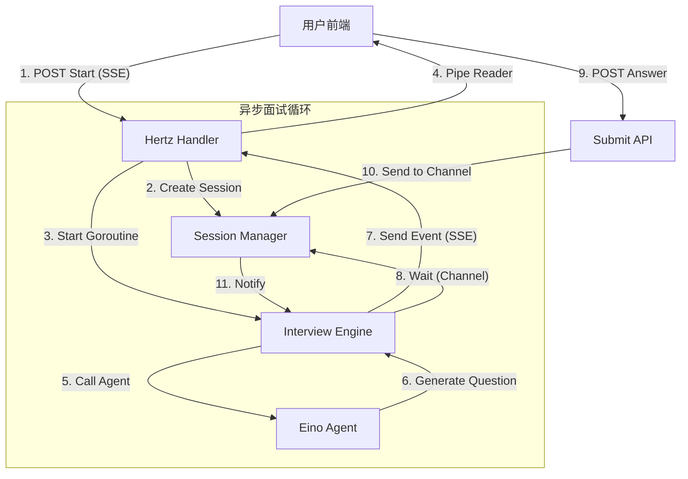

# 面试全流程与核心控制教学

## 1. 课程目标
- 掌握基于 **SSE (Server-Sent Events)** 的实时流式交互实现。
- 理解 **Session Manager** 在无状态 HTTP 服务中如何管理有状态的会话。
- 学习 **Eino Agent** 在复杂业务流程（面试循环）中的编排与调用。
- 实现“提问 → 等待回答 → 追问/下一题”的异步控制循环。

## 2. 架构总览

本功能的核心在于将**同步的 HTTP 请求**转换为**异步的事件流**。



### 核心组件
1.  **Handler 层** (`mianshi_service.go`)：负责建立 SSE 连接，启动异步 Engine，以及接收用户答案。
2.  **Session Manager** (`types.go`)：内存中维护会话状态，使用 Go Channel (`chan string`) 实现“引擎等待”与“用户提交”的同步。
3.  **Interview Engine** (`engine.go`)：面试的大脑，运行一个 `for` 循环，控制面试进度（20题）、上下文维护（最近5轮）和超时控制。
4.  **Agent Service** (`interview_agent_service.go`)：封装 Eino Agent，提供统一的调用接口。

## 3. 核心实现详解

### 3.1 会话管理 (Session Manager)
由于 HTTP 是无状态的，我们需要在内存中保存当前面试的状态（进行到第几题、上下文是什么）。最关键的是**同步机制**。

-   **文件位置**：`backend/api/handler/interview/mianshi/types.go`

**关键数据结构**：
```go
type InterviewSession struct {
    SessionID     string
    UserID        uint
    AnswerChan    chan string  // 核心：用于同步答案的通道
    QuestionCount int32
    // ... 其他元数据
}
```

**同步逻辑**：
-   **Engine** 调用 `GetAnswer` 时，会阻塞在 `<-session.AnswerChan`，直到有数据或超时。
-   **Handler** 调用 `SubmitAnswer` 时，将用户答案发送到 `session.AnswerChan <- answer`。

### 3.2 建立 SSE 连接 (Stream Setup)
SSE 允许服务器主动向客户端推送数据。在 Hertz 中，我们使用 `io.Pipe` 实现。

-   **文件位置**：`backend/api/handler/interview/mianshi_service.go`

```go
// 1. 设置响应头
c.SetHeader("Content-Type", "text/event-stream")
c.SetHeader("Cache-Control", "no-cache")
c.SetHeader("Connection", "keep-alive")

// 2. 创建管道
pipeReader, pipeWriter := io.Pipe()
c.SetBodyStream(pipeReader, -1)

// 3. 启动异步 Goroutine 运行 Engine
go func() {
    defer pipeWriter.Close()
    // ... 运行 engine.RunInterviewLoop
}()
```

### 3.3 面试循环引擎 (The Engine Loop)
这是业务逻辑的核心。它维护一个 `for` 循环，直到完成所有题目。

-   **文件位置**：`backend/api/handler/interview/mianshi/engine.go`

**流程伪代码**：
```go
func (e *InterviewEngine) RunInterviewLoop(ctx, session) {
    history := []HistoryItem{} // 最近5轮对话上下文
    
    for i := 1; i <= 20; i++ {
        // 1. 构建 Prompt (包含简历 + 最近历史)
        prompt := buildPrompt(resume, history)
        
        // 2. 调用 Agent 生成问题
        question := agentSvc.RunInterview(prompt)
        
        // 3. 推送问题给前端 (SSE)
        SendSSEEvent(writer, "question", question)
        
        // 4. 等待用户回答 (阻塞)
        // 使用 select 监听 AnswerChan 或 Timeout
        answer, ok := sessionManager.GetAnswer(sessionID, 30*time.Minute)
        
        // 5. 更新上下文
        history.append({question, answer})
        
        // 6. 推送进度 (SSE)
        SendSSEEvent(writer, "progress", i/20)
    }
    
    // 7. 结束面试
    SendSSEEvent(writer, "complete")
}
```

### 3.4 智能体调用 (Agent Service)
根据面试类型（综合/专项），选择不同的 Eino Agent 实例。

-   **文件位置**：`backend/chatApp/agent_service/interview/interview_agent_service.go`

```go
func (s *InterviewAgentService) RunInterviewWithCallback(...) {
    // 1. 获取 Agent (基于 Eino Graph)
    agent := s.GetInterviewAgent(type)
    
    // 2. 创建 Runner
    runner := adk.NewRunner(ctx, agent)
    
    // 3. 执行并流式处理
    runner.Run(ctx, message)
}
```

## 4. 关键难点与解决方案

### 4.1 怎么处理用户回答超时？
在 Engine 中使用 `select` + `time.After`：
```go
select {
case answer := <-session.AnswerChan:
    // 收到回答
case <-time.After(30 * time.Minute):
    // 超时处理，结束面试
}
```

### 4.2 怎么保持上下文但不超出 Token 限制？
只保留最近 5 轮对话 (`historyContextSize = 5`)。每次循环将这 5 轮对话拼接到 Prompt 中，让 LLM 知道刚才聊了什么，从而实现“追问”效果，同时避免 Prompt 无限增长。

### 4.3 前端如何接收？
前端使用 `EventSource` API 监听 `/api/mianshi/stream/start`。
-   监听 `question` 事件 → 显示题目，启用输入框。
-   用户点击发送 → 调用 `/api/mianshi/answer/submit` (不走 SSE，走普通 POST)。
-   监听 `complete` 事件 → 跳转报告页。

## 5. 练习作业
1.  **实现“跳过”功能**：在 `SubmitAnswer` 中支持特殊指令 `SKIP`，Engine 收到后不记录答案直接生成下一题。
2.  **增加“结束”指令**：允许用户提前结束面试，Engine 收到 `QUIT` 后跳出循环并生成报告。
3.  **断线重连**：当前是内存 Session，重启服务会丢失。尝试将 Session 状态持久化到 Redis，支持断线后恢复进度。