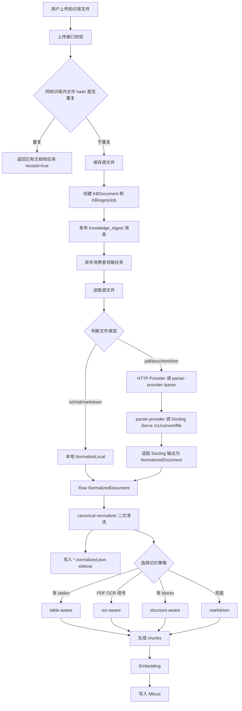
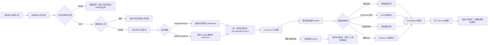

# wubo 分支文档清洗功能业务分析

## 一、结论摘要

`wubo` 分支实现的核心能力不是一个独立的“上传前手动清洗工具”，而是嵌入知识库入库链路中的“文档解析归一化能力”。它的目标是把用户上传到知识库的多种格式文件统一转换成项目内部标准文档模型 `NormalizedDocument`，再用其中的 Markdown 正文、表格结构、来源信息、解析质量信息辅助后续切片、向量化和检索。

从当前代码完成度看，该功能已经具备比较完整的后端闭环：

1. 上传入口已支持 `pdf`、`txt`、`md`、`markdown`、`docx`、`html`、`htm`。
2. 上传接口会做文件类型、大小、空文件、重复文件校验。
3. `txt`、`md`、`markdown` 会由 Go 后端本地归一化。
4. `pdf`、`docx`、`html`、`htm` 会通过 HTTP Parser Provider 调用 Docling Serve 转换为 Markdown。
5. 解析结果会再经过 canonical normalizer 做确定性清洗。
6. 成功和失败都会生成 sidecar 文件，便于排查解析结果。
7. 归一化结果已经接入后续 chunking router，可根据表格、OCR、结构化块选择不同切片策略。
8. 相关核心包已有单元测试，已运行通过。

需要注意的是：需求里说的“上传文档前的数据清洗”在当前实现中更准确地说是“上传后、切片前的异步数据清洗”。上传接口本身不会同步返回转换后的 Markdown，而是保存源文件、创建入库任务，再由异步消费者完成解析、归一化、切片和向量化。

## 二、分支开发内容概览

当前工作区位于 `wubo` 分支，相对主分支新增或修改了以下与文档清洗直接相关的模块：

| 模块 | 作用 | 完成度判断 |
| --- | --- | --- |
| `backend/internal/documentparser` | 定义标准文档模型、本地归一化、HTTP Provider、sidecar、表格规范化 | 基本完成 |
| `backend/internal/documentparser/canonical` | 对 parser 输出做二次确定性清洗 | 基本完成 |
| `backend/internal/parserprovider` | 提供 `/parse` HTTP adapter，转发 Docling Serve 并适配输出 | 基本完成 |
| `backend/cmd/parser-provider` | parser-provider 独立启动入口 | 基本完成 |
| `backend/internal/ragqueue/consumer.go` | 在知识库异步入库任务中接入解析归一化 | 已接入 |
| `backend/api/handler/kb/handler.go` | 上传入口支持更多格式和基础校验 | 已接入 |
| `backend/internal/milvus/chunking` | 根据归一化结果选择 table-aware、ocr-aware、structure-aware、markdown 切片策略 | 已接入 |
| `docker-compose.yml` | 增加 Docling Serve 和 parser-provider 服务 | 已配置 |
| `backend/scripts/start-docling-parser-stack.sh` | 一键启动 Docling Serve + parser-provider | 已提供 |
| `backend/scripts/start-docling-serve.sh` | 单独启动 Docling Serve | 已提供 |

此外，分支里还混入了 MCP Server 相关开发内容，这部分不是本次“文档清洗功能”的主线。

## 三、业务目标和价值

### 1. 解决的问题

知识库上传的文件来源不统一，可能是纯文本、Markdown、PDF、Word、HTML 等格式。如果直接把这些原始文件交给切片和向量化，容易产生以下问题：

1. PDF 存在分页、表格拆散、扫描件 OCR 等问题。
2. DOCX 和 HTML 有结构层级，但直接按纯文本切片会丢失上下文。
3. Markdown 表格如果格式不规范，会影响后续表格检索。
4. 不同文件解析出来的正文格式不一致，会导致切片质量不稳定。
5. 出问题时缺少可审计的中间结果，不方便排查“原始文件、解析结果、切片结果”之间的差异。

### 2. 当前方案

当前方案把文件入库拆成两个阶段：

1. 文件解析归一化：把不同格式统一转换成 `NormalizedDocument`。
2. 结构化切片入库：根据 `NormalizedDocument` 中的 Markdown、tables、blocks、quality 等信息选择切片策略，再写入向量库。

`NormalizedDocument` 是这个功能的核心中间产物，包含：

| 字段 | 含义 |
| --- | --- |
| `content_markdown` | 清洗后的 Markdown 正文，后续切片主要使用它 |
| `content_markdown_raw` | parser 原始 Markdown 输出，用于审计和排查 |
| `source` | 文件名、文件类型、源路径、页数等来源信息 |
| `blocks` | 结构化块信息，预留给结构化切片使用 |
| `tables` | 标准化表格结构，支持 table-aware 切片 |
| `omitted_images` | 被忽略的图片信息 |
| `quality` | 解析质量、警告、置信度等 |
| `extractor` | 解析器来源，例如 `local` 或 `docling` |
| `canonicalization` | canonical 清洗规则、hash 信息 |

## 四、完整业务流程



### 业务视角流程图



这张图从业务使用角度表达：用户只需要上传文档，系统会在入库过程中自动完成格式转换、清洗、切片和向量化。最终目标是让不同格式的文件都能稳定进入知识库检索链路。

## 五、支持的文件类型和处理方式

| 文件类型 | 当前处理方式 | 是否依赖外部服务 |
| --- | --- | --- |
| `txt` | 读取文本、去首尾空白、写入 `content_markdown` | 否 |
| `md` | 本地 Markdown 归一化，并规范 pipe table | 否 |
| `markdown` | 同 `md` | 否 |
| `pdf` | 通过 parser-provider 调 Docling Serve 转 Markdown 和结构信息 | 是 |
| `docx` | 通过 parser-provider 调 Docling Serve 转 Markdown 和结构信息 | 是 |
| `html` | 通过 parser-provider 调 Docling Serve 转 Markdown，并尝试恢复首段说明 | 是 |
| `htm` | 同 `html` | 是 |

上传文件大小限制为 `20MB`。parser-provider 自己的 multipart 限制为 `50MB`，但知识库上传入口先限制了 `20MB`，所以实际业务入口以 `20MB` 为准。

## 六、如何使用

### 1. 启动依赖

如果只处理 `txt`、`md`、`markdown`，不需要额外启动 Docling 服务。

如果要处理 `pdf`、`docx`、`html`、`htm`，需要启动 Docling Serve 和 parser-provider。

推荐方式：

```bash
bash backend/scripts/start-docling-parser-stack.sh
```

该脚本会启动：

1. `docling-serve`：原生 Docling 服务，默认端口 `5001`。
2. `parser-provider`：项目适配层，默认端口 `9000`。

启动后可访问：

```text
Docling Serve UI: http://localhost:5001/ui
Parser Provider health: http://localhost:9000/healthz
```

### 2. 配置后端解析 endpoint

本地直接运行后端时，配置：

```env
DOCUMENT_PARSER_PROVIDER=http
DOCUMENT_PARSER_ENGINE=docling
DOCUMENT_PARSER_ENDPOINT=http://localhost:9000/parse
DOCUMENT_PARSER_TIMEOUT_MS=60000
DOCUMENT_PARSER_STRICT_MODE=true
DOCUMENT_PARSER_SAVE_SIDECAR=true
```

如果后端也在 Docker Compose 网络中运行，配置：

```env
DOCUMENT_PARSER_ENDPOINT=http://parser-provider:9000/parse
```

不要把 `DOCUMENT_PARSER_ENDPOINT` 直接配置成 Docling Serve 的 `/v1/convert/file`。后端期望调用的是项目自己的 parser-provider `/parse` 接口，parser-provider 内部才会转发到 Docling Serve。

### 3. 上传文件

业务上仍然使用原有知识库上传接口或后台页面上传文档。上传接口表单字段为：

| 字段 | 说明 |
| --- | --- |
| `kb_id` | 知识库 ID |
| `file` | 上传文件 |

示例：

```bash
curl -X POST "$RAG_BASE_URL/api/admin/kb/documents/upload" \
  -H "Authorization: Bearer $TOKEN" \
  -F "kb_id=1001" \
  -F "file=@D:/docs/example.pdf"
```

接口成功后通常返回：

```json
{
  "document_id": 123,
  "job_id": 456,
  "status": "pending"
}
```

如果同一知识库内已经上传过完全相同内容的文件，会返回：

```json
{
  "document_id": 123,
  "job_id": 456,
  "status": "completed",
  "reused": true
}
```

### 4. 查看解析结果

解析成功后，会在源文件旁生成：

```text
原始文件路径.normalized.json
```

解析失败时，会生成：

```text
原始文件路径.normalized.error.json
```

成功 sidecar 里可以重点看：

1. `content_markdown`：最终进入切片的 Markdown。
2. `content_markdown_raw`：parser 原始输出。
3. `tables`：识别出的标准表格。
4. `quality.warnings`：解析过程警告。
5. `canonicalization.applied_rules`：应用了哪些清洗规则。

## 七、当前完成度判断

### 已完成能力

1. **上传入口扩展**：支持 `pdf/txt/md/markdown/docx/html/htm`，并限制 20MB、非空、合法后缀。
2. **文件去重**：同一知识库内按文件 SHA256 去重，避免重复解析和重复向量化。
3. **本地归一化**：`txt/md/markdown` 可直接转成标准 `NormalizedDocument`。
4. **Markdown 表格清洗**：能规范 pipe table，并生成结构化 `tables` 元数据。
5. **外部 Provider 机制**：`pdf/docx/html/htm` 可通过 HTTP Provider 调外部解析服务。
6. **Docling adapter**：已实现 parser-provider，把 Docling Serve 输出适配为项目统一结构。
7. **canonical 清洗**：对 parser 输出做 Unicode、换行、标题、表格 span 等确定性整理。
8. **sidecar 审计**：成功和失败都有落盘结果，方便排查问题。
9. **切片路由接入**：可根据 tables、OCR 信号、blocks 选择 table-aware、ocr-aware、structure-aware、markdown 策略。
10. **测试覆盖**：核心 documentparser、canonical、parserprovider、ragqueue 有单元测试。

### 已验证结果

已运行以下测试：

```bash
go test ./internal/documentparser/... ./internal/parserprovider ./internal/ragqueue
```

结果：

```text
ok interview-agents/internal/documentparser
ok interview-agents/internal/documentparser/canonical
ok interview-agents/internal/parserprovider
ok interview-agents/internal/ragqueue
```

说明文档解析核心包、Docling adapter、入库消费者解析逻辑的单元测试是通过的。

## 八、还不完善或需要注意的点

1. **不是同步“上传前清洗”**  
   当前用户上传时不会同步看到 Markdown 转换结果，转换发生在异步入库消费者中。如果产品需求是“上传前预览清洗结果”，还需要新增预解析接口和前端交互。

2. **PDF/DOCX/HTML 强依赖 parser-provider 和 Docling Serve**  
   如果 `DOCUMENT_PARSER_ENDPOINT` 没配、parser-provider 没启动、Docling Serve 不可用，这些格式会解析失败。

3. **OCR 只是配置透传，还没有看到完整 OCR 服务闭环**  
   当前配置里有 `OCR_PROVIDER`、`OCR_ENDPOINT`、`OCR_TIMEOUT_MS`，但主流程中主要还是交给 Docling，OCR 能力是否真正可用取决于 Docling 和后续 OCR 服务配置。

4. **`SaveSidecar` 配置目前没有明显控制分支**  
   配置项存在并默认打开，但消费者代码中实际是直接写 sidecar。也就是说，即使配置为 false，当前代码看起来仍可能写 sidecar，需要后续确认是否要补控制逻辑。

5. **结构化 blocks 能力有限**  
   `NormalizedDocument` 定义了 `blocks`，chunking 也支持 structure-aware，但 Docling adapter 当前主要稳定产出 Markdown 和 tables，blocks 的完整填充能力还需要进一步确认。

6. **生产可用性依赖外部镜像和资源**  
   Docling Serve 使用 CPU 镜像，解析大 PDF 或复杂 DOCX 时可能较慢；生产环境需要单独评估超时、并发、资源占用和错误重试策略。

7. **分支混入 MCP 相关内容**  
   `wubo` 分支不只包含文档清洗，还包含 MCP Server 相关代码。合并或验收时建议把文档清洗和 MCP 两条线分开评审。

## 九、建议后续验收方式

建议准备以下样例文件分别上传到同一个测试知识库：

| 样例 | 验收重点 |
| --- | --- |
| `plain.txt` | 是否能本地归一化，生成 Markdown 正文 |
| `table.md` | pipe table 是否规范化，是否生成 `tables` |
| `simple.docx` | 是否经 Docling 转 Markdown |
| `simple.html` | HTML 首段内容是否保留 |
| `table.pdf` | PDF 表格是否能识别并走 table-aware |
| `scan.pdf` | 是否出现 OCR 相关 warning 或失败信息 |

每个样例上传后检查：

1. 文档状态是否从 `pending/processing` 变为 `completed`。
2. 入库任务状态是否为 `completed`。
3. 是否生成 `*.normalized.json`。
4. `content_markdown` 是否可读。
5. `tables` 是否符合预期。
6. 检索结果 metadata 中 `chunking_route` 是否符合预期。
7. 失败时是否生成 `*.normalized.error.json`，错误信息是否可定位。

## 十、总体判断

这个实习生分支在“多格式文档转 Markdown 并服务后续切片”这个方向上已经做到后端主链路可跑，且并不是简单地把文件转成 Markdown，而是设计了标准化中间模型、解析适配层、canonical 清洗、sidecar 审计和结构化切片路由。

如果当前需求只是“上传文档后，在入库切片前自动把多格式文档转换成 Markdown 并清洗”，这条分支已经基本完成，可以进入联调和样例验收阶段。

如果当前需求强调“上传前清洗、上传前预览、用户确认后再入库”，那么当前分支还没有完成这部分产品交互，需要继续补：预解析 API、预览结果存储、前端预览页面、确认入库流程。