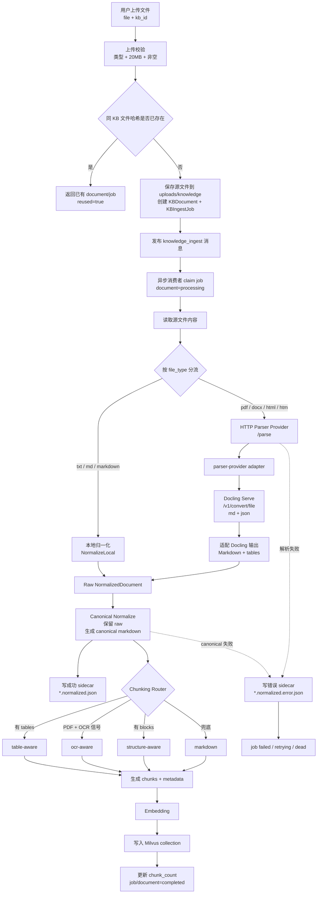

# 知识库文件归一化流程讲解稿

## 一、这套链路到底在解决什么问题

这套功能的核心，不是把文件简单转成 Markdown，而是把知识库上传进来的不同文件，统一整理成一个稳定、可审计、可切分、可追溯的标准文档模型：`NormalizedDocument`。

上传进来的文件可能是 `txt`、`md`、`pdf`、`docx`、`html`。如果后面的切分、向量化、检索和排障都直接面对这些原始格式，链路会很难稳定：PDF 里有分页和表格，HTML 里可能有首段说明，Markdown 里可能已经有表格，扫描 PDF 还会有 OCR 风险。

所以当前项目把入库分成两段：

1. 前半段：把源文件解析并归一化成 `NormalizedDocument`。
2. 后半段：根据 `NormalizedDocument` 里的结构信息选择切分策略，再写入 Milvus。

一句话概括就是：前面统一格式，后面按结构差异选择策略。

## 二、最新整体流程



这张图里有两个容易被忽略但很关键的点。

第一，当前链路新增了 canonical normalizer。也就是说，local parser 或 Docling adapter 产出的还只是 raw normalized document，真正进入切分和索引前，还要再做一层确定性的正文归一化。

第二，sidecar 落盘发生在 canonical 之后。成功 sidecar 里既保留 canonical 后的 `content_markdown`，也保留 parser 原始输出 `content_markdown_raw`，这样后续排障可以对比“解析器原始结果”和“入库实际使用结果”。

## 三、上传入口先做什么

上传入口在 `UploadDocument`。

用户提交的是：

1. `kb_id`
2. 表单文件字段 `file`

入口会先做这些事：

1. 校验用户身份。
2. 校验知识库是否存在，以及当前操作者是否能访问。
3. 确保知识库已经分配 Milvus collection。
4. 校验文件类型和大小。
5. 读取文件内容并计算 `sha256` 文件哈希。
6. 在同一个 KB 内按文件哈希查重。
7. 保存源文件。
8. 创建 `KBDocument` 和 `KBIngestJob`。
9. 发布异步入库消息。

当前支持的上传格式是：

```text
pdf / txt / md / markdown / docx / html / htm
```

上传入口的文件大小限制是：

```text
20MB
```

如果同一个知识库里已经存在相同哈希的文件，接口不会重复创建入库任务，而是直接返回已有文档和最新 job 信息，并标记：

```json
{
  "reused": true
}
```

这一步的意义是避免用户重复上传同一份文档，导致重复解析、重复 embedding 和重复写入向量库。

## 四、异步入库任务怎么跑

上传接口不在请求里同步解析文件。真正的解析、切分、向量化发生在 `knowledge_ingest` 消费者里。

消费者收到消息后，会先做 job claim：

1. 如果入库被暂停，直接跳过。
2. 如果 job 已经是 `completed`、`dead`、`canceled` 这类终态，跳过。
3. 否则把 job claim 到 `processing`。
4. 同步把文档状态更新为 `processing`。

然后进入核心函数：

```text
extractNormalizedKnowledgeDocument
```

它负责：

1. 读取源文件。
2. 按文件类型选择 local normalizer 或 provider。
3. 得到 raw `NormalizedDocument`。
4. 执行 canonical normalizer。
5. 写 sidecar。
6. 把 `NormalizedDocument` 和 sidecar 路径交给 chunking。

如果后面 embedding 或 Milvus 写入失败，错误会被分类成 `embedding_error` 或 `milvus_write_error`。如果开启了入库重试，并且错误里有 timeout、connection refused、network 这类瞬时失败信号，job 会进入 `retrying`，再由补偿扫描器重新发布任务。超过最大重试次数后会进入 `dead`。

解析类错误会被归到 `parse_error`，当前默认不重试，因为这类问题通常来自文件内容、解析器返回结果或 canonical 校验失败，重复执行往往不会自动恢复。

## 五、按文件类型分流

### 1. 本地类型

本地类型包括：

```text
txt / md / markdown
```

它们不需要外部解析服务，直接走 `NormalizeLocal`。

`txt` 的处理比较直接：

1. 读取文本内容。
2. 去掉首尾空白。
3. 写入 `content_markdown`。
4. `quality.status=ok`，`quality.score=1`。
5. `extractor.provider=local`。

`md` 和 `markdown` 会多做一步 Markdown pipe table 规范化：

1. 识别标准 pipe table。
2. 清理单元格里的多余 `*`、`_`、反引号和空白。
3. 统一渲染为规范 pipe table。
4. 生成 `tables`，包括 `table-001` 这类 ID、Markdown 起止 offset、行列单元格和质量状态。

这一步很重要，因为后面 chunking router 会优先看 `tables`。只要 `NormalizedDocument.Tables` 不为空，就会优先进入 `table-aware` 策略。

### 2. Provider 类型

Provider 类型包括：

```text
pdf / docx / html / htm
```

它们会走 `HTTPProvider`，也就是后端向配置里的 `DOCUMENT_PARSER_ENDPOINT` 发 multipart 请求。

请求里会包含：

1. `file`：原始文件内容。
2. `file_type`：规范化后的文件类型。
3. `options`：解析选项 JSON。

当前后端会把这些选项传给 parser-provider：

1. `engine`
2. `strict_mode`
3. `ocr.provider`
4. `ocr.endpoint`
5. `ocr.timeout_ms`
6. PDF 额外加 `pdf_backend=pypdfium2`

其中 `pdf_backend=pypdfium2` 是最新链路里和 PDF 质量相关的关键点。它的目标是让文本型 PDF 在 Docling 里得到更稳定的标题和正文结果，减少同一段知识因为 PDF 解析差异而切成不同 chunk。

## 六、parser-provider 和 Docling adapter

项目里没有让 RAG 后端直接调用 Docling Serve，而是中间放了一个轻量 adapter：`parser-provider`。

它对 RAG 后端暴露：

```text
POST /parse
GET  /healthz
```

内部再调用 Docling Serve：

```text
POST /v1/convert/file
```

这样做的好处是：RAG 后端只需要理解自己的 `NormalizedDocument` 协议，Docling 的表单字段、返回结构和错误格式都被 adapter 吸收掉。

Docling adapter 当前会向 Docling 请求两种输出：

```text
to_formats=md
to_formats=json
```

同时图片导出模式是：

```text
image_export_mode=placeholder
```

也就是说，图片本体当前不会作为多模态内容进入知识库。它更多是被占位和省略，后续如果要扩展图片理解或多模态 RAG，可以沿着 `omitted_images` 这类字段继续扩展。

adapter 拿到 Docling 结果后，主要做四件事。

第一，选择正文。优先使用 `md_content`；如果没有 Markdown，再退回 `text_content`。

第二，修复 HTML lead-in。Docling 有时会从第一个 heading 开始输出，导致 HTML 正文开头的说明段落丢失。项目现在会从原始 HTML 里抽取第一个标题前的前置段落，最多 8 个块、4096 字节；如果这些内容不在 Docling Markdown 中，就补回到第一个 heading 前。带 `strong`、`b` 或粗体样式的段落会转成 Markdown 加粗。

第三，规范 Markdown 表格。Docling 直接输出的 pipe table 会再次经过 `NormalizeMarkdownPipeTables`，生成标准 Markdown 表格和 `tables` 元数据。

第四，补结构化表格。如果 Markdown 里没有识别到表格，但 Docling 的 `json_content` 里有结构化 `tables`，adapter 会把表格渲染成 Markdown，追加到正文末尾的 `## Extracted Tables` 下，并生成对应的 `tables` 元数据。

PDF 表格还有一个特殊处理：Docling 有时会把表格后面的说明段落切成普通标题或普通段落，但这些内容实际上是表格行的延续。当前代码会在安全范围内尝试延展 PDF 表格的 Markdown span，让表格 chunk 能覆盖这些续接内容；但它会在新的编号章节或无关小节前停止，避免把后续章节错误吞进表格。

## 七、canonical normalizer 是最新主线

解析器产出的 raw `NormalizedDocument` 还不是最终入库文本。当前项目新增了：

```text
backend/internal/documentparser/canonical
```

它会在 local/provider 之后、sidecar 和 chunking 之前运行。

这个步骤的目标不是用 LLM 改写内容，也不是补业务含义，而是做确定性、可审计、尽量保守的 canonical Markdown 归一化。它解决的是“同一份知识从 Markdown、HTML、PDF、OCR PDF 进来时，标题、空白、表格 span 不稳定”的问题。

当前已落地的规则包括：

1. Unicode 兼容归一化。
2. `\r\n`、`\r` 统一为 `\n`。
3. 压缩过多空行。
4. 清理常见 parser 噪声，比如 `## ·`、`- ·`、`- -`。
5. 清理标题里的多余强调符号和反引号。
6. 规范编号标题的空格，比如 `1.3消息` 会被整理成 `1.3 消息`。
7. 去掉中文字符之间意外插入的空格。
8. 合并确定性很强的相邻标题续接，比如 `## 1.3 TPS` 后面紧跟同级 `## 消息收发 计算规则`。
9. 对 Markdown 表格重新规范化，并重新计算表格 Markdown span。

canonical normalizer 会把 parser 原始正文保存到：

```text
content_markdown_raw
```

把最终用于切分和入库的正文保存到：

```text
content_markdown
```

同时记录：

```text
canonicalization.version
canonicalization.applied_rules
canonicalization.warnings
canonicalization.raw_sha1
canonicalization.canonical_sha1
```

这个信息非常适合排障。比如检索效果不一致时，可以直接比较 raw hash 和 canonical hash，判断问题发生在解析器输出阶段，还是 canonical 规则阶段。

这里也要说明一个边界：当前 canonical normalizer 是保守规则，不会把 `128MB` 强行改成 `128 MB`，也不会把业务术语改写成另一种表达。它只处理结构和格式层面的稳定性问题。

## 八、NormalizedDocument 里有什么

`NormalizedDocument` 是整个归一化链路的统一产物。当前字段包括：

```text
content_markdown
content_markdown_raw
source
blocks
tables
omitted_images
quality
extractor
canonicalization
```

### 1. content_markdown

这是最终用于切分、embedding 和检索的 canonical Markdown。

后面的 chunking strategy 只需要面对这一份统一正文，不需要关心源文件是 PDF、Word、HTML 还是 Markdown。

### 2. content_markdown_raw

这是 parser 原始输出。

它不会直接用于切分，但会保存在 sidecar 里，用来做审计和排障。比如发现 canonical 规则过度合并标题时，可以回头看 raw 输出到底是什么样。

### 3. source

`source` 记录来源信息：

1. `file_name`
2. `file_type`
3. `source_path`
4. `page_count`

本地解析会带上 `source_path`。Docling adapter 当前主要填 `file_name` 和 `file_type`。

### 4. tables

`tables` 是当前归一化链路里最重要的结构化信息之一。

它包含：

1. 表格 ID。
2. 页码。
3. 在 canonical Markdown 中的起止 offset。
4. 行列单元格。
5. 合并单元格标记。
6. 嵌套表格标记。
7. 表格质量状态和 warning。

后面的 `table-aware` 策略会用它生成专门的 table chunk。

### 5. blocks

`blocks` 用来表示文档结构块，比如标题、段落、表格块、OCR 块。它可以带页码、bbox、Markdown offset 和 OCR confidence。

当前 chunking 层已经支持 `blocks`：只要 provider 返回了有效 blocks，`structure-aware` 和 `ocr-aware` 就能利用它们。

但按当前项目代码看，内置 Docling adapter 主要沉淀 Markdown 和表格，并没有完整抽取 Docling JSON blocks。因此这里要讲清楚：`blocks` 是模型和策略已经准备好的结构字段，当前默认 Docling 路径的重点还是 `content_markdown` 和 `tables`。

### 6. omitted_images

`omitted_images` 用来描述被省略的图片信息。

当前 Docling 请求使用 placeholder 图片模式，图片内容不会直接进入文本向量库。这个字段更像是后续多模态能力的扩展入口。

### 7. quality

`quality` 记录解析质量：

1. `status`
2. `score`
3. `warnings`

OCR 相关 warning 会影响后续路由判断。比如 PDF 的 quality warning 里包含 `ocr`，就可能触发 `ocr-aware`。

### 8. extractor

`extractor` 记录解析器来源和版本。

本地文本是：

```text
provider=local
version=document-normalizer-v1
```

Docling adapter 是：

```text
provider=docling
version=docling-serve-adapter-v1
```

这个字段用于定位“某份文档到底是谁解析的”，也方便以后升级解析器时做版本对比。

### 9. canonicalization

`canonicalization` 记录 canonical normalizer 的版本、应用规则和 hash。

讲这部分时可以强调：这相当于给“入库最终正文”打了一个可审计指纹。未来如果规则升级，同一份 raw parser 输出对应的 canonical hash 发生变化，就能明确知道是规则版本导致的。

## 九、sidecar 文件怎么用

归一化成功后，系统会写出：

```text
原文件路径.normalized.json
```

归一化失败时，会尽量写出：

```text
原文件路径.normalized.error.json
```

成功 sidecar 里保存完整 `NormalizedDocument`，包括 raw/canonical 正文、表格、质量、解析器、canonical hash。

错误 sidecar 里保存：

1. `error_code`
2. `message`
3. `stage`
4. `page`
5. `quality`

如果错误来自 provider，`ProviderError` 里的 `code`、`message`、`stage`、`page` 会被尽量保留下来。比如 Docling 返回某页解析失败，就可以在 sidecar 里看到具体阶段和页码。

sidecar 的实际价值有三个：

1. 复现：不用重新上传文件，也能看当时归一化结果。
2. 排障：能区分 parser 原始输出、canonical 结果和最终 chunk metadata。
3. 溯源：chunk metadata 里会带 `normalized_path`，检索命中后可以反查标准化文档。

## 十、归一化之后怎么选择切分策略

Milvus manager 初始化时会创建默认 chunking router。

当前策略优先级是：

1. `table-aware`
2. `ocr-aware`
3. `structure-aware`
4. `markdown`

router 会在 chunk metadata 里打：

```text
chunking_route
```

具体策略会在 metadata 里打：

```text
chunking_strategy
chunking_unit
```

这两个字段有区别：`chunking_route` 表示路由入口选中了谁，`chunking_strategy` 表示这个 chunk 实际由哪类策略生成或标注。

## 十一、四种切分策略

### 1. table-aware

触发条件：

```text
len(NormalizedDocument.Tables) > 0
```

`table-aware` 会先委托 `structure-aware` 生成基础 chunk，然后再为每张表生成专门的 table chunk。

table chunk 的内容格式大致是：

```text
Table table-001

| 字段 | 含义 |
| --- | --- |
| id | 编号 |
```

如果表格 Markdown span 不可用，但 rows 可用，也会把表格行渲染成类似：

```text
字段: id | 含义: 编号
```

它会补充这些 metadata：

1. `table_ids`
2. `table_row_count`
3. `table_quality_status`
4. `table_merged_cells`
5. `table_nested`
6. `page_start`
7. `page_end`
8. `child_start_offset`
9. `child_end_offset`

为什么表格要特殊处理？

因为表格的信息密度高，普通切分很容易把表头和数据行拆开。`table-aware` 让字段说明、计费公式、配置矩阵、参数对比这类问题更容易命中完整语义。

### 2. ocr-aware

触发条件：

1. 文件类型是 `pdf`。
2. `quality.warnings` 里包含 `ocr`，或者 blocks 里有 `confidence`。

它会先委托 `structure-aware` 生成 chunk，再根据 chunk 覆盖的 blocks 计算平均 OCR confidence。

如果 confidence 低于阈值 `0.8`，会打：

```text
weak_evidence=true
weak_evidence_reason=low_ocr_confidence
```

这对扫描 PDF 很重要。检索系统不是简单地把 OCR 文本当成强证据，而是能在 metadata 里保留“这段内容识别质量偏弱”的信号。

### 3. structure-aware

触发条件：

1. `blocks` 非空。
2. 文件类型是 `pdf`、`docx`、`html` 或 `htm`。

它会按 block 的 Markdown span 排序，然后把相邻 blocks 合并成窗口。默认窗口大小是：

```text
1000 bytes
```

它会补充：

1. `block_ids`
2. `block_types`
3. `page_start`
4. `page_end`
5. `ocr_confidence`
6. `child_start_offset`
7. `child_end_offset`

如果没有有效 blocks，它会回退到 fallback，也就是 markdown 策略。

### 4. markdown

这是兜底策略，也是当前大多数纯文本和 Markdown 文档会走的策略。

它会先尝试用 Goldmark 解析 Markdown heading，把文档按标题章节切开。

生成的 metadata 包括：

1. `section_title`
2. `hierarchy_path`
3. `heading_level`
4. `section_segment_index`
5. `section_segment_count`
6. `child_start_offset`
7. `child_end_offset`

如果文档没有可用标题结构，就回退到递归 Markdown splitter。

这里还有一个小细节：如果章节标题里包含 `计费公式`，`chunking_unit` 会标成 `formula`。这是为了让计费公式类内容在检索和调试时更容易被识别。

## 十二、chunk metadata 为什么这么多

切分完成后，`finalizeChunks` 会给所有 chunk 补齐统一 metadata。

核心字段包括：

1. `chunk_index`
2. `total_chunks`
3. `chunk_id`
4. `child_id`
5. `parent_id`
6. `child_start_offset`
7. `child_end_offset`
8. `parent_start_offset`
9. `parent_end_offset`
10. `parent_token_count`
11. `parent_build_strategy`
12. `parent_build_version`
13. `parent_child_available`
14. `section_title`
15. `hierarchy_path`
16. `normalized_path`

这些字段不是为了“好看”，而是服务后面的检索能力。

`child_*` 表示当前 chunk 在 canonical Markdown 里的位置。

`parent_*` 表示它所属的更大上下文窗口。比如一个普通段落 chunk 的 parent 可能是它所在的标题章节；一个 table chunk 的 parent 通常就是表格自身范围。

`parent_build_version` 当前是：

```text
phase3-parent-child-v1
```

这给 parent-child retrieval、引用溯源、检索调试都提供了统一坐标。

## 十三、最后怎么写入 Milvus

chunking 完成后，入库消费者会给每个 chunk 补 ID，然后选择 indexer。

如果知识库已经有明确 collection，就创建对应 collection 的 indexer：

```text
NewIndexerServiceForCollection
```

否则会解析或生成知识库默认 collection。

写入前的 base metadata 来自：

```text
NewKBDocumentMetadata
```

它包含：

1. `tenant_id`
2. `operator_admin_id`
3. `kb_id`
4. `document_id`
5. `file_name`
6. `collection`
7. `normalized_path`

最终通过 indexer 的 `Store` 写入 Milvus。成功后会更新：

1. 文档 chunk 数量。
2. job 状态为 `completed`。
3. document 状态为 `completed`。
4. ingest metrics。

## 十四、这套流程的边界

讲这套链路时，也要把边界讲清楚。

第一，当前不是多模态入库。图片使用 placeholder，文本链路不会真正理解图片内容。

第二，canonical normalizer 不做 LLM 改写，也不补业务知识。它只做确定性格式归一化。

第三，`blocks` 字段和结构感知切分已经在模型和策略层准备好，但当前内置 Docling adapter 主要输出正文和表格。后续如果要更强的 PDF/HTML 结构切分，需要继续把 Docling JSON 中的结构块抽取成 `blocks`。

第四，配置里有 `document_parser.save_sidecar`，但当前实际入库路径会在 canonical 成功后写成功 sidecar，在解析或 canonical 失败时尽量写错误 sidecar。讲实现时要以当前代码行为为准。

第五，parser-provider 自身的 multipart 上限是 50MB，但对用户上传入口来说，真正先命中的限制是 20MB。

## 十五、推荐讲解话术

可以按三个问题来讲。

第一个问题：为什么要归一化？

因为知识库面对的是多格式文件，而检索链路需要的是稳定文本和稳定结构。归一化把不同格式先收敛成 `NormalizedDocument`，让后面的 chunking、embedding、Milvus 写入和检索排障都围绕同一个模型工作。

第二个问题：最新归一化比旧版多了什么？

多了 canonical normalizer。也就是 parser 输出之后，不会立刻切分，而是先做确定性的 Markdown 稳定化：清理标题、合并确定性标题续接、规范表格、保留 raw 和 canonical hash。这样同一份知识从 Markdown、HTML、PDF 进入时，后面更容易切出一致的检索单元。

第三个问题：归一化之后怎么切？

不是一刀切。router 会先看表格，再看 OCR 风险，再看结构 blocks，最后才走普通 Markdown。每个 chunk 都会补齐 offset、表格 ID、页码、parent-child 和 normalized sidecar 路径。这样检索命中以后，不只是能返回内容，还能解释它来自哪里、由什么策略切出来、证据质量如何。

最后可以用一句话收尾：

这套设计的关键是把“格式差异”留在入库前半段消化掉，把“结构价值”带到入库后半段用起来。最终进入 Milvus 的不是一堆来源不明的文本碎片，而是一批有标准正文、有 sidecar、有来源坐标、有结构 metadata 的可检索知识单元。
